2015-fall

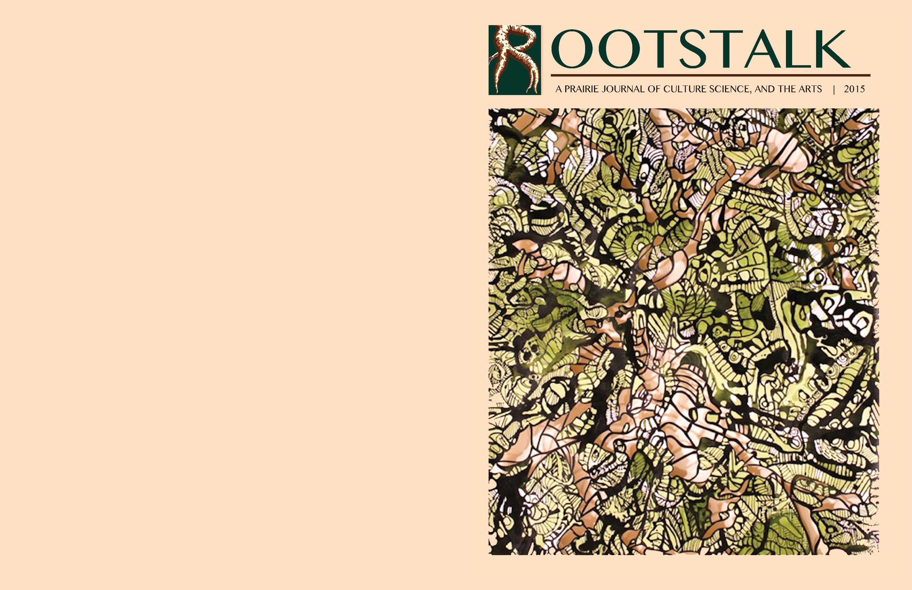

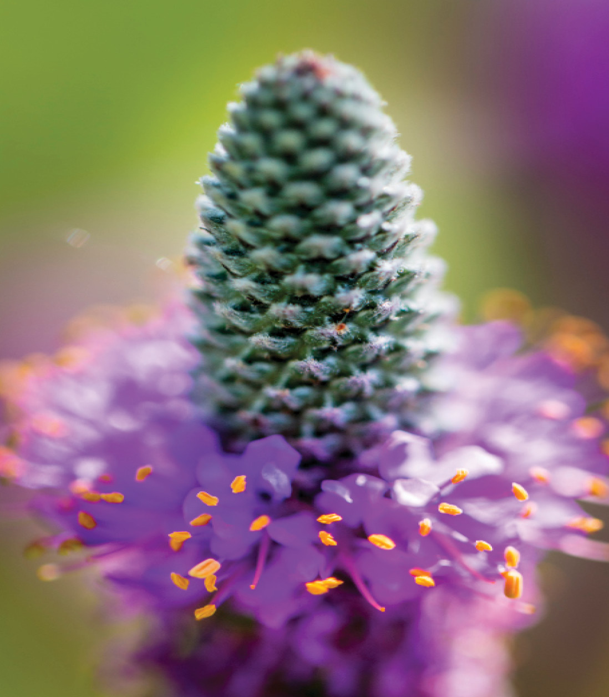

OOTSTALK

A PRAIRIE JOURNAL OF CULTURE, SCIENCE, AND THE ARTS | FALL 2015

VOL. II, NO. 1

Cover image: Justin Hayworth

Cover design: Nathan Kim

Table of contents image: Elizabeth Hill

Layout: Jonathan Andelson, Mark Baechtel, Emma Thomasch 

& Madeline Warnick

Photograph | Hayworth

Photograph: Justin Hayworth

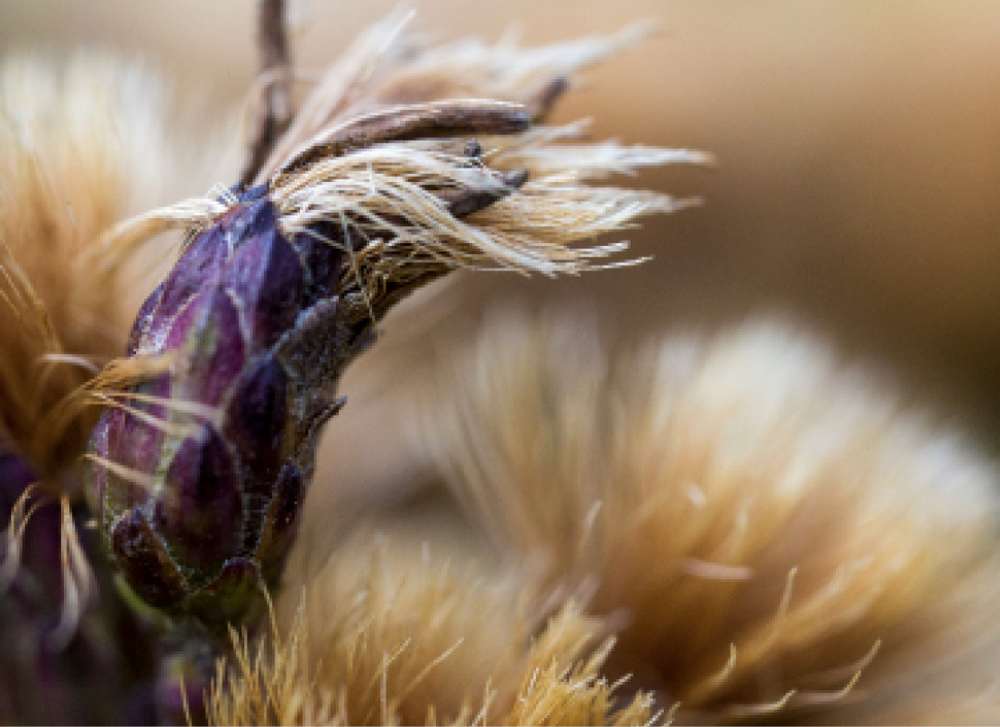

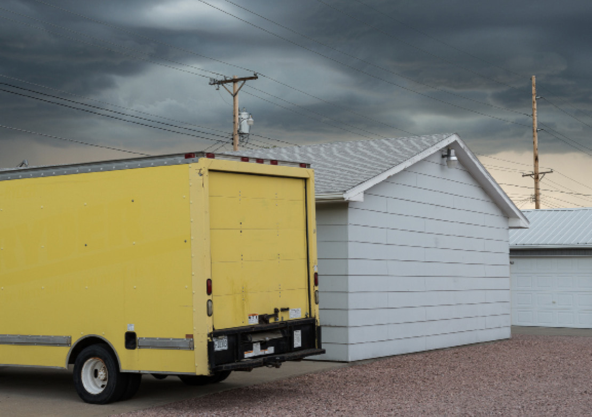

Photograph: Justin Hayworth

 Editorial Staff

The premiere issue of Rootstalk, published last Spring, required a full-court press from a small army of Grin- nellians—students from a two-semester sequence of special-topics classes in online publishing, as well as alumni who’ve made a career in publishing, and who were fantastically generous with their time and advice as they guided the students (and their professors) in the labor and research that went into designing a multimedia online journal from the ground up—one that could do all that our vision statement and mission statement said we wanted it to do. 

All those helping hands are still a ghostly presence in the issue you’re currently reading—our second—since they laid down the tracks, established the best-practices, and made the decisions which, henceforth, will express Rootstalk’s identity. All that being said, five people did the work of soliciting, considering, editing, assembling and publishing Volume II, Issue #1 (Fall 2015). 

Student Editors

Emma Thomasch, ‘16

Madeline Warnick, ‘16

Online and Web-presence Editor

Ajuna Kyaruzi, ‘17

Faculty Editors

Jonathan Andelson

Mark Baechtel

Rootstalk, Fall 2015

Volume II, Number 1

Supported by Grinnell College’s Center for Prairie Studies

Rootstalk is committed to promoting open expression and is hosted on

 Grinnell College’s Digital Grinnell server.

Drawing | Howland

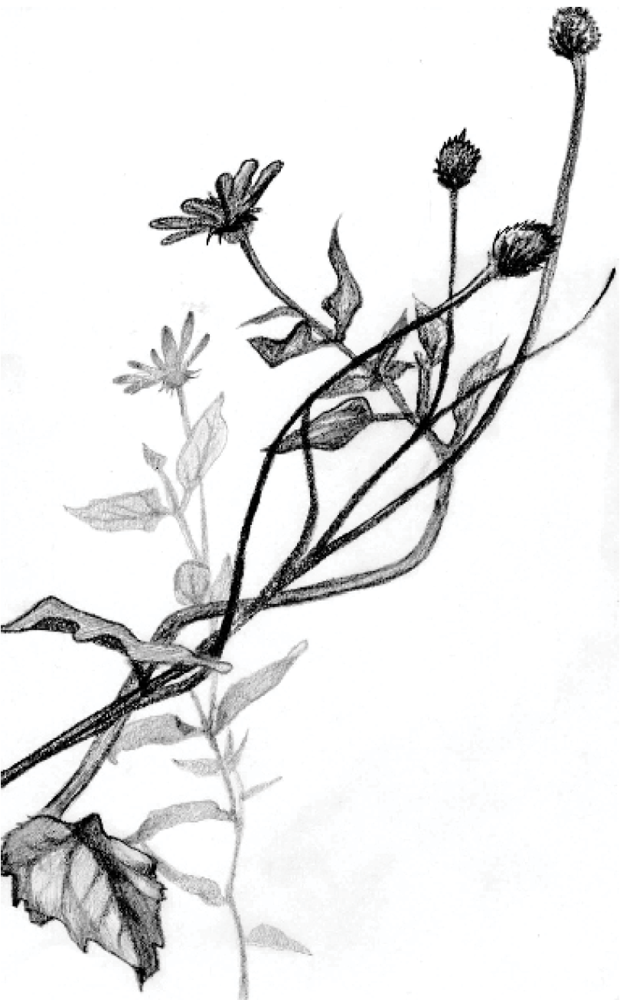

Drawing: Madeline Howland

 Farewell, Richard

 

Until his untimely death from ALS in November, 2015, Richard Fyffe had served as Librarian of the College since coming to Grinnell ten years ago. Richard worked tirelessly to enhance library operations at the College and build a strong staff of professionals and support personnel, and his contributions in this area have been publicly recognized by Grinnell College President Raynard Kington and Dean of the College Michael Latham on several occasions. 

Richard’s contributions extended well beyond the library, however. At the time of his death, he was chair of the Science Division, and over the years he had served on a wide variety of College committees—an expression of his passion for the liberal arts and of his own eclectic talents and interests. One of those committees was the Center for Prairie Studies Advisory Board, of which Richard was a member from 2012 to 2014. 

Richard’s interest in the prairie region began when he was living and working in Lawrence, Kansas, and after moving to Grinnell, his next place of employment, it did not take him long to visit the College’s Conard Environmental Research Area (CERA), a 365-acre nature preserve, a significant portion of which is given over to prairie restoration. CERA eventually became one of Richard’s favorite places for walks, quiet contemplation, and the enjoyment of nature. His wife, Ida, asked that his memorial service be held there.

Richard’s contributions to Prairie Studies were many. He participated actively in board discussions, invariably bringing his characteristic intelligence, wit, and insight to our deliberations. He played a significant role in shaping the Center’s programmatic theme—“The Commons: the natural and cultural resources available to groups of people for shared use”—for the 2013-14 academic year. As a librarian, Richard was especially interested in the information commons, and he was instrumental in arranging for David Bollier, a preeminent scholar of information (and other) commons to come to the College to speak in the Center’s series that year.

Faculty member John Whittaker recalls serving on a College task force charged with “exploring open access and digital dissemination of Grinnell’s scholarly work” that was headed by Richard. I should say spearheaded to emphasize how effective he was. Richard worked tirelessly to produce policy for the college and get it up on our webpages, and to create ‘Digital Grinnell’ as a vehicle. For those of us interested in Prairie Studies at Grinnell, Richard’s work was instrumental in setting the stage for open access digital productions, including Rootstalk.”

Another colleague (and current Center board member), Cori Jakubiak, worked with Richard on the search committee to hire a director for the College’s Writing Lab. “What struck me throughout the process,” she remembers, “was Richard’s unfailing grace and generosity. He took a sincere, measured interest in every single person who applied for the position, and he interpreted any and all application materials charitably. I recall feeling pleased and lucky at the time that I’d had the opportunity to work so closely with Richard. Unknowingly, too, Richard modeled professional kindness and wisdom to a younger colleague.”

My own most memorable collaboration with Richard involved a photograph from Kansas. Wes Jackson, the founder and director of The Land Institute, an agricultural research and education organization in Salina, Kansas, dedicated to re-shaping the nature of American agriculture based on principles of prairie ecology, came to Grinnell to speak. Richard was familiar with the work of The Land Institute from his time in Kansas, and I, along with several other faculty members, had visited “The Land” several years earlier to learn more about Jackson’s vision and path-breaking efforts. 

As he was remarking on the important role of the prairie’s remarkable root system in holding soil, Jackson suddenly rolled out onto the floor an eighteen foot long life-size photograph of a complete specimen—stems and roots—of big bluestem, one of the signature grasses of the tallgrass prairie. The impact of seeing the plant’s full mass of roots was electrifying, at least on Richard and me, and after the lecture we talked excitedly about trying to acquire a copy of the photograph. As it turned out, The Land Institute was selling copies, and also had another available for sale of a compass plant, with an even deeper root system than big bluestem. 

Pooling funds from the library and Prairie Studies, we acquired both photographs, and they now hang in Burling Library helping to educate students about the natural history of the prairie region. The image on this page shows Richard dwarfed by the poster photo of big bluestem, one of his favorite prairie plants. What I see is big bluestem hanging next to one of my favorite prairie ramblers. Thank you, Richard, for all you did to enrich our lives.

Jonathan Andelson

Professor and Director

Center for Prairie Studies

  

Farewell, Richard | Andelson

Photo courtesy of Jonathan Andelson

  Photo courtesy of Emma Thomasch

 Editors’ Notes

Emma Thomasch 

When I decided to attend college in Iowa, I received many questions about why I had chosen to go so far from home, why I would attend college in such a small town “in the middle of nowhere,” and what there was in Iowa that I preferred to schools elsewhere. At the time, I didn’t know how to answer—as a New Yorker, I was uncertain enough of my own decision to spend four years in the middle of cornfields without having to justify it to anyone else. But what I discovered when I became a student here is that the difference between here and New York is much more than a laundry list of contrasts I saw (people walk slowly here; people say hello to other people; people engage in conversations with strangers)—the entire atmosphere here is different. It’s a mental change, as well; time seems as though it moves slower here, and instead of the beauty of a cityscape, we admire the beauty of the prairie, and its plants, and the wide expanse around us. In my final year of college here, I can say that I finally appreciate the beauty of these things to the point that I miss them when I go home for breaks. And now, with the help of Rootstalk, I will have something tangible to show to those at home who wonder what’s out there “in the middle of nowhere.” I will show them this issue, and from it, they’ll see that the answer is “A whole lot of wonderful things.”

 Photo courtesy of Madeline Warnick

Madeline Warnick

I’ll be quite honest: I happily serve as an editor for this prairie region journal, but my heart lies in the mountains, waters, and forests of the Pacific Northwest. Growing up in the Seattle area instilled in me a deep love and appreciation for nature and sense of place. Yet when I came to Grinnell College as a nervous, skeptical, and excited first year student three years ago, the “prairie” region that was my new home meant very little to me. The word “prairie” evoked for me stereotypical images of flat grassy expanses, the Dust Bowl, cornfields, and prairie dogs popping their heads out of the ground. I viewed the prairie region as something that only local and semi-local Grinnellians could connect with. Case in point: after I settled in here, it took me an embarrassingly long time to learn that Grinnell’s Center for Prairie Studies not only hosted many of the sustainability and agricultural events that matched my interests, but also housed people, stories, and ideas that would soon make me feel charmed by this quaint prairie town. Working on this issue of Rootstalk has helped me to foster a rich connection to this prairie region’s human and non-human life, histories, and landscapes. The stories and art that follow—from Connie Mutel’s reflections on climate change, to Justin Hayworth’s breathtaking close-ups of prairie plants, to The Too Many String Band’s captivating “Deep River Blues” tune —have carved into my heart and mind a sense of connection and appreciation for this region that I don’t think I would have developed otherwise. I still occasionally feel resentful of this place for its biting winter winds, stifling summer humidity, and occasional foul breezes from nearby CAFOs, but learning about the region’s complexity from people who call it home has made these features comprehensible, even endearing (well, except for the CAFOs). I hope that you find our second issue of Rootstalk as diversely appealing, thought provoking, and enchanting as I do, whether or not you call this region home. 

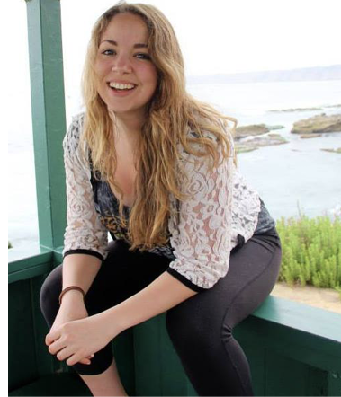

Drawing | Howland

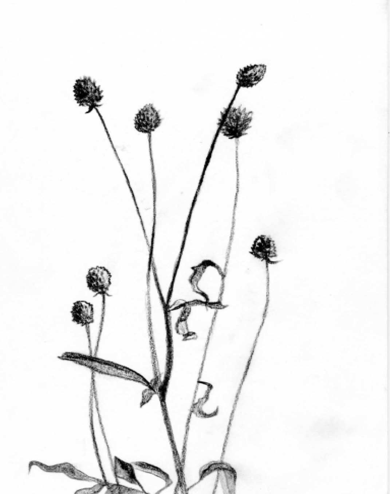

Drawing: Madeline Howland

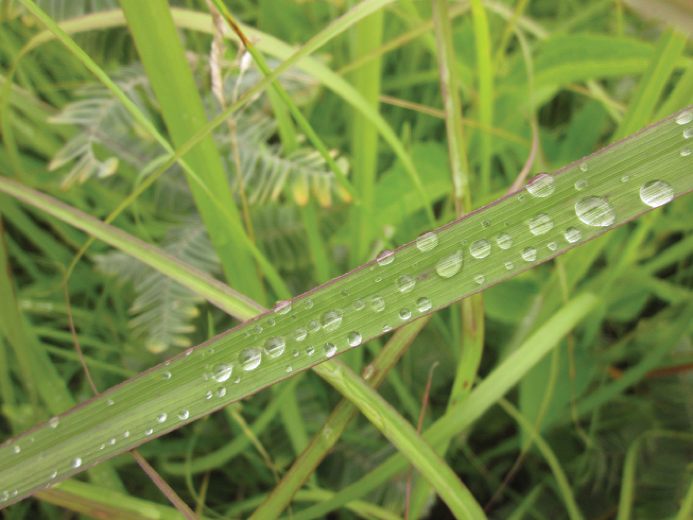

Contents

In order of Appearance

Untitled photo 1 2

 Justin Hayworth 

Untitled drawing 1 4

Madeline Howland

Untitled drawing 2 8

Madeline Howland

My Prairie 11-12

Betty Moffett

The Real Deep River Blues 13-14

Sandy Moffett

Female Redwing Blackbird (Photo) 15

John Clayton

The Garwin Bowery 16-18

Frank Heath

Untitled photo 2 • Untitled photo 3 19-20

Justin Hayworth

Tortoise Philosophy 21-25

John C. Whittaker

Untitled photo 1 22

Ken Saunders II

Untitled photo 2 24

Ken Saunders II

Triptych: Diana Scandridge 26

The Stories We Live By: Writing Climate Change 27-31

Cornelia F. Mutel

Untitled photo 4 32

Justin Hayworth

Swimming Upstream: Des Moines 33-38

Water Works Asks for Agricultural

Accountability in A State that Claims 

to “Feed the World”

Bill Stowe

Photographs by Max Christensen 39-40

 Field of Dreams 

 The River 

Puppy Mills in Iowa 41-48

Mary LaHay

Untitled photo 5 49

Justin Hayworth

From Soil to Sustainability 50-56

Frederick L. Kirschenmann

Untitled photo 6 52

Justin Hayworth

Untitled photo 7 • Untitled photo 8 57-58

Justin Hayworth

Close-up: Robert Wolf 59-60

Untitled drawing 3 61

Madeline Howland

Such A Clean, Tidy Man 62-66

J. Harley McIlrath

Untitled photo 9 67

Justin Hayworth

Endnotes 68

 By Category

Words

My Prairie 11-12

Betty Moffett

The Real Deep River Blues 13-14

Sandy Moffett

The Garwin Bowery 16-18

Frank Heath

Tortoise Philosophy 21-25

John C. Whittaker

The Stories We Live By: Writing Climate Change 27-31

Cornelia F. Mutel

Swimming Upstream: Des Moines 33-38

Water Works Asks for Agricultural

Accountability in A State that Claims 

to “Feed the World”

Bill Stowe

Puppy Mills in Iowa 41-48

Mary LaHay

From Soil to Sustainability 50-56

Frederick L. Kirschenmann

Such A Clean, Tidy Man 62-66

J. Harley McIlrath

Sounds & Images

Madeline Howland

Untitled drawing 1 4

Untitled drawing 2 8

Untitled drawing 3 61

Sandy Moffett & The Too Many String Band

“The Real Deep River Blues” 14

John Clayton

Female Redwing Blackbird 15

Justin Hayworth

Untitled Photo 1 2

Untitled Photo 2 19

Untitled Photo 3 20

Untitled Photo 4 32

Untitled Photo 5 49

Untitled Photo 6 52

Untitled Photo 7 57

Untitled Photo 8 58

Untitled Photo 9 67

Ken Saunders II

Untitled Photo 1 22

 Untitled Photo 2 24

Diana Scandridge

Triptych 26

Max Christensen

Field of Dreams (photo) 39

The River (photo) 40

Features

Close-up: Robert Wolf 59-60

Rootstalk | Volume II, Issue 1, Fall 2015

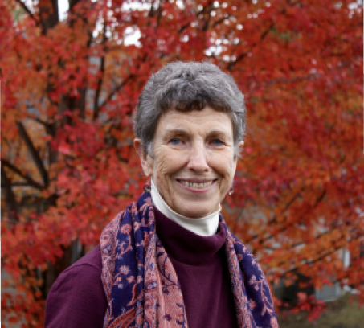

Betty Moffett taught for almost thirty years in Grinnell College’s Writing Lab, where she learned a great deal from her students.  Her stories have appeared in a number of journals and magazines, including [The MacGuffin](http://www.schoolcraft.edu/a-z-index/the-macguffin#.VqAvnpNVhBc), [The Storyteller](http://www.thestorytellermagazine.com/), and [The Wapsipinicon Almanac](http://www.wapsialmanac.com). She and her husband, Sandy, write songs for and play with The Too Many String Band.

  Photo courtesy of Betty Moffett

My Prairie

Betty Moffett

My husband Sandy works with a small, committed group which purchased and is restoring to prairie a tract of land in southern Iowa. They call these rugged 700 acres Pleasant Grove, a name I find inappropriate. It’s too large to be a grove and too rough to be pleasant. Though appreciative of its deer, wild turkey, and blackberries, I am put off by the labor this land requires—planting, mowing, burning—and by its size. I could get lost there, and tired.

 Tiny by comparison, the patch of prairie I consider my own is across the road, field, and railroad track from our house. Five years ago, Sandy planted this seven acre spot in a mix of native grasses and forbs. Like Pleasant Grove, it had been over-farmed. Some places have eroded badly. It’s bounded on three sides by Little Bear Creek, and because areas of it are always damp-to-wet, it attracts Canadian geese as they migrate south in the fall. We coveted what we’ve christened the Goose Field for years before we were able to buy it in a ninety-nine acre farm package. It’s a kind of oblong bowl, sheltered from wind even in winter, and I regard this small, wild place as mine, even though I’ve done precious little work on the making of it.

 Sometimes I feel like a taker in a gathering of givers, since I’m attracted to the prairie largely for what it gives me, not the other way around. When I walk there, I can believe the Earth’s heart is still beating strong and steady. I go to the prairie in three ways—with my dogs, on my horse, and with people I like, or may like. Each way is different; each way makes me see the land fresh.

 Going with the dogs is good in fall and winter, and it’s best when all three dogs can come. Hyde and Shiek (for Poweshiek County) are ours; Lucky is a grand-dog, who visits. Labs all, Shiek is the color of Iowa topsoil; Lucky, of Fall switch grass; and Hyde is brown. The dogs guarantee action: pheasants rise up, wings clattering; rabbits sprint in zigzags down the path and into the tall grasses; an occasional deer arcs over the creek and disappears up the hill. The ecstatic canine trio run from scent to scent—mouse, raccoon, coyote—and then plunge down the bank to the creek. Depending on the season, they play in the water, slide on the ice, bite at the snow, finding joy in whatever they encounter.

 When snow falls on the prairie, the dogs and I all notice tracks, they with their vivid noses, I with my eyes. Rabbits make lines of quotation marks; pheasants, blurry fleur-de-lis. Mice burrow under the snow, and then their tunnels collapse, leaving what looks like the trails of snow snakes.

Seeing the prairie from horseback is an entirely different deal. While keeping company with the dogs draws my attention to the prairie’s wild residents, my little horse Gwyneth encourages me to concentrate on plants—first and foremost because she likes to eat them. In the late spring and early summer, before the flies and heat get discouraging, Gwen is tempted by gray-headed cone flowers and bee balm. We strive for compromise. First, on the path around the prairie, she gives me a walk-trot-canter tour of the grasses and flowers. On her back I have the perfect vantage point to see over and into the burgeoning feast. Then I dismount in an especially appealing patch of grasses, and she indulges herself. 

 Of course, Gwyneth and I encounter fauna as well. A covey of quail sometimes bursts from under her feet; once she kicked and killed a hen pheasant who barked behind her. She feigns fear at each of these meetings, and I have to stay alert to keep my seat. Gwyneth has evolved a game of being scared with a blue heron who fishes every summer in Little Bear Creek. We are trotting rhythmically along. The path curves toward the creek. Horse and heron simultaneously spot each other. Gwyneth snorts, jumps, and wheels. The heron squawks furiously and lifts off, leaving a stream of white behind him. The next day he’s back again, and we repeat the scene.

Taking people to my little prairie complicates the issue. Unlike Gwyneth and the dogs, they have multiple reasons for being there—to exercise, to identify a kind of golden rod, to have a good talk, to plant a willow, let a house-bound dog run, burn reed canary grass, sit in the sun. I don’t ask many people, and I prefer that they come in ones or twos. Established friends are fine. We can talk or not, as we pass through the sounds and smells of this piece of country. I pretty much know what their reactions will be, and they pretty much understand my obsession. Acquaintances are harder. I dread over-enthusiasm: “Oh, it’s just perfect. Can’t you imagine the early settlers…,” and lack of appreciation: “Looks like weeds to me.” So I am cautious. 

I do like to bring my grandchildren. Eva and Lilly, one and three, don’t yet love my prairie. I think it’s too big and open for them, as Pleasant Grove is for me. And negotiating badger holes, horse poop, and grasses four times their height is discouraging. I respect their opinions, and hope they change in time. Alex, at six, likes this land. We sail stick boats down the creek. He has helped build a bridge, plant a cottonwood, and control a tiny prairie fire. He has seen a rabbit killed by a hawk, and he recognizes the tracks of deer, raccoon—and dog. He knows this land is partly, temporarily, his, and that the grasses are feeding it and making it strong again. He will be able to tell stories about this prairie that begin with “When I was a boy….”

Compared to Pleasant Grove’s wild expanse, my prairie is a small, mild wilderness. But hawks, quail, deer, milkweed and stiff goldenrod, goldfinches, orioles, and monarchs find refuge there. And so do I.

My Prairie | B. Moffett

It’s a kind of oblong bowl, sheltered from wind even in winter, and I regard this small, wild place as mine, even though I’ve done precious little work on the making of it.

Rootstalk | Volume II, Issue 1, Fall 2015

  Photo courtesy of Sandy Moffett

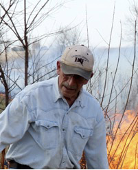

Sandy Moffett, Emeritus Professor of Theatre at Grinnell College, joined the Theatre Faculty in 1971 and continues to teach and direct plays on campus on occasion. Currently he spends most of his time restoring prairie, writing songs and stories, entertaining his grandchildren, and playing with The Too Many String Band. His most recent short stories are scheduled for publication in [The Wapsipinicon Almanac](http://www.wapsialmanac.com) (http://www.wapsialmanac.com) and [Gray’s Sporting Journal](http://www.grayssportingjournal.com/) (https://www.grayssportingjournal.com)

There’s a little town on the county line,

’bout two miles past the “Road Closed” sign, 

nestled in the middle of the corn and the beans and the hay.

They had a little river, no more than a creek,

The doggone thing never was very deep.

But they called that town Deep River anyway.

They used to have a real good hardware store, 

had “locally owned” up over the door, 

and it had anything that you’d ever want to buy.

The man at the back could fix anything 

that would buzz or whir or whistle or ring,

And the café next door had sixteen kinds of pie.

There was a big old church up on the hill. 

There were three kinds of beer at the bar and grill, 

and the grass on the softball field was always green.

There were flowers planted all along the road.

The houses’ lawns were always mowed.

It was the prettiest little ol’ town you’d ever seen.

CHORUS

Let it rain, let it sleet.

Cracks in the sidewalk, holes in the street.

That’s the real Deep River blues.

Let the rain come on down.

We’re gonna lose another little town.

That’s the real Deep River blues.

Back in the eighties things went south. 

There were two bad years of real hard drouth, 

and a man from Texas bought all the little farms around.

The high school grads started movin’ away, 

to places they could get more pay,

like West Des Moines or some other big-ass town.

The grocery store was the first to go, 

then the hardware closed its door, 

and Joe at the tavern said he’d run plum out of luck.

The Wal-Mart at the county seat 

set prices so low they couldn’t compete.

‘Deep River was blowin away like an old corn shuck.

CHORUS

Now all these little towns are dyin’ away 

like weeds in the pavement on a dry hot day, 

no matter how they try to fight defeat.

A few old folks, a couple a dogs, 

lots all around that are feeding hogs, 

and “for sale” written on the buildings all along Main Street.

I had a dream that I’ll relate. 

I was at the Mall on the interstate, 

on the biggest damn Caterpillar ‘dozer this side of hell.

And I was wrecking every thing, 

Target, Menards, and Burger King, 

Home Depot, Hooters, Perkins, and Taco Bell.

Then I awoke and put my feet on the ground.

I saw the destruction was the other way around.

These little old towns got nothing’ left to lose.

All over this country it’s goin’ on, 

like tree limbs breaking in a bad ice storm.

All that they got is the blues.

CHORUS 

The Real Deep River Blues

Lyrics by Sandy Moffett

 performed by The Too Many String Band

The Real Deep River Blues | S. Moffett

To listen to “The Real Deep River Blues,” download the interactive PDf and click the image above, or follow our SoundCloud link: https://soundcloud.com/user-239159245-389989462/the-real-deep-river-blues

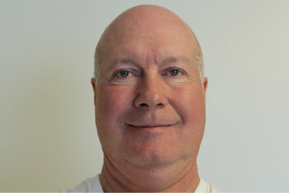

 Photo courtesy of John Clayton

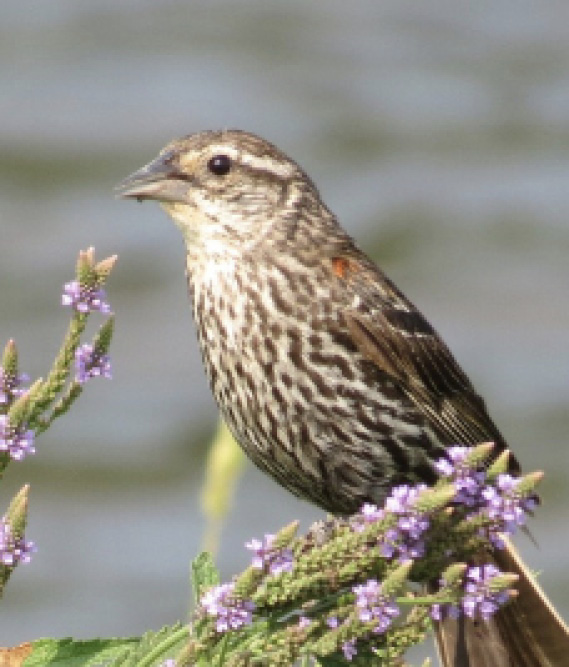

 Photograph: John Clayton

John Clayton

John Clayton, in addition to being a photographer (his image above is of a female redwing blackbird), is a native life enthusiast, retired teacher, former Peace Corps volunteer, prairie wildflower gardener, and resident of Grinnell, Iowa. He asserts that climate change is occurring, is mainly man-made, and that there is hope. John has organized and/or delivered talks about the climate change crisis, and is also active in local politics, as he believes it is a duty of every citizen to participate. 

The Garwin Bowery | Heath

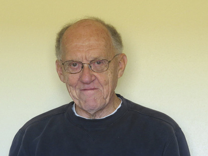

Author photo

Frank Heath is a writer, musician and historian who has published in magazines and newspapers and has soloed with various symphony orchestras. He has spoken about Iowa town bands and Iowa history, interviewed 25 farm families in Iowa’s Poweshiek County about growing up in the 20s, 30s, and 40s, and published a book of their stories. He is a founding member (on trombone) of Grinnell, Iowa’s Prairie Jewel Dixieland Band and the Basement Brass Quintet.

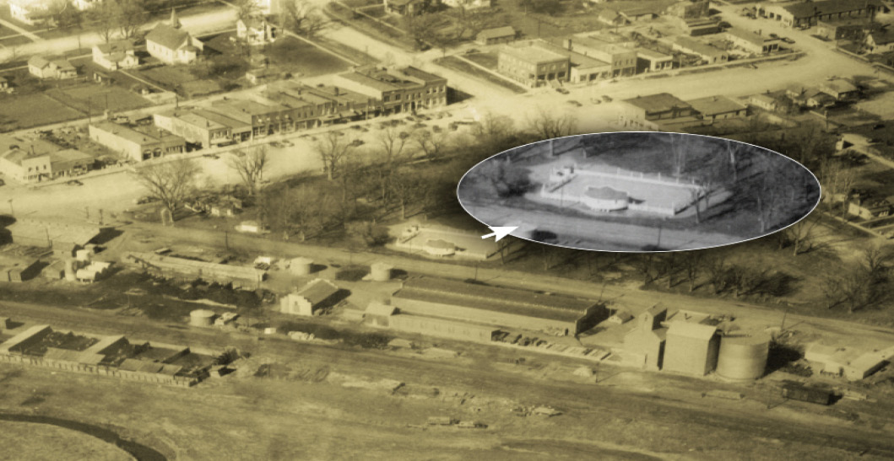

The Garwin Bowery, Photo courtesy of Frank Heath

Photo courtesy of Frank Heath

On Wednesdays, when Shirley Springer’s dad closed the front door of the drugstore in Garwin, Iowa, at midnight and turned off the lights, Shirley went across to the Bowery, an open air pavilion, and danced ‘til one in the morning. When Kenny Hofer and the Midwesterners were playing, as many as 700 people paid 75 cents to go through the swinging gate to the dance floor. A bandshell held the band and seats ringed the floor with a short fence surrounding it all.

Crowds of people stood around the outside looking in or sat in their cars to listen. Some brought the car earlier in the day to get a parking place. “The whole Main Street and all around was so full you couldn’t find a place to park,” said Marley Bacon. “They’d be parked two rows, one behind the other.”

Wednesday night in Garwin was business, of course, with grocery stores open late as farmers brought eggs and cream to sell, but the 8 p.m. free talent show and the dance from 9 p.m. to 1 a.m. provided entertainment, and the chance to two-step, foxtrot, waltz, or round dance. There was an intermission at 11 p.m., and the bars and the drugstore did steady business. Then the dancers came back.

“The floor was crowded,” Shirley said. “They’d put cornstarch around to make it slippery. Everybody danced.” 

Burdell Aldrich said he and his wife danced at the Bowery—the two-step and the waltz. “The waltz is a wonderful dance. And my wife, she didn’t want to leave ‘til the last dance was over.” 

Many bands played at the Bowery through the ‘30s, ‘40s, ‘50s and into the ‘60s: Les Hartman, Leo Greco, Tom Owens and His Cowboys from WMT, Don Hoy from Brooklyn, Tiny Hill, Ralph Slade. The Charlie Barnet Orchestra played there, too, probably taking the Wednesday night gig as they traveled between two larger cities.

The names of the bands that played at the Bowery and other area venues bring echoes of the times: Andy’s Ridge Runners, The Salt Creek Syncopators, Rob McClellan and His Gloomchasers, Spider Kurth’s Orchestra, The Moeller Accordion Band, Joe Fisher, Sovereign of Concertinists and his Victor Recording Orchestra, Woody’s Woodchoppers, Burt Whorell and the Night Owls, the Iowa Cornhuskers.

During the ‘30s the Garwin Business Men, acting as a Chamber of Commerce, sponsored the dances in cooperation with the American Legion. The amateur contest at 8 p.m. carried a $10 prize for the winner and a chance to compete for the grand prize later in the summer—an early Garwin version of American Idol.

In 1945, the show before the July dances featured the stars of radio, Ken Houchins, Mary Lou, and Wanda Hargrave from WHO, the Higgins Brothers of KXEL, Happy Haines of WMT with Mary Bernard. WHO also sent Cliff and Helen, Red Scobee and Jack Lester. 

By the ‘50s, the Garwin Commercial Club was cordially inviting people to attend. Dallas Wiese and his wife Joyce liked to jitterbug at the Bowery, and Dallas remembers that activities went on outside the fence, too. Someone tossed a firecracker onto the dance floor once, and that occasioned some fisticuffs that week and the next week, too. Workers at the lumberyard across the street spent some of Thursday morning picking up beer cans.

The only thing sold at the Bowery, though, was popcorn. Using two gas burners, ladies started popping corn between 7 and 8 p.m. They turned the handles round and round on the poppers and they did it in shifts until 11 p.m. or midnight. In the early years, the price was a nickel a bag, and they sold $90 to $100 worth. They didn’t sell drinks, but there were two cafes—including one in the old hotel—and two taverns, and the drugstore had a soda fountain. Joan Bacon worked there and recalls learning to make her first Green River, a lime-flavored drink. She also made cherry cokes and vanilla cokes and something called a ‘Suicide Coke,’ a Coke with a dash of every flavor available. 

Other boweries offered the chance to dance. Chelsea had the Vavra Bowery in 1933; Gladbrook had a bowery and Blodgett’s Bowery sat further south, down by the Iowa River. The American Legion had a bowery in Tama. In Brooklyn, it was Landtiser’s Dance Pavilion. Admission there cost 50 cents, and for another dime you could park your car. Many people went to the Forest Park in Marshalltown, and later to the Bricklayer’s Hall in Garwin, but those were inside dance halls.

The Garwin Bowery got a new dance floor in 1949. The Bowery itself lasted into the early 60s, but rock and roll, television, and a changing population brought the crowds and dances to a close. Garwin still has Wednesday events in the summer—music on the bandstand, sandwiches, pie and coffee—but the nights are gone when you held your partner close under the stars and danced to the music of your favorite bands. 

The Garwin Bowery

Frank Heath

The Garwin Bowery | Heath

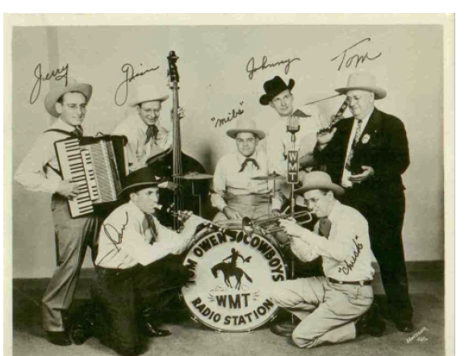

Tom Owens and His Cowboys, Photo courtesy of Frank Heath

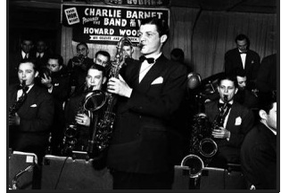

Charlie Barnet Band, Photo courtesy of Frank Health

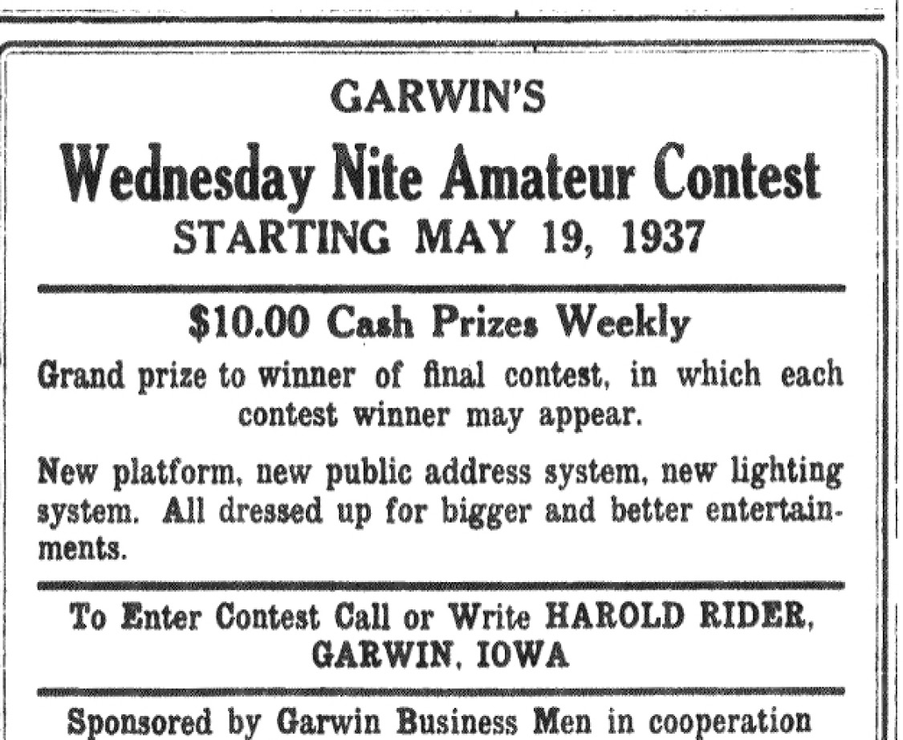

 Garwin Bowery Contest, Photo courtesy of Frank Heath

 Justin Hayworth

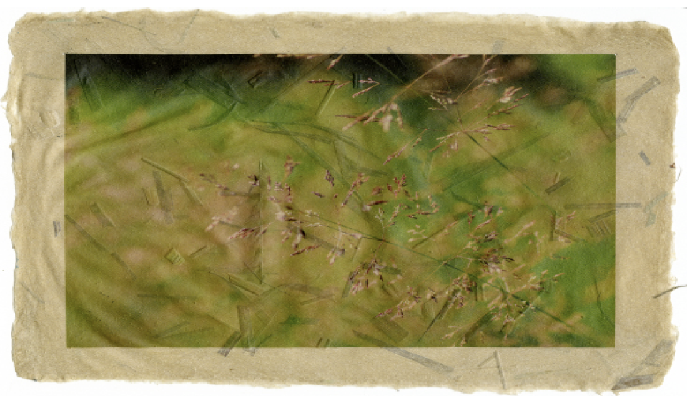

 Photo courtesy of Justin Hayworth

Photograph: Justin Hayworth

[Justin Hayworth](http://justinhayworthphotography.zenfolio.com/) has been the photographer at Grinnell College for three years. Prior to that he spent 15 years as an award winning newspaper photojournalist in Kansas, Arkansas, South Dakota, New York, Minnesota and Iowa. Hayworth was born and raised in Wichita, Kansas, and graduated from Kansas State University with a print journalism degree. In addition to working at Grinnell he currently teaches photo classes at Des Moines Area Community College in Ankeny and is a freelance photographer regularly working for the Associated Press and other commercial and editorial clients in the midwest. Justin printed the images on these two pages and on p. 51 on paper handmade from prairie plant materials.

Photography | Hayworth

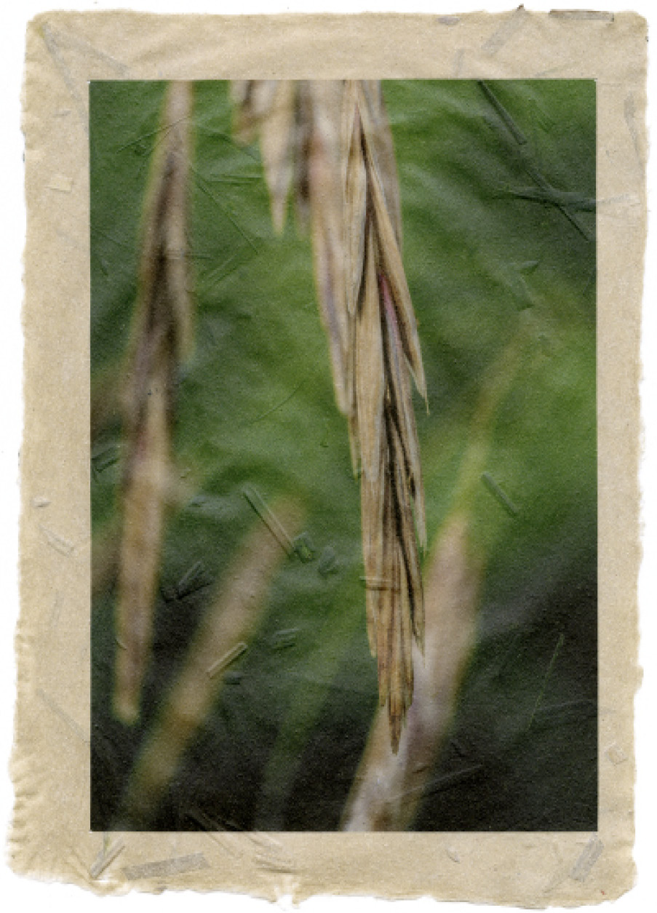

Photograph: Justin Hayworth

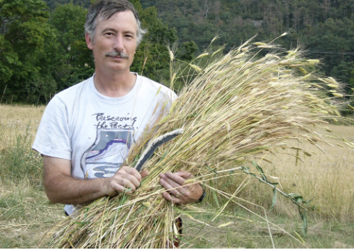

John Whittaker has been teaching Anthropology at Grinnell College since 1984. He is mostly an archaeologist, often experimenting with ancient hunting and farming technologies, but says that all people, living and dead, are of interest to him. He finds thatthe broad view of the world encompassed by anthropology also encourages an interest in the natural world, and he is increasingly interested in exploring the human condition through means other than formal scholarly papers.

Photo courtesy of John Whittaker

Tortoise Philosophy

John C. Whittaker

The giant trucks crowding past me on I-35 ignore the turtle plodding down the shoulder. Under their wheels, the unfortunate reptile that tries to cross the freeway is no more than a sickening crunch on the way from Tulsa to Des Moines. As a card-carrying “I brake for wildlife” reptile-lover, I feel obliged to rescue turtles when I can stop safely, but I have begun to wonder about the implications of my kindly impulses.

Many Midwestern miles pass beneath my wheels each year, and neither the prairie nor its inhabitants are the flat and bland stereotypes imagined by some Americans. The tribes of turtles are more limited than those of people, but just as the farmer is different from the banker, and the teacher, and the plumber, turtles too require local knowledge and diplomacy. Soft-shelled turtles are parochial. They stick to their rivers, and rarely cross dry land. Snapping turtles wander a lot, up the bank of pond or river, across the golf course or pasture, down the lane, and onto the highway. When you try to help them, they are never grateful, and require careful handling. I am told that dragging them off the asphalt by their tails may damage their spine, and they should be picked up by gripping the back of the shell with the tail between your fingers, or between your hands if they are large enough to require two. Of course it is not always that easy. Even knowing that most snappers are less aggressive than stories have it, those finger-lopping jaws still scare me, and a 30-pound antediluvian with the head of a small fierce dinosaur may just have to take his chances without my help. Box turtles, on the other hand, are pleasant little beasts. They never try to bite; some pull themselves in and lock up the box, but others paddle their legs in the air and wave their heads around curiously as you carry them off the blacktop.

 In countries less ravaged by pesticides and highways, tortoises are more common. In Turkey, for instance, I worked some years ago with my wife and students on an ethnographic project in the neighborhood of Kastamonu near the Black Sea. We were interviewing vendors in local markets, which required a lot of driving from town to town. Our ethnographic team encountered European tortoises (Testudo graeca) frequently in Turkey, from the sun-baked and tourist-ridden heat of Ephesus to the cool pines of Mount Ida. The tortoises we saw seemed to share our affinity for archaeological sites, although we found quite a few trapped and perishing in ditches and abandoned excavation areas. 

 We learned that Ephesus was home to the pre-Socratic philosopher Heraclitus, who posited that all things in nature were in a state of flux, but connected by logical patterns. But as we drove away one day from Ephesus, I remembered aloud that the tragic playwright Aeschylus was supposedly killed by an eagle who, mistaking his balding pate for a rock, dropped a tortoise on it to break the shell. According to some, Aeschylus was living outdoors at the time to avoid a prophecy that said he would be killed by a falling object. It is hard to know if Heraclitus would find a logical pattern here. 

A tortoise’s need to travel for food and mates, and the needs of humans to do the same, leads to a sad but predictable pattern of highways and flattened reptiles. I took my Midwestern habits to Turkey, and we were occasionally delayed when I braked and pulled over to rescue plodding tortoises on small winding roads, somewhat to the dismay of my companions. While they muttered at the unwisdom of my driving practices, I mused on a Philosophy of Life as Expressed by Tortoises:

I wondered: after lugging a tortoise off the blacktop, through the brambles, across a stone wall, and safely into a field, have I really helped it? True, its chances on the highway were not good, at least if it tried to cross. But maybe it needed to go there. Perhaps I preserved it this time, but now the poor pilgrim, fixed in his determination, would only struggle once again to find a hole in the wall, push through the weeds, climb down into the ditch and up the other side, and scrabble onto the road again. In that case, all I would have done was force the tortoise to waste the energy that it could have better used to mate, find food, escape a predator, cover another hundred yards of rough terrain. Quite possibly, a different disaster awaited it in the field—a blind tumble into a deep and inescapable hole, or grinding destruction under a farmer’s plow. 

I will never know, as I drive on, the outcome of my interference, or the rest of the tortoise’s story. When humans intervene in natural processes, we do not often do good. But much of life is like that: it is impossible not to affect the lives of those around us. When you act with the best of intentions but without omniscience, do you help or hurt? Sometimes you have no choice but to make the attempt, and hope that if you prevent one disaster, the future that follows will be better, or may at least offer different chances for better.

 ***

 Turtles are vulnerable in part because they are so well-protected. Like small inoffensive tanks, they trundle through the world protected from most predators, but blind to the perils of man-made habitats. I consider Midwestern box turtles nature’s Houdinis. In spite of clumsy shells, their powerful legs can get them out of all sorts of places, escaping my railroad tie pens, moving mysteriously from the front floor of my car to under the back seat and into gaps in tightly packed luggage. But shells and legs controlled by a very small brain can also get turtles in trouble around humans. 

My friend Ken, a biologist who has also kept box turtles as pets, reminds me that while our box turtles behave like my Turkish tortoises, they are actually terrestrial members of the turtle family. More important to us than their taxonomy, box turtles are great for teaching children responsibility with a pretty indestructible animal. You have to dig worms for them, but they won’t die if you forget to feed them for a few days. If you let them wander the house, you have to clean up after them now and then, but there is no smelly litter box or soiled carpet. They don’t bark at the postman or claw the couch. Tortoises are active enough to be interesting, but they can’t dive through the door and vanish up the street while you call their name in vain. Tortoises do get used to humans, enough to stop hiding and expect food, but compared to dogs and cats, turtles are not cuddly or affectionate. Ken’s daughter was found howling one evening with her tortoise firmly gripping her lip. She swore she was not trying to kiss it goodnight; perhaps it was on her pillow and thought her lip was a worm. Best intentions gone awry again? Maybe. Not all is what it seems to be, even for a tortoise. 

 You know a child is being raised right if he or she is not afraid of bugs and likes reptiles. Everyone should at least be able to recognize the difference between harmless snakes and those you don’t mess with. And everyone should be kind enough to despise the brutes who treat turtles as targets for their driving. Reptiles, like most of us, find themselves in danger more through ignorance than in pursuit of adventure. Extreme sports are foreign to the small mind of a tortoise; Nature has not evolved them to seek thrills. Be that as it may, in the wild, misadventure sometimes brings them to the inescapable bottom of natural ravines and human diggings, as well as moving them to explore the easy open space of a highway. Pet turtles in a house roll down stairs and try to dig through living room corners. My friend Ken’s daughter grew up to be a social worker, and ‘Tort’ became a metaphor in her counseling for the tendency of all humans, and her clients in particular, to work themselves into a dead end, blindly continuing instead of thinking their way out.

 ***

One particular tortoise stands out in memory. I often attend a primitive skills event in Missouri, and driving there from Iowa gives me all too many chances to observe the mortal effects of highways on wildlife. When the national speed limit was 55, I could easily identify small animals, not just deer and raccoons. Once I even rescued a tiny kitten in addition to the tortoises I usually stop for. Barreling along at 75 mph, the current speed limit, and dodging the majority who go even faster, it’s hard to be sure what I see. 

This particular tortoise was a dark lump I glimpsed beside the highway—unmistakably a turtle, not a rock or tire fragment. On its back, with head and feet sticking out, it was apparently alive. By good fortune (since I am not fanatical enough to risk my life or become a road hazard to effect a rescue), this turtle lay near an exit. Pulling off on the side of the exit lane, I trotted back along the grassy, littered verge the quarter mile it took to stop. The tortoise was in fact alive, lying beside some flapping paper and a crushed Mountain Dew bottle (the drink of choice for slobs, if highway litter is to be believed). But it was not doing well. The passing tornado of a truck’s wake must have scooped it up and flipped it off the road, bouncing across the black rock of the asphalt. The tortoise’s plastron, its under-shell, was shattered, and its hind legs crushed by the impacted fragments. The rounded upper carapace was undamaged, though, and the hardy reptile was still alive. When I picked him up, he pulled his head and front feet into his damaged shell with a hiss, indicating that the hinge on the plastron still worked. With a screw driver and needle-nose pliers from my toolbox I performed rude surgery, prying and pulling the shell fragments back into place. This freed his damaged hind legs, but I shook my head as I straightened the white bone showing through the green skin. Not much I could do about that. The front end of the beast was still going strong, though, and turtles are amazingly tough little critters.

Back in my car again, with the tortoise in a bucket beside me, I considered: should I put it out of its misery, or hope it would recover? Even hurt, it was an attractive little animal, with the colorful patterns of the ornate box turtle, Terepene ornata. The concave plastron told me he

Tortoise Philosophy | Whittaker

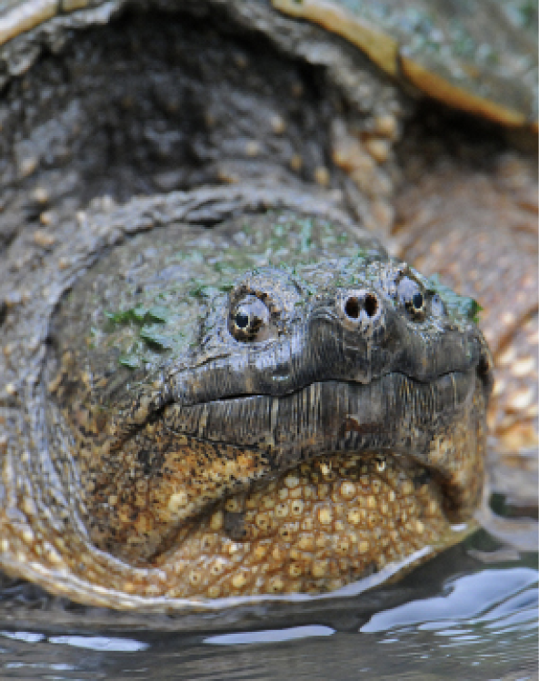

Photograph: Ken Saunders II

The tortoise was in fact alive, lying beside some flapping paper and a crushed Mountain Dew bottle (the drink of choice for slobs, if highway litter is to be believed). But it was not doing well.

Tortoise Philosopohy | Whittaker

Photograph: Ken Saunders II

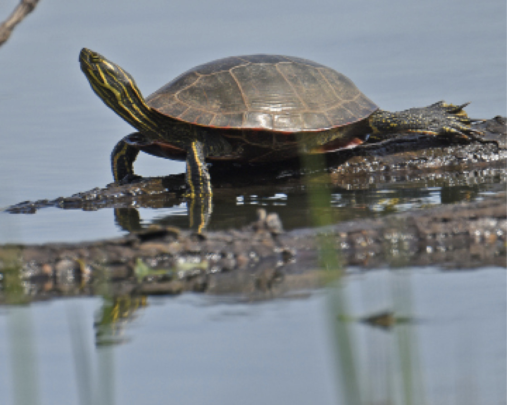

was a male, and as humans do, I had already felt a connection, personalized him. In the end, curiosity and sympathy alike impelled me to keep this turtle: I wanted to know what kind of damage a turtle could sustain and still be worth rescuing. If this one recovered, I figured it would be a gimpy turtle, probably not capable of life in the wild, but I told myself I needed a house reptile anyway.

 When I arrived at my destination, a group of flintknappers and primitive archery experts camped in a county park, I hospitaled my patient in a shaded bucket in the back of my pickup, cooling him with water and washing away leaking blood. I considered superglue for the shell, but the turtle’s own muscles seemed to be keeping everything in place, and his head and front legs went in and out as he occasionally dragged himself around the bucket. He survived the first day, and the night, and a second day. In the evening, I decided to drive to town with a friend for dinner, and figured the turtle would do better with the minimum of bouncing around in my truck, so I left his bucket under a picnic table. 

 Alas, when I returned, two friends cleaning up the camp had found the turtle, and deciding he was dead, had thrown him into the woods. I fear they will always regard me with suspicion, remembering my turtle-obsessed ranting. I informed them loudly that my turtle had NOT been dead when I left, and I accused them of secretly cooking and eating him. I assured them that if I found one of them wearing a tortoise-shell rattle at the next event, he would be in trouble. 

The next morning, I searched the weeds for over an hour, with the repentant help of the guilty parties, but we couldn’t find the turtle. Had he crawled away? Had he been taken by a raccoon? Did we just not see his camouflaged shell? We never found him. My personal suspicion is that he dug himself deeply into the loose leaves, where he probably didn’t survive for long. It’s likely that Nature took its course, regardless of my designs, but I’ll never know what the outcome really was. 

 Tortoise philosophy: you never do know, really, and even the best intentions can go awry. After I explained all this at length to my captive audience of grumpy anthropologists, trapped while I drove our small SUV along the Turkish roads to and from Kastamonu, someone expressed a wish that I might experience the fate of Aeschylus at our next stop. I didn’t. But if that were ever to happen, would it be a tragedy, or merely the pattern of Nature?

 Diana Scandridge

Triptych | Scandridge

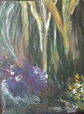

Triptych, Acrylic, 2015

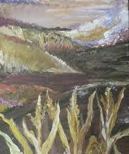

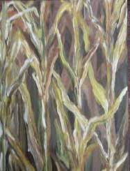

Born in Vinton, Iowa in the 1960s, Diana Scandridge received her degree from the University of Northern Iowa and began teaching K-12 art in small rural Iowa towns. She has taught both young and seasoned artists how to develop and express their ideas on canvas and paper, and received a grant from the Calvin Institute of Worship and the Lilly Foundation to create an after-school art program for elementary children. She created her art studio, [Exodus 31](http://www.exodus31artstudio.weebly.com), in a refurbished barn. It has been featured in the Hometown Press newspaper and Jasper County Living Magazine. Her work often focuses on the spiritual. She currently teaches at Pella Community Schools, and lives in Sully, Iowa, with her husband Bob and three children.

 Her composition “was a reflection piece as I looked out on the abundance of the fields surrounding my rural Iowa home. Each panel is an abstraction, but assembled, the pieces are reminiscent of a stained glass window in a house of worship. We often give thanks for our numerous blessings, only to want and desire more before we leave the seats of worship. This is to hold us in the place of thanksgiving a little longer as we dwell on the ‘harvest of plenty.’”

Photo courtesy of Diana Scandridge

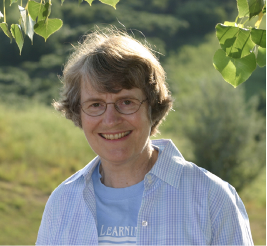

Connie Mutel, a Senior Science Writer at the University of Iowa’s [IIHR-Hydroscience & Engineering](http://www.iihr.uiowa.edu/), has written and lectured extensively on Midwestern natural history and environmental issues. Her books include The Emerald Horizon: The History of Nature in Iowa, Fragile Giants: A Natural History of the Loess Hills, and The Tallgrass Restoration Handbook for Prairies, Savannas, and Woodlands. This essay explains her efforts with her most recent book, A Sugar Creek Chronicle: Observing Climate Change from a Midwestern Woodland, forthcoming from the [University of Iowa Press](http://www.uiowapress.org/) in 2016.

Photo courtesy of Connie Mutel

The Stories We Live By: Writing Climate Change* 

Cornelia F. Mutel

When I was a youngster, my grandmother perched me on her knee and fed me stories about her childhood on a Wisconsin farm in the late 1800s. She and her sisters strolled in nearby woodlands in springtime, gathering bundles of wildflowers and wild herbs to bring home to their mother. Her son, my father, filled me with descriptions of his own 1930s rambles across Wisconsin farm fields—where he and his teenaged buddies startled large flocks of feeding larks who rose to trill from the heavens. Add to these tales of nature’s abundance the sensitivities of my mother, who showed me warblers hidden in the bush, beetles and flowers too small for most to notice, and the beauty of snow layering the cedar branches outside our front window, and it’s not surprising that I became a teller of stories of our natural world, using words to detail nature’s elements, complexities, and wonder.

I have written about nature and the environment for forty years now, completing books and articles on natural history, restoration ecology, and conservation issues. In 2010, while editing a major report on climate change in Iowa1, I was forced to dig into the details of global warming. For the first time I came to understand how, if left untended, the burning of fossil fuels and resulting inexorable rise of global temperatures have the potential to destroy the civilized world as we know it, dragging along perhaps half of the earth’s species and trashing dependable, predictable planetary functions as it goes. Astounded by the unbelievable possibilities of climate change’s relentless advance and stunned by humanity’s apparent race toward the cliff, I felt I needed to do something about this unfurling crisis. For me, that meant writing about it.

My book, A Sugar Creek Chronicle: Observing Climate Change from a Midwestern Woodland, will be published early in 2016. The interim period between manuscript submission and book release is usually a pleasant, relaxing time of anticipation, a period to lean back and enjoy a sense of accomplishment. But instead I find myself wondering how I managed to complete a treatise on this devastating and often overwhelming subject. How did I persevere?

My book started out, as many do, with contemplations of goals, scope, readership, and structure. Decisions about some of these matters, such as my target audience and goals, were immediately evident. I wanted a book for the general public, people who are broadly concerned about climate change but who may not understand what it is, how it works, or its unparalleled importance. Although I would be writing for non-scientists, I knew that I would need to dispel climate-change myths already engrained in many Americans’ minds—feelings of dread and powerlessness and unspoken tales of hopelessness, perhaps of the unreality of climate change, tales based on fear, misinformation, and denial. My goal was to replace those messages with considerations of hopeful future possibilities and active involvement. 

To do so, I turned to the comfort we feel when immersing ourselves in stories of small-scale worlds, places where actions and consequences are immediate and manageable. What if, I wondered, what if I focused my book on one minuscule section of Earth’s surface—the 16-acre woodland where I live—and explained the growth of oaks, the turning of leaves, return of migratory swallows and warblers, the heat and humidity that sweep north from the Gulf of Mexico in the summer, the Arctic storms that force their way into our lives in winter. All are predictable processes that could dissolve with unfettered climate change. Could the woodland meanders and concerns of a friendly, observant grandmother (me) become a doorway to caring about changing climate around the world? And what if I also revealed my own struggles with cancer, presenting them as a metaphor for society’s struggles with climate change? They both, after all, involve insidious increases of invisible substances that can kill us. Might this metaphor beckon readers to adopt deeper and more caring involvement? 

Using these thoughts as fodder, trusting the strength of words and stories, and fed by my love of writing, I moved forward. 

The result became a text that explores climate change within a double-wrap of stories. A year-long journal—the book’s core—traces my nature ramblings as well as that year’s weather vagaries. Interspersed memoir chapters include tales of both my lifelong search for wholeness and explorations of global environmental change since the mid-1900s. Explanations of climate-change science are spread throughout the text. I spent considerable time selecting the most essential concepts and then working to make these science segments straightforward so that readers could float through them, learning as they go, before becoming impatient with dry facts. I took these chapters, bookended them with introductory and concluding chapters, and a rough book manuscript was born.

This summary makes the book-creation process sound simple. But converting a rough draft into a cohesive treatise is never easy. I invested many months in massaging my original mix of Midwestern natural history, personal memoir, weather descriptions, and climate science into a flowing, unified whole. I wrote and rewrote, ordered and reordered, tossing superfluous information as I went. Often I became overwhelmed by the complexity of the subject matter and the number of topics I was trying to merge. Sometimes my direction clouded. If I had not been practiced in writing, I might not have finished. But I had been at this point before. I knew that a book consists of themes that are ordered into chapters, that chapters are broken into paragraphs, that paragraphs consist of sentences, and that if I wrote one sentence at a time, I would eventually get to the end. Somehow, even when the vast convolutions of climate change were too complicated to handle, I could manage a few sentences on its likely impact on agriculture or a paragraph on Arctic melting. 

As ideas and words became better ordered and started flowing both logically and artistically, I entered the stage of book-writing that I relish – the time when all elements come together so that the whole is greater than the sum of the parts. There is a magic in this final stage, a time when you can feel the tens of thousands of carefully sequenced words and hundreds of paragraphs gel into a unified whole that takes on a life of its own, as if the creation is no longer a product of its creator, but rather an entity with its own spirit and direction, its own life force. 

 This is the logistical story of how I wrote my book. But another narrative bubbled underneath my three years of writing, a narrative of what the subject matter did to me, for climate change has been the most deeply disturbing topic I have ever addressed, and writing about it exacted a high emotional toll. 

The difficulty lay partly in the technical complexity of climate change and its vast ramifications. Studying and processing this material required a great deal of energy and intense work. But I had written about complex subjects in the past. I knew that fortitude would get me to the end. 

Much more upsetting was my understanding that to write well about climate change, to take it beyond a list of facts and make it come alive for the reader, I had to become intimate with the climate-change process. To focus on its treacherous proclivities for months on end, welcome it as my bedfellow, think about it during the day and dream about it at night. Rise in the dark to scratch down ideas and phrases that entered my sleep. Sit down at my computer first thing in the morning to draft ideas fresh from my subconscious. I needed to obsess about the climate-change process and let it permeate my inner recesses. 

My obligatory association with this devilish process – which is global and permanent, unthinkable, inescapable, and self-compounding, a process that will touch everyone and affect every aspect of global function and human life as it carries us into a new reality – my necessary closeness to climate change wore on me from the start. I resented my need to learn more than I wanted to know about the possible disappearance of all that I loved. I became obsessively hyper-alert, tying everything I perceived – the atmosphere’s increasing moisture and energy, the greater floods and more severe storms we were having – to climate change. A sadness about our planet’s future pervaded my every thought and action, a deep state of grief and quiet despair. I mourned the possible uncertainties and miseries of future people, mentally ticking these off as I wrote: new health problems, uncertain provision of food and water, growing numbers of environmental refugees, communities struggling to recover time after time from extreme floods, droughts, and winds. At times, I believed that our ongoing business-as-usual lifestyles were a sign of societal insanity, and I felt that insanity penetrating my spirit. At other times, I grew jealous of people who seemed blissfully unaware of how each drive to the grocery store was altering climate processes. 

By the middle of the project, I realized that I needed help with my growing depression. I sought a counselor who became instrumental in guiding my efforts, reminding me of my goals and discussing techniques for reaching them. When I complained about my sadness over the planet’s future, she named my grieving process and gave it a new direction. “Part of your writing job is to work through the grief for your readers and get to the other side. That’s your duty as an author – and no one can do it for you. If you want your readers to envision hope-filled solutions, you need to show them your own new-found hopefulness.” For whatever reason, that thought energized my efforts. 

Fighting my overwhelming sense of doom became easier as I kept going. Again, my counselor guided me. One dark day she asked, “What gives you hope, what fills you with joy?” 

“Being in nature,” I answered. “Walking in the woods. Watching the sun rise and set through the trees. Staring at their branches as they wave in the wind.” 

“If you want to write a hopeful book, you need to give your book and nature equal time,” she suggested. “For every hour you are reading, processing, writing about climate change, you need to spend an hour enjoying the natural world.” To this recipe, I added my own time-tested practices for retaining mental balance: meditation, prayer, yoga, talking with friends, exercise, escaping into novels, taking time off and immersing myself in our grandchildren’s lives and antics. 

As my writing progressed and I started reading of ways to address climate change, my sense of hope increased. I realized that many European countries are determined to become carbon-neutral by mid-century or before – that is, to cut their net carbon emissions to zero. Corporations like Walmart, Google, Microsoft, and others are adopting similar initiatives, their dedication fueled by recognizing the immense impacts and high costs of climate change’s escalating expression. Engineers have designed a doable roadmap for carbon neutrality by 2050 specific to each state in the U.S. Many nations, including China, are striving to reduce fossil-fuel emissions through placing a price on carbon emissions. Some U.S. states, cities, and near-neighbors are doing the same – California, New York, Massachusetts, British Columbia, and Mexico, to name a few. A sprinkling of cities in the U.S. and elsewhere are even attempting to become “carbon-negative,” to absorb more net carbon dioxide than they produce. 

All these activities had been moving forward while I was sitting at my desk feeling isolated and overburdened. But I had been far from alone. Thousands of creative, dedicated, and intelligent thinkers and doers were working hard to address the largest problem ever faced by human civilization, walking together into the future, extending helping hands to those who cared enough to act.

As I continued to read more about positive initiatives and my mental state improved, I came to believe a widely accepted truth: we currently have the technological and economic capability to switch to renewable energy sources that will help slow and then halt rising temperatures, thus defusing climate change’s worst expressions. If we applied our willpower and skills in a focused and dedicated manner, by the century’s end, we could be seeing a decline in the global average temperature. But if fossil-fuel emissions continue to follow their existing trend, models predict a 6 to 10°F global average rise by that time, well beyond the safe level, a rise that likely would activate multiple tipping points and release unimaginable climatic turmoil. 

I realized that curbing climate change would not be easy; it would demand immeasurable political will, international cooperation, societal change, and hard work. “Might we change direction?” I would whisper to myself, thinking of the dedication and cooperation of peoples and nations that would be required. “Not likely, but not impossible. We still have choices. Hope remains.” Repeating this mantra, focusing on nature’s resilience, and believing that my book could be one small part of a global push toward health and sanity, I propelled myself toward my manuscript’s finish line. 

I completed my manuscript a month ago. I see now that doing so has been my attempt to countermand climate chaos. It also has become my way of looking my grandchildren in the eye and believing that I have done my best to will them a hopeful future. My sense of heaviness remains, as does my exhaustion, but these can be explained as normal responses to completing a large writing project. 

What’s not normal are my brittle, fragile, dry feelings, as if my body were emulating the droughts that climate change will exacerbate. Feelings such as these advise me that now is the time to care for myself and to rest. To give myself time to recover, as if I had just returned from a lengthy expedition to an unknown and distressing land. I need to be patient with myself. To believe that I will move on, to trust that joy and lightness will return, even as I remain aware of the climate dangers we face. To accept that I can simultaneously hold sorrow and joy, grief and hope within me, and by doing so I can remain active in countermanding a danger-ridden future. 

I still think constantly about climate change, and so I’m not surprised when stories of the future float uninvited through my mind. I envision the woodland where I live losing its sanctity and wholeness as climate change progresses and the chickadees and nuthatches leave in search of more hospitable homes or simply disappear. 

But then my mental story morphs, and I tell myself that life – that miraculous force that transforms inanimate objects into sentient beings that breathe, move, reproduce, and communicate – will remain. The intricate, self-sustaining interactions of complex ecosystems may unravel. But perhaps, as long as birdsong, movement in the bush, and breezes through flowering plants remain, the peace of a summer morning will not disappear. Or so I choose to believe.

And where will humans be in this picture? What stories will future grandmothers be telling? Will they perch grandchildren on their knees, consider the violent storms and punishing heat waves that have become commonplace, and begin by saying, “Once upon a time, long ago when I was young, a beautiful planet held its offspring, fed them in abundance, and provided safe places for them to live…”? 

Or will future grandmothers talk of times when climate challenges seemed insurmountable, but these challenges were handled with wisdom and dedication to a nurturing future? Will grandmothers expound upon how today’s peoples and their governments pulled together to replace fossil fuels with renewable energy sources, in this way successfully holding the atmosphere’s energy in check?

 Now, a month after handing my manuscript to my publisher, I am spent. But when my energy returns, as I know it must, I want to return to a life focused on passionate defense of our planet. I ask myself how I can do this, even as I think of telling stories – not stories of the destructive weight of climate change, but rather of the amazing beauty, resilience, persistence, and healing powers of this orb we stand upon. Stories of a planet that yearns for integrity and wholeness, that strives to create and sustain life, that constantly calls us home. Stories of possibility and hope.

Perhaps my stories could join with those of others to reshape assumptions about how we live and act on our planet and what we demand of it. And these assumptions in turn might create alternative visions of our planet’s and our own futures. For surely we will need such visions in coming years as we negotiate uncharted courses. Surely we will need new visions to guide our yearnings and actions as we move into an uncertain future and struggle to redeem our species. 

*References listed in Endnotes

The Stories We Live By | Mutel

I felt I needed to do something about this un- furling crisis. For me, that meant writing about it.

a few sentences on its likely impact on agriculture or a paragraph on Arctic melting. 

As ideas and words became better ordered and started flowing both logically and artistically, I entered the stage of book-writing that I relish – the time when all elements come together so that the whole is greater than the sum of the parts. There is a magic in this final stage a time when you can feel the tens of thousands of carefully sequenced words and hundreds of paragraphs gel into a unified whole that takes on a life of its own, as if the creation is no longer a product of its creator, but rather an entity with its own spirit and direction, its own life force. 

This is the logistical story of how I wrote my book. But another narrative bubbled underneath my three years of writing, a narrative of what the subject matter did to me, for climate change has been the most deeply disturbing topic I have ever addressed, and writing about it exacted a high emotional toll. 

The difficulty lay partly in the technical complexity of climate change and its vast ramifications. Studying and processing this material required a great deal of energy and intense work. But I had written about complex subjects in the past. I knew that fortitude would get me to the end. 

Much more upsetting was my understanding that to write well about climate change, to take it beyond a list of facts and make it come alive for the reader, I had to become intimate with the climate-change process. To focus on its treacherous proclivities for months on end, welcome it as my bedfellow, think about it during the day and dream about it at night. Rise in the dark to scratch down ideas and phrases that entered my sleep. Sit down at my computer first thing in the morning to draft ideas fresh from my subconscious. I needed to obsess about the climate-change process and let it permeate my inner recesses. 

My obligatory association with this devilish process—which is global and permanent, unthinkable, inescapable, and self-compounding, a process that will touch everyone and affect every aspect of global function and human life as it carries us into a new reality—my necessary closeness to climate change wore on me from the start. I resented my need to learn more than I wanted to know about the possible disappearance of all that I loved. I became obsessively hyper-alert, tying everything I perceived—the atmosphere’s increasing moisture and energy, the greater floods and more severe storms we were having—to climate change. A sadness about our planet’s future pervaded my every thought and action, a deep state of grief and quiet despair. I mourned the possible uncertainties and miseries of future people, mentally ticking these off as I wrote: new health problems, uncertain provision of food and water, growing numbers of environmental refugees, communities struggling to recover time after time from extreme floods, droughts, and winds. At times, I believed that our ongoing business-as-usual lifestyles were a sign of societal insanity, and I felt that insanity penetrating my spirit. At other times, I grew jealous of people who seemed blissfully unaware of how each drive to the grocery store was altering climate processes. 

By the middle of the project, I realized that I needed help with my growing depression. I sought a counselor who became instrumental in guiding my efforts, reminding me of my goals and discussing techniques for reaching them. When I complained about my sadness over the planet’s future, she named my grieving process and gave it a new direction. “Part of your writing job is to work through the grief for your readers and get to the other side. That’s your duty as an author—and no one can do it for you. If you want your readers to envision hope-filled solutions, you need to show them your own new-found hopefulness.” For whatever reason, that thought energized my efforts. 

Fighting my overwhelming sense of doom became easier as I kept going. Again, my counselor guided me. One dark day she asked, “What gives you hope, what fills you with joy?”

“Being in nature,” I answered. “Walking in the woods. Watching the sun rise and set through the trees. Staring at their branches as they wave in the wind.”

One dark day she asked, “What gives you hope, what fills you with joy?”

The Stories We Live By | Mutel

“If you want to write a hopeful book, you need to give your book and nature equal time,” she suggested. “For every hour you are reading, processing, writing about climate change, you need to spend an hour enjoying the natural world.” To this recipe, I added my own time-tested practices for retaining mental balance: meditation, prayer, yoga, talking with friends, exercise, escaping into novels, taking time off and immersing myself in our grandchildren’s lives and antics. 

As my writing progressed and I started reading of ways to address climate change, my sense of hope increased. I realized that many European countries are determined to become carbon-neutral by mid-century or before—that is, to cut their net carbon emissions to zero. Corporations like Walmart, Google, Microsoft, and others are adopting similar initiatives, their dedication fueled by recognizing the immense impacts and high costs of climate change’s escalating expression. Engineers have designed a doable roadmap for carbon neutrality by 2050 specific to each state in the U.S. Many nations, including China, are striving to reduce fossil-fuel emissions through placing a price on carbon emissions. Some U.S. states, cities, and near-neighbors are doing the same—California, New York, Massachusetts, British Columbia, and Mexico, to name a few. A sprinkling of cities in the U.S. and elsewhere are even attempting to become “carbon-negative,” to absorb more net carbon dioxide than they produce. 

All these activities had been moving forward while I was sitting at my desk feeling isolated and overburdened. But I had been far from alone. Thousands of creative, dedicated, and intelligent thinkers and doers were working hard to address the largest problem ever faced by human civilization, walking together into the future, extending helping hands to those who cared enough to act.

As I continued to read more about positive initiatives and my mental state improved, I came to believe a widely accepted truth: we currently have the technological and economic capability to switch to renewable energy sources that will help slow and then halt rising temperatures, thus defusing climate change’s worst expressions. If we applied our willpower and skills in a focused and dedicated manner, by the century’s end, we could be seeing a decline in the global average temperature. But if fossil-fuel emissions continue to follow their existing trend, models predict a 6-10°F global average rise by that time, well beyond the safe level, a rise that likely would activate multiple tipping points and release unimaginable climatic turmoil. 

I realized that curbing climate change would not be easy; it would demand immeasurable political will, international cooperation, societal change, and hard work. “Might we change direction?” I would whisper to myself, thinking of the dedication and cooperation of peoples and nations that would be required. “Not likely, but not impossible. We still have choices. Hope remains.” Repeating this mantra, focusing on nature’s resilience, and believing that my book could be one small part of a global push toward health and sanity, I propelled myself toward my manuscript’s finish line. 

I completed my manuscript a month ago. I see now that doing so has been my attempt to countermand climate chaos. It also has become my way of looking my grandchildren in the eye and believing that I have done my best to will them a hopeful future. My sense of heaviness remains, as does my exhaustion, but these can be explained as normal responses to completing a large writing project.

What’s not normal are my brittle, fragile, dry feelings, as if my body were emulating the droughts that climate change will exacerbate. Feelings such as these advise me that now is the time to care for myself and to rest. To give myself time to recover, as if I had just returned from a lengthy expedition to an unknown and distressing land. I need to be patient with myself. To believe that I will move on, to trust that joy and lightness will return, even as I remain aware of the climate dangers we face. To accept that I can simultaneously hold sorrow and joy, grief and hope within me, and by doing so I can remain active in countermanding a danger-ridden future. 

If we applied our willpower and skills in a focused and dedicated manner, by the century’s end, we could be seeing a decline in the global average temperature.

I still think constantly about climate change, and so I’m not surprised when stories of the future float uninvited through my mind. I envision the woodland where I live losing its sanctity and wholeness as climate change progresses and the chickadees and nuthatches leave in search of more hospitable homes or simply disappear. 

But then my mental story morphs, and I tell myself that life—that miraculous force that transforms inanimate objects into sentient beings that breathe, move, reproduce, and communicate—will remain. The intricate, self-sustaining interactions of complex ecosystems may unravel. But perhaps, as long as birdsong, movement in the bush, and breezes through flowering plants remain, the peace of a summer morning will not disappear. Or so I choose to believe.

And where will humans be in this picture? What stories will future grandmothers be telling? Will they perch grandchildren on their knees, consider the violent storms and punishing heat waves that have become commonplace, and begin by saying, “Once upon a time, long ago when I was young, a beautiful planet held its offspring, fed them in abundance, and provided safe places for them to live….”? 

Or will future grandmothers talk of times when climate challenges seemed insurmountable, but these challenges were handled with wisdom and dedication to a nurturing future? Will grandmothers expound upon how today’s peoples and their governments pulled together to replace fossil fuels with renewable energy sources, in this way successfully holding the atmosphere’s energy in check?

 Now, a month after handing my manuscript to my publisher, I am spent. But when my energy returns, as I know it must, I want to return to a life focused on passionate defense of our planet. I ask myself how I can do this, even as I think of telling stories—not stories of the destructive weight of climate change, but rather of the amazing beauty, resilience, persistence, and healing powers of this orb we stand upon. Stories of a planet that yearns for integrity and wholeness, that strives to create and sustain life, that constantly calls us home. Stories of possibility and hope.

Perhaps my stories could join with those of others to reshape assumptions about how we live and act on our planet and what we demand of it. And these assumptions in turn might create alternative visions of our planet’s and our own futures. For surely we will need such visions in coming years as we negotiate uncharted courses. Surely we will need new visions to guide our yearnings and actions as we move into an uncertain future and struggle to redeem our species. 

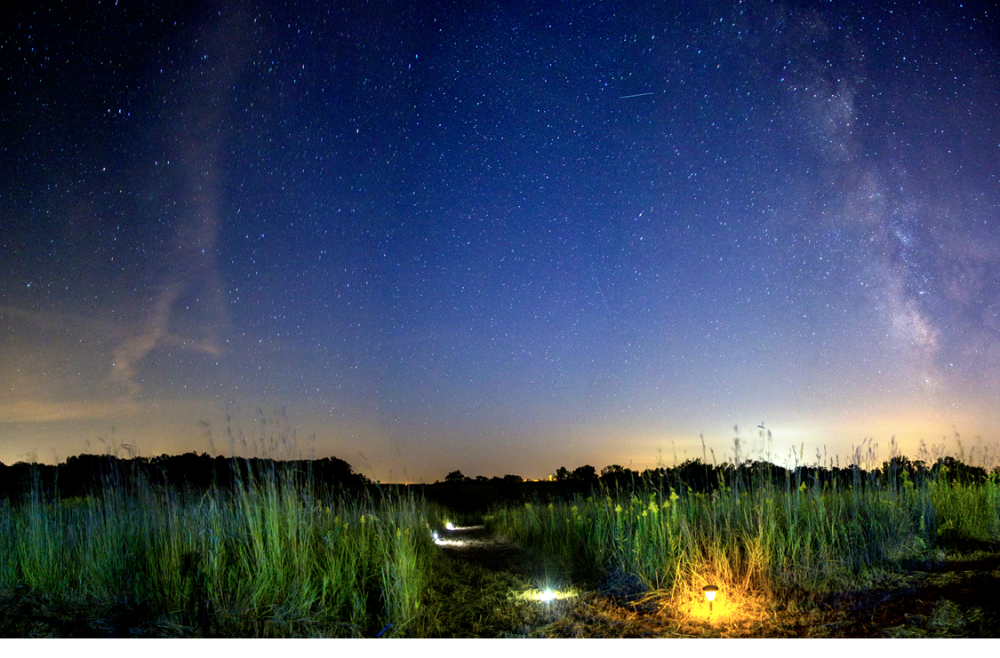

 Photograph: Justin Hayworth

  Photo courtesy of Bill Stowe

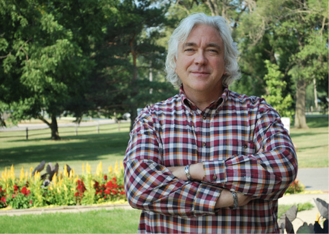

Bill Stowe is the CEO and General Manager of [Des Moines Water Works](http://www.dmww.com/) (DMWW). DMWW is a regional utility that protects public health and promotes economic development by delivering outstanding quality water affordably in reliable quantities. DMWW works closely with business, environmental, consumer and agricultural leaders to advocate for better stewardship of water resources and clean water initiatives throughout Central Iowa.

 Bill is a Phi Beta Kappa graduate of Grinnell College with a Bachelor of Arts, and received a Master of Science in Engineering from the University of Wisconsin, a Master of Science in Industrial Relations from the University of Illinois, and a Juris Doctorate Degree from Loyola University Law School. Bill sits on the Board of Directors of the Association of Metropolitan Water Agencies, representing the largest drinking water utilities in North America. He is a member of the American Society of Civil Engineers and a member of the Iowa Bar Association. He frequently acts through the American Arbitration Association as an impartial arbitrator in resolving complex construction and commercial disputes involving public and private construction projects.

Swimming Upstream: Des Moines Water Works Asks for Agricultural Accountability in A State that Claims to ‘Feed the World’*

William G. Stowe

Abstract

Des Moines Water Works, the largest drinking water utility in Iowa, filed a federal lawsuit in March 2015, against the Boards of Supervisors in three northwest Iowa counties as trustees of public drainage systems designed to drain agricultural lands, claiming these violate state and federal laws by polluting the Raccoon River (one of the utility’s primary water sources). This action was taken only after it became clear that Iowa’s surface water quality immediately threatens public health and that past collaborative efforts had provided no meaningful consumer and environmental protection. This lawsuit will be heard in August 2016, in Federal District Court, Sioux City, Iowa, and raises novel legal and cultural issues both locally and nationally.

Background

Since its inception as a private water company in 1871, Des Moines Water Works’ mission has been to provide safe, affordable, and abundant water to its customers. As the population of its customers (now approximately 500,000 customers in Des Moines and surrounding metro communities) has changed, so has the quality of the utility’s source water taken from the Raccoon and Des Moines Rivers. Once, outhouses, upstream sewage, and septic tanks were the main causes of pollution. Today, industrial scale agricultural land practices are the cause of most water quality concerns for the Des Moines Water Works. The intensive corn-soybean cropping system that occupies much of Des Moines Water Works’ watersheds “requires” tile drainage beneath farm fields and the application of massive amounts of fertilizer to maximize yields. We see application of manure from growing animal feeding operations and unlimited application of commercial fertilizer. These and other pollutants are then conveyed to waterways through drainage systems. All of this has significantly, and increasingly, degraded water quality. 

As consumers, we think of “nutrients” as something good and even necessary to support maximum crop yields. But pollution occurs when the amount of nutrients applied to land are more than can be used by plants; when this occurs, artificial drainage carries these excess amounts into our rivers and lakes 

Under the Safe Drinking Water Act, Des Moines Water Works is required to meet the United States Environmental Protection Agency’s standards for the maximum contaminate level (MCL) in its finished drinking water. The MCL standard for nitrate is 10 mg/L (or 10 parts per million). The health risks associated with nitrate contamination above MCL include Methaemoglobinemia, also known as “blue baby syndrome,” where infants under six months of age who consume water over 10 mg/L may lose the ability to transport oxygen. It is unknown how higher nitrate levels affect the broader population, but researchers are studying potential impacts. In addition to public health risks to drinking water, nitrate pollution also contributes to the hypoxic conditions in public waters, including the Gulf of Mexico’s “Dead Zone.” 

In 1989 and 1990, the water flowing from Des Moines Water Works exceeded the EPA’s standard for nitrate in drinking water. Des Moines Water Works’ current nitrate removal facility was designed in 1989 and was built in 1990-1991, at a cost of $4.1 million, so that the utility could produce water that meets federal drinking water standards.

Since then, the nitrate removal facility—the world’s largest such facility—has seen increasing use. At the time of this writing, in 2015, Des Moines Water Works has operated the denitrification system a record 148 days, up from a previous annual record of 108 days. This nitrate removal process adds an extra four to seven thousand dollars per day in operating costs of treating water, and the facility is reaching the end of its life cycle. In addition, reliance on an ionization process for nitrate removal is no longer acceptable to environmental groups due to waste disposal issues. 

While Des Moines Water Works has invested millions of dollars in capital infrastructure and has developed strategies to manage high nitrate levels, record nitrate peaks in source waters continue to threaten the security of the water supply and the ability of Des Moines Water Works to deliver safe and reliable water, affordably to its consumers.

Little Regard for Downstream

It’s a saying in farming that well-drained soil leads to higher yields. In simple terms, subsurface drainage tile is farm field plumbing—drainage pipes moving water off land with no regard for water quality or water quantity. The once swampy land of the Des Moines Lobe (also known as Prairie Pothole Region) was transformed into farmable land beginning in the 1890s through farm field drainage systems. A 1910 New York Times article wrote about the extraordinary feat: “Iowa farmers have been arranging drainage improvements in their low lands at a cost that will come within $85,000 of equaling the expense of building the Panama Canal. The general public has little conception of the extent of the enterprise which will increase the value of Iowa lands by millions of dollars.”1 

Drainage districts were formed as public utilities under Iowa legislation. Districts have taxing authority over benefited farms and are overseen by Boards of Supervisors in the counties they serve or by elected trustees. Under Iowa law, drainage districts are responsible for constructing, administering, and maintaining drainage infrastructure. 

The primary source of nitrate pollution in the Raccoon River watershed is artificial subsurface drainage system infrastructure, such as those created and managed by drainage districts. There are thousands of drainage districts in the Des Moines Lobe, including hundreds located in the three northwest Iowa counties of Buena Vista, Calhoun and Sac. 

History of “Partnerships” 

For the last two decades, nitrate levels in both the Des Moines and Raccoon Rivers have been peaking at concentrations and loads dangerous to humans. For even longer, Des Moines Water Works representatives have been engaged in discussions and have served on numerous study commissions, task forces and similar cooperative efforts with the state of Iowa, local governments, businesses, agricultural interests, academia, citizen groups, and individuals to explore ways to stem this threat to Iowa and Iowans. Efforts such as these are only successful when those who begin on opposite sides of an issue are able to put their own interests aside and acknowledge the difficulties their counterparts face. 

Unfortunately, efforts at cooperation and collaboration between Des Moines Water Works, as a producer of safe drinking water, and farm groups, including corn, soybean, hog, poultry and cattle producers, have led to no sustainable improvements in Iowa surface water quality. In fact, record levels of nitrate concentrations on any single day have been recently set on the Raccoon and Des Moines Rivers while the denitrification efforts of the Des Moines Water Works have been used more frequently in 2015 than ever before in its history. Moreover, the Iowa Farm Bureau, a profoundly active participant in Iowa politics at all levels, has vehemently pushed back on any challenges to the notion that agricultural practices should be more heavily regulated, particularly as it might benefit greater environmental protection. Iowa Farm Bureau representatives have called Des Moines Water Works’ leadership “un-Iowan.”

Flawed Strategy

The Mississippi River/Gulf of Mexico Watershed Nutrient Task Force was established in 1997 to coordinate activities to reduce the size, severity and duration of hypoxia in the Gulf. In its 2008 Action Plan, the task force called upon each of the 12 states along the Mississippi River to develop its own nutrient reduction strategy. The Iowa Nutrient Reduction Strategy was introduced to the public in 2012 to reduce the state’s contribution of nutrients in rivers, streams and lakes by 45 percent. Unfortunately, Iowa’s Nutrient Reduction Strategy places agriculture’s interests first to the exclusion of public health and environmental interests. Under this scheme, the people of Iowa are left to blindly trust that those upstream are taking steps to improve water quality.

With science and technology of the strategy developed by Iowa State University, Iowa Department of Natural Resources and Iowa Department of Agricultural and Land Stewardship, the strategy was heavily influenced by Iowa Farm Bureau and other agricultural interest groups to support voluntary, non-regulatory land uses. According to the strategy’s science, the estimated nitrate contribution to Iowa’s rivers and lakes is shown to be 92 percent from agriculture and eight percent from communities and industries; however, the Strategy’s policy regulates small town, suburban, and urban water and sewer users, while advocating for “voluntary” conservation practices from agricultural producers and ignoring the role of unregulated, large scale, agricultural drainage infrastructure in transporting nutrients from field to stream. 

The voluntary approach for agricultural sources fundamental to the Strategy lacks quantifiable and credible data, timeframes to measure progress, and adequate funding. However, management of Iowa’s water resources will take commitment (including regulation), appropriate water quality measures, and sustainable funding. Vital ingredients to water quality improvements includes regulation monitoring, and sustained public and private funding.

Des Moines Water Works Seeks Remedies 

Since the launch of the Nutrient Reduction Strategy, Des Moines Water Works has experienced two unprecedented nitrate episodes and associated costs for the treatment of the pollutant. In 2013, when nitrate levels in the Raccoon and Des Moines Rivers reached record highs in each river of 24.39 mg/L and 18.62 mg/L, respectively, Des Moines Water Works incurred approximately $900,000 in treatment costs and lost revenues. Various denitrification efforts in 2014 and 2015, including operation of the Nitrate Removal Facility for a record 148 days in 2015, have had direct operational costs of over $1,500,000.

Moreover, continued high nitrate concentrations in the Des Moines and Raccoon Rivers will require future capital investments to remove the pollutant and provide safe drinking water to a growing central Iowa population. Des Moines Water Works is now actively planning for capital investments currently estimated to cost $76-183 million, a cost funded by ratepayers, for new denitrification technology in order to remove pollutants and continue to provide safe drinking water.

Concerned with the continued high levels of nitrate in its watershed, costs associated with denitrification passed onto customers, and little action from state and agricultural industry leaders, Des Moines Water Works began its investigation into significant upstream nutrient polluters.

Des Moines Water Works sampled 72 public, right-of-way sites in three upstream counties for nearly a year. These sites were identified as places where agricultural land practices are the sole contributor of the nitrate pollution. Lab results showed nitrate levels as high as 39.2 mg/L in groundwater discharged by the drainage districts—nearly four times the federally required Safe Drinking Water regulatory limit of 10 mg/L. These results correlated with measurements by the United States Geologic Survey (USGS), a scientific agency in the United States government, at monitoring sites along the Raccoon River in close proximity to these industrial agricultural polluters. 

In January of 2015, Des Moines Water Works staff recommended to the Board of Water Works Trustees to issue a Notice of Intent to Sue to the Boards of Supervisors of Buena Vista, Calhoun and Sac Counties in their capacities as trustees of 10 drainage districts, for the discharge of nitrate pollutants into the Raccoon River. The notice is a required 60-day notification under the citizen suit provision of the Federal Water Pollution Control Act (commonly known as the Clean Water Act) and Iowa Code Chapter 455B.

 With no negotiated solutions after the 60-day notice, the Board of Water Works Trustees filed a federal complaint on March 16, 2015. The case is currently in the discovery phase and is scheduled for trial in August 2016, in Federal District Court, Sioux City, Iowa. 

The complaint seeks to declare the named drainage districts as “point sources,” not exempt from regulation, and required to have a permit under federal and Iowa law, just as any other business that discharges in the waters of Iowa. The complaint states that the drainage districts have violated and continue to violate the Federal Clean Water Act, Chapter 455B, Code of Iowa (involving permitting for discharges into state waters) and public nuisance laws. 

Des Moines Water Works demands agricultural accountability from the drainage districts, requiring them to take all necessary actions to comply with existing law, including ceasing all discharges of nitrate that are not authorized by a National Pollutant Discharge Elimination System (NPDES) permit.

In addition, damages are demanded by Des Moines Water Works to compensate for the harm caused by the drainage districts’ unlawful discharge of nitrate, and to award litigation costs and reasonable attorney fees to Des Moines Water Works as authorized by law.

Implications of Agricultural Regulation

Des Moines Water Works is not seeking to change agriculture methods, but rather to challenge governments, including drainage districts, Iowa Department of Natural Resources and United States Environmental Protection Agency, to better manage and control drainage infrastructure in order to improve water quality within the state. 

“Precision agriculture” and the use of technology to balance agricultural needs with the consequences to downstream users hold tremendous potential for making Iowa more productive and safe for everyone.

Abusive land use, artificial drainage systems, and intensive nutrient applications by industrial agriculture are the root causes that continue to be left unregulated. Instead of the obstructionism we see by agricultural organizations, we need consumers to understand the consequences of deteriorating water quality to downstream users and to provide a venue to openly and honestly discuss water quality issues and solutions. Iowa will be a more productive state and draw new businesses, industries, and employees to the state when water quality improves. 

Political Push Back

Since the federal lawsuit was filed, there have been many attention-grabbing headlines from political leaders. These have ranged from Governor Terry Brandstad (R) stating that Des Moines has “declared war on rural Iowa,”2 and “Des Moines Water Works ought to just tone it down”3 to State Sen. Randy Feenstra (R-Hull) encouraging Iowans to boycott Des Moines,4 and his promise to introduce state legislation to block the lawsuit.5 In so doing, state political leadership continues to sidestep any meaningful action that would help reverse the state’s ongoing environmental decline.

Outcomes: Public Health Protection and Improved Waterways

It is important to remember that this issue is not about run-off from farm fields. Today’s highly engineered and increasingly efficient drainage systems move groundwater infused with nitrate from intensive agriculture operations directly through a complex system of pipes to the stream heads and rivers that serve as the water source for a large portion of the state. If left to its natural course, much of this groundwater would never move into rivers and streams and that which does would be filtered through a natural process that would reduce the nitrate concentration considerably. 

Des Moines Water Works is seeking agreement on a few simple facts, including the notion that entities such as agricultural drainage districts should be subject to reasonable standards and assume responsibility for altering the hydrology of Iowa’s waters. 

Dumping polluted groundwater into the waterways is causing significant environmental damage and putting people downstream at risk. Drainage districts must seek and receive the same permit that other entities do, and the water being handled by drainage districts must be required to meet reasonable standards before being dumped into the water system we all rely upon to survive.

Des Moines Water Works remains committed, first and foremost, to protecting Iowa’s water by holding agriculture accountable for environmental protection like any other activity. The utility is hopeful that this objective can be reached short of prolonged litigation through good faith efforts to reach acceptable public policy outcomes that materially improve clean water protections. If not, Des Moines Water Works is committed to compelling regulators to protect our community from the adverse health consequences of upstream polluters who have established an extensive history of draining their farm fields without any regard to the water quality and water quantity consequences downstream.

Summary

Iowans take great pride in their history of agricultural prosperity, sometimes claiming to “feed the world.” Picturesque images of rolling fields of corn and symmetric red barns are more than Iowa kitsch. They’re a vision of an Iowa untouched by increasing consolidation characteristic of international markets and reliance on corn, soybeans and hog production to support the dwindling economies of rural Iowa and the giant insurance, chemical and equipment manufactures that prosper under the status quo’s “voluntary” environmentalism. Economic justice, social justice, and demographic factors must lead to greater accountability in agricultural production that will protect both consumers and producers by reflecting social costs from agricultural production in the costs borne by those who profit to the detriment of those downstream. 

*References listed in Endnotes

Swimming Upstream | Stowe

The nitrate removal facility–the world’s largest such facility–has seen increasing use. So far in 2015, Des Moines Water Works has operated the denitrification system a record 148 days, up from a previous annual record of 108 days. 

 Photo Courtesy of Des Moines Water Works 

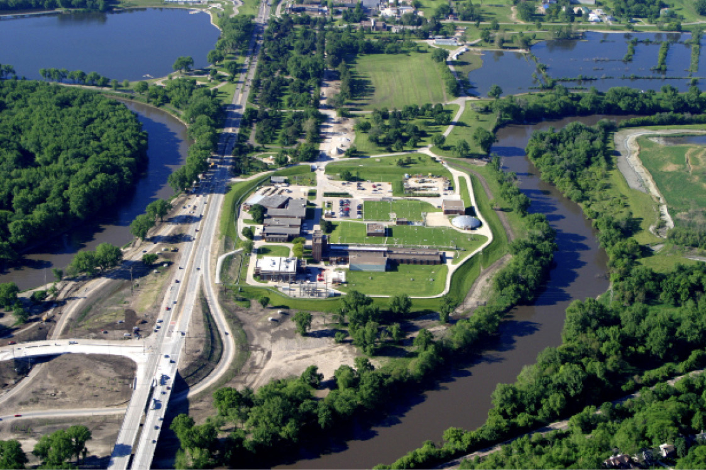

Swimming Upstream | Stowe

I felt I needed to do something about this unfurling crisis. For me, that meant writing about it.

Iowa’s Nutrient Reduction Strategy places agriculture’s interests first to the exclusion of public health and environmental interests. Under this scheme, the people of Iowa are left to blindly trust that those upstream are taking steps to improve water quality.

Swimming Upstream | Stowe

 Max Christensen

Rootstalk | Volume II, Fall 2015

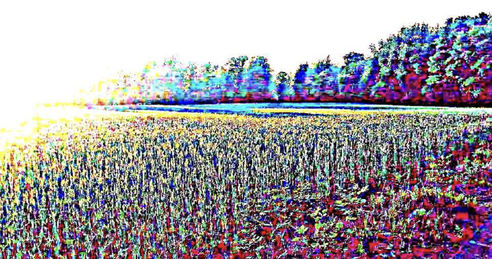

Photograph: “Field of Dreams,” Max Christensen

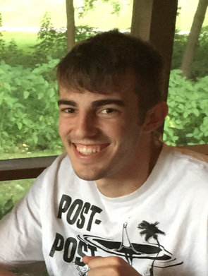

Photo courtesy of Max Christensen

Grinnell College student Max Christensen is a compusive creator whose main complaint about the Midwest prairie is its absence of waterfalls.

Photography | Christensen

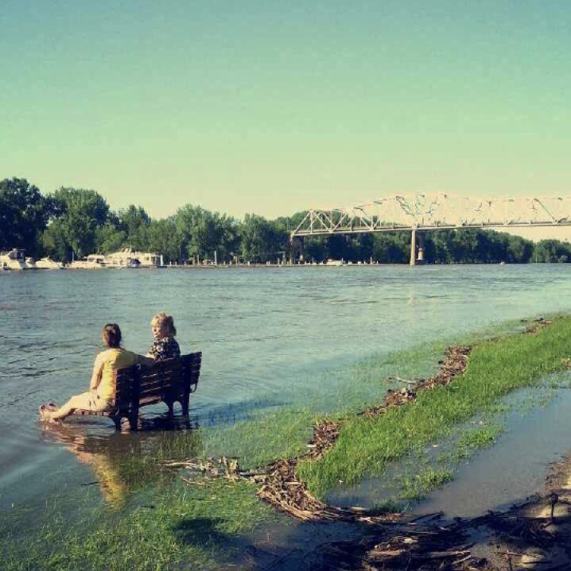

Photograph: “The River,” Max Christensen

Rootstalk | Volume II, Issue 1, Fall 2015

Mary LaHay lives in Des Moines with her husband, four dogs, and one cat. She started Iowa Friends of Companion Animals, a nonprofit grassroots organization that works to help protect dogs in Iowa puppy mills. Visit their website and signup up for their e-newsletters at [www.iafriends.org](http://www.iafriends.org). Or visit their Facebook page, Iowa Voters for Companion Animals.

Photo courtesy of Mary LaHay

Puppy Mills in Iowa

Mary LaHay

I’ve always had a cat, both as a child and as an adult. I never cared much for dogs and was quite nervous around large breeds. So when my husband said he wanted to get a dog, my only requirement was that we get a puppy to ease the transition for me and my cat.

We did what many people do—we started looking at the pet ads in our local newspaper. We’d been hearing that goldendoodles were great dogs so when we saw an ad for goldendoodle puppies, we called and arranged to go see them. The kennel was located on a farm not far outside of town.

I remember getting out of our car and hearing a cacophony of barking, though there were no dogs in sight. The sounds were coming from behind a large building and a stretch of privacy fence. We were met in the driveway by a disheveled man who directed us into a makeshift office in the large building. The putrid smell of dog urine was terrible. We stood in the building and discussed our breed preference and when the man stated he had puppies available and began walking toward a door in the back of the room, we started to follow. But he turned, held up a hand to signal “stop” and told us he’d bring the puppies to us. While we waited, the stench of urine started to make me nauseous so I went back outside using the door we’d entered through. My husband and the man, his arms now laden with several pudgy puppies, soon joined me.

The man set the puppies on the ground. They were adorable, roly-poly bundles of fur, but that fur was filthy. They reeked of the same urine stench I couldn’t tolerate in the office. I couldn’t bring myself to touch them. My husband was more interested and coaxed them into play. One of the puppies took off romping behind the building and my husband chased after it. It was several months before he told me what he had seen back there. 

That day we left the farm without a puppy. I couldn’t get past the smell and I felt guilty. But we kept checking the newspaper ads and eventually found our puppy; an eight-week-old corgi/rat terrier mix we named Ruby. I fell head-over-heels in love with this dog. So much so that when she was a few months old, I told my husband I wanted to get a second dog—a playmate for Ruby.

This time my search for a dog began on the Internet. I was still learning about dogs and never tired of reading about them; the different breeds, their temperaments, how to train them. At one point I came across a site with recommendations on how to find the “perfect” puppy. It included warnings about something called puppy mills, and said that one should avoid them. It included descriptions and photographs of conditions found in these puppy mills. I was saddened by it all. As I continued to read, it started to sound familiar–many dogs, filthy conditions, puppies offered without an opportunity to meet the mother. Was that first kennel we visited a puppy mill? I discussed my suspicions with my husband and he confirmed it. What he had seen when he chased the pudgy goldendoodle puppy that day was dogs in stacked cages, all of them jumping and barking frantically.

I was compelled to learn more, so I continued my online research and discovered that Iowa is home to hundreds of other puppy mills. Our little Ruby had become such an important part of my life, and the thought that others of her species were being subjected to some of the inhumane conditions I read about was not acceptable. I was confident that there must surely be an agency or organization working to effect change, so I went in search of them. Sadly, I was mistaken. I met with leaders in the area of animal welfare. Everyone I spoke to was familiar with the problem but no one knew of anyone doing much to address it. I could not walk away, and so started the path I’ve been on for the past seven years.

According to information on the website for the American Society for the Prevention of Cruelty to Animals (<http://www.humanesociety.org/assets/pdfs/pets/puppy_mills/report-puppy-mills-then-now.pdf>), “puppy mills became more prevalent after World War II. In response to widespread crop failures in the Midwest, the United States Department of Agriculture (USDA) began promoting purebred puppies as a foolproof cash crop. Chicken coops and rabbit hutches were repurposed for dogs, and the retail pet industry—pet stores large and small—boomed with the increasing supply of puppies from the new mills.”

Today’s commercial dog-breeding kennels–those supplying puppies to the pet trade via brokers–are licensed and inspected by the USDA. These facilities are required to comply with the federal Animal Welfare Act (AWA), which defines the minimally acceptable standards for animal treatment and care; standards such as minimum cage sizes, minimum veterinary care, acceptable methods of euthanasia, etc. The USDA employs inspectors who carry out unannounced inspections of thousands of licensed facilities all across the United States, including research facilities, animal transporters, exhibitors, and “animal dealers.” Dog breeders fall under the “animal dealers” category. 

In 2008, Iowa was home to more than 450 USDA-licensed commercial dog-breeders. Accessing their inspection reports required that I submit a Freedom of Information Act (FOIA) request. I submitted a request for “Iowa licensee data” and waited, having no idea what to expect in terms of what the data would look like or how much time it would take to receive. A few short weeks later I received an envelope containing several CDs. Each CD stored more than 1800 scanned pages of inspection reports and a variety of other documents. It was a dizzying amount of information. Each of the inspection reports included the name, address and USDA ID numbers, comments on the inspection results, and the inspector’s name. Flipping through the pages, most were single page documents with a simple notation, “No non-compliances noted.” But some were quite disturbing, with comments about sick and injured dogs, dogs living without protection from the elements, and dogs living in terrible filth and noxious environments. They were difficult to read and I vacillated between sadness and anger. But the vast majority of reports showed “No non-compliances,” so I started to think that this was an exercise in futility. Perhaps all the bad news I’d read online was inaccurate or exaggerated. I was hopeful—until a troubling trend became quite obvious; that the majority of inspection reports were signed by one particular inspector and that a suspicious number of this inspector’s reports included the notation, “No non-compliances noted.” 

I commissioned a small database for entering and analyzing the data and spent hours inputting information from the inspection reports. I assigned values to the types of violations: “1” indicated a violation was related to paperwork or recordkeeping; “2” indicated a violation other than paperwork or recordkeeping and which were classified as Indirect by the USDA (not posing an immediate threat to the health or welfare of the animals); and “3” indicated Direct USDA violations (poses an immediate threat to the health or welfare of the animals). I also assigned an alphabet character to each of the inspectors. The inspector I was concerned about was assigned letter “A.” Here’s a table showing the results of my analysis:

My concerns were validated; inspector A’s inspection results clearly showed a problem. But I wasn’t sure what to do with this information. And I wasn’t sure who to turn to for direction.

At the same time, Tom Colvin, executive director of the Animal Rescue League of Iowa (ARL)—Iowa’s largest animal shelter based in Des Moines—was preparing for a second attempt to pass a law mandating better oversight of these commercial breeding facilities. Tom, with the help of a lobbyist, had been trying to amend IA Code Chapter 162, Iowa’s “Care of Animals in Commercial Establishments” statute, to allow for the inspection of USDA licensees by our state Department of Agriculture “upon receipt of a complaint.” Existing code included language which specifically excluded USDA commercial kennel licensees from any state-level oversight. Making this change to the law was no easy task. The dog breeders and various agriculture interests wailed at any attempt to pass better laws to protect animals. Iowa’s mammoth agriculture industry made sure these attempts didn’t succeed. And while Tom knew that there were significant animal welfare concerns within these kennels, he didn’t have hard data. Well, now we did. I shared the information with Tom and we discussed how it could buttress his efforts. He also shared a book with me, Get Political for Animals and Win the Laws They Need, by Julie Lewin—a publication of the National Institute for Advocacy for Animals (NIFAA). I finally had a roadmap for the grassroots effort Tom knew was necessary for success.

The Beginning of a Grass Roots Movement

As I’ve said, prior to this I had never cared much for dogs, and I had cared even less about politics. It seemed too big, too alien to my experience, so I avoided it. But Julie Lewin’s book explained the process so well, that I couldn’t put it down. I read it, made notes, attached Post-It notes and dog-eared several pages. (Have you ever noticed how often the word ‘dog’ is used in our language? Pay attention for a while. You’ll be amazed!) Of course mounting a campaign to achieve the necessary change was going to be a lot of work, but as I saw it, what other option was there? Now that I had concrete evidence of the severity of the problem, I couldn’t turn my back on these defenseless animals.

I decided to try and reach out to as many local animal shelters around the state as I could, to introduce myself and to share what I’d learned. But I didn’t have contact information for many of these shelters, and I didn’t want to simply drop in on them. I learned that an online pet adoption tool called Petfinder might be a good way of connecting with Iowa shelters. So I visited the site and indeed found that many, many Iowa rescue organizations and shelters were registered there, and most of them provided an email address. I spent more than a few hours one night copying and pasting all of these email addresses into my Hotmail account.

Now if you know anything about email providers, you know that Hotmail is not the most robust among them. But I honestly had no knowledge about my options, so I was resigned to using it. It only allowed for a finite number of addresses for any one email within a 24-hour period, and I planned to far exceed that limit, so I wasn’t going to get my email out as quickly as I’d hoped. I did what I could, and, one Friday night in the Fall of 2008, I sent several shelters and rescues an email detailing what I’d learned from USDA inspection reports, and asking for their help on the legislation. Because my email list exceeded Hotmail’s maximum, I had to send a second batch the following day and another the day after that to reach everyone. I went to bed that first night wondering what kind of response I’d receive. 

The next morning I made a pot of coffee, poured a cup, and headed for my computer—anxious to see the response to the previous night’s email. Hotmail took especially long to open up. I wondered if I’d overloaded it somehow. It chugged and chugged and then suddenly, my inbox contents began to appear. My inbox was filled with replies! Emails from many of the addresses included information about mills that they’d known about for quite some time, but that they’d been unable to do anything about. Every email included a message of encouragement! And the same results occurred with the two additional batches of emails I sent out. I’d hit a nerve, and I knew there were people out there who would help get something done!

The job I held at the time required statewide travel, so I’d become quite familiar with the entire state of Iowa. Over the next several weeks I stopped in at many of the area shelters and rescues, both those which had answered my email and those which had not.

I learned that most of those running the shelters were already well aware of the extent of the problem, but felt powerless to change it. I determined that they were either too busy and/or short of resources to do much more than the bare minimum work required to house and care for the hundreds, and in some cases thousands, of homeless pets which ended up in their facilities each year. I had hoped the shelters would be my conduit to the community as I built a grassroots organization, but in most areas, it wasn’t to be. Two things held them back; 1) they were simply too busy taking care of animals to consider adding anything else to their workload, 2) they feared their nonprofit status would be threatened if they got involved with advocacy and I was unable to convince them otherwise. I would have to find another way.

Thank goodness for the Internet! And for PowerPoint! I set to work generating a powerful presentation and started booking library and other public meeting rooms all across the state. Then I began placing ads in the local newspapers, inviting all “animal welfare advocates” to learn about the puppy mill problem in Iowa and to learn what they could do to help. Finally, one wintry Friday afternoon, I set off for Davenport, Iowa to give my first public presentation at a rather run-down hotel. I had no idea how many, if any, attendees I would have. I set up my computer, connected to the rented projection system, and waited. A grand total of two people showed up. Perhaps I should have been disheartened, but I wasn’t. The two who showed up provided me with a wealth of information, and they offered up great ideas, so I was thrilled to have met them. I spent the night in Davenport with plans to drive to Cedar Rapids the next day for a noon presentation, and then on to Iowa City for an evening session. I woke up on Saturday to find the roads covered with ice. Just a side note—I’d had a terrible car accident on icy roads several years prior, so I wasn’t terribly comfortable driving on ice. But I was compelled to move on and drove behind a semi-trailer toward Iowa City on I-80, never getting above 35 mph. I got to Cedar Rapids finally. And thank goodness! The room was packed! And Iowa City was, too! I found the beginnings of what has become an amazingly active grassroots base!

I traveled to various parts of the state each weekend, giving between two and four presentations in as many different towns—collecting email addresses from attendees so I could follow up with them. But the going was slow. 

The Iowa Legislature was convening and ARL had their bill ready to go. State Senator Matt McCoy and State Representative Jim Lykam agreed to carry the bills forward. To this day they continue to be the dogs’ staunchest allies in our Capitol. 

In the course of my travels I’d collected approximately 500 email addresses of people who said they’d help lobby in support of the bill. When it was introduced, I was asked to rally the troops. But again, my awful Hotmail account limited me. Most of my messages had to be sent out in at least two batches. So my first Calls-to-Action were sent out with an initial batch going out in the evening, then I’d set my alarm and go to bed and wake up just after midnight to send the second batch out. This is how our first year of lobbying went.

Needless to say it was not optimal. But our grassroots followers were tenacious, and what we lacked in infrastructure, we made up for in enthusiasm! In fact, we had legislators asking us to stop the flood of emails into their inboxes. We respectfully declined, and reveled in the knowledge that they were hearing from us loud and clear. 

I was asked to present to a House subcommittee to share the data I’d compiled. I wondered to myself: How the heck did I end up here? Before 2008 I hadn’t even known the difference between the House and the Senate, and now I was presenting to a subcommittee! I had to have my data down pat, so I spent hours checking and rechecking my results. I had pages and pages of inspection reports, but I wouldn’t have time to share many of those with the subcommittee. All I really had were numbers—important, but boring, numbers. Then, one glorious February day, I found in my mailbox an envelope with a couple of photos. The photos were really terrible and disturbing. They showed dogs in stacked cages in the back of a semitrailer. A short note accompanying the photos (one of them shown below) stated: “this place can be found at (address), Charles City, Iowa.” 

The letter-writer told me that this “kennel” had existed for years and that there were at least three semi-trailers like this on the property. No heat, no running water, poor ventilation. But the breeder was USDA-licensed and inspected and, according to my data, had passed every inspection in the past three years. The inspector for this facility was our infamous Inspector A.

My heart ached for these animals and my head raged at the breeder. But now I had something more than just numbers. I could say, “See!”

I was nervous for the subcommittee meeting. Our Iowa state Capitol is an amazingly gorgeous building but it was also designed to be imposing, and it is. I sat in a huge room at a stately table across from three legislators and stated my case. Two of the three sat attentively and asked good questions. One sat and glared and occasionally scoffed at my comments. 

The subcommittee voted to move the bill forward and the same happened in the Senate. At least three times a week for three to four months, I wrote emails to grassroots supporters with instructions on what they needed to convey. Still, the bill did not pass that year, and we geared up for the next.

But we were able to demonstrate to the USDA that they had a rogue inspector in their Inspector A, and he was no longer an inspector soon thereafter. If I never accomplished anything else, I would have considered this a success.

I continued to accumulate data and grassroots supporters throughout the summer and fall of 2009, and the bill was reintroduced into the 2010 legislature. We were a little better organized this time, and the bill passed after a lot of gnashing of teeth. Now we had a law which said that our Iowa Department of Agriculture could inspect a USDA licensee “upon receipt of a complaint.” 

One of the ways that I celebrated this win was by adopting a dog that had been rescued from an Iowa puppy mill. I found my miniature poodle, Eddie, at Hearts United for Animals, a rescue organization in southeast Nebraska. They specialize in rehabilitating dogs that have been rescued from puppy mills like the one pictured in the image below:

This photograph shows the western Iowa facility where Eddie spent the first eight years of his life. I felt proud that my work just might help protect some dogs from suffering in places like this.

We started to see a dramatic drop in the number of USDA licensed dog breeders in Iowa. Within a year we saw the number drop from more than 450 to approximately 300. No doubt the removal of Inspector A had something to do with that, but so did the passage of some city ordinances around the country restricting the sale of puppies through pet stores. Our data showed that Iowa breeders were producing and exporting at least 100,000 puppies annually, so as the outlets dried up, likely so did the producers. But we still had at least 300 breeders and the USDA reports showed that up to 60 percent of them were being cited for violations to the AWA. The problem wasn’t fixed, and we couldn’t let up just yet.

We kept gathering data. Now the USDA was making inspection reports available online so we had better access. Several breeders continued to subject dogs to horrendous conditions, and we reported them to the Iowa Department of Agriculture and Land Stewardship (IDALS) per the new law. Unfortunately, we didn’t see much improvement in the enforcement of our animal cruelty law. That’s what we’d expected to come from the new law—that IDALS would go into these places, see the problems, and then implement our state’s cruelty law as needed. That’s what it was for, right? Wrong. The sad truth, as we discovered, is that nobody wants to deal with this problem. We met with sheriff’s departments and county attorneys to discuss particularly problematic breeders, but our requests for help fell on deaf ears.

One of the more frequent, and understandable, reasons for not pursuing these cases… who pays for the care of the dogs if they have to be rescued? The law says that if the dogs are confiscated, a court has to hear the case within ten days to determine if there’s enough evidence to warrant confiscation. If the judge determines there is enough evidence, the dogs can either go to a rescue organization or be euthanized—whichever the county decides. But if the judge doesn’t find enough evidence, the dogs are returned to the original owner. Regardless of which way the decision goes, the county is responsible for the costs of seizing and holding the dogs until the decision is made. Have I mentioned the numbers of dogs we’re talking about? The USDA inspection reports also include a head count on the number of dogs on site at the time of inspection. Are you ready? For the year 2008, we found that 227 of the over 450 kennels in Iowa housed a combined 14,280 adult dogs. The majority of them kept fewer than 50 dogs, but 34 kennels kept more than 100 adult dogs. Five kept more than 200 and three kept more than 400 adult dogs! To this day, one Lee county breeder often has more than 1500 adult dogs. Who could possibly afford to rescue and house hundreds of dogs? Nobody. So they wouldn’t.

There are other states which are light years ahead of Iowa when it comes to animal welfare laws. Missouri has laws that provide simple, but extremely important improvements to standards: larger cage sizes, solid flooring, and access to the outdoors. Pennsylvania requires “unfettered access to an exercise area.” Virginia law protects consumers from fraudulent claims by breeders regarding the pedigree of dogs sold. Virginia, Oregon, Louisiana, and Washington place limits on the numbers of adult breeding dogs kept in any one facility. Ohio requires breeders to carry liability insurance. So we borrowed from some of these other states’ laws and found a couple of really common sense solutions: 1) require the breeders to carry a bond to cover the cost of a potential rescue, 2) establish a fund from a portion of the licensing fees for officials to tap into to cover rescue costs as needed. We opted to attempt to pursue an amendment to the existing dog breeder law which would require a bond. While preparing data to support that, I found another troubling pool of information. I learned that the USDA often takes photos of situations showing violations to the AWA. So I requested photos taken in all Iowa facilities during a particular time span. And I waited.

A few weeks later I received several CDs which held hundreds of photos. Reading about the problems was bad enough. Now I had to look at images of them. Here are just two of the photos, representative of Iowa mills, that we received: 

I couldn’t help but think that the actual scene would be even worse with the addition of the sound of, in some cases, hundreds of dogs barking, compounded by the smell of their waste.

In fact, one inspection report for the facility in the photo above (dogs in semi-trailer) stated that the ammonia levels in the back of that trailer were so bad as to keep the inspector (NOT Inspector A) from being able to stay there long enough to adequately assess the dogs—the dogs that lived in that environment 24 hours a day, 365 days a year. And their sense of smell is much more acute than ours!

Our first and second attempt failed to gain an amendment which would provide for funding in the case of a rescue. So in 2014 we decided to go-for-broke and offer an amendment which would fundamentally change the law that applied to this industry. We reviewed laws from several other states and cherry picked those parts that could be most helpful. The bill we composed called for mandated inspections of USDA licensees by IDALS; it increased the breeder licensing fees to cover the costs of the inspections; it required IDALS to report all instances of violations to the Iowa cruelty statute to local law enforcement; and it provided for some bare minimum changes to humane standards, such as allowing the dogs access to the outdoors. Such a radical notion!

We knew getting the bill passed would be tough. Agribusiness had been our toughest opponent thus far, but we’d been meeting with various industry leaders to educate them on the issue and to calm their fears about the “slippery slope.” The breeders’ lobbyists (they have two!) were telling the legislators that we had ulterior motives—implying, that once we were done with dogs, we’d move on to hogs. Good grief. The fear-mongering that goes on when it comes to dealing with some fac- 

Puppy Mills in Iowa | LaHay

Rootstalk | Volume II, Issue 1,Fall 2015

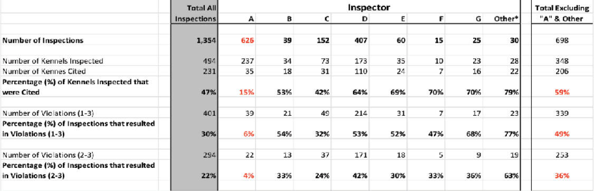

Puppy Mills in Iowa | LaHay

Rootstalk | Volume II, Issue 1, Fall 2015

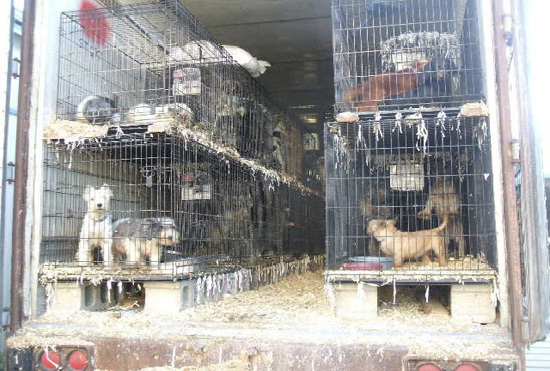

Photo courtesy of Mary LaHay

Puppy Mills in Iowa | LaHay

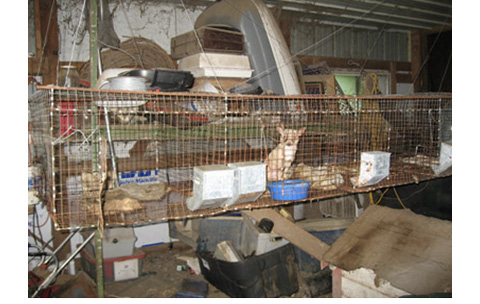

Photo courtesy of Hearts United for Animals, Auburn, NE

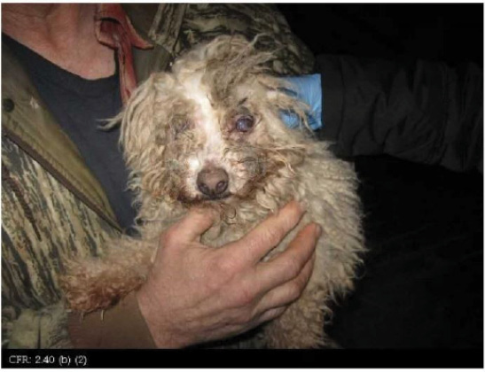

Rootstalk | Volume II, Issue 1, Fall 2015

.jpg)

Photos courtesy of Mary LaHay

Puppy Mills in Iowa | LaHay

tions of our citizenry is appalling! We’re working to help dogs. We’re a rag-tag bunch of citizens—most of us middle aged women. What kind of threat are we to agriculture? Apparently substantial. Who knew!

The opposition we faced in the Capitol was pretty standard; the usual, tired slippery-slope arguments and the cries that our attempts were anti-business. But we

were ready for all that. One new piece of data that emboldened us—the Iowa Department of Revenue did research and found that fewer than half of breeders possess state sales tax permits! How could any ethical legislator support such a shoddy business? But what happened next really threw us for a loop. Our new and fiercest opponent ever (because they’re so highly respected) reared its ugly head… the American Kennel Club (AKC).

How could this be? AKC’s tagline is “The Dogs’ Champion.” How could they NOT be in support of what we’re working on? Well, as they say, follow the money. Documents show that many dogs in puppy mills are AKC-registered. So that means that the puppies of those dogs are eligible for registration, too. And there are fees associated with registering a dog with AKC. Bingo! The money. More puppy mills = more AKC registrations = $$$. Period. 

Of course AKC couldn’t tell its minions that this is the reason for their opposition, and it needed the help of its minions to lobby on its behalf, so the organization sent out messages far and wide telling “hobby breeders” that our ultimate goal was to stop all dog breeding in the state. Oh good grief! No way! Where the heck did that come from? But the AKC apparently has very devoted members who do not question any communication coming from AKC headquarters. So dozens of hobbyists—some of them Iowa residents, some of them not—started barraging the Iowa legislators with outlandish comments and claims. We had to scramble hard to respond to them all. In the process, we found that many of the hobbyists had no idea what was in the bill, nor what was in current law. 

But we couldn’t fend them off. So Senator McCoy, who was managing the legislation, organized meetings with several hobbyists and significant changes were made to the bill to make it more palatable. A special hobby breeder status was created, with lower licensing fees and relaxed inspection requirements.

That revised bill was introduced in the 2015 legislature. It passed two senate committees but senate leadership wouldn’t carry it forward. According to some sources, agribusiness is still the biggest reason it isn’t moving.

So here we are. We’re down to approximately 200 USDA-licensed dog breeders in Iowa. At last count in 2015, 41 percent had been cited for violations to the AWA. And right now we have one breeder who is so threatening toward inspectors that they have to be accompanied by law enforcement when they visit his facility. You and I are paying for that! Another breeder was fined $19,000 in 2011 for his violations to the AWA. To date, he’s only paid $1,000 of that amount, and simply ignores all court orders to pay up. Both of these breeders are still breeding dogs, and selling the puppies.

So: we’ll be back in the Capitol in 2016. Because dogs are still suffering. Because some breeders continue to skirt authority. Because the puppy-buying public is still being scammed. Because Iowa can do better. And you can help. Visit our website, [www.iafriends.org](http://www.iafriends.org), to learn more. Join our grassroots efforts by clicking on the Take Action tab to register to receive our updates and Calls-to-Action. The dogs need you.

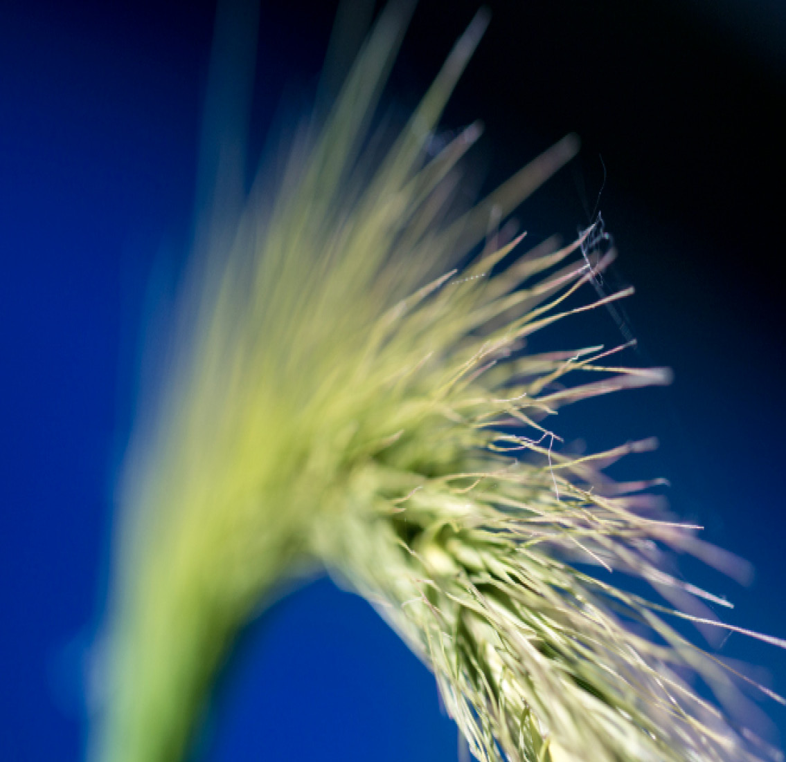

Photograph: Justin Hayworth

  Photo courtesy of Frederick Kirschenmann

From Soil to Sustainability | Kirschenmann

Frederick L. Kirschenmann shares an appointment as Distinguished Fellow for the [Leopold Center for Sustainable Agriculture](http://www.leopold.iastate.edu/) at Iowa State University and as President of [Stone Barns Center for Food and Agriculture](https://www.stonebarnscenter.org/) in Pocantico Hills, New York. He served as the Leopold Center’s second director from July 2000 to November 2005 and has been recognized widely for his work. He also continues to manage his family’s 1,800-acre certified organic farm in south central North Dakota, where he developed a diverse crop rotation that has enabled him to farm productively without synthetic inputs (fertilizers or pesticides) while simultaneously improving the health of the soil. His farm has been featured in numerous publications including National Geographic, Business Week, Audubon, the LA Times and Gourmet magazine.

From Soil to Sustainability*

Frederick L. Kirschenmann

…the way was blazed for treating the whole problem of health in soil, plant, animal and man as one great subject, calling for a boldly revised point of view and entirely fresh investigation.

 Sir Albert Howard, The Soil and Health (1947) 

Defining Sustainability 

As most everyone interested in sustainability knows by now, the concept has been appropriated by numerous entities and used in various ways, often to achieve different objectives. In his introductory chapter to the excellent 2013 edition of the Worldwatch Institute’s State of the World report, Robert Engelman coined the term “sustainababble” to reflect this “cacophonous profusion of uses of the word sustainable to mean anything from environmentally better to cool.” Increasingly the term is used as a marketing tool, often it is used as an environmental metric, and, of course it is used extensively to describe an “improved” food and agriculture enterprise. While many of these uses may be grounded in good intentions, the result, as Engelman points out, has “a high cost.” “Frequent and inappropriate use lulls us into dreamy belief that all of us—and everything we do, everything we buy, everything we use—are now able to go on forever, world without end, amen” (State of the World, 2013). 

Such a “dreamy belief” has certainly been prevalent in most of the visions of contemporary “sustainable agriculture”. Whether one belongs to the school of sustainable agriculture which is fixated on the notion that sustainability can only be achieved by intensifying the technology of our dominant industrial agriculture, or to the school of “greening” the system by inserting more environmentally friendly practices, or to the school that insists everyone must transition to organic, all are grounded in the belief that the fundamental principles of modern agriculture, which emerged in the early 20th century, can continue. According to this standard we simply need to tinker with the current system, in various ways, to make it “sustainable.” While such “tinkering” can sometimes produce positive, short-term, results, it fails to address the new challenges that will emerge in the near future. Occasionally pundits now refer to this “dreamy belief” of sustainability (appropriately, I think) as “band-aid sustainability.” 

Historical Context

In his engaging book, Culture and Agriculture: An Ecological Introduction to Traditional and Modern Farming Systems, anthropologist Ernest Schusky provides us with a summary of how the human species has fed itself since it evolved on planet earth some 200,000 years ago. I think such a historical context can help us to better frame the concept of sustainability. Schusky reminds us that for most of our time on the planet we have fed ourselves as hunter-gatherers. Like many other species, we have tended to live in small bands, gather and hunt the food available in a particular place, until the food sources became depleted—at which point we moved on to another place. Apparently various mechanisms and methods also limited population growth and kept population density within “carrying capacity.”

 It wasn’t until the Neolithic Revolution, approximately 10,000 years ago, that we began to transition from “food collectors” to food producers by domesticating plants and animals. This is when we began to live in settled societies, and to try to produce enough food in place to feed a local, settled population. 

As Schusky points out, this new way of feeding ourselves was “land intensive.” It tended to mine the natural fertility of the soil. Consequently, much of this early agriculture was based on “swidden cultivation,” also known as “slash-and-burn” agriculture. In other words, a common practice was to burn off perennial plants—trees or grasses—and then cultivate the soil and plant seeds (usually cereals). The natural soil fertility, plus the fertility from the ash, produced good yields the first year. After this, however, yields would decline quickly, as natural soil fertility diminished. So the general practice was to slash-and-burn a new plot of ground every year or two, and allow the first to lay fallow for 15 or 20 years, before returning to cultivate it again, after soil fertility was restored.

In the mid-twentieth century we introduced a new form of agriculture—which Schusky calls the “Neocaloric Revolution,” since it was largely dependent on external—i.e. artificial, or “new”—inputs. Ironically, almost all of these were, and remain, “old calories”—fossil fuels, fertilizers, fossil water, etc.—which are non-renewable. While the discovery of fossil fuels was the principle innovation which ushered in the industrial revolution, it wasn’t until the mid-twentieth century that industrial methods were applied to agriculture on a large scale (Schusky, 1989). 

While Justus von Liebig came up with the idea of substituting synthetic fertilizers (Nitrogen, Phosphorus and Potassium) for the “laborious” practices necessary to maintenance of soil health, and Fritz Haber and Carl Bosch devised the means of making ammonia from atmospheric nitrogen in 1909, enabling the conversion to an intensive “input” agriculture, the adoption of these practices did not become dominant in agriculture until after World War II. 

There were numerous agricultural visionaries, soil scientists, and ecologists who issued strong warnings that this “N-P-K mentality” (as Sir Albert Howard called it) was the wrong direction for agriculture to take, since it was contrary to the workings of nature and was, in fact, a “form of banditry” since it would steal the availability of healthy soil from future generations (Howard, 1943). F. H. King, Liberty Hyde Baily, Aldo Leopold, William Albrecht, Hans Jenny, Wes Jackson, and many others voiced similar concerns. They saw that maintaining the health of soil was crucial to any kind of truly sustainable agriculture, and were all aware that the modern industrial agriculture was still extremely “land intensive” and therefore damaging to the health of the land. We simply replaced healthy soil with “old calorie” inputs.

Of course, the immediate short-term benefit of industrial agriculture—maximum, efficient production for short-term economic return—was too compelling to permit serious discussion of these visionaries’ warnings. 

Schusky reminds us that our “neocaloric era” will of necessity be a very short period in the time-line of human history. We seldom consider that “modern” agriculture is dependent on a collection of “old” (non-renewable) calories which we are rapidly depleting. We also seem to forget that the first producing oil well in the US became operational in Titusville, Pennsylvania, in 1859, and it has been fossil fuels (especially petroleum) that provide the cheap energy necessary to sustain the entire “neocaloric” economy. But all of these old calories are stored, concentrated energy—fossil fuels, rock phosphate, potash, fossil water, etc.—and these old calories accumulated in the planet over many millennia. Once they are gone, the neocaloric era, according to Schusky, must end, and we will need to redesign a new agriculture that can be “sustainable” in the post-neocaloric era. 

The point to remember in all this is that—unless someone finally finds a way to invent a perpetual motion machine—current, diffuse energy (sunlight) will never be as efficient (in terms of energy-return for energy investment) as stored concentrated energy. Consequently, any alternative energy we may invent in the future will never be as “cheap” as fossil fuels have been.

 In addition, we need to acknowledge the ecological damage that the excessive use of the old calories has caused—damage that will further affect the “sustainability” of agriculture—more severe weather events due to climate change, eroded and degraded soils, depleted biodiversity and degrading fresh water resources. These are the “sustainability” challenges that will confront us in the decades ahead. 

 Of course, as the old calories get used up, they will become increasingly expensive, bringing the neocaloric era to an end due to prohibitive costs long before all the calories are gone. 

With this preface in place, it is now possible to frame the question of our future food and agriculture system’s sustainability by asking ourselves whether we will still be able to “sustain” the current, industrial system (along with any “Band-Aids” we might apply) when crude oil is $350 a barrel, fertilizer costs are five times what they are today, we only have half the amount of fresh water currently available, we have twice the number of severe weather events, and our soils are even more degraded than they are today.

Anticipating the Future

Given the changes coming at us, it will be difficult to sustain a future food system unless we anticipate the changes and get a head start preparing for them. Perhaps we can learn a critical lesson from the research conducted by Jared Diamond for Guns, Germs and Steel. Based on his intensive studies of past civilizations, he has concluded that those civilizations that anticipated the changes coming at them, recognized the value of their ecological reserves, and got a head start preparing for the changes, were the civilizations that tended to survive for the long term. They were “sustainable,” while those that failed to do those things were the ones that tended to collapse (Diamond, 2005). If we keep this in mind, it renders another of Schusky’s observations concerning human culture more important and more sobering. Schusky observes that “humans manipulate their cultures to achieve many practical, short-range goals; what they do not foresee are many more long-term undesirable consequences. Innovations that solve immediate problems often have built-in effects that eventually will cause major problems” (Schusky, 1989). I would submit that it is important for anyone interested in achieving agricultural “sustainability” to consider Diamond’s and Schusky’s observations side-by-side. 

Taking this as a given, it seems to me that the most urgent priority before us now is to do all we can to restore the biological health of our soils, before the remaining old calories become too expensive to be a viable resource for continuing to “sustain” our food system. Of course other issues will need to be addressed at the same time—crucial among them—putting a cap on carbon, restoring our biological and genetic diversity as much as possible, restoring as many perennials as possible (forests and grasslands), eliminating food waste, implementing the “right to food” and other recent UN proposals (UN reports, 2008–2013). However, the key to future food sustainability will be biologically healthy soil! 

Beacons to Guide Us

Fortunately, we are not without practical wisdom to guide us as we design a new agriculture for the post-neocaloric era. 

 There are a few beacons of light to guide us. I prefer to call them “beacons,” rather than “models,” since we tend to think of models as examples that can be duplicated. In our new world, we will need to pay much more attention to the uniqueness of each ecological “neighborhood,” and to design agricultural systems that are suited to each ecology, rather than imagining another uniform, homogenized, global agriculture typical of the agriculture which has evolved in the “neocaloric era.”

Here are a few of the “beacons” that can show us the way on our journey to future sustainability:

Deborah Koons Garcia, “The Symphony of Soil”

This new [documentary](http://www.symphonyofthesoil.com/) on soil is a masterpiece of science and art which can be used to transform the way our culture thinks about soil. No one can watch this video and still think that soil is just “dirt.” It not only describes how soil was formed over many millennia, but also how to care for it and restore its biological health. The documentary can be obtained from Lily Films Inc. 

 NRCS and Cover Crops 

In recent months the [Natural Resources Conservation Service](http://www.nrcs.usda.gov/wps/portal/nrcs/site/national/home/), under the leadership of Ray Archuleta, has become very active, working with farmers and soil scientists to incorporate cover crops—a crop grown for the protection and enrichment of the soil—into monoculture farming operations, with significant results toward beginning a process of restoring soil health. Farmers who have incorporated these practices for a period of five to seven years have discovered that the improved soil health enables them to reduce their fertilizer and pesticide inputs by 70 percent and still maintain yields. Furthermore the improved soil health dramatically improves soil moisture absorption capacity, reducing flooding and nutrient pollution, as well as increasing drought tolerance. If you’d like to hear some stories from farmers and soil scientists who’ve been involved in using cover crops, you can view “Under Cover Farmers,” a USDA/NRCS video that’s up on Youtube by clicking [here](https://www.youtube.com/watch?v=nWXCLVCJWTU&feature=player_embedded.). 

The American Academy of Microbiology 

One of the encouraging recent developments in the area of soil health has been the increasing attention given to the micro-biome in soil. Even soil scientists, as recently as a decade ago, sometimes referred to soil as simply “a material to hold a plant in place.” Now we are beginning to understand that soil is a living community of organisms with billions of microbes at its base. While not perfect, a typical article on the subject, “How Microbes Can Help Feed the World,” by Ann Reid and Shannon E. Greene, was published in December 2012 by the [American Academy of Microbiology](http://academy.asm.org/). It can be accessed by Googling the Academy.

John Deere, The Furrow, “Building Better Soils” 

I take further encouragement from the fact that John Deere elected to devote the entire February 2013 issue of its magazine, [The Furrow](https://www.deere.com/en_US/industry/agriculture/our_offerings/furrow/furrow.page), to the subject of soil health. Again, many of the stories in this issue concerned farmers and the benefits they experienced in using soil health-restoring practices. For example, the issue featured Gabe Brown, a “20-year no-till, cover crop, and livestock” farmer near Bismarck, ND, who reported that before he started his soil health farming practices, his fields were only able to “absorb a half-inch of rain-water per hour. Now they’ll take in 8 inches.” This issue of The Furrow can be accessed at JohnDeere.com/Furrow. Brown also has made a video, Keys to Building A Healthy Soil, (available on his website at <http://brownsranch.us/category/videos>/) in which he reports that, while it now costs most conventional monoculture farmers $4.50 per bushel in input costs to raise corn, his costs are $1.41 per bushel.

Matthew Liebman, Ph.D., agronomist at Iowa State University 

Dr. Liebman has conducted over ten years of research in which he has compared results from typical two-year monoculture corn/soybean rotations, three-year rotations of corn/beans/small grain with clover, and four-year rotations of corn/beans/small grains/alfalfa and a second year of alfalfa. The two-year rotation relies entirely on synthetic inputs of fertilizers and pesticides and the three- and four-year rotations incorporate modest amounts of livestock manure. His research has demonstrated that the soil health improves in the three-and four-year rotations, while fertilizer and pesticide applications can be decreased by almost 90 percent, all while maintaining yields realizing a return-on-investment in land and labor that is only slightly lower than in the two-year rotation. Liebman’s research showed that incorporating perennial prairie strips into conventional corn/soybean monocultures creates comparable ecological benefits. Reports on the published research can be obtained on the Leopold Center web site: [www.leopold.iastate.edu](http://www.leopold.iastate.edu).

[The Land Institute](https://landinstitute.org/)

In 1976, in Salina, Kansas, Wes Jackson established a research and education institute to explore the possibility of developing perennial grains that could eventually replace annuals. After more than 30 years of research, scientists at the Land Institute have concluded that with additional research it could be possible to replace many annual grains—such as wheat, sorghum, rice and other crops—with perennial varieties. Perennial plants are much more resilient than annuals, and have many soil-building and carbon-sequestration capabilities by virtue of their robust root systems. Scientists have already demonstrated the soil health restoration capacity of such perennial varieties. In the longer-term (post-neocaloric) future, these new varieties are likely to become the core of sustainable grain agriculture. Information can be obtained on the Land Institute [web site](https://landinstitute.org/).

Growing Recognition within the Investment Community of the Importance and Benefits of Restoring Soils’ Biological Health 

This recognition is not only on the part of farmers and agronomists, but on the part of economists and investors as well. In the April, 2011 issue of his widely read publication, the [GMO Quarterly Letter](https://www.gmo.com/docs/default-source/public-commentary/gmo-quarterly-letter.pdf?sfvrsn=20), Jeremy Grantham, one of the nation’s leading investment counselors, reminded investors that it was “Time to Wake Up: the Days of Abundant Resources and Falling Prices are Over Forever.” Grantham pointed out in this essay that investors need to change their investment strategies if they want to continue to make money on their money. Continuing to invest in cheap raw materials to increase value without paying attention to the natural and social capital which sustain our economies, will not continue to be successful, he said. Among other things, he advises investors to “invest in soil.” (A copy of the Newsletter can be obtained by Googling “Jeremy Grantham.”) 

Woody Tasch, founder of the “Slow Money” investment movement and author of Slow Money: Inquiries into the Nature of Slow Money: Investing as if Food, Farms and Fertility Mattered, makes similar points in his book regarding successful investing in the future, and makes even more passionate appeals to “investing in soil health.”

Recognition within the Health Care Industries of Soil Health’s Importance 

Finally, health care professionals are beginning to recognize the relationship between soil health and human health, a connection that Sir Albert Howard had observed back in the 1940s in his book The Soil and Health (1947). Howard suggested that we could not have human health without soil health, plant health and animal health—insisting that they are all “one great subject,” and that understanding and working with this synergy would become the “health care system of the future.” 

The connection between healthy soil, healthy agriculture and healthy humans is now being reiterated by [Dr. Daphne Miller](http://drdaphne.com/books/farmacology/), a practicing physician and professor of family medicine at the University of California at San Francisco. In her new book, Farmacology: What Innovative Family Farming Can Teach Us about Health and Healing (Miller, 2013), she provides numerous on-the-ground examples of such connections. Ronnie Neff, health care professional at the Johns Hopkins School of Public Health, has also edited a book of essays, some of which suggest the connections between healthy soil and human health (Neff, 2015).

One more work seems worth adding to this list. In their forthcoming book, [The Hidden Half of Nature: The Microbial Roots of Life and Health](http://books.wwnorton.com/books/The-Hidden-Half-of-Nature/) (W.W. Norton, 2016), David R. Montgomery and Anne Bikle have made what I think is one of the most important additions to this important topic I have seen. In its essence, the book is a description of the ways in which microbial life in the soil and in us (the “hidden half of nature”) is finally becoming evident, and so consequently we are beginning to deeply explore the connections between the microbiome in soil and in our bodies. As we do, the authors tell us, we begin to discover a whole new and critically important dimension of the connections between soil health and human health, and the very important role that the microbial communities play in all this. One paragraph toward the book’s end provides a sense of its scope:

So where does this revolutionary perspective leave us? Put bluntly, many practices at the heart of modern agriculture and medicine—two arenas of applied science critical to human health and well-being—are simply on the wrong path. We need to learn how to work with, rather than against, the microbial communities that underpin the health of plants and people. (p. 255)

 

Lessons from My Own Farm

My earliest personal lesson about soil health came from my own farm. It began with my father, who started working on our farm with my mother right after they got married in 1930, which was in the midst of the dust bowl. Somehow my father understood that the devastation the dust bowl was wreaking on his land stemmed not just from the weather, but also from the way farmers farmed. Consequently he became determined not ever to let that happen to his farm again, and so “taking care of the land” became his central passion. He began early on to instill that value into his young son.

Later, in my life, when I returned to our farm to manage it and was introduced to organic agriculture, I discovered that managing for soil health was central to the thinking of the early advocates of organic farming; visionaries like Sir Albert Howard, Lady Eve Belfour, J. I. Rodale, and others. Consequently, I decided to convert our farm to organic practices, and began implementing various strategies for restoring soil health—applying compost, introducing a mixture of crops in a crop rotation pattern—that included alfalfa, a deep-rooted legume that also supplied our ruminant animals with forages for winter feed.

By the 1980s our soil had visibly improved—it was more porous, earthworms and other soil life had dramatically increased. Then, in 1988, we experienced the first dramatic, practical result of this improved soil health. That was the year we experienced the worst drought in the history of south central North Dakota. Our neighbors, who farmed with conventional synthetic inputs, never pulled a combine out of the shed that summer, since all of their crops dried up and died by the time they grew to roughly seven or eight inches tall, due to lack of moisture. Remarkably, by contrast, our fields produced wheat yields that averaged seventeen bushels per acre, despite the severe drought. That result could only be explained due to the increased moisture absorption and storage capacity of our healthier soils.

Coda

One important lesson in all this was articulated clearly by Wendell Berry in an essay that he originally published back in 1980, “Solving for Pattern” (Berry, 1981). In this remarkable essay Wendell pointed out that, in our culture, we tend to try and solve problems in isolation, as if they were detached phenomena that could be solved with single-tactic therapeutic interventions. But in fact problems are always part of a network of interrelated phenomena. Of course, as long as we had all of the cheap “old calories” to perform all of our interventions, we could make the system of therapeutic interventions work relatively well. However, as we enter the post “neocaloric era,” at the same time that we have squandered the health of our ecological and social resources (especially the soil), we will need to begin recognizing the ecological complexity of living systems and their self-renewing capacity. If we are to live healthy, productive lives, let alone feed ourselves, in our post-neocaloric future, it will be essential that we sustain our ecological capital (soil being the foundation of that capital). We will need to “solve for pattern.”

It is interesting to note that this shift in our thinking is now also being recognized by some of our leading economists. In an essay, published in the January/February, 2011 issue of the Harvard Business Review, Michael Porter and Mark Kramer suggested that businesses which wanted to be successful in our future could no longer operate by “the old play-book” of marginalizing labor and raw materials in the interest of maximizing profits, and neither could they continue to externalize social and natural costs in the interest of maximizing short-term profits, since labor, raw materials, social and natural capital (including soil) have now all been so degraded that businesses can no longer be successful unless they “share value” throughout each of these sectors to maintain the health of the whole. As they put it: “Shared value holds the key to unlocking the next wave of business innovation and growth. It will also reconnect company success and community success in ways that have been lost in an age of narrow management approaches, short-term thinking and deepening divides among society’s institutions.” In other words, we will now need to “solve for pattern.”

All of this further suggests, as John Ehrenfeld and Andrew Hoffman propose in their recent book, Flourishing, that any of us interested in truly achieving “sustainability” need to move beyond much of the “chatter” about simply buying more “sustainable” products. As they put it “ . . . sustainability is not about windmills, hybrid cars, and green cleaners; it is about the way we live. It is about living authentically; it is about our relationship with nature, with each other, and with ourselves. To be sustainable requires a fundamental shift in our way of thinking and goes to the core of who we are as human beings” (Ehrenfeld, 2013). 

I would only add that it is also about how we relate to soil!

*References listed in Endnotes

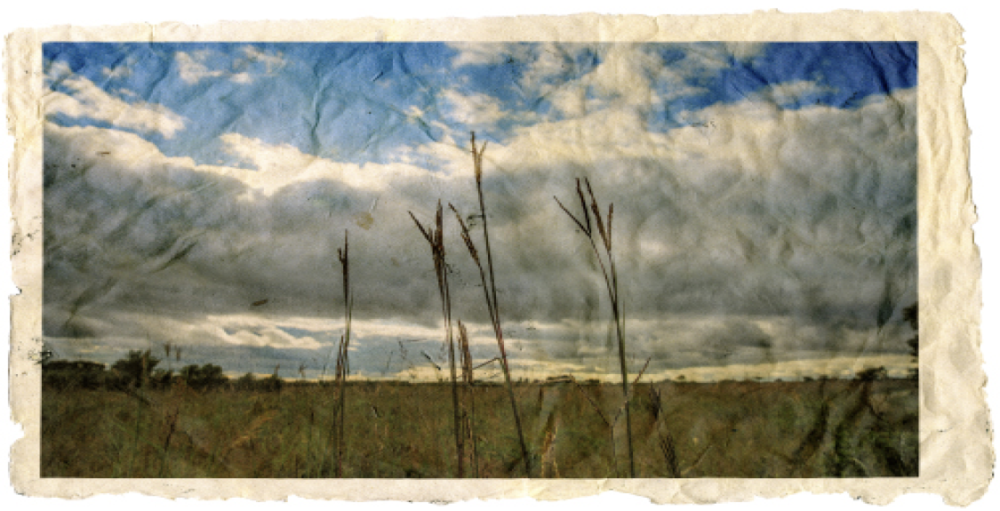

From Soil to Sustainability | Kirschenmann

 Photograph: Justin Hayworth

From Soil to Sustainability | Kirschenmann

Rootstalk | Volume II, Fall 2015

Sir Albert Howard observed that we could not have human health without soil health, plant health and animal health—insisting that they are all “one great subject,” and that understanding and working with this synergy would become the “health care system of the future.”

From Soil to Sustainability | Kirschenmann

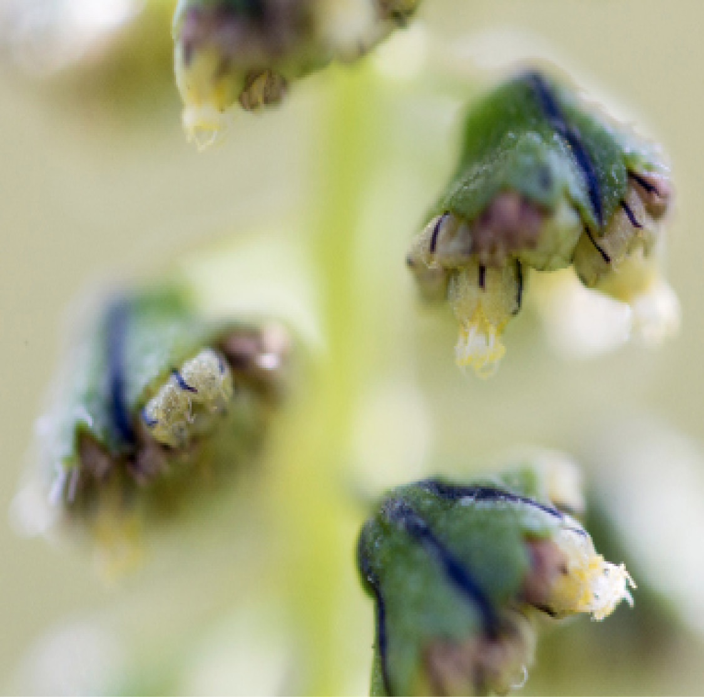

 Photograph: Justin Hayworth

Photography | Hayworth

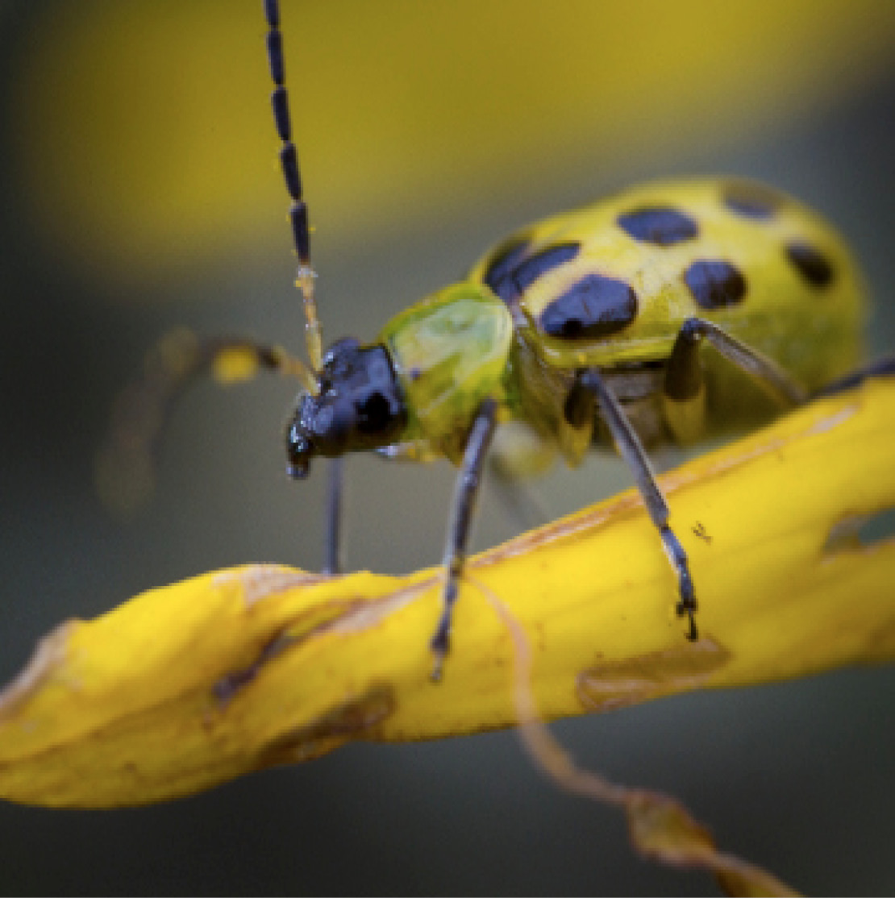

 Photograph: Justin Hayworth

Robert Wolf is a keen observer of the American scene. For over four decades he has traveled America’s back roads and backwaters, searching for iconic American figures and regional folkways. This led him to establish Free River Press, a nonprofit, in 1990, with the mission of documenting contemporary American life through writing workshops that he conducted with workingmen and women across the country.

Since that foundation, the press has published 26 titles, and in 1991 Oxford University Press published a collection of Free River Press writings, An American Mosaic: Prose and Poetry by Everyday Folk. 

Though Wolf has come to be known primarily through his work as an editor, publisher and writer, his six-part radio editorial for Iowa Public Radio, “On Developing Regional, Rural Economies,” won the Sigma Delta Chi Award from the Society of Professional Journalists for Best Radio Editorial of 1994. When he travels, he is never without sketchbooks, pens and pencils. He is drawn to record the many faces of the American landscape, and when he arrives home, he frequently uses the sketches he produces on the road as the basis for easel paintings. 

“The preservation of the rural American Heartland is another of my preoccupations,” Wolf says. It is a “preoccupation” that is amply on display in the three paintings—all oils—he shared with Rootstalk for this issue. 

Wolf’s most recent book, In Search of America, is a memoir of his life in the 1960s when he rode freight trains and hitchhiked across the country in search of the American soul. You can learn more about Wolf, Free Rivers Press, and Wolf’s projects at www.freeriverpress.org and www.robertwolfwriter.com. 

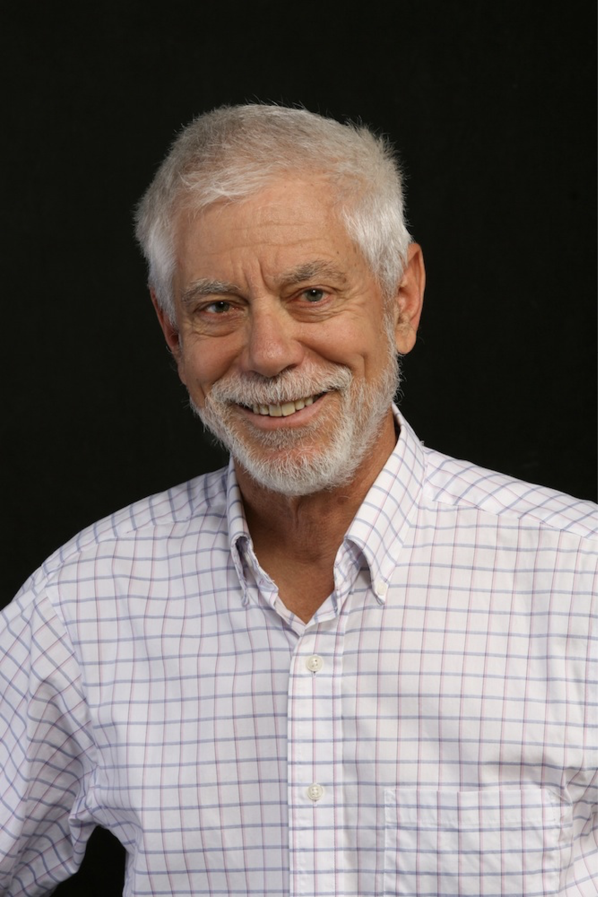

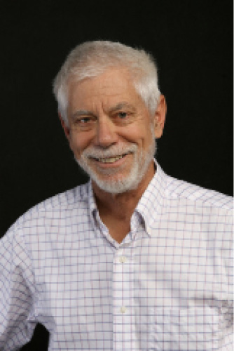

Author photo

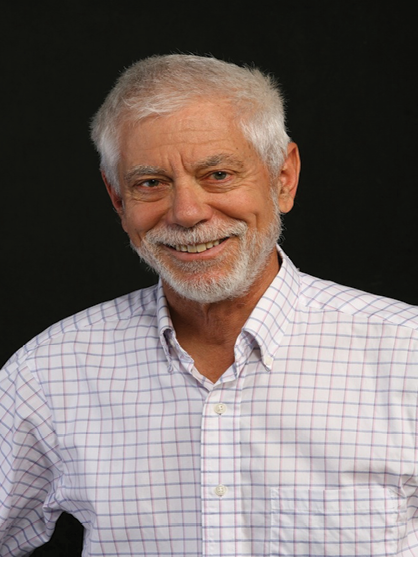

Photo courtesy of Robert Wolf 

Close-up: Robert Wolf

Close-up | Wolf

.png)

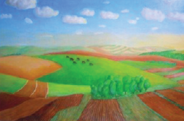

High Summer, Oil, 26” x 28,” 2003-2013

Not Too Far from Home, Oil, 24” x 12,” 2004

Spring Dawn, Oil,

36” x 24 1/4,” 2014-2015

Photo courtesy of Madeline Howland

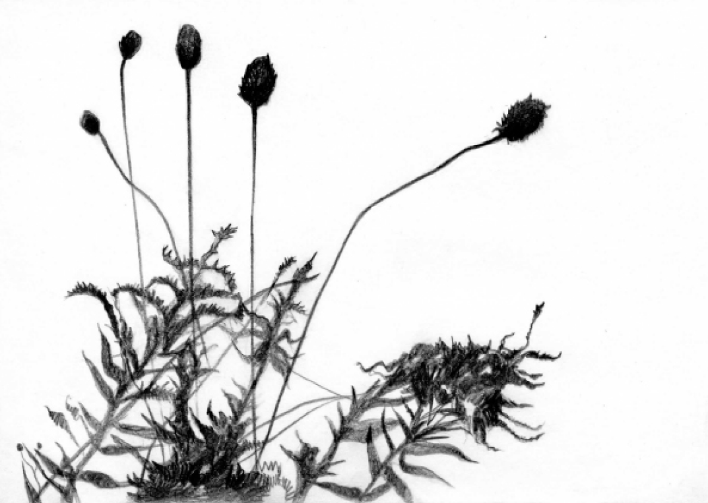

Drawing: Madeline Howland

Madeline Howland

Madeline Howland, from Minneapolis, Minnesota, is a senior at Grinnell College, where she is majoring in biology. Her favorite place is Quetico Provincial Park in Canada, with its tall white pines and myriad of tiny islands. During her time in Grinnell, she has also come to appreciate the prairie and the evocative power of its negative space. She does simple graphite drawings to capture the expressive way that goldenrod, coneflowers and black-eyed Susans reach toward the sky.

Such A Clean, Tidy Man | McIlrath

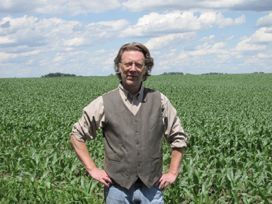

Photo courtesy of Harley McIlRath

J. Harley McIlrath’s work has appeared in the [North American Review](http://www.northamericanreview.org), the [Seneca Review](http://www.hws.edu/senecareview/), the [Wapsipinicon Almanac](http://www.wapsialmanac.com/) and elsewhere. His story collection, Possum Trot, is available from the Ice Cube Press. A second collection, The Child, is forthcoming from the [Ice Cube Press](http://www.icecubepress.com) in 2016.

Such A Clean, Tidy Man

J. Harley McIlrath

I don’t know what’s got me thinking about Shorty Tinkle. I suppose it’s this hip. It gets to hurting me if I sleep on it too long. It wakes me, and then I have to lie on my back. I prop myself up on pillows because the stomach acid bothers me, too, and between this hip and the stomach acid, I can’t get back to sleep. So I lie there thinking about things, running them over in my mind. Some people count sheep. I work on things in my mind. Like Shorty Tinkle. I couldn’t come up with his name, so I was lying there on my back working my way through the alphabet. I take a consonant, you know, and then start running vowels after it, seeing what jars loose. But nothing was coming. It’s because it’s a “sh,” you know. It starts with a “sh” so it’s not a proper consonant sound. 

I never did come up with it. Not lying there in bed anyway.

But that wasn’t what got me started. Where it came from, maybe, was sitting here waiting. I’m sitting here the other day, and this . . . what my dad would have called a grease monkey… is talking about all the cars he’s ever owned. 

He’s saying, “Bought a 66 Mustang 289 off a guy up to New Hampton. Floors rusted out. Rear quarters rusted out. Sat for 20 years in the windbreak behind his old man’s barn.”

He says, “Only five thousand miles on the engine and tranny, though. Car’s all there like the day it come off the line. Nothing missing.”

He says, “I got it for seven hundred. Two grand later, I got all the parts I need and a new black interior. Then the rocker studs pull out of my heads. Press in non-adjustable.”

He says, “Now I have to do the top end of the engine,” and he’s looking at me like he’s expecting a comment, like I should be saying something. I’m trying to think when he started talking. I don’t know. I think he was already talking when I sat down.

So this grease monkey’s putting me to sleep, and the bell goes off at the door, and in walks this guy in bib overalls and no shirt. You don’t think about it at first because he’s very clean, like he’s just got out of the shower. Hair all combed. Straight part on the side. Bibs look like they’re pressed. Brand new running shoes, you know, not work boots or anything like that. He’s clean and all done up for town, except he’s not wearing a shirt. That’s just one of those things you just know, right? You grow up with it: No shirt, no shoes, no service. 

But in he walks, proud as can be, and he steps up to the window there where the gal sits.

The grease monkey’s saying, “Went over to Wisconsin. Kid wants twenty-eight hundred. Twenty-eight hundred is way too much for a Wisconsin car.”

Here’s the thing. He’s so clean. The guy in bibs. Like I say, like he just got out of the shower. But it’s not just that. His skin. It’s soft. Looks soft, anyway. I don’t know. He’s tan, but it’s not a regular tan. It’s not a tan like a guy in bibs would have. You know. Real bibs. Overalls. He looks like a guy maybe that holds the stop sign on road construction. Maybe a guy drives a lawn mower at the college. But his tan is like he works on it. Like he lays at every angle to the sun so no wrinkle or crevice gets missed. 

Looks like the inside of his belly button might be as tan as his shoulder blades. 

You know, maybe you don’t think about it because his tan looks just as store bought as a shirt. Maybe it is. I don’t know.

The grease monkey is saying, “Picked up a cherry 81 Z for twenty-five hundred in Montana. No rust. Newly rebuilt engine. Great-running car.”

And the guy in bibs, he goes straight to the window there where the gal sits, but before he’s halfway there he reaches at the pocket in the front of his bibs, and he pulls out a folded paper. Holds it out in front of him as he walks. The gal there at the window is talking into that headset she always wears for the phone. 

She’s saying, “I have a 3:15 on the twelfth . . . of August . . . that’s a Tuesday. Does that work for you? How about a 4:30 on the fourteenth? That’s a Thursday . . . is a Thursday better? . . . August.” 

She’s setting up an appointment, and the guy in bibs walks up to the window with the paper held out in front of him, and the gal takes it without ever looking up. She doesn’t look at him. The fellow stands there a minute, looking through the window. Then he steps to the side. You can see he’s a little rattled. He’s not looking at me, but he’s looking through the door I’m sitting by. 

The grease monkey’s saying, “Just picked up a 67 RS Camaro for twenty-two hundred. It’s just a shell, but it’s pretty solid for a vinyl top.”

The guy in bibs must be looking at his own reflection in the glass from the framed diplomas the therapists have hanging there in that hallway. Anyway, he takes a comb out of the back pocket of his bibs, and he combs his hair. It doesn’t need combed, but he combs it anyway. I’m thinking that’s his way of reassuring himself. He combs with his right hand and kind of pats the hair with his left hand. 

The gal at the window is saying, “Well, what works for you? Why don’t you tell me what works for you, and I’ll see if I can make it work for us.” 

You know, she’s in the middle of saying that, and the guy in bibs puts the comb back in his pocket and steps up to the window. He stands there a second, and she keeps on talking into her headset.

And he says, “I guess you could give me a receipt.”

That’s all he says, and he stands there looking at the gal at the window.

And I hear her say, “Just a minute . . . Just a minute.” 

I don’t know whether she’s talking to him or to whoever she’s got on the phone. But she must be talking to the person on the phone because she hands a bit of paper through the window, and the guy in the bibs takes it from her hand and heads for the door. But he’s not done because he stops halfway to the door, and he turns.

 He says, “I guess I could have paid for this tomorrow when I come in.”

 The gal there at the window doesn’t say anything. She’s talking on the headset, and the fellow in the bibs stands there. That’s it. That’s all there is to it. 

The grease monkey, he’s saying, “I bought a Wisconsin truck once. Never again. Twenty-eight hundred is way too much for a Wisconsin car.”

But that’s it. I don’t know. That might be what got me thinking of Shorty Tinkle.

Shorty wasn’t his given name, of course. People just called him that. 

My dad did, anyway. 

I couldn’t tell you his real name. I don’t know that I ever heard it. People just called him Shorty. Shorty Tinkle. And he really wasn’t short, you know. He was thin, but he wasn’t short. It was his wife. She was a big woman. Not fat, you know but big. Big boned . . . and tall. She was a manly woman, very unpleasant, not in her looks so much, but in who she was. People hated to see her coming, and Shorty was always following along in her shadow. I don’t recall her name. Don’t know as I ever knew it. 

People just said, “Shorty was in with the missus, yesterday,” which was a joke because it made it sound like Shorty was in charge, but he wasn’t. It was Shorty’s missus had him in tow everywhere she went. 

I don’t know as Shorty even carried his own checkbook.

I was in line with my mom at McNally’s one time. Just a kid. This is forty, forty-five years ago. Shorty and the missus were in line ahead of us. Missus Shorty was digging in her bag and pulling out coupons and arguing with the checkout girl about whether they were good or not. 

“This one is for the Hy-Vee,” the girl was saying.

And Missus Shorty says, “Oh, pooh. It’s good there, it’s good here.” 

“No,” the girl says. “It’s put out by the Hy-Vee. You’ll have to use it at the Hy-Vee.”

The girl says, “It’s only good for twenty cents anyway.” 

And Missus Shorty slaps the coupon back down on the counter with a big thwack sound and says, “Well, if it’s only good for twenty cents then it won’t bankrupt you to give me those twenty cents here.”

Coupon after coupon she bullied that poor checkout girl, and when they were gone, Shorty and the missus, I thought the girl would say something about the missus. But you know what she says? 

She says, “He’s such a clean, tidy man.” 

She says that in a sad voice. 

“He’s such a clean, tidy man.” 

I heard my dad say one time, “If Shorty Tinkle could plant a corn row as straight as he parts his hair, he’d be a hell of a farmer.” 

He was saying that to the boys loafing at the elevator, and he got a good laugh out of them. My dad ran the elevator in Newburg. Grain elevator I suppose I should say. People anymore get the idea he worked in a hotel or something. He ran the grain elevator, and he delivered feed to the farmers all around. Sometimes I’d ride with him, delivering feed to their farms. Sometimes it was in bags. Sometimes we’d take ground corn in the auger truck, put it right in the feeders. Most guys would come talk to us while my dad unloaded the feed. Some didn’t, but most did. 

Almost everybody. 

I can think of being at Shorty Tinkle’s twice. Once he was out pulling weeds in his beanfield. The other time, he stepped out the house door and stood there watching us without coming down to say hello. I remember sitting there looking at him from the truck. I didn’t wave at him, and he didn’t wave at me. Shorty looked like he was ready for town, except his pants were denim. New looking. Pressed even. But in town he wore dress pants. 

Denim or not, Shorty could have walked straight out of his beanfield and taken a pew at church and been just fine.

“Shorty’s beans’d be a lot cleaner if he didn’t stop for a bath after every weed he pulled.” 

That’s another of my dad’s lines. He was full of them.

That second time I was at Shorty Tinkle’s, the time he stepped out of the house, was after Missus Shorty died. I don’t remember when Missus Shorty died. There must have been a notice in the paper. They must have run her picture maybe. I’m sure there wasn’t much grieving. As I say, people hated to see her coming. But that second time I was at Shorty’s was after Missus Shorty had died, and there were clothes on the line. I remember because it was odd to me. I remember thinking if Shorty’s missus was dead, then how’d those clothes get on the line.

And who was going to pull them back in?

That’s what I was running through my mind sitting there in the truck. I don’t know why I was thinking about that. What did I know? I was a kid.

That was a long time ago, and it wasn’t quite fair what my dad said about Shorty’s corn rows. His rows were as straight as anyone else’s. 

My dad was just going for the laugh. He did that. 

Truth was, Shorty Tinkle’s corn rows were as straight as anyone’s. Straighter. And his beanfields were cleaner than most. Shorty’s building site was kept up, too. White house. Red outbuildings with white trim. Yard all mowed. Clean and tidy, just like Shorty.

Shorty Tinkle’s building site was on the cover of the Wallace’s Farmer once. They ran a contest where they’d put a picture of a nice looking building site on the cover, and then people could win a prize calling in and correctly saying whose it was. I don’t remember what the prize was. I don’t imagine it was much. But there was Shorty’s building site on the cover.

I was in line behind Shorty one other time at McNally’s. This was twenty years or so ago. After my mother had passed. Dad, too. 

I think so. Yes. 

I didn’t speak to him, but I was behind Shorty in line. I don’t think he said a word to anyone, not even the checkout girl, but he was buying the stuff people buy, milk, eggs. I remember noticing him buying eggs because that first time I was at his place they had chickens. 

Maybe they were Missus Shorty’s chickens. I don’t know.

Anyway, that had been a long time before. Shorty must have been late in his eighties, but he still looked real nice, like his mom had just got him ready for school. I was ready for the checkout girl to say something when I stepped up, make some remark, but she didn’t.

Shorty Tinkle was nothing to her.

Maybe that isn’t it at all. What’s got me thinking about Shorty Tinkle? I don’t know. Maybe I was already thinking about him. Maybe I’ve been thinking of him all along. Maybe I’d just lost his name.

It was the mailman found Shorty. Shorty hadn’t been getting his mail, and when the mailman went to stuff the third Pennysaver in his box, he decided he’d better check things out. He looked in the garage and saw the car was in there, so he went up and knocked on the house door. No answer, but the door wasn’t locked. So the mailman went on in.

He was upstairs, lying there in bed, Shorty was, but the bedroom was dark. The shades were pulled, and the mailman almost missed him. Shorty’d been there awhile, and he blended right in with the bedding. 

The mailman says, “Jesus, Shorty. You scared the hell out of me.”

He says, “You ain’t been bringing your mail in.”

He says, “You want me to bring your mail in, Shorty?”

The mailman said he figured Shorty was dead from the get go, but he couldn’t stop himself from talking. Nerves. This is all second hand from the Post Office. They say the mailman, it was Ed Kirby if you know him, went to switch on the light on the nightstand, but it was already switched on. The bulb was burned out. Shorty’d been lying there with the light on.

Seems like Shorty was just lying there like he was waiting for something, running things over in his mind, couple pillows under his head.

So Ed finishes his route and then calls the sheriff from the Post Office.

Shorty Tinkle.

Now here’s the rest of it. The neighbors go in to get Shorty’s stuff ready for the estate sale, you know, he and the missus didn’t have family, so the neighbors go in to get things arranged, pull out the machinery and all, and I guess you should have seen the insides of those buildings. That’s what they say. They were all painted up on the outside, you know, but on the inside, they were held together with baling twine and wire. All of them. The wood was all splintered inside. The beams and rafters were all split and cracked, and Shorty had them wrapped with twine and electric fence wire. Barbed wire. Copper wire. All wrapped around the broken wood. Holding things together. The joists were all cobbled up with scrap wood. 

But the real thing was the garbage. Shorty Tinkle’s buildings were piled full of garbage. Hundreds of bags of it, what was in bags. Maybe thousands. Machine shed. Corn crib. Barn. Not a bale of hay in the hay mow. Floor to roof stacked with garbage. From what they say, Shorty’d never been to the landfill in his life. Never put a match to a newspaper or envelope. It was all piled up there in those buildings. Decades of it, just feeding the rats.

It just goes to show you. 

And then, I don’t know, I step up to the window here today, and that gal’s talking into her headset, and she doesn’t look up or nothing, and she’s got the window there pulled half shut, and there’s my reflection on the window. I’m looking through my own reflection, and that’s when it comes to me. 

And I look at the gal there, and I say it.

I say, “Shorty Tinkle.” 

I’m looking at her, and I say it as if we’ve been trying to come up with it together, the two of us. Maybe over a cup of coffee. I say it like I’m pretty proud of myself, and maybe I’m expecting her to say, “That’s it! You got it!”

You know. “Good for you!”

And the gal at the window there, she doesn’t look up, but she keeps talking, and I see her running her finger up and down the list while she’s talking. She’s running her finger up and down the list. She’s looking for Shorty Tinkle’s name. 

She doesn’t even look at me. 

She just keeps looking for Shorty Tinkle’s name as if she doesn’t see me in here twice a week for the past two months. 

So I step away from the window, and I come over here, and I sit down here in this chair by the door where I always sit, and we’ll see. I guess we’ll see. And here’s what you can tell me, maybe you know, I want to know what it is about Shorty Tinkle.

Such A Clean, Tidy Man | McIlrath

Such A Clean, Tidy Man | McIlrath

What’s got me thinking about Shorty Tinkle? I don’t know. Maybe I was already thinking about him. Maybe I’ve been thinking of him all along. Maybe I’d just lost his name.

Such A Clean, Tidy Man | McIlrath

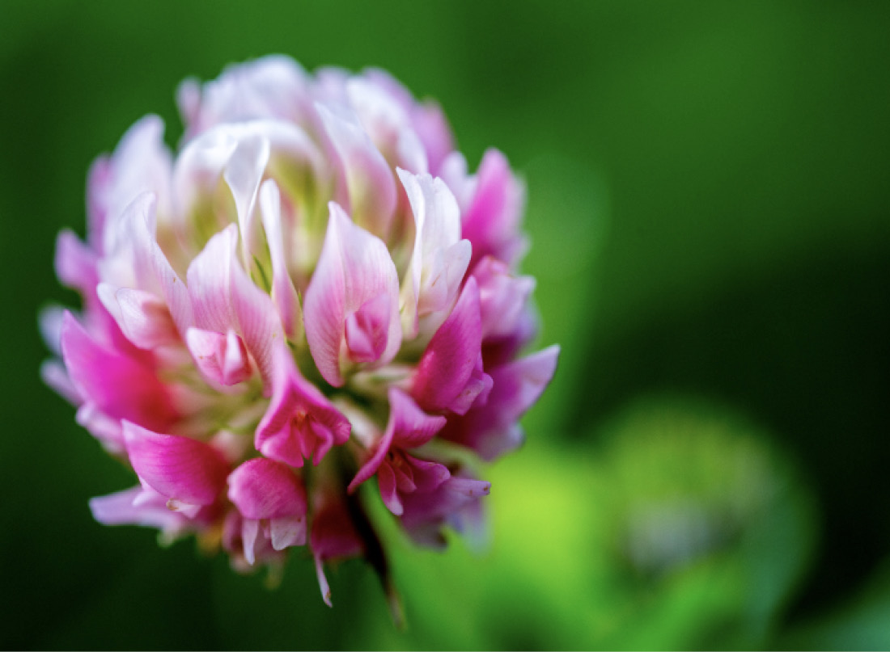

Photograph: Justin Hayworth

 

 Endnotes 

Mutel, “The Stories We Live By” 

1 Iowa Climate Change Impacts Committee, Climate Change Impacts on Iowa 2010, 1/1/2011, Report to the Governor and the Iowa General Assembly. Available online. 

 • Executive Summary: <http://www.water.iastate.edu/sites/www.water.iastate.edu/files/iowawatercenter/Climate%20Change%20Executive%20Summary.pdf>

 • Complete Report: <http://www.water.iastate.edu/sites/www.water.iastate.edu/files/iowawatercenter/Climate%20Change%20Impacts%20on%20Iowa%202010.pdf>

Stowe, “Swimming Upstream” 

1 Paying $307,000,000 for Iowa Drainage. (1910, September 23). The New York Times. 

2 Petroski, W. (2015, January 13). Branstad: “Des Moines has declared war on rural Iowa” The Des Moines Register.

3 Petroski, W. (2015, July 28). Branstad: Water Works should ‘tone down’ criticism of ag pollution. The Des Moines Register.

4 Petroski, W. (2015, March 19). Rural lawmaker calls for boycotting Des Moines over Water Works lawsuit. The Des Moines Register.

5 Petroski, W. (2015, September 20). Boycott flops, bill eyed to stop Water Works lawsuit. The Des Moines Register.

Kirschenmann, “From Soil to Sustainability” 

Berry, Wendell, 1981. The Gift of Good Land. San Francisco: North Point Press. pp 134-141. 

Diamond, Jared, 2005. Collapse: How Societies Choose to Fail or Succeed. New York: Viking. 

Ehrenfeld, John, R, & Andrew J. Hoffman, 2013. Flourishing: A Frank Conversation about Sustainability. Stanford, CA: Stanford Business Books 

Howard, 1947, The Soil and Health, The Devin-Adair Company. University Press of Kentucky edition, 2006. 

Howard, Sir Albert, 1943. An Agriculture Testament, New York: Oxford University Press. 

Miller, Daphne, 2013. Farmacology: What Innovative Family Farming Can Tech Us about Health and Healing. New York: Harper Collins. 

Neff, Roni, ed., 2015. Introduction to the U.S. Food System: Public Health, Environment, and Equity. Jossey-Bass.

Porter, Michael E. and M.R. Kramer, 2011. “Creating Shared Value,” Harvard Business Review, January/February.

Schusky, Ernest, 1989. Culture and Agriculture: An Ecological Introduction to Traditional and Modern Farming Systems, New York: Beregin & Garvey Publishers.

State of the World, 2013. “Is Sustainability Still Possible?” The Worldwatch Institute, Island Press.

UN reports, 2008–2013. Five recent UN reports can be very helpful in shaping the new culture of agriculture that can better “sustain” our future, global food ventures: Agriculture at A Crossroads, Agroecology and the Right to Food, Save and Grow, Toward the Future We Want, and Wake Up Before It Is Too Late.

