2019-spring

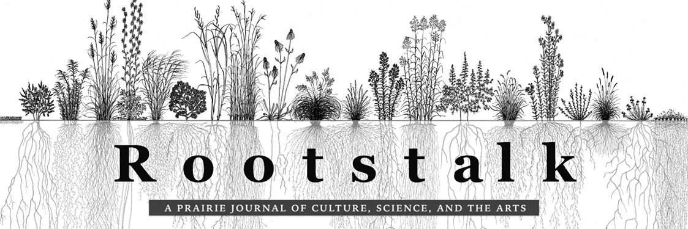

Volume V, Issue 2, Spring 2019

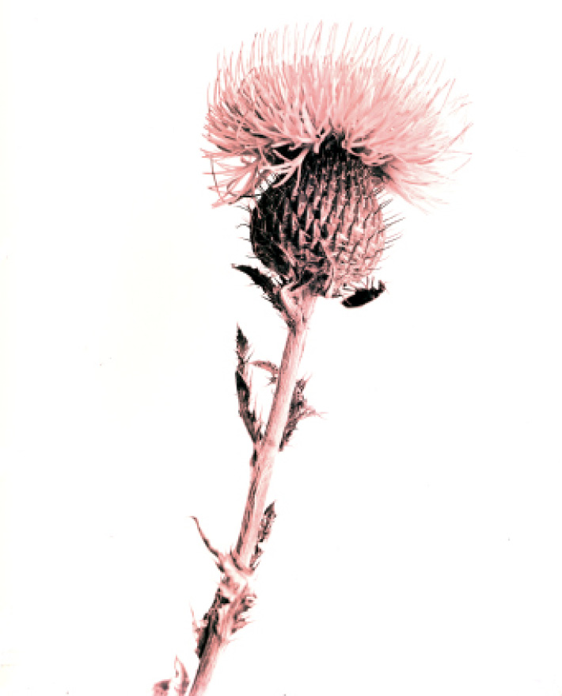

Rootstalk, Spring 2019

Volume V, Issue 2

Supported by Grinnell College’s [Center for Prairie Studies](https://www.grinnell.edu/academics/centers-programs/prairie-studies)

and a grant from the College's Fund for Innovation.

Rootstalk is committed to promoting open expression and is hosted on

 Grinnell’s Digital Grinnell server.

A note on this issue’s multimedia features: In order to access all the media in this latest issue of Rootstalk—including content featuring embedded sound files—you’ll need to download the interactive PDF version (approximately 173 MB) and, once you’ve done so, open it using the Adobe Acrobat Reader. You'll find a link you can use to download the interactive PDF at the bottom of the page at <https://rootstalk.grinnell.edu>. If you don’t already have the Adobe Acrobat Reader installed on your computer, you can download a free copy [here](https://acrobat.adobe.com).

Cornelia Clarke created the work we're featuring on the cover of this issue, a photographic image of a tall thistle (Cirsium altissimum). Like its more familiar relative the Canada thistle, it is a member of the asteredae family, but unlike the Canada thistle, it is native to the prairie and not an invasive species. 

Cover design: Mark Baechtel, Jonathan Andelson

Table of contents image: Naomi Clayton

Layout: Jonathan Andelson, Mark Baechtel

Watercolor | Krueger Curtis

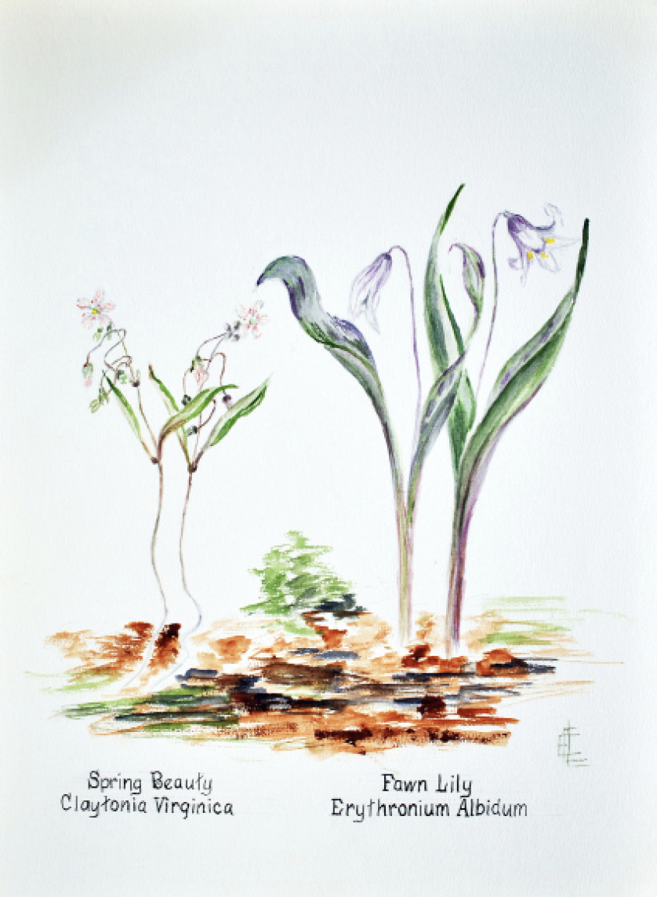

Depicted above are Lydia Krueger Curtis’s watercolor renderings of two of the prairie’s most beautiful spring ephemerals. On the left is the Virginia spring beauty (Claytonia virginica), a member of the purslane family. The flower on the right, though identified as a specimen of the fawn Lily (Erythronium albidum), more closely resembles the dogtooth violet (Erhythronium dens-canis). More familiar to those who ramble in the prairie region’s spring woodlands is the fawn lily’s and dogtooth violet’s cousin, the trout lily (Erythronium americanum). 

Rootstalk | Volume V, Issue 2, Spring 2019

A few years ago, I wrote a little essay called “Changing Heroes” that appeared in The Land Report, the bulletin of [The Land Institute](https://landinstitute.org). In it, I argued that the Western world has a propensity for choosing the wrong heroes, and the wrong kinds of heroes. 

 Hercules is our archetypical hero. His life, even in infancy, was a playbook of superhuman deeds. He performed astonishing feats—the “twelve labors of Hercules”—showing all the while physical strength, undaunted courage, unimaginable endurance, and the ability to overcome seemingly insurmountable challenges.

 Yet despite Hercules’s legendary deeds and unequivocal prowess, the thing that strikes me most about him is a deficiency: he is rootless. He lacks a clear and strong connection to any location. He roams, he conquers, never settles down, never has a place that he calls his own, a place that he’s drawn to. As the classicist Emily Butler recently wrote, “[Hercules’s] home is as foreign to him as any place he visits.”1 

 The West has long admired the Hercules type. To embark on projects in foreign lands, to face seemingly impossible odds, to persevere in the task, ultimately to achieve the goal, win the race, clean up the mess, vanquish the opposition. It’s the stuff of Alexander the Great, Caesar’s conquest of Gaul, Cortez’s overthrow of the Aztecs, Boone’s trailblazing to Kentucky…the list goes on and on.

 It’s also the stuff of other kinds of conquests: pioneers “breaking” the prairie in the mid-19th century, Cornelius Vanderbilt forging a railroad empire, Norman Borlaug enabling the “Green Revolution,” Steve Jobs revolutionizing digital content delivery. There is a seductive quality to such conquests, at least to those who tell the stories and those who benefit from them. But ask the Aztecs, or smallholders in India, or the prairie itself, and you might hear a different opinion.

In my Land Institute essay I called on us to celebrate other kinds of heroes—those who protect rather than conquer, heroes who connect to a place and its people and promote their well-being, heroes like Henry David Thoreau, who so famously connected with the Concord woods, and who also “came to see the violent removal of the Indians from New England as the central tragedy of American history.”2 Ada Hayden is another of those heroes, who—as early as 1919—called on Iowans to preserve even “a few acres” of prairie in each of the state’s counties, asking plaintively, “why not preserve now at a small cost what can not be replaced at any cost?”3 Mahatma Gandhi was one of these heroes, too, and on an even larger scale, fighting on behalf of the people and natural environment of India. One could even invoke another ancient hero, Odysseus, whose story “is the ultimate endorsement of nostos, or homecoming, the idea that a heroic warrior’s greatest triumph comes when he returns from war to his own home and family.”4 

It is in this context that I want to acknowledge Bill Stowe.

 Bill was born in Des Moines on January 1, 1959. According to his slightly irreverent obituary published in the Des Moines Register, he was the first baby born in Iowa that year. I doubt that is what made him a leader, but it makes a good story. Bill’s involvement in politics (more on this later) began in high school when he served as a page in the Iowa Senate. He attended Grinnell College and graduated Phi Beta Kappa, then began collecting advanced degrees: a Master of Science in Engineering from the University of Wisconsin, a Master of Science in Industrial Relations from the University of Illinois, and a Juris Doctor from Loyola University Law School. But his credentials are not why Bill is my hero.

Nor are his many professional positions, though they are impressively diverse. Bill’s first job was as a field examiner with the National Labor Relations Board, which led to a position as labor relations representative for Inland Steel. After that, for about ten years, he worked in the energy sector—for Shell Oil and MidAmerican Energy—then for two years as the human resources director for the City of Des Moines. In 1999, he changed to being the Assistant Manager of Des Moines’ Public Works/Engineering Department, a position he held for thirteen years before becoming the CEO and General Manager of the Des Moines Water Works (DMWW). It was here that Bill’s heroism and political acumen were revealed to the world. Allow me to set the stage.

DMWW is a regional utility that, its website states, “protects public health and promotes economic development by delivering outstanding quality water, affordably, in reliable quantities, to Des Moines and surrounding communities.” For over 25 years the utility has, in the interest of public health, been removing nitrates from water from the Raccoon and Des Moines Rivers, the sources of Des Moines’s drinking water. Excessive nitrate in drinking water is implicated most notably in methemoglobinemia, or “blue baby” syndrome. It may cause other health problems as well.

The main source of nitrates in drinking water is agricultural runoff. Farmers upriver from Des Moines add nitrogen fertilizer to their fields—mostly in the form of ammonia—to promote leaf growth in their corn and soybeans. Though some ammonia is injected directly into the soil, some is surface applied and is susceptible to washing into drainage ditches and creeks and thence into the Raccoon and Des Moines Rivers. You cannot see, smell, or taste nitrates in drinking water. 

DMWW operates a denitrification facility to reduce the nitrate level to below a threshold set by the government. This is an expensive process, the cost of which varies from year to year based on fertilizer application rates and rainfall. In 2015, the worst year on record, DMWW had to operate the facility for 177 days at a cost of $1.5 million. That’s just for denitrification. 

Reckoning with such costs, Bill Stowe took a bold and controversial step, unanimously backed by the DMWW board of directors. The utility filed a law suit against three upriver county boards of supervisors for failing to control the nitrate level of water in the rivers in violation of the Clean Water Act. Stowe argued that the counties (which own and operate agricultural drainage pipes) had not been doing what they should have been doing, namely monitoring nitrate runoff as point-source pollution with an aim to regulating it. 

The lawsuit received extensive media coverage in Iowa and beyond, and for good reason. Opposition to the lawsuit was fierce and immediate. It came from many extremely powerful and well-financed agricultural interests in Iowa and beyond. The state legislature began exploring ways to derail the lawsuit. The governor accused DMWW of exacerbating the urban-rural divide. Stowe was personally attacked and vilified. In the end, the courts dismissed the suit. Had DMWW prevailed, it could have reshaped the face of Midwestern agriculture. (For a fuller account, see Chapter 13 of Pulitzer Prize winning journalist Art Cullen’s recent book, Storm Lake: A Chronicle of Change, Resilience, and Hope from a Heartland Newspaper, Viking 2018).

So, Bill Stowe is my hero because he cared about Iowa’s water and about Iowans themselves enough to fight for their health. He took a stand that involved no personal gain but exacted a high cost in terms of relationships and mental distress. He faced a withering backlash with patience and poise.

About a year after the lawsuit was dismissed, Bill was diagnosed with an aggressive form of cancer that took his life earlier this year at the age of 60. Hugh Espey, Executive Director of Iowa Citizens for Community Improvement, writing a remembrance of Bill on his organization’s website, remarked, “Bill often said in the fight for clean water, ‘lean forward.’” May Bill’s example lead us all to do the same.

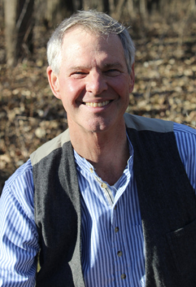

Photo courtesy of Jon Andelson

Publisher’s Note:

What Makes A Hero? 

Remembering Bill Stowe (1959-2019)*

by Jon Andelson

*References listed in Endnotes

Publisher's note | Andelson

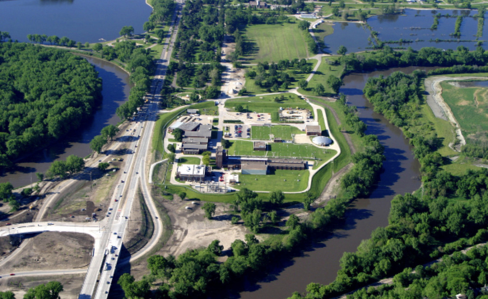

The Des Moines Water Works was the field on which Bill Stowe fought his toughest battles. Photo courtesy of Des Moines Water Works

Rootstalk | Volume V, Issue 2, Spring 2019

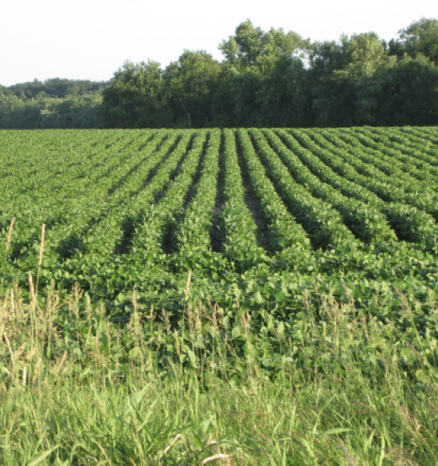

Photo by Jon Andelson

Associate Editors

Associate Editors:

Anna Brew ‘21

Sang Yoon Byun ‘21

Emma Christoph ‘19

Illana Cohen ‘21

Amelia Darling ‘19

May Dru ‘21

Ethan Evans ‘20

Anjali Jain ‘21

Anushka Kulshreshtha ‘21

Stephen Lemmon ‘22

Daisy Morales ‘20

Max Aryn Semba ‘20

Rachel Snodgrass ‘21

Jeremy Sparagon ‘20

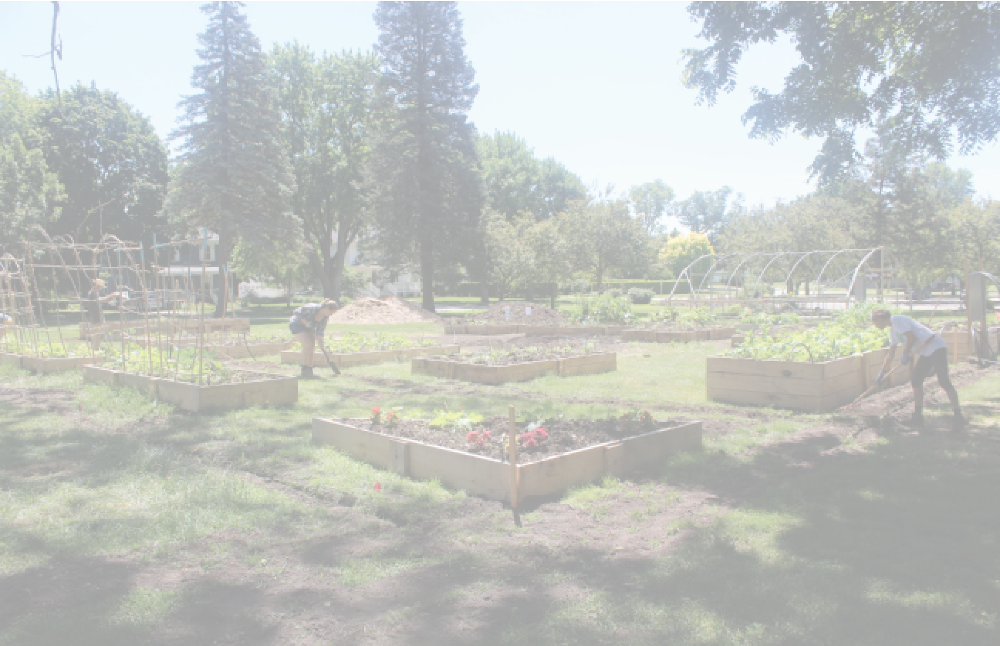

Contents

In order of appearance

Tall thistle (photograph) Cover

 Cornelia Clarke

Spring beauty and fawn lily (watercolor) 2

 Lydia Krueger Curtis

Publisher's Note 3-5

Jon Andelson

Untitled Photo 5

Jon Andelson

Associate Editors 6

Untitled Photo 7-8

Jon Andelson

Sacrifice State (interview) 9-12 

Associate Editor Maya Dru talked with

Des Moines Water Works CEO Bill Stowe 

before his untimely death 

Why Drive to Nebraska During A 13-14

 Winter Weather Warning? (poem)

Sandy Moffett

Untitled photograph 14

 Sandy Moffett

Violence Against the Earth Is 15-19

 Violence Against Women (essay)

 Kandi White

Untitled photographs 16 & 18

 Sebastian Braun

Wild Bergamot (watercolor) 20

 Lydia Krueger Curtis

The Tools of Prairie 21-22

 Reconstruction (infographic)

 Rachel Snodgrass 

Bruce Leventhal’s Photos of 23-28

the Greater Prairie Chicken 

Ilana Cohen

Establishing Native Prairie Plantings 29-31

Without Using Herbicides (essay) 

Harriet Behar

Untitled Photo 31

Jun Taek Lee

Finding the Midwest: A Journey 32-35

 in Six Parts (essay)

 Greg Brew

Two poems  36-37

 Nikki Neems

Mrs. Cecile Schwab (photograph) 38

 Keith Kozloff

Literature and Opportunity 39-44

 in the Midwest (interview)

 Associate Editor Daisy Morales

interviews Prof. Deborah Brandt

“Sunflower, Sunflower:” A Neuro- 45-48

 diverse Landscape (interview)

 Associate Editor Sang Yoon Byung

interviews publisher Bryan Boyce

Prairie Wildflowers: Two Artists, Two 49-67

 Mediums, One Beauty (2D art 

 and photography)

Cornelia Clarke and Lydia Krueger Curtis

Ode to Liberty #6 (essay) 68-69

 Mary McBee 

Two poems 70-71

Mike Lewis-Beck

Seth Hanson’s “Not Too Deep”— 72-76

 Seeking the Sound

 of Rural Iowa (interview)

 Associate Editor Ethan Evans

interviews Musician Seth Hanson

Jewel Box Bank, Grinnell, IA 76

 (photograph)

Jon Andelson

RootsTalk! #6 (podcast) 77

 Wisconsin writer Heather Swan discusses 

 her love for pollinators

Thoreau’s Home on the Prairie 78-81

 (essay) 

 Paul Goodnature

Prayerful Prairies (poem) 82-85

Gerard Sarnat

Untitled Photo 85

Jun Taek Lee

Tortilla Pooris (and Other Kitchen 86-89

 Experiments) (interview)

 Associate Editor Anjali Jain

interviews her family to

understand Indian food in the Midwest 

My Integrated Life, Part II (essay ) 90-99

 Dartanyan Brown

Endnotes 100-102

 By category

Words

Publisher's Note 3-5

Jon Andelson

Associate Editors 6

Sacrifice State (interview) 9-12 

Associate Editor Maya Dru talked with

Des Moines Water Works CEO Bill Stowe 

before his untimely death 

Why Drive to Nebraska During A 13-14

 Winter Weather Warning? (poem)

Sandy Moffett

Violence Against the Earth is 15-19

 Violence Against Women (essay)

 Kandi White

Establishing Native Prairie Plantings 29-31

Without Using Herbicides (essay) 

Harriet Behar

Finding the Midwest: A Journey 32-35

 in Six Parts (essay)

 Greg Brew

Literature and Opportunity 39-44

 in the Midwest (interview)

 Associate Editor Daisy Morales

interviews Prof. Deborah Brandt

“Sunflower, Sunflower”: A Neuro- 45-48

 diverse Landscape (interview)

 Associate Editor Sang Yoon Byung

interviews publisher Bryan Boyce

Ode to Liberty #6 (essay) 68-69

 Mary McBee 

Two poems 70-71

Mike Lewis-Beck

Seth Hanson’s “Not Too Deep”— 72-76

 Seeking the Sound

 of Rural Iowa (interview)

 Associate Editor Ethan Evans

interviews Musician Seth Hanson

Thoreau’s Home on the Prairie 78-81

 (essay) 

 Paul Goodnature

Prayerful Prairies (poem) 82-85

Gerard Sarnat

Tortilla Pooris (and Other 86-89

 Kitchen Experiments) (interview)

 Associate Editor Anjali Jain

interviews her family to

understand Indian food in the Midwest 

 

My Integrated Life, Part II (essay ) 90-99

 Dartanyan Brown Endnotes 100-102

Sounds & images

 Photography: Cornelia Clarke

 Tall Thistle Cover

Watercolor: Lydia Krueger Curtis

 Spring beauty and fawn lily 2

 Photography: Jon Andelson

 Untitled 5

 Untitled 7-8

 Jewel Box Bank, Grinnell, IA 76

Photography: Sandy Moffett

 Untitled 14

Photography: Sebastian Braun

 Untitled 16

 Untitled 18

Watercolor: Lydia Krueger Curtis 

 Wild Bergamot 20

Infographic: Rachel Snodgrass

 The Tools of Prairie Reconstruction 22

Photo Essay: Bruce Leventhal 

and the Greater Prairie Chicken

 Ilana Cohen 23-28

Photography: Jun Taek Lee

 Untitled 31

 Untitled 85 

Photography: Keith Kozloff

 Mrs. Cecile Schwab 38

RootsTalk! #6 (podcast)

 Wisconsin writer Heather Swan discusses  77

 her love for pollinators

Wildflowers in Photography and Art: 

 Cornelia Clarke and 49-67

Lydia Krueger Curtis

Music (link): Seth Hanson’s “Not

 Too Deep”  75

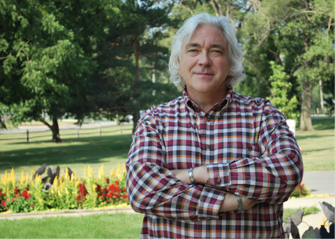

photo courtesy of the estate of Bill Stowe

Bill Stowe, the CEO and General Manager of the Des Moines Water Works (DMWW), recently passed away after a brief struggle with pancreatic cancer. In the weeks before his death, he spoke with Rootstalk Associate Editor Maya Dru concerning his long battle on behalf of the water-consuming public he served at the head of his agency. 

 Under Stowe’s leadership, DMWW worked closely with business, environmental, consumer and agricultural leaders to advocate for better stewardship of water resources and clean water initiatives throughout Central Iowa.

 Stowe was a Phi Beta Kappa graduate of Grinnell College with a Bachelor of Arts, and he also held a Master of Science in Engineering (University of Wisconsin), a Master of Science in Industrial Relations (University of Illinois), and a Juris Doctorate Degree (Loyola University Law School). Stowe sat on the Board of the Association of Metropolitan Water Agencies, representing the largest drinking water utilities in North America. He was a member of the American Society of Civil Engineers, a member of the Iowa Bar, and he frequently acted through the American Arbitration Association as an impartial arbitrator in resolving complex construction and commercial disputes involving public and private construction projects.

Sacrifice State: An 

Interview with Bill Stowe

Conducted by Maya Dru

Rootstalk: I read the court ruling on Des Moines Water Works versus the counties [DWWW brought suit against three agricultural counties upstream from Des Moines, in which the agency held that the counties should be considered to be point-source polluters, and should pay damages for the negative effects their practices had on Iowans living downstream]. I was wondering what you thought of the ruling, and if you were to respond to it, what you would say.

 

Stowe: You know, there are actually two rulings. I assume you read the Iowa State Supreme Court decision and then there was also a decision from a U.S. District Court here in Iowa. In both cases, we were certainly disappointed. In the Iowa case, the Iowa Supreme Court by a 3 to 2 majority, basically said that we did not have standing to...sue [the] drainage districts in Iowa. [These are the] public utilities that drain farmland. [They are] supervised by a county board of supervisors [and are held to be] immune from suits, particularly [those brought by] other public entities [such as] the Des Moines Water Works. So, [we were] certainly disappointed by that [decision]. But I understand and respect the rule of law and the court’s ultimate jurisdiction.

 The other ruling was from a Federal Court, and we had serious disagreement with [the ruling because it] essentially just sidestepped the whole idea about whether agriculture is immune from suit for violations of environmental laws. And that is a far more serious issue for us than this kind of nuanced issue about whether a local government can sue another local government within the Iowa Constitution. So, we accepted the Iowa Supreme Court decision, we were disappointed by it, certainly, but the federal decision that essentially said it wasn’t even going to rule on the basic issue of whether agriculture should be regulated under the Clean Water Act was a huge disappointment for us.

Rootstalk: Why do you think they ruled that way?

 

Stowe: Well, I mean, clearly the judge thought he was following federal law. We think it’s an error of law and certainly regret that. But you know the motives of judges and the motives of all of us are always arguable, and [it’s] pretty speculative for us to put ourselves in their position and guess why it is they did it. I have every reason to believe that the federal judge believed he was following federal law, but it just reinforces the myth that agriculture is unregulated under the Clean Water Act. And that’s a huge concern for us and should be for all Americans. Yeah, I mean what kind of precedent-keeping is that law? I think it’s pretty narrow, because this is out of the Federal District Court for the Northern District of Iowa. So relatively narrow.

 District court rulings generally aren’t authoritative in driving decisions of other district courts, but it certainly makes an argument that our enemies will carry forward into other venues even though I don’t think it decides the case. It certainly gives them a bit of an upper hand that we would certainly not intend to give them.

 

Rootstalk: So, given the results of a case, where does Des Moines Water Works go from there?

 

Stowe: The decisions are about two years old now and we’re in the process of spending millions more dollars on water cleaning processes because we just don’t see anything other than a downward trend in surface water quality in Iowa. Now that agriculture has seemingly been given a free license in the wild, wild West to do whatever they want in terms of environmental damage to our surface waters, we’re compensating for that by spending a significant amount of money—tens of millions of dollars over the next five to 10 years—to deal with the fact that polluters don’t have accountability here, and [will] continue—in their narrow self-interest—to push pollutants to us downstream. We’ll we have to make that water safe and affordable for our consumers.

 

Rootstalk: How are you making it affordable?

 

Stowe: Well, by using technologies that we believe are most effective both in terms of an end result but also most efficient in terms of cost. But at the end of the day, there’s no question that our ratepayers are subsidizing upstream producers who are polluters that are polluting our surface waters. And that’s a real problem. There is an extra analogy there. The industrial agricultural model of row crops (corn and soybeans) and livestock (particularly hogs) in Iowa and their current method of farming particularly in our waterways is exporting all kinds of pollutants into the Raccoon and Des Moines Rivers. And our rate-payers are paying to clean it up just to make it safe for them to drink.

 

Rootstalk: How do the upstream producers pollute it?

 

Stowe: By the very act of adding anhydrous ammonia, by adding manure to crop land and then draining it in a way that exports it to the river. So, it’s endemic in the agricultural model that unfortunately we’re stuck in right now, where greater production is the watchword as opposed to greater sustainability and greater attention to regenerative agriculture.

 

Rootstalk: Do you think that’s going to shift at all?

 

Stowe: I’m certainly not a prophet. Or if I am, I’ve done a pretty poor job so far in my life. at prophesizing what’s going to happen. I think there will be a shift over time because ultimately this model of industrial agriculture actually lessens and exhausts the resource of the land that the farmers themselves own.

 

Rootstalk: That’s very scary. But it also seems like, at least in name, the state is trying to address it with the Nutrient Reduction Srategy?

 

Stowe: I’m a native Iowan. I’m 60 years old. I’ve been around the state for most of those 60 years. And the idea of conservation practices adopted by some farmers and not by others has been really the only [established environmental protection policy concerning] the surface waters of the state. So, the Nutrient Reduction Strategy essentially codified what’s the status quo in a very ineffective process with stakeholders who have every interest in maintaining the status quo and maintaining a voluntary strategy which really does nothing, other than continue to encourage producers to produce more and pollute more.

 

Rootstalk: How does it encourage producers?

 

Stowe: It encourages producers by saying what you’re doing now, [you can] do more of it because we need to feed the world, when in fact, we’re poisoning those downstream who use the water. As an example, in pesticide drift there are other aspects of the industrial agricultural model that go beyond drinking water. But I think you get the point that a model of tilling more land, adding more chemicals, producing higher yields in the short-term, continues to lead towards long-term consequences. The short-term effects [include] things like the hypoxic zone in the Gulf of Mexico and the type of water quality that we’re experiencing here in Iowa. Who wants to go swimming or boating in our rivers? We would far prefer, as Iowans, to go to Minnesota, Wisconsin, where we know the waters are better protected and in better shape than we would here. The Nutrient Reduction Strategy plays into that do-nothing, whistle-in-the-dark kind of mentality.

 

Rootstalk: So, what’s next?

 

Stowe: Well ultimately, we hope cooler regulatory heads will prevail. The U.S. Environmental Protection Agency right now is a complete debacle [in the way it’s] rolling back environmental protections. But the timeframe for that obviously is a concern for us because many of the issues that we face are short-term public health consequences. Seventy-five percent or so of Des Moines Public School students receive subsidized school lunches. They and their parents, their families, are paying higher water rates because polluters upstream who affect the drinking water downstream are unaccountable. 

 Rootstalk: I think a lot of people might say, “It’s very difficult to farm, and if you’re trying to feed as many people as possible and keep the farm afloat...you need to use chemicals.” How do you respond to that?

 

Stowe: Well, there are a couple of things going on in the question. One of them is that “farming is difficult.” That may well be, but it’s a business, and you know we’re not talking about some kind of Norman Rockwell picture here or American Gothic. Farming in this state is a multimillion-dollar business. This is industrial agriculture, with industrial chemicals, and industrial hybrid seeds, and industrial machinery, [all used on a] large scale. So, [let’s] break that myth a little bit. More production of hogs and field corn and soybeans isn’t necessarily feeding the world. If you go to a local market, 90 percent or so of the food that you’re buying is not from Iowa. We have just become the sacrifice state—the pollutants sinkhole, if you will—in which these industrial models that generate lots of waste and lots of agro toxins are allowed to continue unfettered.

 

Rootstalk: Wow, that’s tough language to use, calling Iowa [an environmental] sinkhole. Can you can go into that more?

 

Stowe: Sure, happy to. If you were to look longitudinally at the water quality in this state, you’re going to see alarming trends of more and more pollutants coming into our waters. There are many people within the public health community that see manifestations of that which are very disconcerting. In Iowa, private wells aren’t tested, but [there’s] a lot of concern that there are consequences [affecting our] drinking water. [This is] an essential part of our day-to-day living [which has significant] social and economic implications, particularly for those with lesser incomes. And, again, to [call the] current farming model at work on Iowa’s family farms “subsistence farming” is really [to perpetuate] a myth.

 We need to think as a community and think of the implications of the continued emphasis on higher yields and short-term profits in industrial agriculture. [We need to turn] away from that, and start thinking more about the community aspects for our neighbors, for our communities, for downstream water users, and—ultimately—for the soil that we all depend on in this state for our economic prosperity.

 The bottom line is this: drinking water is going to become unaffordable or else available but dangerous for people to drink. And that is a significant concern for those of us who are in this business. We’re not selling a typical commodity, we’re in the public health business. I’m not selling Grinnell Pioneer sweatshirts or beer. I’m in the process of working, with many others, to sell drinking water, which you can’t live without.

This interview was edited for clarity and length. To hear our complete conversation, visit our website: rootstalk.grinnell.edu.

 

Interview | Stowe

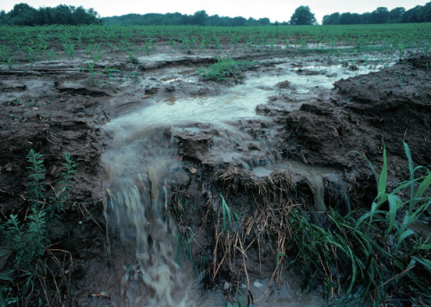

Agricultural runoff in Iowa, 1999. Photograph by Lyn Betts. Image via Wikimedia Commons

Interview | Stowe

“We have just become the sacrifice state—the pollutants sinkhole, if you will—in which these industrial models that generate lots of waste and lots of agro toxins are 

allowed to continue unfettered.”

 

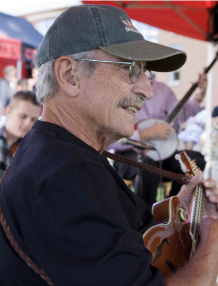

Photo courtesy of Sandy Moffett

Why Drive to Central Nebraska 

During A Winter Weather Warning?*

by Sandy Moffett

Why else drive twohundredseventyfive miles on gym-floor-flat I-80 through corn 

farms, wind farms, and “mixed precipitation”?

Why else find ourselves somewhere near Gibbon, Nebraska?

Why else the south plain of the great Platte River meandering like veins on hand-back, three bridges to cross, “a mile wide and an inch deep” so said Edgar Nye1? 

Why else this black mud-graveled road, slurping into a sunset creeping under clouds on this rain-all-day March nineteenth?

Ah, yes! The cranes. The cranes. The cranes. 

Cranes. Cranes. Cranes. Cranes. Cranes. 

The sight. Bird strings in the vermillion. Sloppy S’s, L’s, and, V’s. Sketched cross crumbling clouds by the pen of a shaky old god. Lines, squiggles, and a period, dot: a single bird here; and there. Did I say halfmillion altogether?

Wings cup. Big silver birds drop toward knee-deep (for cranes) brown water, change their minds, circle up, then cup again, drop again, land with splashy walk, stop and stand ‘till dawn and flight to corn left in fields by careless combines. Or northeast Siberia to copulate and make more cranes.

The sound. Wing sound. A windstorm? A knockdown fastball much too close? A plane? Superman?

The voices. Ebullient vocabulary of wildness. Conversation? Orders to the ranks? Shrieks for the joy of shrieking.

 RTP2 in his Birds of Eastern and Central North America says “VOICE: A shrill, rolling garooo-a-a-a; repeated and bugled in flight.”

That’s not quite right. But I can’t do better. You’ll have to hear it for yourself. 

Sandy Moffett, Emeritus Professor of Theatre at Grinnell College, joined the faculty in 1971 and continues to teach and direct plays on campus on occasion. Currently he spends most of his time restoring prairie, writing songs and stories, performing with The Too Many String Band, and catering to the whims of his 

grandchildren. His writing has appeared in The [Wapsipinicon Almanac](http://www.wapsialmanac.com), [Salt Water Sportsman](https://www.saltwatersportsman.com), [Rootstalk](https://rootstalk.grinnell.edu), and other publications.

*References listed in Endnotes

Why Drive to Central Nebraska During a Winter Weather Warning? | Moffett

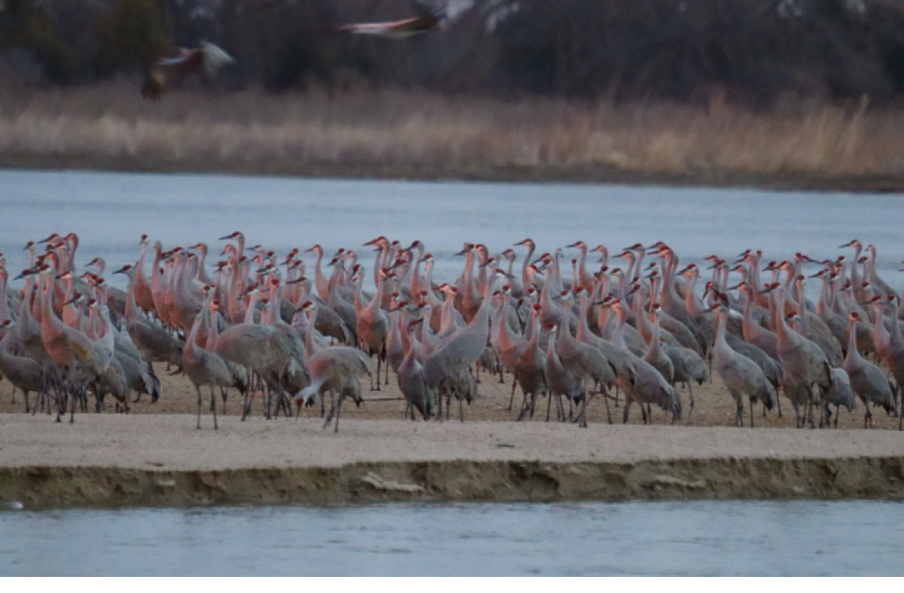

Photo courtesy of Sandy Moffett

Photo courtesy of Kandi White

Kandi White ([Mandan, Hidatsa, Arikara](https://www.mhanation.com)) is a leading voice in the fight to bring visibility to the effects of climate change and environmental injustice on North America’s indigenous communities. Upon completion of her Master’s Degree in Environmental Management, White began working with the [Indigenous Environmental Network](https://www.ienearth.org), engaging with more than 30 tribal colleges to start community-based environmental programs, discuss issues of socio-ecologic injustice, and connect indigenous youth with green jobs. Now the IEN’s Lead Organizer on the Extreme Energy and Just Transition Campaign, she is creating awareness about the environmentally and socially devastating effects of hydraulic fracturing (fracking) on tribal lands, and on working towards a just transition away from fossil fuel. Her local work is complemented by international advocacy work, including participation in several United Nation Forums and testimony before the U.S. Congress on the climate issue and its links to health, identity, and well-being on tribal lands.

Violence Against the Earth

Is Violence Against Women

by Kandi White

I would like to share a story with you and will begin by telling you that I’m a Mandan, Hidatsa, Arikara woman who grew up in the small rural community of New Town on what is known today as the [Fort Berthold Indian Reservation](https://en.wikipedia.org/wiki/Fort_Berthold_Indian_Reservation) in North Dakota. My Hidatsa name is Eagle Woman; my English name is Kandi (Mossett) White. I work with a non-profit organization known as the Indigenous Environmental Network (IEN). Working with IEN for over the last decade of my life has broadened my horizons as far as my work in environmental justice goes, teaching me that I am definitely not alone in experiencing how the perpetration of violence against the earth through fossil fuel extraction leads to the perpetration of violence against women in extraction zone communities. 

Since the inception of our network, we’ve observed time and again that grassroots movement leaders who have emerged and continue to emerge are predominantly women. Perhaps that’s because colonization took the “warrior status” away from our men, or perhaps it goes deeper—having to do with the status of women as keepers of the water and carriers of the next generations. I believe it’s a combination of both and more. 

Over the years, people have wanted to label me as an environmentalist, an activist, a tree-hugger, etc. However, I feel it’s important for people to know that I don’t consider myself to be any of those things. I’m simply a mom who grew up on a reservation in North Dakota, the circumstances of my life leading me to where I am today.

In order to truly understand my story, I have to back up a little bit to a time when life, for me, seemed more carefree and less worrisome. As a small child I was blessed with the freedom that comes from growing up in a rural community. I could play outside whenever I wanted, which was all of the time. I swam in [Lake Sakakawea](https://www.parkrec.nd.gov/lake-sakakawea-state-park) (a reservoir of the Missouri River) from sunup to sundown in the summers at my grandparents’ house. I climbed hills and explored the badlands. We had no video games or cell phones, so adults always told us to go outside and play. We often went with our grandma to pick chokecherries and made the most delicious chokecherry jams and syrups I’ve ever had. We canned them for the winter months and made other things, too, like the homemade apple turnovers that I loved so much! 

My grandpa often took us out on the four-wheeler to load up on veggies from the garden and to check on one thing or another on the land. We went fishing on the lake from his pontoon boat, traveling from Mossett Bay (aka Charging Eagle Bay) over to McKenzie Bay for ice cream in the summer. We went ice fishing on the lake in the winter. It was all so perfect and idyllic for me.

I thought North Dakota was the best place in the world, because it was my beloved home and all I ever knew. It was not overdeveloped and people really did seem to care for each other. My eyes did not see the coal-fired power plants that dominate our state or the uranium mining or underground missile silos. I didn’t know North Dakota was and still is home to the nation’s only commercial-scale coal gasification plant, which can strip paint off cars parked in the wrong area under certain conditions. I didn’t realize all of this activity was polluting the lake that I loved so much and swam in every day. However, I did know that cancer and asthma, diabetes and heart disease were all normal in my world. 

So, I was not completely surprised when, as a 20-year-old student at the [University of North Dakota](https://und.edu), I was diagnosed with a form of cancer known as a stage-4 sarcoma tumor. This is an extremely rapidly spreading cancer that’s usually attached to muscle or bone. What made it rare in my case was that it wasn’t attached to my muscle or bone; it was right there in the subcutaneous tissue of the left side of my stomach, where I could see it and feel it and watch it spreading. I remember the morning I woke up and noticed that the pea-sized lump I discovered on my tummy just a few days before had grown and was now changing color. Because of the fact that so many people on the reservation had already dealt with cancer in the past, I knew that this was not good and that I had to get to the doctor. 

By the time I could get into the [Indian Health Service](https://www.ihs.gov) (IHS) clinic for an emergency appointment the following week, my lump had gone from pea-sized to nickel-sized and was changing from red to dark purple to blue. I remember feeling scared because I was pretty certain that it was cancer, and I remember feeling completely taken aback when the doctor asked if I had somehow just bumped into a high-backed chair and bruised myself. He told me it looked like a bruise, and he thought I just had calcium build up from an old scar that was there. As a result, he would not give me a referral to see a specialist. Without the referral, there was nothing I could do because I had no other form of healthcare and no money. My doctor told me to come back in 30 days and sent me home. 

Within less than one week I was back at the IHS clinic talking to the same doctor. The lump on my stomach had grown from nickel-sized to over the size of an unshelled walnut, and the color had spread as well. The doctor took one look, signed my referral papers, and I was on my way to Altru clinic in Grand Forks, ND to have tumor removal surgery. The tumor had to be sent to Mayo Clinic in Minnesota, and my family and I waited over two weeks before we found out for sure that it was malignant. In total I had 5 surgeries to deal with my cancer, and in the end, I refused localized chemotherapy or radiation because I had heard the horror stories of women whose good cells were so damaged by the chemo that they could not safely have children. 

After I survived that experience, my life changed. I became aware of just how high the cancer rates were in North Dakota, and I wanted to learn more. As I began my research on cancer, I began noticing clear patterns of health issues in low-income, minority and low-population communities. There was no question that these communities had disproportionate rates of cancers, asthmas, diabetes, heart attacks and miscarriages. There was also no question that most of these communities were near major pollution sources, including coal-fired power plants, coal, oil, gas and uranium extraction sites, and nuclear power plant sites. 

In the year 2000, my mother-in-law started a local grassroots group with other women at home called the Environmental Awareness Committee of Fort Berthold. The committee has gone through many name changes over the years, but the work has remained the same: protecting our people and communities from harms caused by fossil fuel. We started out fighting against the installation of a tar sands oil refinery on our reservation. We’ve continued fighting against the proposed refinery ever since and have thus-far succeeded at stopping it. 

After my brush with cancer, I felt fortunate that I could finish my undergraduate degree in Natural Resource and Park Management in 2001. I went on to work in state and national parks, including [Big Bend National Park](https://www.nps.gov/bibe/index.htm) in Texas and [Fort Abraham Lincoln State Park](https://www.parkrec.nd.gov/fort-abraham-lincoln-state-park) in North Dakota. During this time, I came to understand that our country sets aside pieces of land for resource management and destroys the rest for development or extraction. I didn’t know exactly what to do with this realization, so I returned to the University of North Dakota to work on my Masters Degree in Environmental Management and successfully completed the Earth Systems Science and Policy Program in December of 2006. It was then that I learned about the Indigenous Environmental Network and decided I wanted to join them. I applied and was fortunate enough to be chosen out of 14 candidates to become the newest member of the IEN team in February of 2007.

Around this time, fracking swept down upon us at Fort Berthold, and it was like a bomb went off. While our Tribal Council, made up of all men, made decisions for us that were not in the best interest of the environment, future generations, or any of us alive today breathing the air and drinking the water, we women stepped up again and began taking matters into our own hands. We decided to dig a little deeper and found out that toxins, many of them carcinogenic, were put into our water and into our air as a result of the fracking, so we looked for the regulations and found a lack thereof. We decided that being poisoned—with or without our knowledge or free, prior and informed consent—was not acceptable here or anywhere, and we pushed back against the fracking industry. We remain embroiled in that battle even today, with some of us fighting for regulations and others of us fighting to ban fracking altogether.

We’re not just pushing to stop fossil fuel projects or uranium mining projects; we’re also working toward that next step beyond—something called a “Just Transition.” In recent years, that term has become a buzzword, and we like that it has. It means communities are actively seeking to improve and change the current system of fossil fuel destruction and abuse. You see, women have a deep and abiding tie to the land, called blood memory. It’s this blood memory that ties all women to our Mother Earth and gives us the instinct to care for our families and communities just as our Mother Earth cares for and provides for all living beings through clean water to drink, clean air to breath and clean soil in which to grow our food, none of which we can survive or thrive without. 

It’s because of this blood memory that we can’t stand our earth being ripped apart, blown up, dug up and desecrated by the extraction of fossil fuels. It has often been said that the rape of Mother Earth is the rape of women, and this is where I return to my story’s frame: violence perpetrated against the earth through fossil fuel extraction leads to violence perpetrated against women. When fracking came to our little communities in rural North Dakota, we fully understood what that meant, as the violence against women in our communities increased exponentially. Although data is lacking on the reservation itself, counties in North Dakota near oil extraction sites saw an 18.5 percent increase in violent crime between 2006 and 2012. As man-camps ruled the prairies, women and children became the victims of men working grueling hours in the oil fields with little to do in their down time besides haunt the small town bars and engage in predatory behavior—against women particularly, but also against children and men. Fort Berthold became ground zero for sex trafficking, and the numbers continue to go egregiously underreported throughout the state.

This has often been referred to as the dark side of the oil boom, which I never understood, as I have never seen a bright side to the oil boom. Money is certainly not a bright side, as it has caused jealousy, greed and heartache for both those that have it and those that don’t.

Through the [U.S. Energy Information Administration](https://www.eia.gov), I found out that North Dakota’s total energy production is six times greater than its energy consumption—meaning that others get the energy while we get the sickness and pollution. In 2016, North Dakota was the second largest crude oil producing state due to fracking. In 2017, two-thirds of North Dakota’s net electricity generation still came from coal, which is ironic considering that North Dakota has abundant wind resources, ranking ninth in the nation for utility-scale generation. 

I also found out through the [North Dakota Department of Health](https://www.ndhealth.gov) that all of North Dakota’s rivers, lakes and streams—over 11,000 miles of them—are contaminated with mercury due to years of coal extraction. Women in particular are told not to consume too much fish during pregnancy, because of the dangers posed by mercury exposure to the unborn child. These dangers do not even take into account the exposures we face as a result of the oil drilling and the subsequent flaring of natural gas in the Bakken. More and more fish are pulled out of Lake Sakakawea with deformities. Blue green algae blooms, which used to cause fish die-offs only rarely, are now becoming the norm. However, they continue to go underreported and get covered up. Growing up, I loved eating walleye taken fresh from the lake, battered and fried up right there near the shores. I wonder now if that and other facets of my day-to-day life in North Dakota led to my recent heartbreaking miscarriage, or to my sisters’ miscarriages, or to all of my cousins’ miscarriages. We just live with the fact that we may never truly know or be able to prove a connection. 

This is why the movement at Standing Rock—[protesting](https://en.wikipedia.org/wiki/Dakota_Access_Pipeline_protests) the extension of the Dakota Access Pipeline across tribal lands—was so beautiful and so necessary. We have seen that it’s difficult and sometimes dangerous work to fight back against the greed of the multi-billion-dollar fossil fuel industry to protect our families and our water. We see that we need to educate people on a different and better way to live upon the earth. Even though there’s backlash due to corporate and industrial propaganda, the work we do is necessary, and it must not end until justice has been realized for everyone, including those of us that have dealt with environmental injustice our whole lives. 

As women leaders, we’re determined to protect our families and communities, and we are ramping up our efforts to expose the false solutions to the climate crisis currently being pushed upon our societies at an international level. These false solutions are based upon global carbon market trading schemes, which allow polluters to continue to pollute at the local level, instead of solving the root cause of the problem and leaving fossil fuels in the ground. Just this past September, leaders from around the world met in spaces such as the [Global Climate Action Summit](https://www.globalclimateactionsummit.org) to determine the best way to continue to make money, while simultaneously pacifying a growing population of people educated on the climate crisis. 

Yet here we are today: working as Native women in our communities trying to find a way forward and striving for that bright side that we can see there just off in the distance as our way out. We see that we have our culture with us, and we have our traditional teachings to guide us and to wipe our tears as we fight back once again. Our vision for a Just Transition includes such things as large-scale community gardens (for we know that we cannot be truly sovereign unless we can feed ourselves); small-scale distributed power, in the form of the gifts we receive from the sun and the wind; and the creation of jobs for our men that will make them whole again as providers for their families, but that will not negatively impact their health and ours. 

As women, as educators, as nurturers and as keepers of the water, we will not quit, we cannot quit, until we succeed in changing the current course of our future on this planet. Our blood memory continues to drive us to protect our future generations by fighting for the protection of the very source that gives the breath of life to all living beings: our one and only Mother Earth. 

Violence Against the Earth Is Violence Against Women | White

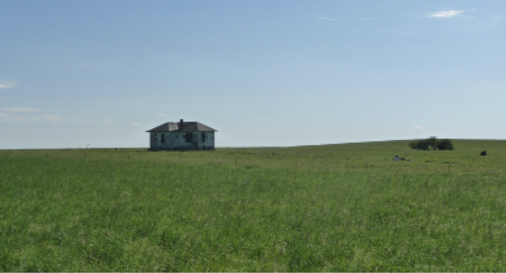

Photograph by Sebastian Braun

Around this time, fracking swept down upon us at Fort Berthold, and it was like a bomb went off.

Violence Against the Earth Is Violence Against Women | White

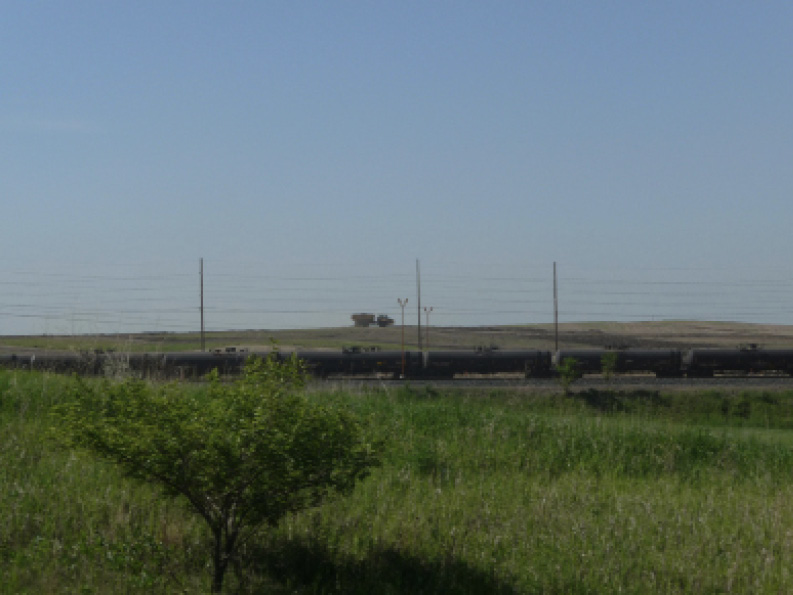

Photograph by Sebastian Braun

...[A]ll of North Dakota’s rivers, lakes and streams—11,000 miles of them—are contaminated with mercury due to years of coal extraction.

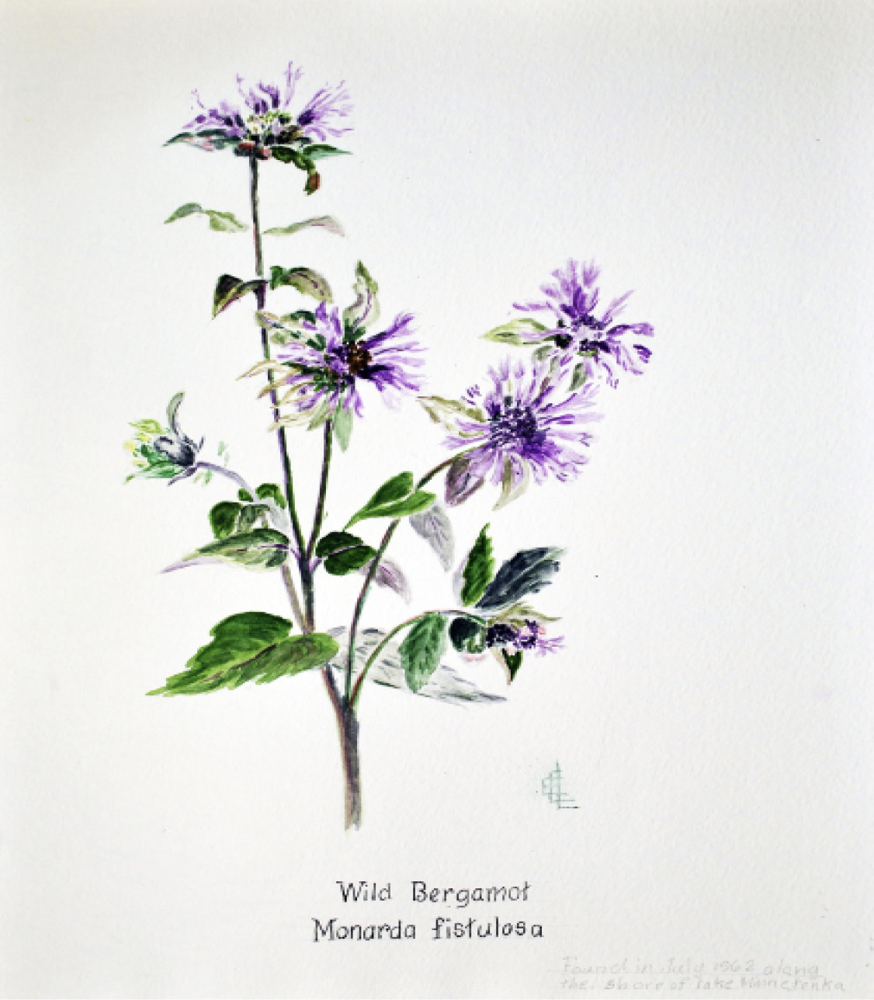

A member of the mint family, wild bergamot (Monarda fistulosa) is also commonly known as bee balm. Like most mints, its habit is to spread out into dense beds wherever it takes root. It is a showy, fragrant plant, a favorite of pollinators, and its leaves (either fresh or dried) can be steeped as a tea that (as tradition has it) helps relieve nausea, upset stomach and gas.

Watercolor | Krueger Curtis

Photo courtesy of Rachel Snodgrass

Rachel Snodgrass is a second year student at Grinnell College studying biology and environmental studies. She grew up in Clive, Iowa, and enjoys working in the Grinnell College Garden and advocating for on-campus sustainability through her work with the student government. She has learned about prairie reconstruction firsthand through her experiences doing internships in land stewardship with [The Nature Conservancy of Iowa](https://www.nature.org/en-us/about-us/where-we-work/united-states/iowa/) and the [Polk County Conservation Board](https://www.polkcountyiowa.gov/conservation), as well as in biology classes at Grinnell. She plans on working in ecology or conservation after she finishes her undergraduate degree. 

The Tools of Prairie 

Reconstruction

by Rachel Snodgrass

We reconstruct or “restore” prairies to learn about the ecosystems that built our soils, to control erosion, and to support native insects and pollinators. But how are prairies reconstructed?

First, a note on semantics:

We often refer to the process of planting native prairie species on land that has been used previously for crops or grazing as prairie restoration. Instead, I will refer to this process as prairie reconstruction. This is in order to emphasize the magnitude of what we lost when we lost our native prairies. We cannot restore, or bring them back exactly as they were because they were created over hundreds of thousands of years by glaciations, deposition of nutrients, and thousands of years of growth and interactions among prairie species. There is no way for us to reproduce the quality of native prairie remnants in our reconstructions within a short timescale. Additionally, we don’t usually have records of which species were present on the land before European colonization, since settlers usually viewed the prairie as emptiness waiting to be planted with crops rather than as a noteworthy ecosystem. This means that we lack a historical “baseline” to which we could restore prairies.

The infographic on the following page was made by combining and modifying images from me, from Jon Andelson, and from Wikimedia Commons users including cassi saari, Bene16, Appaloosa, Dvortygirl, USFWSmidwest, and various uncredited images uploaded by U.S. government employees. 

 

Infographic | Snodgrass

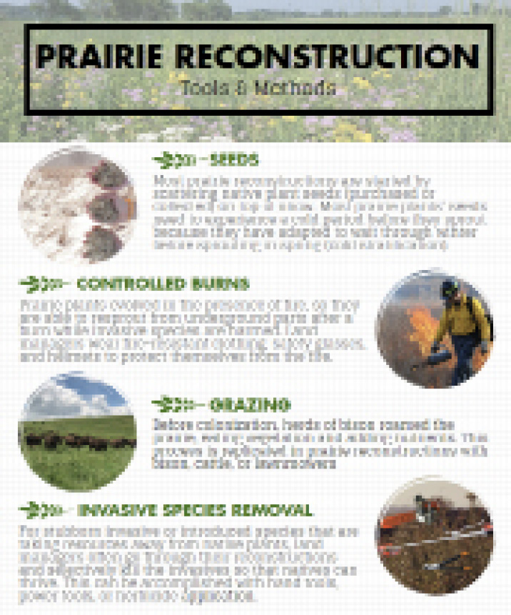

How can you get involved in prairie reconstruction?

* Call your local county conservation board, DNR office, or wildlife preservation areas. Many hold volunteer days to collect seeds or remove invasive species as part of community outreach efforts.
* Plant native prairie species in your yard at home! Though its benefits are not on the same scale as prairie reconstructions, planting native species still helps out pollinators and established natives require no water or fertilizer. For more information on planting native prairie species, visit ISU Extension.

 

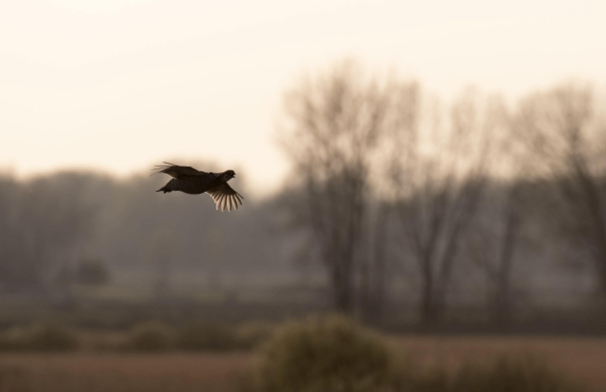

The Greater  
Prairie Chicken

The Greater Prairie Chicken | Leventhal

photos by Bruce Leventhal

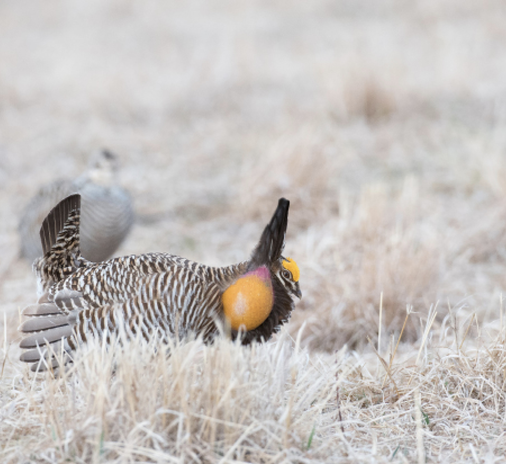

The Greater Prairie Chicken | Leventhal & Cohen 

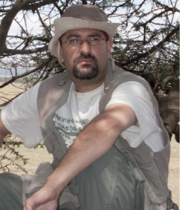

 Bruce Leventhal researched rare species of subarctic and arctic pelagic birds from 1986-1989 as a field/marine ecologist on Alaska’s Pribilof Islands. After earning his BS in Biology-Ecology-Evolution and Behavior in 1989, he worked for [Scripps Institution of Oceanography](https://scripps.ucsd.edu) as a ship’s ornithologist during a multi-week oceanographic study. In 1990, he completed a program in Science Education at the [University of Minnesota Twin-Cities](https://twin-cities.umn.edu) campus and began teaching biology at Forest Lake Senior High School in 1992. In 2000 he enrolled in the University of Minnesota for a Masters in Biology, working in the University’s Monarch Lab from 2003-2007. 

 Leventhal’s passion for biology informs his work as a nature photographer. “My goal is to inspire you to think about the amazing characteristics inherent in all living organisms.” To see more of his work, visit his [web gallery](http://btleventhal.com).

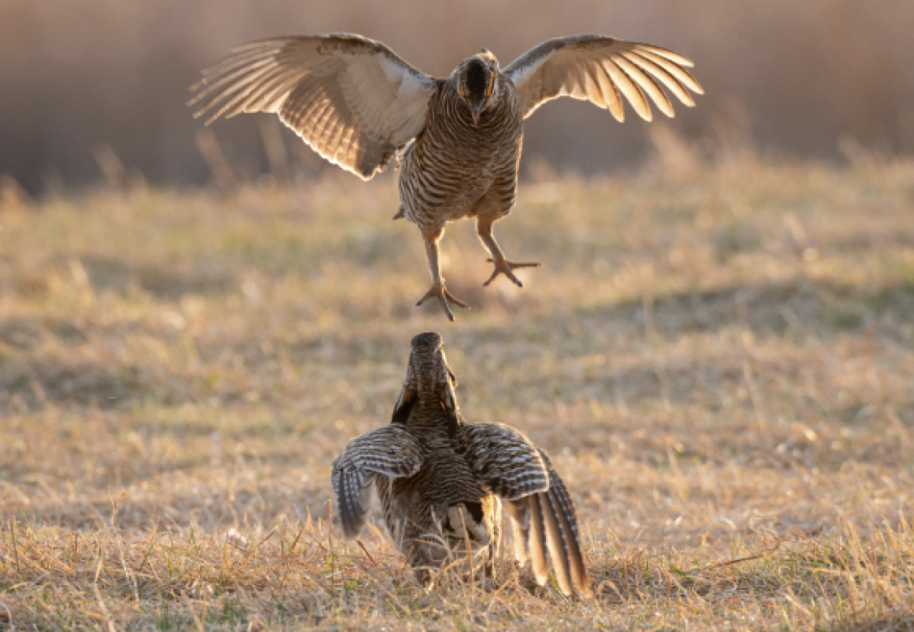

Once widespread in oak savanna and tall grass prairie habitats in the Midwest, the greater prairie chicken has become rare due to the destruction of these habitats in favor of agriculture. 

 Wildlife conservationists are working to ensure that remaining populations are protected, sustained and rehabilitated. One creative approach to conservation, which has the virtue of raising both awareness and funds, is holding Prairie Chicken Festivals. In the words of promotional materials for the Nebraska Prairie Chicken Festival—one of many such festivals taking place across the prairie region—the aim is “to celebrate [prairie chickens], the grasslands they inhabit and the culture that surrounds them.” 

 The Festivals all take place in the spring so that visitors can view the prairie chickens’ famous mating ritual, called “booming.” The breeding season usually lasts from late March through April. During this time the males establish booming sites where they remain for almost two months to display for the females. 

Greater prairie chickens do not migrate. They are territorial birds and often defend their booming grounds, as seen in Bruce Leventhal’s striking photographs. Their displays consist of inflating air sacs located on the sides of their neck and snapping their tails. After mating has taken place, the females move about one mile from the booming grounds to build their nests.

Despite the many challenges these birds face, their beauty and grace attracts everyone from environmental tourists to local families and adventure seekers. Leventhal’s photographs capture the haunting majesty and perseverance that these birds represent; they capture hope and an eerie promise that—as the sun continues to rise and set—the prairie chickens will continue their own strange ritual display.

  —Ilana Cohen

The Greater Prairie Chicken | Leventhal & Cohen 

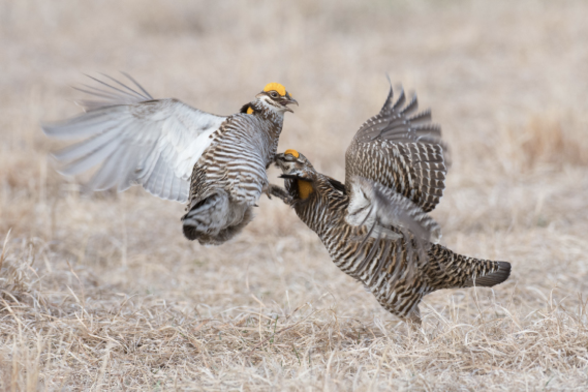

Photo courtesy of Harriet Behar

[Harriet Behar](https://www.ams.usda.gov/rules-regulations/organic/nosb/current-members/harriet-behar) has worked extensively in the organic industry for over 35 years. Since 1989, she has owned and operated Sweet Springs Farm in Wisconsin with her husband, Aaron Brin, growing certified organic vegetables as well as culinary and medicinal herbs. They also raise chickens for eggs and meat, and manage a number of honeybee hives. They have planted over 30 acres of prairie and native plants on their farm for their own enjoyment and to provide diverse pollen and nectar sources for the bees as well as for the benefit of other species of wildlife.

Establishing Native Prairie Plantings Without Using Herbicides

by Harriet Behar

With growing interest in providing habitat for pollinators and a concern over the loss of native plants in our landscape, many landowners want to transform fallow or savannah land from non-native or single species grasslands to diverse native grasses and flowering plants—ultimately restoring native prairies. Because native prairie grasses and flowering forb plants have very small seeds, the planting area needs to be bare to ensure good seed-to-soil contact. Most prairie planting recommendations encourage the use of herbicide in preparing this seed bed.

As organic farmers, my husband and I did not want to either handle or hire someone to apply these prohibited substances, so we tried a different way. Eight years after we planted our one-acre, we can say that we created a successful prairie planting without any herbicide use. Three and a half years ago, we planted 22 acres of [CRP](https://www.fsa.usda.gov/programs-and-services/conservation-programs/conservation-reserve-program/) land with a grass/flowering plant prairie mix, without broad herbicide use, and things are going well there, too.

Prairies can successfully be established in a variety of areas that receive full sunlight, either on flat or sloping land, and on any type of soil. Farmers may want to plant a flowering field border to provide habitat for beneficial insects in the buffer zone between their own organic fields and the neighboring conventional fields, gaining benefit from land where they cannot grow organic commercial crops. The [Natural Resources Conservation Service](https://www.nrcs.usda.gov/wps/portal/nrcs/site/national/home) has a variety of cost share opportunities— such as the Environmental Quality Incentives Program ([EQIP](https://www.nrcs.usda.gov/wps/portal/nrcs/main/national/programs/financial/eqip)) and the Conservation Stewardship Program ([CSP](https://www.nrcs.usda.gov/wps/portal/nrcs/main/national/programs/financial/csp))—to aid farmers with these plantings.

The first step is to assess the area where you plan to plant your prairie and your capabilities to prepare and plant it. If the existing plant community is acceptable, but you wish to improve the diversity of plants and add specific flowering plants such as milkweed for monarch butterflies or fall asters to provide late-season forage for honeybees, then “frost interseeding” can work. Broadcast seed in very late fall before snow, during the winter if the ground is not snow covered, or in the very early spring when just a small amount of snow is on the ground and melting quickly. This should be done on ground that was burned or mowed short in the fall, or raked in areas to expose soil so those seeds can touch moist soil.

Consider this interseeding technique especially in areas where tractors cannot be used and on small patches of ground. This frost seeding will allow much of the current vegetative cover to remain, but some mowing in the early years in mid-summer and controlled burning every five to seven years will eventually favor your native plantings.

Learn your soil type, as certain grasses and flowering plants will do better in dry, wet, clay, sand or silt soils. It is more ecologically beneficial and helps you achieve more success with your planting when you use a great diversity of seed. Depending on the seasons, each year different plants will flower, and the diversity will give you a better chance of having a strong stand of preferred plant communities. Native seed is expensive, so planning for success is important.

For larger tracts of land where undesirable plant communities are present, and on which you can use a tractor, use cover crops, tillage and mowing—that’s what we used on our land. You will need to either broadcast the seeds and pack them down or use a drop seeder drill, such as a [Brillion](http://landoll.com/home/products/farm-equipment/brillion-farm-equipment/agricultural-seeders/) with a roller, to get good seed-to-soil contact.

If you have persistent weeds such as perennial (Canadian) thistle, you may need a few years to deal with them before you can plant your native plants. One method for controlling thistle that I have found effective in fields (not untilled pastures), is to plant sorghum sudan grass in the spring into tilled soil and continually mow it, up to three or four times in the season when it gets to about two feet tall. You don’t want the sudan to get too tall, or else it will smother itself when you mow it. You can harvest it for forage, or just leave it in the field, depending on how much thistle there is. Using this method, the thistle grows with the sudan, and fights for light in the thick and fast-growing stand. Each time you mow, the thistle has to start all over again, and since it is somewhat smothered by the sudan, it is using up and weakening its roots rather than gaining nutrients from the soil or sun. By cutting it numerous times, you continually weaken the root. After one season, I have seen a 75 percent drop in the thistle present; after two years of doing this, we were able to get rid of just about all of the thistle. You could also just mow each time the thistle starts to flower the first year and do the sudan grass treatment the second year, to save you two years of tillage. If you only have a few thistles, you can dig up the roots. Continual tillage only cuts up the roots and makes more plants, not less.

Using tillage 

In a situation where most of the vegetation can be set back with tillage, unlike thistle, you can get your field ready for planting using the following method: mow in midsummer, which prevents the current crop of plants from dropping seed and knocks back any small shrubs. Then field cultivate, disc or use whatever tillage you want to prepare a seed bed and plant winter rye. This is between mid-August and mid-September for southern Wisconsin; you should adjust this timing for your region. Field cultivating works especially well for controlling quack grass, if you remember to let those quack grass roots dry out in the sun. The following spring, till in the rye when it is less than a foot tall. This will be sometime in May—earlier if an early spring, later if a late spring. Then plant a thick stand of oats. Let this grow until late June and then till it in. Drill soybeans in early to mid-July—yes, I said soybeans. Drill them thick and they will come up very quickly in the warm soil (hopefully, you will have enough moisture), and will canopy over the tight rows. We had very little growth of grasses or broadleaves under our soybeans. We have done this numerous times for fall vegetable production and have had success in controlling weeds with the use of July-planted soybeans. If we are following with vegetables, we would mow off the beans and till in August. For the native prairie, we let the soybeans go until the end of September and mowed them then. The thick canopy provided excellent weed control for us and left us with a firm seed bed, mostly free of weeds. We did not do any further tillage after the soybeans before we planted the prairie. We then planted our prairie seed using a broadcast seeder and went over the field with a [cultipacker](https://en.wikipedia.org/wiki/Cultipacker) in late October. It snowed the following week—perfect timing. 

The first year, we mowed twice, when the plants were about 14-18 inches tall. The second year, we hand-pulled some problem weeds in our one acre. We did a prescribed burn, with a good firebreak around the acre, and good planning to prevent the fire from going beyond borders. A rule of thumb is that spring burns favor native grasses and fall burns favor native flowering plants, or forbs. Since we are managing our prairie for our own honeybees, native pollinators and butterflies, we favor the flowering forbs. Our prairie has a diverse stand of native grasses, too, which hold soil and are very beautiful as well.

Professionals typically recommend the use of herbicides to achieve the weed-free, firm seedbed that is required to plant your native seeds. Any method that lessens the weed seed bank, lessens the number of weeds growing in the top inch or two of soil, and does not disturb the soil to bring up new weed seeds, could be used to successfully plant native grassland species. Experiment with various techniques on small areas to familiarize yourself with the timing of seeding and mowing for your soil type and climate, and then move to larger acreages. You will be rewarded for your work and stewardship with the environmental stability a permanent sod cover provides: diverse wildlife habitat and the blissful beauty of a prairie with different blooming plants throughout the growing season.

Establishing Native Prairie Plantings Without Using Herbicides | Behar

After one season, I have seen a 75 percent drop in the thistle present; after two years of doing this, we were able to get rid of just about all of the thistle. 

.jpg)

Grinnell College students analyzing soil chemstry at the Conard Environmental Research Area (CERA). Photograph by Jun Taek Lee

Finding the Midwest | Brew

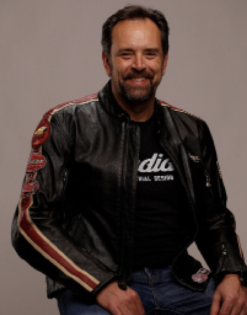

Author photo

Photo courtesy of Greg Brew

Greg Brew is Vice President of Industrial Design and User Interface/User Experience for Polaris Industries of Minnesota. A car industry veteran, he joined Polaris in 2004, building a multi-national group with four studios in the USA and Europe. Prior to Polaris, Brew held positions with BMW/Designworks, BMW AG, Rolls-Royce and Fiat Auto SpA./Lancia SpA. Brew taught at Art Center College of Design—Europe, in Vevey, Switzerland, as well as at Art Center College of Design, Pasadena, CA, his alma mater. He taught in Italy at the Scuola d’Arte Applicata and the Instituto d’Arte Applicata, both in Turin, and has lectured at many design schools throughout Europe. He is passionate about being with his family outdoors—doing everything from skiing to off-road racing, mountain biking to camping and boating. 

Finding the Midwest: 

A Journey in Six Parts

by Greg Brew

Seventeen years ago, working at my former employer, German automaker BMW AG, I was feeling like it was time for a change. I had spent the greater part of my professional career overseas in automotive design, and BMW had been very good to me. I’d had assignments in the UK for BMW subsidiary Rolls-Royce, and I had recently returned to the USA to gain experience running a studio in California. But returning to Germany at the end of this time to run the 3, 5 or 7-series studio didn’t feel like the step I wanted to take, and I started to look at what was going on outside automotive design. 

The New Job

One job was at Polaris Industries, which was a client of the BMW studio I ran in California. In my experience, they had been terrible to work with, spending a big chunk of money then failing to follow-up to find out if the design was feasible or cohesive. I consulted with my mentor, Imre Molnar from Art Center College in Pasadena, California, with whom I’d worked on and off following school. He told me: “Go for it! These people make all the things you’ve been riding your whole life.” He was right; I’d been a gearhead since birth, and motorcycles, off-road vehicles and such have been my thing most of my life. But I told him: “These guys are terrible,” and explained my reasons why. His reply: “That’s why you need to go there—to fix them.”

To my surprise, the first visit and the interview were impressive. There were other companies I was looking at, too, but this place was pretty special: a young and smart executive staff and a very accomplished CEO, Tom Tiller, who came to Polaris straight from Chainsaw Jack Welch’s GE. They were building a strong base for the future, and they were doing it to win.

My wife probably wasn’t expecting me to come home and say what I did. I told her if Tom Tiller were to walk down the stairs at Polaris’s headquarters and announce to everybody “We’re going to build a space shuttle!” everyone would say “Hell, yeah!” and go get busy. I told her I wanted to be part of that energy and optimism. I’m sure a Polaris space shuttle would not have looked like a regular one, but dammit, they’d figure it out and do it. My old boss at BMW (and at Fiat SpA, where I’d worked before that) had said that, in the future, “Fiat would be mining rocks on the moon when BMW was in a museum.” In Polaris, I saw an example of a forward thinking company like Fiat, right in front of me.

I started to take Polaris seriously and decided it was where I wanted to go. Then I got the word that they had selected someone else. I was angry; I wrote the CEO a one page letter that used the F-word in it. I told him that job belonged to me.

The Second Interview

My champion on the inside, the VP of motorcycles, told me that the selected guy was waffling and maybe wasn’t going to come. His wife wanted to stay in Detroit, or something like that. I got a call from the recruiter and, with his support, I got back in front of the CEO. He was wearing sweats and a Wild Hockey hoodie with his cap turned backwards. My recruiter said if I could last 30 minutes with him, I’d be okay. 

When I walked in he had my letter on his desk and said “This is why I wanted to call you back.” We talked for over an hour and I left with the job. That was 15 years ago. And I’ve owned that job every day I’ve been here. 

The optimistic, powerful company I had imagined I’d be joining really did turn out to be just that. We didn’t build a space shuttle, but our CEO demanded more out of us than many thought possible, and we delivered on that and more, growing straight through the recession. We did things the big three (Ford, GM and Chrysler) couldn’t do, and things even the mighty Honda couldn’t do, beating them in the lucrative Side-by-Side Sport motor vehicle market. We beat companies many times our size as a matter of course, and over the years we became a Fortune 500 company valued at over $6.5 billion.

Riding, Roseau and the Culture of Polaris

First of all you have to realize that Roseau, Minnesota, in the far north of the state, is the heart of Polaris. Without Roseau, there would be no Polaris. Without the people there, we would not exist, nor could we be as good as we are.

Riding is a big part of Polaris culture. Back in the day, when I first arrived, it was a rite of passage. During your first trip to Roseau and the first snowmobile ride with the engineers up there, they would try to kill you just to see if you’d survive.

Everyone told me in advance how it would work: the engineers would instruct me to meet them at the “sled corral” out back, where I’d pick a sled out of a huge pile. I’d been told that they’d all be already suited up and on their machines, warmed up and ready to go. 

Custom dictated that I would wind up with the snowmobile (or “Buggy” as they say) with a bent ski, something I wouldn’t find out until after I’d filled its tank with gas (which would be necessary because the tank would be empty). By the time my machine was gassed up, they’d all be revving their sleds and circling around impatiently outside the guarded gate in the parking lot. As I joined them, there would be a brief exchange about where we were going, and then everyone would roar off at full-speed. Most of the time, I was told, leaving the plant meant riding alongside the highway in one direction or another, in the ditch. Every roadway that connected to the highway involved a huge jump on the snowmachine (another word for a “sled” up North), and the engineers knew where they all were. Intimidating.

For me, this rite of passage played out exactly as I had been told it would; in fact, the briefing I had been given proved to be almost bizarrely accurate. My year-old sled had a bent right ski; its gas tank was empty, and it took 10 pulls to start the engine because it was minus 22 degrees Fahrenheit, and they all took off at top speed. 

I expected all this, though, and I had a plan. I held on to the group and at the first pause, when we turned west, I asked the guy next to me if we could swap because I saw he had the new model for that year and I wanted to see how it rode. This was bullshit, of course, because I had never ridden a snowmachine before. I was just a guy that happened to be able to ride well right off the bat. At lunch the guy I switched with said, “This sled has a bent ski; it’s terrible, I can’t believe we gave it to you,” which was permission for me to keep his sled the rest of the day. This saved me for that ride. 

While Polaris has become a bit less hardcore as it’s grown, a surprising amount of that attitude is still in evidence. I have since learned that if you try and hang with the guys from our Swiss motorcycle engineering group on a fast ride in the Alps, you may have an experience similar to mine in Roseau.

The Studio and 

Designers

During the fifteen years I’ve been with Polaris, my group has gone from four people in one studio to 55 people in four studios, one of them in Europe. We handle design for over 20 of our 25 brands, and execute the design of all whole-goods (vehicles) for Polaris, with the exception of our new boat brands. Our group includes Digital Design, responsible for the UI/UX (user interface/user experience) of our gauges, Infotainment, App and Web. With fewer than half the designers working for our next biggest competitor, our department is twice as fast, helping Polaris be segment leaders in many markets due to our ability to innovate within our competitors’ development timeframes—often making a second or third-generation machine when others have just entered the market.

The secret, of course, is the people. When I arrived, the words that were being used to describe our ambitions were “world class,” as in “We want to be world class.” Having been with BMW for eight years, I knew what it took to get there: you might not think that BMW makes the best cars in the world, but the cars it makes are certainly “world class.” I knew that this level of excellence didn’t happen between nine and five, and that it took more-than-average people working long hours to get there. The thing that I worried about was: could I get people like that to come to Minnesota? Out in the middle of the prairie?

Vehicle Designers aren’t endemic to Minneapolis, or Minnesota, so achieving that goal meant importing people. The few people I inherited were really good, and I mean “world-class” when I say that, so the base was there. The first few staff additions were slow in coming, but I found a master-class clay modeler who had started the BMW clay modeling studio in California. He was hidden in a small town near Detroit, commuting to the city. I quickly grabbed him. Then came a talented Australian guy working in Italy, an up-and-coming young manager from our watercraft business, a couple killer CAID (Computer Aided Industrial Design) people 

from Detroit, and lots of interns who would eventually become designers. They all began to set the path. 

We became the desired internship for the two best design schools in the country, Art Center College of Design in Pasadena, California and College for Creative Studies in Detroit, and capitalized on that, starting eight of our twelve designers as interns. Four additional interns have taken other positions in Industrial Design. I had thought that we’d grow faster—the rest of the company doubled in size between 2009 and 2013—but we wanted the best, so it took time. 

When I bring people in for interviews, I admit that I like to try to get them here during the summer—preferably the August/September time frame. It’s warmer and dryer than during mid-summer, and so beautiful you can get just about anyone to fall in love with the Midwest. We go for a motorcycle ride around Lake Minnetonka, through downtown Minneapolis, over to Hudson, Wisconsin, and then up the St. Croix, all the way to our Wyoming Engineering center for a tour. That usually does it. 

While we’re there, I normally take them out for an off-road demo ride. Most of the time I like to go in a RZR as I’m familiar with them and can give a pretty good demo. That normally boosts the folks that really like to ride a bit closer to signing.

In my department it’s important to have good people on staff for more than the obvious reasons, and they’re not motivated solely by money. Powersports Design is a small world, and everybody knows where everybody else is. If you’ve been able to attract really well-known, quality people, then others will come because they’ll want to work with them. And this cycle will perpetuate as long as the flow continues and you keep them happy. This last August, I had the honor and pleasure of awarding two 20-year awards and one 15-year award in my group. Those original guys I mentioned above stayed with me, and between the core group of those roughly 12 people who’ve been there 12 years or more, we have done over 100 complete vehicle designs.

Today

When it snows we are all smiling (after all, we are still a snowmobile company in our hearts, and many people will always think of us that way). 

We are not flashy. Our CEO, whose compensation is public record, could afford something other than the six-year-old Audi sedan he drives every day. The parking lot at headquarters has lots of pickup trucks in it, so people can haul trailers with their toys in them. Our building is nice, but not particularly fancy. 

Every year we gain more technology, more electric vehicle companies, more large international acquisitions, but when you come to do business with us there’s a particular sensibility that comes out. You’ll know you’re in the Midwest, on the prairie.

Finding the Midwest | Brew

The secret, of course, is the people. When I arrived, the words that were being used to describe our ambitions were “world class,” as in “We want to be world class.”

The Polaris Rzr XP-1000. Photo courtesy of Polaris, Inc.

Two poems | Neems

Photo courtesy of Niki Neems

horizon mind

Blooms of freezing breath semi-precious hay-bale days roll ahead and chase from behind. Anything foot printing nowdays, I want. A countryside of mercy.

Talking softer than I did back then, like a low res tree line leaning into Sunday sky. First snow. Deep and muffled. Pressed and resting. Burrowed. Being

can be an effort, can be a response to distance, can be I’m not ashamed of lost luster, and confess nostalgia for this piece of place, this monocrop of stubbled pheasant cry. First glance, it’s opposite

of chaos. Second glance, its ways of letting go, widening in every direction. Cartography of endless, this: names are a walk through holes, a gaze looking to land the secret no one tells at the start. A circle story. Here

in the nook I keep, prairie holds down seeds buried for someone else. A new, stranger heart to wear out.

Two poems

by Niki Neems

Niki Neems received an M.F.A. in poetry from Vermont College. She lives in Iowa City, Iowa, where she owns the stationery shop, r.s.v.p. and instigates The Response Handwriting Project: the convergence of poetry, handwriting and epistolary correspondence. Her poems have appeared in The Iowa Review and jubilat.

What By Now Is Pretty Much Ritual

Or put it this way: to keep falling down, love the ocean, the potential of rhythm, the sway. I don’t need you, I don’t need you, I need only

the notion of you. Fill silence, I suppose, because it’s what we do,

adore what isn’t there.

Same name, same vessel, dilapidated and moored, yet variously lost. Reeds and grass reach for warmth, instead get wind. Gone isn’t we never existed, gone is both exist as we were before. And so

treasure moves from land to hand. Generosity ends, it always does, and thunder

roves. Inkling  
becomes want, becomes  
what we have,  
unnoticed,

like a sea story set on a prairie that used to be sea. Green furrow, widening to sky.

Photography | Kozloff

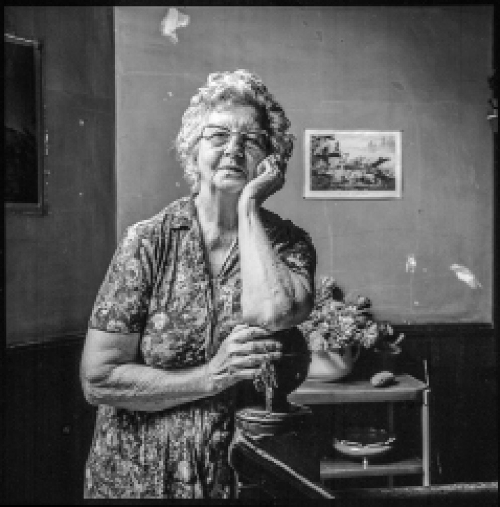

“Mrs. Cecile Schwab,” Photograph by Keith Kozloff, 1973

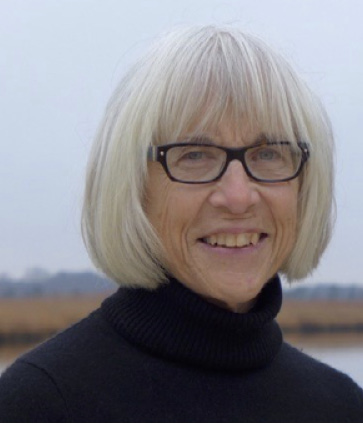

Photo courtesy of Deborah Brandt

Deborah Brandt is professor emerita of English at the [University of Wisconsin at Madison](https://www.wisc.edu). Her book, [Literacy in American Lives](https://www.amazon.com/Literacy-American-Lives-Deborah-Brandt/dp/0521003067), published in 2001 by [Cambridge University Press](https://www.cambridge.org), won multiple awards, including an outstanding book prize from the [Modern Language Association](https://www.mla.org) and the [Grawemeyer Award](http://grawemeyer.org) in Education. Most recently Brandt is author of [The Rise of Writing: Redefining Mass Literacy](https://www.cambridge.org/core/books/rise-of-writing/AE510DE2550C0BA0F61C22FC04034924) (Cambridge University Press, 2014). Brandt has been a recipient of fellowships from the [Guggenheim Foundation](https://www.gf.org), the [American Council of Learned Societies](https://www.acls.org), and the [National Endowment for the Humanities](https://www.neh.gov), among others.

Literacy and Opportunity in the Midwest

Daisy Morales Interviews 

Prof. Deborah Brandt

Since the middle of the 19th century, farm families in the Midwest have aspired to improve their situation through education. Our current school system, and frankly our society as a whole, is based on the premise that if you work hard enough you can achieve what you set your mind to. This belief may provide people with hope—it suggests individuals control their destiny—but embedded in the rhetoric is the subtext that failure to succeed must mean personal inadequacy. This message obscures the effects that socioeconomic factors can have on a person’s success despite that person’s hard work or ability. Socioeconomic effects are hard to measure because they vary with geographic location. In her 2001 book Literacy in American Lives, professor Deborah Brandt demonstrates some of the general dynamics of the relationship between opportunity, reward for literacy, and economies through a case study of two Midwestern farm women.

 

 Rootstalk: Can you tell me about the origins of Literacy in American Lives? How did you get interested in the topic which you write about in the book?

Brandt: For nearly 30 years I taught writing and courses about writing at the University of Wisconsin-Madison. I was always interested in the social conditions for literacy learning, particularly the ways in which the rising standards for literacy achievement affect everyday people and their families. By “rising standards” I mean the need for more and more people to do more and more things with literacy, an escalating demand that was so much of the story in 20th century America and continues into the 21st century. How do people cope with these unrelenting demands? 

 The only way I could think to find answers to these questions was to go out and talk with people. So, in the early 1990s, I did in-depth interviews with 100 people from all walks of life, born between 1895 and 1985, asking them to remember everything they could about how they learned to read and write, in and out of school, from their very earliest memories to the present. Many of the interviewees grew up in the Midwest, but others migrated from other regions in the U.S. and other countries. They were all living at the time of the interviews in Dane County, Wisconsin, where I lived and taught. So Literacy in American Lives is an analysis and interpretation of those astonishingly rich and detailed—and often surprising—interviews.

Rootstalk: Is literacy more than simply the ability to read?

Brandt: Literacy certainly can be seen as the ability to read and, I would add, to write. But there is nothing simple about it. First, you have to ask: the ability to read or write what? In what capacity? For what end? So, for instance, I might be able to read a recipe and follow the words but end up making a disaster of a meal. A master chef might read the same recipe and create something much better than even the recipe called for. The chef and I will see the same words, but they will mean different things to us. We will operate them differently. And all reading and writing works like that—the ability to read and write is not stable. It depends on context. It is always relational. And what counts as literacy or enough literacy is always changing. 

Rootstalk: What affects people’s ability to attain literacy?

Brandt: I would say anything and everything affects our ability to attain literacy—where we live, when we live, who we live with, how we are treated, how literacy is treated, what is expected of us, what learning opportunities are presented to us, how we respond to them, how things change or do not change around us. Literacy is knitted into the social and economic and political contexts in which we live, and it will be acquired (or will need to be reacquired) as both a reflection and a product of those contexts. 

Rootstalk: Why did you decide to begin your study by portraying the lives of two Midwestern farm women, Martha Day, born in 1903, and Barbara Hunt, born in 1971? 

Brandt: During the interviewing phase of the project, I was just trying to find volunteers who were willing to spend a couple of hours talking with me about their memories of reading and writing. So among other places, I went to local elder care facilities and to various schools, including the local community college. Martha Day, born 1903, lived in an assisted living facility and volunteered for the project. Barbara Hunt, born 1971, was attending the community college and volunteered for the project. As a coincidence, they both grew up on small, family owned dairy farms in the Midwest, one at the beginning and one close to the end of the twentieth century. 

Rootstalk: The two women were born 68 years apart. However, you found that there were some similarities in their backgrounds. What were they?

Brandt: I tried to make the point that these two women had some striking similarities in their backgrounds but that the meaning of those similarities really changed between the early 20th century and the late 20th century. Both were raised on 80-acre, low-income dairy farms that their fathers had inherited, Martha Day in northern Indiana and Barbara Hunt in southern Wisconsin. Both grew up in sparse, rural settlements of about 500 people, quite a distance from stores and schools. Neither had money nor family encouragement for schooling beyond the 12th grade, and both left home and went to work shortly after high school graduation. 

Rootstalk: Despite their common background, how did the effect of the farm economy on their literacy experiences differ?

Brandt: In the 1920s many children of farmers, including Martha Day, were moving to bigger cities because of employment opportunities. Interestingly, it was because of the general health of the agrarian economy at the beginning of the twentieth century that more farm families had surplus money to buy commercial goods, like appliances, magazines, and clothing. Banks also thrived in service to farmers. So service jobs could be found in the larger cities. As people migrated, though, they brought their hometown, homogeneous, close-knit social networks with them. “I never did have to hunt for jobs then,” Martha Day recalled. “Somebody from my area would just call up and say, we have a job, would you be interested?” Martha Day carried her religious affiliations with her, too, and started attending a Sunday School class for young adults, volunteering to write a newsletter for the group. Her interest in writing attracted the attention of her Sunday School teacher, who happened to be the editor of a regional farm magazine. He set her up with a typewriter and desk in her home and taught her how to write journalism. “He would say, ‘Imagine you are a farm woman.’ That I grew up on a farm helped me in some respects. It wouldn’t today,” she told me. Her social network launched her eventually into editorial positions in corporate offices as farm magazines were bought up and merged by media conglomerates. By the time she retired in 1968, the heyday of farm magazines was over. But for a time, as we can see, the social structure of the agrarian village still operated in Martha Day’s favor even as she made the transition into an urban economy. Her identity as a farm woman was exploitable by her sponsor (the farm journal), and she traded on that identity for a chance to write for a living. That give and take is a key feature of the literacy sponsor-literacy sponsored relationship.

 By the time of Barbara Hunt’s birth in 1971, there had been 50 more years of shrinkage in the family farm economy, bringing disintegration of the societies that supported it. Barbara Hunt’s hometown was struggling—isolated, poor, and weakly tied to the region around it, which had become a cosmopolitan, school-oriented, tech-heavy, knowledge-making service economy. The work she could find was not tied to agriculture. Initially hired as a home health aide, she was laid off when medical providers consolidated, and her agency moved out of the area. Instead, she went to work at the cash register of an Exxon gas station and did babysitting on the side while pursuing her studies part-time at the community college. Interestingly, the remnants of the long, rich agrarian cultural tradition still could be found, if attenuated, supporting Barbara Hunt’s literacy development. In eighth grade, she joined the forensics club in her school (“As soon as I heard about it, I knew I wanted to be in it,” she said.) Her forensics club was part of a statewide consortium of speech, debate, and theatre clubs that had been founded in 1895 by a school superintendent from the same district in which Hunt was a student. (In fact, it had been the first high-school forensics association established in the United States.) As a participant in competitions, Hunt wrote speeches on topics of her choice, involving issues that “didn’t affect me directly, but did affect other people,” including the problem of homelessness. The forensics club provided opportunities for Barbara Hunt to conduct research, express, write, and argue, an experience that helped her find resonance with an urban-oriented social service degree program in her community college. At the time we talked, she was training to be a technical assistant with interests in services for the displaced. So Barbara Hunt, to me, represents many of the young people of the late 20th and early 21st century who must pursue literacy in contexts of fragmentation, volatility, anonymity, and escalating demands for credentialed education.

Rootstalk: You write about “sponsors of literacy.” What does that mean, and why is it important? 

Brandt: Our literacy, as we know, has tremendous value in our lives and motivates our efforts to acquire it. It enables individual growth, learning, connection, knowledge, and social and economic security. Literacy is good in our lives and, often, the more, the better. But our literacy also has tremendous value for other people or interests who need our literacy to pursue their own ends. In the wider arena, the literacy of the people is considered a good, a raw material, a resource, a necessary ingredient in the making of products and services and profits. Our literacy helps those who use our literacy to make money or achieve power or spread their values. Those entities—the ones who need our literacy as much or more than we do—are sponsors of literacy. Think employers, governments, religions, social movements. Think Facebook. These entities will teach, encourage, support and stimulate literacy in various ways, but they do so in order to realize their own goals, which do not always necessarily converge with our goals. Sponsors of literacy will compete with each other for our skills and for our loyalty to their version of literacy. They also can gain advantage by destabilizing existing forms of literacy by, say, introducing new communication technologies or other changes. Then we have to hustle to respond to those changes. Sponsors enable literacy learning (we need them), but they introduce inequity and volatility into our efforts to pursue literacy or secure it for our children.

Rootstalk: In your book you mention that the need for more and more people to do more things with their literacy also has an effect on individual literacies. What is that effect?

Brandt: In the not so distant past most people worked with their muscles. Today, most people work with their minds. We have been transformed from a farming and manufacturing economy into a service economy or what some call a knowledge or information economy. In this transition, literacy became a dominant form of labor. Today, just about everyone writes on their jobs now, and it is not uncommon for people to spend three, four, five, eight or more hours a day in the posture of the writer—communicating, recording, analyzing, interpreting, and responding to others who are also writing. In many industries, written products are the only products. We are living at a time of tremendous pressure on our literacy skills as they are pulled more and more deeply into the engines of production and profit in our economy. This puts pressure on young people, as well, to achieve forms of advanced education and to adapt to rapid changes in the forms and levels of literate communication. The U.S. must compete with other nations in innovation, efficiency, speed, and productivity. These competitions are waged with the literacy of the population. So we can expect the “literacy crisis” to be a perpetual problem, not because people are not learning the way they used to but because so much more is being demanded and the repercussions for not keeping up are more punishing.

Rootstalk: Do you believe that Hunt or Day were aware of the impact the economy and sponsors of literacy had on their lives, or did they explain their lives in terms of their own strengths or weaknesses?

Brandt: Perhaps because of the influence of school, we are invited to think of literacy as an individual skill. Do I make the grade? Why is my child having trouble learning to read? That young generation just can’t spell! We have all experienced or heard things like this. So Martha Day, Barbara Hunt, and I, for that matter, are not immune to those messages. But to your question I have to answer that Martha Day and Barbara Hunt were aware of the impact of the economy and sponsors of literacy in their lives, or else I would not have found evidence of these impacts when I analyzed their testimonies and the testimonies of all the other people I interviewed. All I asked people to do was to try to remember the scenes of their literacy learning across time. I was just about flabbergasted at the number and variety of figures who turned up at these scenes as they were recalled: older relatives, teachers, religious leaders, supervisors, military officers. These many references could not be ignored. As I worked with them, I came to understand them as sponsors of literacy, to see how those sponsors proliferated across the generations, and to appreciate how they linked individual literacy efforts to larger material and historical systems. 

 

Rootstalk: Do you think it’s particularly important for individuals in declining economies, like the farm economy, to learn about literacy in the context of socioeconomic factors?

Brandt: As I mentioned, our society tends to hold simplistic notions of literacy; we are invited to think of reading and writing as neutral, timeless, and portable skills. So I think everyone can benefit from understanding that literacy is contextual and relational. When it comes to literacy learning, it is potentially advantageous to belong to a dominant economy, whether in periods of stability or change. We saw those advantages operating in the life of Martha Day. But for the young Barbara Hunt, those advantages were not available. If it took the society as a whole three or four generations to make the transition from agriculture to post-industrialism, Barbara Hunt, and millions of other young Americans from forgotten economies, have to make that transition in one fell swoop, in the span of their youth. This is where literacy disadvantage and economic disadvantage find their relationship. It is not fair, but for society to ignore that unfairness is a double injustice. So, to answer your question, wherever we are positioned—whether students, teachers, policymakers, concerned citizens, elected representatives or business leaders—it is important to learn about literacy in the context of socioeconomic factors. 

Rootstalk: It seems external factors like the economy strongly influence the way people become literate. Can becoming literate be more equitable or at least be less entangled with the economy?

Brandt: This is where the role of public education becomes so critical. Democratic institutions, including the public schools, exist partly to rebalance injustice—to make sure that any differences in health, inheritance, origin of birth, or other inequalities do not over-determine one’s life chances. Democratic institutions are supposed to serve this function by expanding the control that individuals have over the decisions that affect their lives and by making sure that our collective resources and civil rights are equally accessible by all members. Literacy is central to equality because it is central to our participation in the political process: our right to know, our right to petition, our right to be understood. Inequalities in access and reward for literacy are symptoms of a more general disenfranchisement and aggravate it. So, it is important to remember what schooling is really for, especially when economic interests have such a huge influence over educational policy and practice. Inclusion and equality need to be not only the means of education but also the outcome. From all angles—policy to pedagogy—literacy needs to be addressed in a civil rights context. Understanding and not simply accommodating economic and technological change is a vital responsibility of a democratic school. 

Rootstalk: Does individual initiative or intelligence still have a role to play in people’s literacy? 

Brandt: It is important to say that I am not trying to make the case that our literacy is determined by the contexts in which we live in any predictable or monolithic way. Martha Day’s experience a century back was not the only—or even the most typical—experience of the farm people of her generation. Among other Midwestern European Americans of her cohort that I interviewed, extreme physical isolation, poor schooling, instability in farm prices and the catastrophes of the Depression all made access to material and institutional supports for literacy difficult and sometimes impossible. For people bearing the burden of racial discrimination, the conditions were usually more difficult. But as Martha Day’s individual initiative and intelligence played a role in her literacy outcomes, they came from a mentality that others shared around her. Success and failure, especially in literacy, are always co-creations. Our economic condition will not determine our literacy. But it will matter in ways that we can analyze.

Literacy and Opportunity | Brandt

Literacy certainly can be seen as

the ability to read and...to write. 

But there is nothing simple about it.

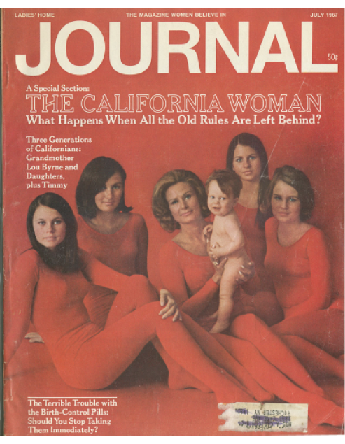

National magazines like The Ladies’ Home Journal eventually displaced women’s sections in regional

farm journals like the one Martha Day wrote for.

Literacy and Opportunity | Brandt

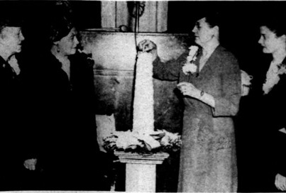

Mrs. Roy C. Weagly, president of the Associated Women of the American Farm Bureau Federation, lights a candle at the 1948 convention. Martha Day traveled regularly to conventions like these, held in Chicago and other large cities. 

So we can expect the “literacy crisis” to be a perpetual problem, not because people are not learning the way they used to but because so much more is being demanded and the repercussions for not keeping up are more punishing.

Literacy and Opportunity | Brandt

Rootstalk Associate Editor Daisy Morales is an English major at Grinnell College. She anticipates graduating in 2020.

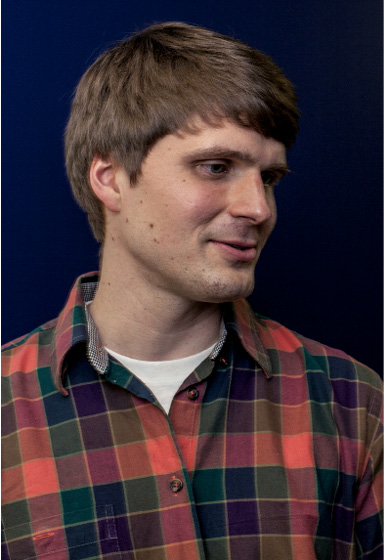

Photo courtesy of Bryan Boyce

Bryan Boyce grew up in Waseca, Minnesota, and graduated from Grinnell College before teaching high school English in Lesotho and the [Rosebud Lakota Reservation](https://en.wikipedia.org/wiki/Rosebud_Indian_Reservation) and serving as Assistant Director of [Breakthrough San Juan Capistrano](http://www.breakthroughsjc.org), which he led to nationally recognized student gains. As the Executive Director of Cow Tipping Press, he seeks to give others the opportunity to experience first-hand the richness of neurodiversity—an alternative to presuming deficit and pity—through the often inventive, radically self-representative writing of Cow Tipping authors.

"Sunflower, Sunflower"—A Neurodiverse Landscape

A interview with Bryan Boyce and the writers of Cow Tipping Press, by Sang Yoon Byun 

Bryan Boyce was a middle schooler when he spent a typical summer with his brother and his friends in a cabin in Minnesota. They would spend whole days swimming out in the lake, waging squirt gun wars against each other, and walking downtown to buy Little Debbie snacks. However, this time of childhood bliss was interrupted one day when a girl quietly pulled Boyce aside and conspiratorially whispered, “Hey, do you realize we are the only normal people here?”

As the sibling of a brother with developmental disabilities, Boyce knows firsthand the value and richness of exchange across neurological difference. He aspires to create a supportive community where people genuinely understand that developmental disabilities bring different kinds of value as well as various new perspectives in looking at our world. What would it take, he asks, to build a world where kids and families sought out and actively relished disability as a rich form of human difference that they can learn and gain from, like any other form of diversity? 

“True inclusion takes changing mindsets,” Boyce argues. He believes that most of our thinking is still firmly rooted in old ways of conceiving of disabilities. If we think of disabilities just as a deficit or something to be pitied, we will only see a small part of the bigger picture. He created Cow Tipping Press, a non-profit organization currently located in Minneapolis, to provide opportunities to relish assets rather than pity deficits through the unique lens of creative writing. By teaching inclusive writing classes for adults with developmental disabilities, Boyce believes they gain the “radical chance to speak for themselves in a medium usually used to speak about them.”

 Cow Tipping Press has created waves of meaningful impact for the disabled communities throughout Minnesota. The Press has recently expanded its creative writing program with the help of VSA Minnesota and Disability Minnesota. Faculty at several colleges, including Carleton, Macalester, St. Olaf, and the Universities of Minnesota, and of Massachusetts at Amherst, have frequently invited Cow Tipping authors into their classrooms to facilitate workshops on inclusion, empathy, and divergent thinking. 

Your Mind

by Vince Fiorilli

Some minds are dark

But minds can be bright

I just heard a tone that makes you glad

But what does it do

makes you happy and open your mind to do

something fun

oh my, oh my, oh my

let’s open our mind and have fun

Author statement for Vince Fiorilli: Vince had many dreams in his life. He even had so many dreams he didn’t know where to start. After a while, all that was left was writing. And man, does he get compliments on what he writes and his imagination!

 

Vince Fiorilli, one of the Cow Tipping authors that Boyce works with, can affirm the benefits of the organization’s philosophy’s inclusivity: “When I was a kid, I thought I would never fit in the world. I always read some books and sometimes all I was doing for the day was reading some mystery books and sometimes even some poetry books. So after a while since I was reading them so much I grew up with a skill—as I like to call it, the great power in words. I can write poems that catch people’s attention and some short stories that can make people smile. Now I’m even trying to make some books of my own and sell them at maybe an art fair. Heck, one of the biggest surprises is how I found how good I am at it. Another surprise is what words do to me. I could be in the angriest mood whatsoever, and by either reading or brainstorming, a poem can calm me down. Well that’s just the beginning.”

As much as possible, Boyce says, he tries to let his authors’ words speak for them. They have a lot to say. “After two years of running Cow Tipping Press, I can still enter a Day-training and Habilitation (DTH) facility, group home, or special ed classroom and marvel at the creativity, diversity, quirks, frustrations, and ingenuity of the one in 50 peers with developmental disabilities we all were born alongside. That so few of us know and see these traits on a daily basis is a choice we have made about how to set up our society: its mindsets, structures, policies, funding. I hope these pieces beg the question: what other assets are we leaving on the table when we don’t choose to change it?”

Gratitude to Plants

by Bruce Zentic 

It’s like the plants need rain and sun, then they’ll grow. Feeding the plants after it gets some sun, it’ll grow. Then it will grow. When the fall comes the leaves will turn and it’ll all fall out. In the winter they die off, then the plants are all dead. The plants they would stay alive, they wouldn’t die out and plants never grow lilacs like the purple. Only the trees, bushes. And I know trees grow leaves. Small leaves and big leaves. And dandelions come from—they used to remind me, ‘cause they’re like yellow, remind me of butter. Dandelions, dandelions, what’s in them? Why they’re yellow? Sunflower, sunflower.

Author statement for Bruce Zentic: Bruce is from Minneapolis. He likes old cars and phonographs, stereos, and radios. He likes writing about certain stuff that grows, like lilacs. He likes dandelions like butter. He still likes his cucumber pickles. He likes lights and “go” signs. He likes riding a bike. 

Birdy

by Danny Roherty

I was out fishing and I caught a couple fish, then I said to myself one more cast. I then cast the line and within seconds I got a tug on it. I started to wheel in and on the end of the line is a bird. I was like, a bird who thinks he is a fish. I then take a picture of me and the bird on the line then take the hook out of its beak. I then place it on the boat and it doesn’t fly away. It just sits there looking at me.

Then I take it to my car and drive away back home. I then get a tank from my basement and fill it with water. I place the bird inside it. It swims around and occasionally comes up for air. Then goes back down into the water and swims. I have never seen a bird who loved to swim as much as he did. It was a very unusual sight to see. 

Then I go to record and post a video of the Bird-Fish. It gets over a million views on YouTube and over 200,000 likes and shares. I am now famous with a bird-fish. Who would have thought a bird would think it’s a fish and do what that bird does? Not me in a million years.

Author statement for Danny Roherty: Danny didn’t like to read and write. Harry Potter, however, changed that. He wrote his first poem and it was called “Life,” an anti-suicidal poem. So then it just blossomed from there. He started his book-writing and reading biographies and sci-fi or fantasy books and even wrote more poems. He thinks you all will love what he has to offer the world because he still has the imagination of a kid. One who wants to share his creativeness, to spread his imagination to the world.

My Mother is Mom

by April Robinson

Family my mother can help me can different background in the south in she in south go to church in Mississippi Abdeen Abdeen MS. She pick the cotton in the field until the sun go down in the south in Mississippi in Abdeen.

Author statement for April Robinson: April was born in Harlem, NY on 54th Street. She likes greens and cornbread. April used to roller skate and also likes to play frisbee. Football. Go walking in her free time when it’s nice out. When she’s bored she loves to make jewelry, draw pictures and write about all sorts of distant characters, in a fictional sense, and also loves to write about happy things. Someday April wants to open her own chiropractor business, give people massages, and have a big house where all of her friends can come and stay with her.

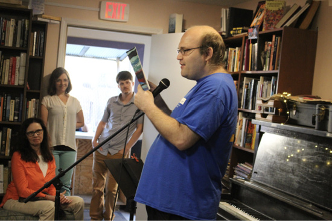

Cow Tipping author and speaker Vince Fiorilli

Sunflower, Sunflower | Boyce

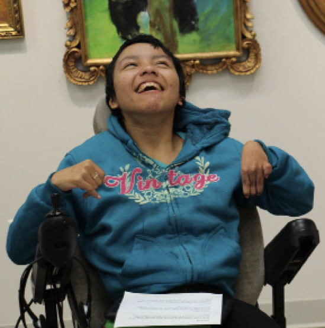

Cow Tipping Author Jasmine

Sunflower, Sunflower | Boyce

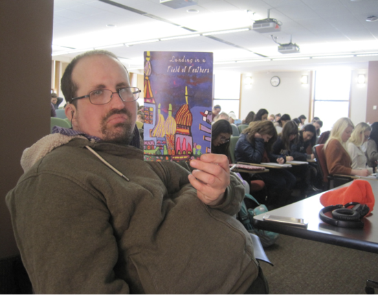

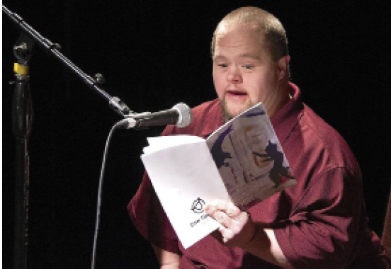

Cow Tipping author and speaker Thomas Robinson at the 

University of Minnesota

Cow Tipping author and teaching apprentice Nathan Bauer

reading one of his poems

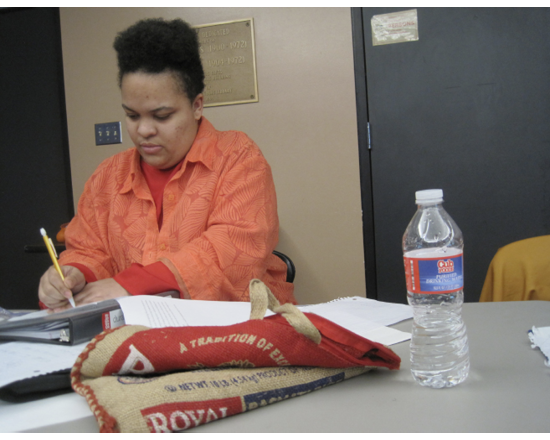

Cow Tipping author and teaching apprentice Mary Ayetey

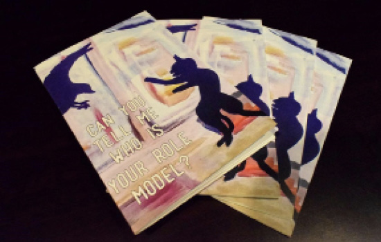

One of Cow Tipping Press's publications

Rootstalk Associate Editor Sang Yoon Byun is a second-year Computer Science major at Grinnell College. 

Snow trillium (Trillium nivale) or dwarf white trillium, is a member of the Melanthiaceae family, and is native to parts of the Eastern and Midwestern United States, primarily the Great Lakes States, the Ohio Valley, and the Upper Mississippi Valley. The species is one of the earliest flowers to bloom in spring. Along the Ohio River Valley, flowers may be seen in early March, while in Northern Minnesota, it blooms in early April. All photos, unless otherwise credited, are by Cornelia Clarke. All text descriptions are adapted from Wikipedia and The State Historical Society of Iowa

Prairie Wildflowers: Two Artists, Two Mediums, One Beauty

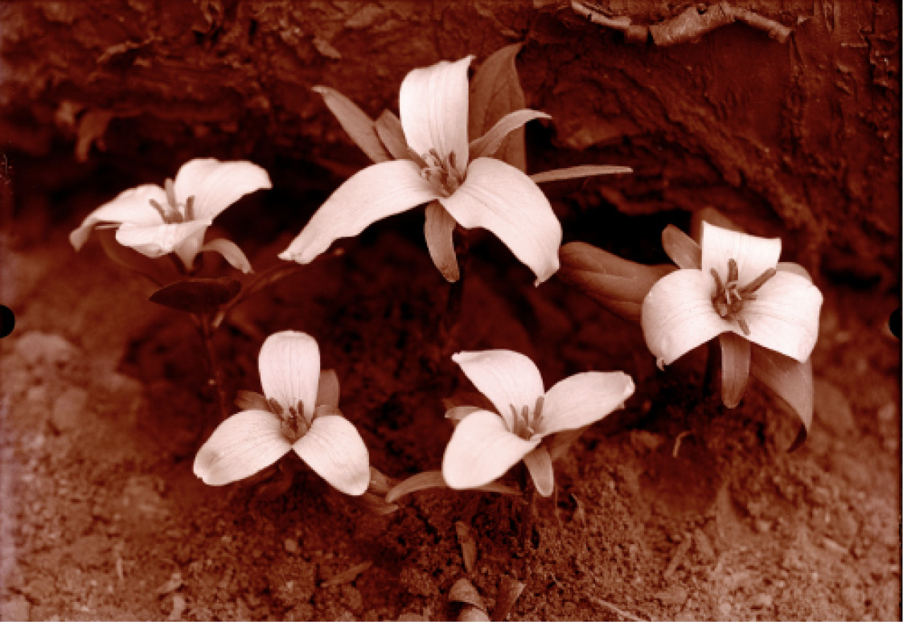

Recently, and quite by chance, Rootstalk became simultaneously aware of the work of two women artists, born in Iowa two years apart toward the end of the nineteenth century. Cornelia Clarke (1884-1936) and Lydia Krueger Curtis (1886-1973) had rather different life experiences, but both felt drawn to the wildflowers of the tallgrass prairie, which during their lifetimes virtually disappeared from the Iowa landscape as the result of agriculture. Both were moved to record the beauty of prairie plants, Clarke through the medium of photography and Curtis in watercolors. We thought our readers might enjoy the juxtaposition of Clarke’s and Curtis’s art as much as we do.

Butter and Eggs

Linaria vulgaris

This plant with its bright blossoms used to be easily found but now it is not often seen. It grows from one to three feet tall, and grows from short root stocks. Where found it may be in clusters or a colony of plants. It has been naturalized from Europe.

It was believed to have certain healing powers. The blossoms have been steeped and used in cases of dropsy, jaundice and various skin infections. The fresh plant has been bruised and applied as a poultice on boils and was also made into an ointment that was used for skin irruptions. In Germany the blossoms were used as a yellow dye. Pioneers used the juice in milk as a fly poison.

The blossoms resemble the cultivar Snap Dragons in shape and manner of growth. They are visited by bumble bees and butterflies.

The plant is partially parasitic. Its roots wrap themselves around any roots—even other roots of the same plant—that chance to be near, and draw part of their food from their host. 

Sandpaper Vervain

Verbena hastata, var. scabra*

This is a hardy plant that came to us from Europe. It is also known as Wild Hysop. In Europe it was one of the religious plants of the Druids. In ancient times it was held sacred to Thor, the god of thunder. It was used to stimulate affection and charms and was reputed to break the power of witches.

In France it was gathered under certain changes of the moon with secret incantations, after which it was supposed to make remarkable cures.

Bridal wreaths made of Vervain were used in Germany. Both Virgil and Shakespeare mention Vervain in their writings.

When found in dry hilly pastures it is small and the stems are tough and woody, but in moister more fertile ground it grows luxuriantly.

Indians gathered the seeds and made them into flour.

  

Prairie Wildflowers | Clarke and Krueger Curtis 

Cornelia Clarke 

(1884-1936)

Cornelia Clarke was the only child born to Ray Alonzo Clarke (1850-1932) and the former Cornelia Shepard (1849-1884), July 4, 1884. Her mother died within a few hours of the baby’s birth, so Cornelia was “baptized over the coffin with her mother’s name,” as her mother’s obituary had it. At the time, her father was farming north of Grinnell, Iowa, and, except for her father’s mother, who came to Iowa to keep house and care for the baby, Cornelia lived a fairly lonely childhood, occupying herself with the animals and plants she found around the farmstead. These early experiences with the natural world proved crucial to her life-long interest in nature and her ability to photograph it.

Clarke learned the rudiments of photography while still a child, borrowing her father’s camera and gradually developing her skill. While still quite young, she began to photograph her pets, including two cats, which she trained to accept humanoid clothing and to pose like humans. These pictures were first published in 1911, bringing Clarke immediate fame and a contract to publish colorized versions in a fetching 1912 volume, Peter and Polly.

“My childhood days were spent on a farm with father and, not having any brothers or sisters, my mother having died at my birth, perhaps the cats took the place of many things which other children have…My cats and myself were brought into a closer understanding and a sort of deeper affection grew between us.”

However, if many of Clarke’s early photographs required an imaginative story as context, over time she became a serious nature photographer whose pictures appeared regularly in publications like Nature Magazine and Science News-Letter, the latter often using Clarke photos for its covers. Numerous authors of biology and zoology textbooks also sought her photographs, as did encyclopedias and newspapers.

Clarke used her growing camera skills to reveal the secrets of biological process, as when she documented the life history of the mosquito or the stages of butterfly generation. Collaborating with Grinnell College professors like Henry Conard (1874-1971) gave her occasion to produce images—often enlarged many times over natural scale—of great scientific accuracy and value, confirmed by the Grinnell College herbarium of local plants of which she became volunteer curator.

Despite her success, Clarke’s last years were not happy. Difficulties began when in May 1929 she and her father were involved in an automobile accident. Both suffered from the collision, and Ray “slowly but steadily failed until the end came peacefully,” March 21, 1932. Cornelia carried on, and continued to publish her photographs, but soon after her father’s death she was diagnosed with breast cancer, which killed her September 29, 1936. She bequeathed some 3300 glass plate negatives to Henry Conard, who abandoned them at the University of Iowa when he retired in the 1950s. Fifty years later 1100 of her botanical images were discovered in poor condition, but saved by the State Historical Society of Iowa. The fate of the other 2200 negatives—of insects and animals, including cats—is unknown.

  —Daniel Kaiser

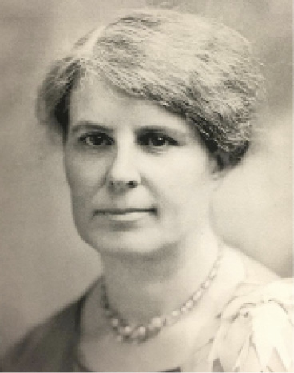

Photo courtesy of State Historical 

Research Center of Iowa

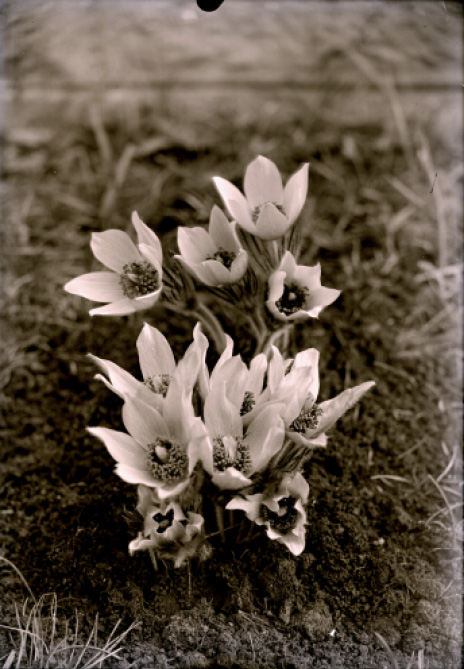

Pasque Flower (Anemone patens Wolfgangiana), also known as Prairie Crocus or Cutleaf Anemone, is a member of the Ranunculaceae family, and is one of the first flowers to bloom in the spring, often coming up while there is still snow on the ground. Look for it on south facing slopes in dry to average sandy soil, typically in scattered clumps. All these photographs were most likely taken in or near Grinnell, Poweshiek County, Iowa, early in the twentieth century.

Canada Anemone (Anemone canadensis) is another member of Ranunculaceae family. Also known as the round-headed anemone, meadow anemone, or crowfoot, it is a herbaceous perennial native to moist meadows, thickets, streambanks, and lakeshores in North America, spreading rapidly by underground rhizomes, valued for its white flowers.

Prairie Wildflowers | Clarke and Krueger Curtis 

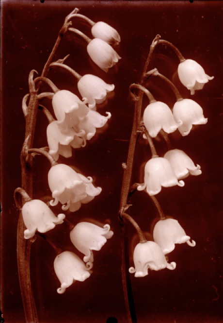

Lily-of-the-Valley (Convallaria majalis), also known as May bells, Our Lady’s tears, and Mary’s tears, is a rhizomatous herbaceous perennial of Asparagaceae family. It is a sweetly scented, highly poisonous woodland flower, native throughout the cool, temperate Northern Hemisphere. It flowers in late spring, though in mild winters it has been known to bloom in early March. The plant’s variant, majuscula, is thought to be native to North America.

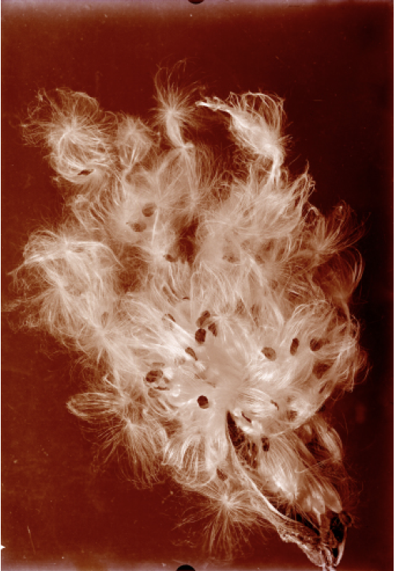

Asclepias (milkweed) seeds. The Asclepiadaciae family is a genus of herbaceous, perennial, flowering plants named for their latex, a milky substance containing cardiac glycosides termed “cardenolides,” exuded where cells are damaged. Most species are toxic, though the plant is vital as a food source for the caterpillar of the monarch butterfly. The genus contains over 200 species distributed broadly across Africa, North America, and South America, and includes several species which are native to the prairie region. 

Wild Geranium (Geranium maculatum) in its fruit capsule stage. In this phase of its development, the flower resembles a crane’s bill, which accounts for its “Cranesbill” nickname. 

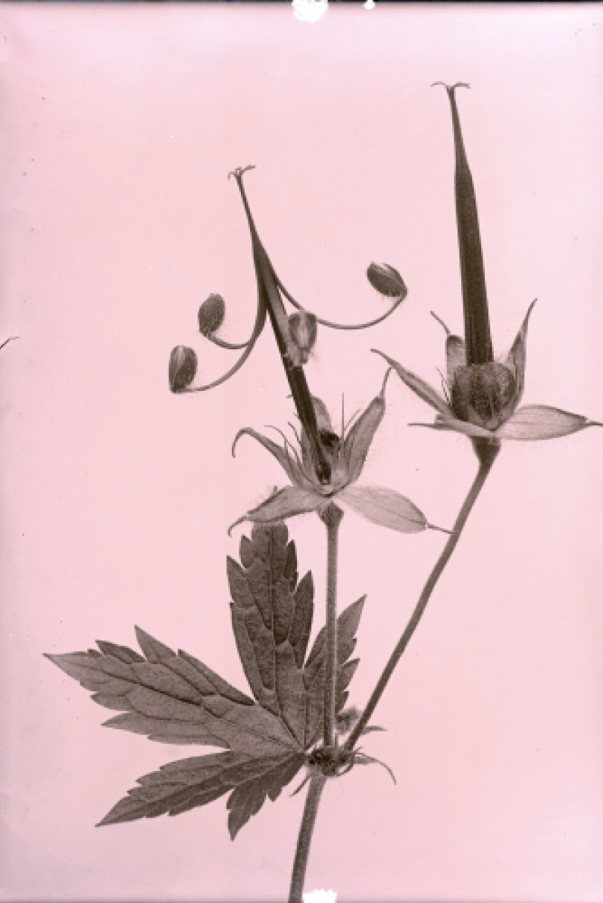

Prairie Wildflowers | Clarke and Krueger Curtis 

Lydia E. (Krueger) Curtis

(1886-1973) 

Lydia Krueger Curtis was the second of four daughters born to Fred and Sophia Krueger. She grew up on a farm southwest of Charles City, Iowa, and graduated from Charles City High School. Her older sister wrote the following about life on their farm:

“The near-by timber was an ideal locale for little girls to grow up and learn to know birds, flowers and trees. Our parents knew and loved wildlife. Our father was a born naturalist. No plant, stone, tree or bird escaped his notice. A tramp through the woods was fun and we always learned something new from his knowledge about nature. In the spring, we strolled along the creek into the woods where bloodroots, bluebells, Dutchmen breeches and violets grew in profusion. Sometimes we picked flowers until we could carry no more. Our mother patiently untangled our armfuls and showed how they must be put into water. She told us not to pick so many because some must be left for seed…a lesson in conservation to avoid the destruction of the beautiful wildflowers of our childhood.”

Lydia received a bachelor’s degree at Highland Park College in Des Moines, where she met James Hubert Curtis, whom she married on December 27, 1910. While earning her bachelor’s degree, she also taught pen arts at the college.

As a civil engineer, James was employed in Iowa, Minnesota and Missouri communities. During their marriage, Lydia carried on the usual activities of a wife and mother, as well as church, school and community activities. During the Depression she augmented family income by extensive gardening and raising poultry. She also found time to engage in painting with watercolors and oils, something she enjoyed since girlhood. Her talent was recognized early by her father, who arranged private lessons while she was still in her teens, though in large part she was self-taught.

Following James’s death in 1945, Lydia worked for the United States Army Corps of Engineering. Her responsibilities included using field data to hand-draw snow pack maps of the upper Missouri River watershed to estimate spring run-off.

After retiring at age 72, she had the leisure to give full rein to her artistic talents, her love of flowers and more-than-superficial knowledge of botany. She searched out, collected and painted in watercolors the wildflowers indigenous to the upper Middle West, especially Iowa and Minnesota. During the twelve years she continued painting, she produced about 250 plates of different wildflower species. At age 85, with failing vision and a less than completely steady hand, she quit painting, concluding she no longer could “do justice to the beauty of the wildflowers.” 

Still, she kept working on precise identification of each species. Her knowledge of botany was used as she keyed out each species with the best technical manuals as reference. Also, she accumulated bits of lore about the flowers, including where they might be found, the preferred soil and growing conditions, whether they were edible, their use as herbs in cooking, or as sources of medicines by the Indians or by pioneers. She incorporated this into essays to accompany her paintings, and we reproduce them (in part) here.

  —Andy Hayes

  

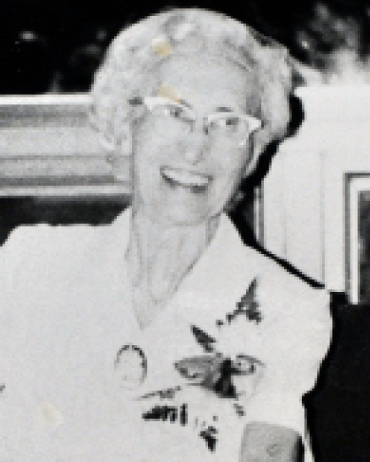

Photo courtesy of State Historical Research Center of Iowa

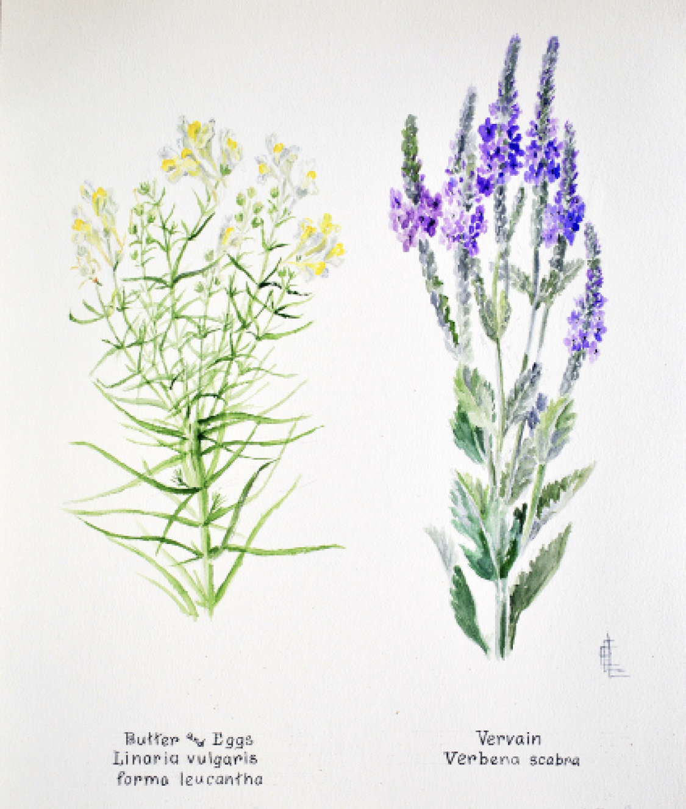

Prairie Wildflowers | Clarke and Krueger Curtis 

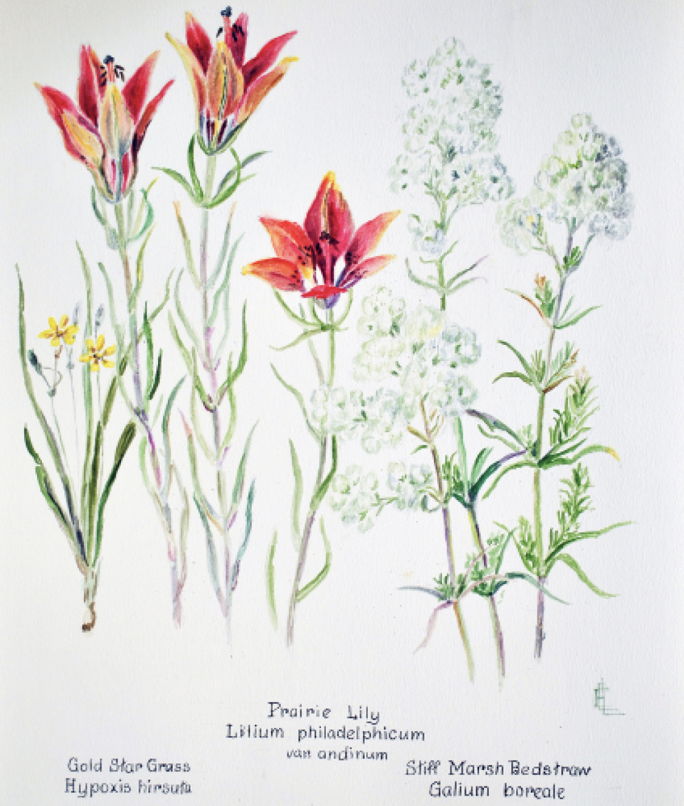

Prairie Wildflowers | Clarke and Krueger Curtis 

Gold Star Grass

Hypoxis hirsuta

Gold Star Grass [also called yellow star grass or common goldstar] belongs to the Amaryllis family. Its leaves look much like the grass leaves that grow around them in both size and shape, but they grow from a small bulb. 

The blossoms grow on very slender stems from the bulb with the leaves surrounding them for an inch. The blossoms have three sepals and three petals, all bright yellow on the face and lighter yellow or somewhat green on the back. The blossom opens to about a half inch. There are several buds which form at the tip of the stem, but they usually open one at a time. 

Prairie Lily

Lilium philadelicum, var. andinum

The Prairie Lily [also commonly referred to as the western wood lily] seems to belong to the prairies of the Upper Midwest of the United States. I have failed to find anything about it in any of the Eastern or Western flower books. Even Ryberg in his book Flora of the Plains and Prairies of the United States does not mention it. In Gray’s 8th edition of his Manual the author does add “var. andinum-which grows in the prairie” to his paragraph about Lilium philadelphicum, the wood lily. 

When I was a child there were still large areas of unfenced prairie near our home. My father rented tracts of this land to pasture cattle. He hired a young man to herd the cattle. At intervals during the summer he drove out to see about the herder and cattle. Sometimes he took my sisters and myself with him. In June and early July we would find the prairie bright with flowers. Among these were the bright red Lilies. How we prized them. 

The Prairie Lily [has] a simple stem about 15 inches tall, which ends in a whorl of leaves about 1-1.5 inches long.... The leaves are fleshy and narrow and below the whorl they alternate on the stem. The blossoms are more orange-­red than the Wood Lily’s crimson. Like other lilies they fasten to the stem with narrow parts of the petals and sepals, then abruptly widen and grow more colorful. Near the place of widening they are spotted with small purple spots. The blossoms do not open as widely as those of the Wood Lily but instead the petals and sepals stay more upright. The stamens and three-part pistils are pink tipped with brown which adds much to their beauty. 

Since prairies are cultivated and roadsides mowed, these beauties are becoming rare. 

  Stiff Marsh Bedstraw

Galium tinctorium*

Marsh Bedstraw with its whorled leaves and plumy heads is very attractive. In this area there are several varieties; in fact they are widely distributed. They grow from fibrous roots. Indians used the juice from these roots to dye their feathers and themselves. Just how they got the name Bedstraw I have not been able to learn. One variety is fragrant, especially when dry. It may have been from this variety.

Prairie Wildflowers | Clarke and Krueger Curtis 

White Campion

Lychnis alba

The Campions belong to the Pink family. They have ovate-lance shaped leaves. Both stem and leaves are softly hairy and sticky. The corolla petals are held in a tubular calix which becomes inflated and red- ribbed as it matures. The outer part of the corolla spreads out to make a blossom 1-1.5 inches wide. The blossom is centered by stamens seated in the tube, the yellow anthers barely showing above the surface of the corolla. 

The white Campion has many species, and they are widely distributed in Minnesota. They may be found in many waste areas. The one sketched was found near Gull Lake northwest of Brainerd, Minnesota. 

Columbine

Aquilegia canadensis

In shady nooks or along stream banks the stately Columbine finds its favorite home. The lower leaves are long stemmed and compound with subdivisions in groups of three. Simple notched leaves surround the stem at points where the stem branches. The slender red-brown stem grows tall, usually rising above neighboring foliage at blossom time. 

Although delicate in appearance this is a hardy plant. The lower part of the stem is stiff and almost woody. The stem may branch several times, each branch terminating in the red and yellow blossoms which hang gracefully. These blossoms have a unique form, consisting of five yellow sepals—which look like petals—and five tubular petals which point upward. These petals have small sacs of honey at their tips especially attractive to hummingbirds. These dainty visitors add their color and charm. (When I was a child I and my sisters used to enjoy nibbling these tips.) A group of long yellow stamens and slender pistils hang like golden tassels from the center of the blossoms. 

In Colonial days plants of Columbine were sent from Virginia to King Charles I to decorate the gardens of Hampton Court. 

The Columbine is widely distributed in the wooded areas of the Midwest. The speciman sketched was found in the woodland near Gull Lake northwest of Brainerd, Minnesota. 

  

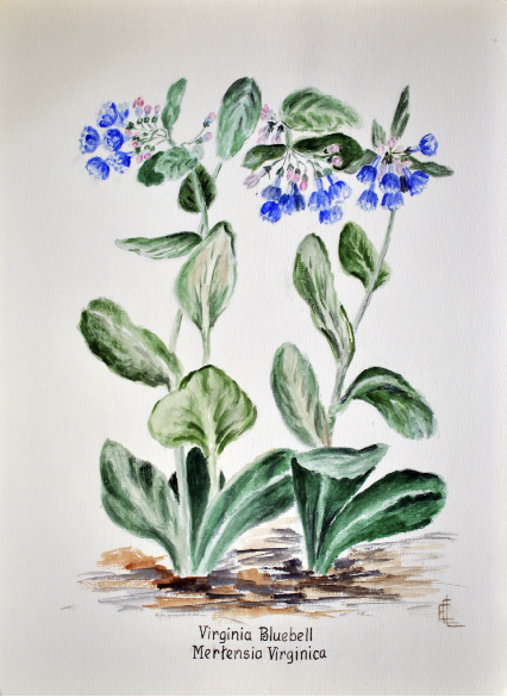

Prairie Wildflowers | Clarke and Krueger Curtis 

  

Virginia Bluebell

Mertensia virginica

In the long-ago when I was a child my family lived near a creek that meandered its way through a woodland. At its bends were a number of low moist areas, so-called bottom land. In May or early June we found these areas so blue they looked like pools of water. As we ventured near we found it was Bluebell time and that the bright blue Mertensias or Virginia Bluebells were in bloom. The beauty of the Bluebells and their fresh fragrance were always a special delight. 

The plants grow from one to two feet in height. The leaves are rather large, oblong in shape, smooth in texture, easily crushed. When the buds first appear they are a delicate pink. As they continue to develop they become a dainty orchid color and finally clear blue. 

Although these plants are hardy and respond readily to being transplanted to cultivated gardens, they have not been able to endure the tramp of cattle over their natural beds. The sight of large patches of Bluebells such as I knew is becoming rare. 

This plant is known by various local names such as Cowslip and Lung wort. 

The specimen sketched was growing in our wild flower garden in St. Paul, Minnesota. 

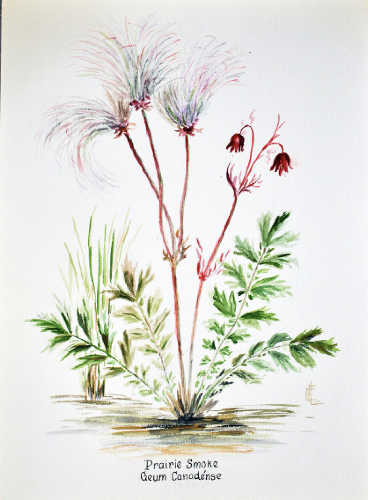

Prairie Wildflowers | Clarke and Krueger Curtis 

Prairie Smoke

Geum triflorum*

This lovely prairie flower, once so plentiful, is known by several names such as Torch Flower, Plumed Avens and Old Man’s Whiskers. It cannot survive cultivation and frequent moving. Now that the virgin prairies are mostly cultivated it is becoming very rare. 

Many years ago when I was a little girl we lived in north central Iowa in an area between a large native prairie and some timberland. The prairie was not fenced and farm homes were far apart. My father rented some of the prairie land and hired a man to herd cattle on it. Sometimes he would drive out to see how the herdsman and cattle were doing. Frequently he took me and my sisters with him. In June and July we would find patches of Prairie Smoke growing in the grass. We were always delighted to find these flowers so different from most plants. 

At the base of the plant there is a roseate of attractively notched base leaves three to six inches long. They are broader at their tips than near the base. From this base almost naked ruddy red stalks arise which are divided into three branches. The branches are terminated by ruddy red buds. As the blossom opens the white petals are small and insignificant, but there are an abundance of pistils which grow into a hairy head with numerous hairlike appendages. These are delicately colored and make an unusual showing with the ruddy sepals surrounding them and the ruddy stems holding them to the wind. From a distance they give an impression of a cloud or smoke, hence the common name of Prairie Smoke. In some area they are known as Old Man’s Whiskers. 

The specimen sketched was found in a bit of prairie turf a short distance south of the Minnesota-Iowa border near Chester, Iowa.

*Corrections: Through the years, changes occasionally take place in the Linnaean nomenclature (more popularly known as “Latin names”) for various organisms—usually in the species (the second word) rather than in the genus (the first word). Whether this is the case with several of the plant species Ms. Krueger Curtis painted, or whether she made errors in labeling a few of her watercolor images, it is impossible to say for sure, however several corrections are necessary. Her use of Verbena scabra with her illustration of Vervain is slightly misleading. The proper nomenclature for the specimen depicted is Verbena hastata, var. scabra, commonly referred to as sandpaper vervain.The label Galium boreale, used to identify stiff marsh bedstraw (Galium tinctorium), actually identifies northern bedstraw. The correct nomenclature for prairie smoke is Geum triflorum. Geum canadense is the nomenclature for another flowering plant, white avens.

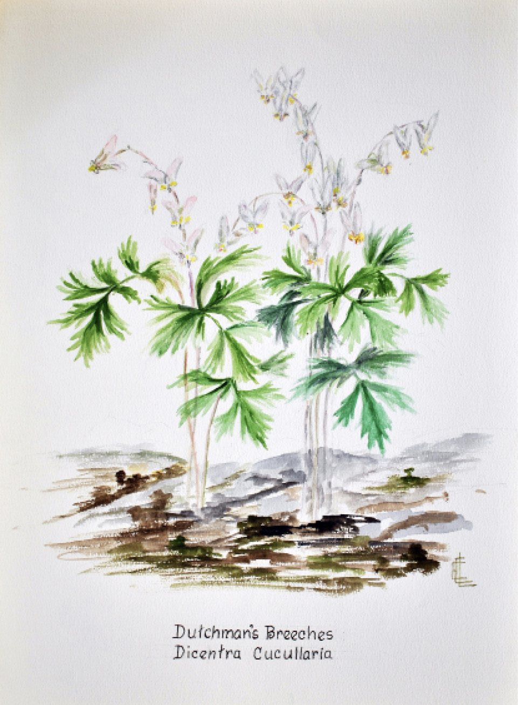

Prairie Wildflowers | Clarke and Krueger Curtis 

Dutchman’s Breeches

Dicentra cucullaria

This is one of our daintiest wild flowers. It blooms in May in our area, preferring a wooded lake shore or streamside. The leaves are compound, being divided into parts of three until they are lacy. Both leaves and blossoms grow on long stems which grow up from a cluster of small tubers which look like a scaly bulb. 

The blossoms have four petals, two of them formed into pouches joined together so they look like pantaloons. Since they were found by our colonists in New York and eastern Pennsylvania they were given the name of Dutchman’s Breeches, probably because they resembled the garments that Dutch men were then wearing. At any rate this name followed them as people moved on westward. The blossoms are mostly white but sometimes a very faint pink. The other two petals are small and are shaped like a cup, protecting the stamens of which there are six. 

Squirrels are fond of the bulbs and when other food is scarce they will dig for them. 

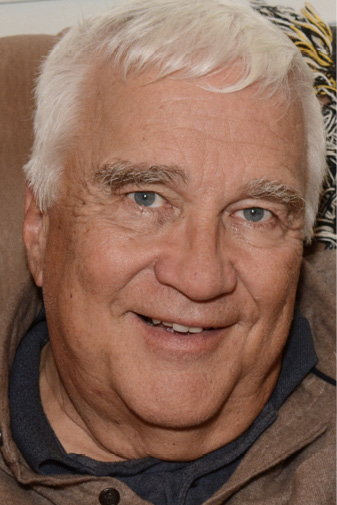

Photo courtesy of Andy Hayes

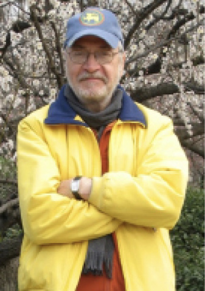

Photo courtesy of Dan Kaiser

Andy Hayes is the sixth of Lydia Curtis' 14 grandchildren. He was raised in Des Moines, graduating with a Bachelor of Medical Science from Emory University in Atlanta. He practiced as a physician assistant, then moved into varying roles in marketing and development of medical devices and equipment. Now retired, he's settled in the Sierra Nevada foothills in California. In addition to active volunteer work, he's documenting the Krueger-Curtis family in Iowa and helped his mother and Lydia's daughter, Cora Curtis Hayes, to develop the Wildflowers of the Upper Midwest exhibition, which includes the paintings presented in this article.

Dan Kaiser is retired from teaching Russian and European history at Grinnell College. After a career centered on places far away, he is using retirement to learn more about places close at hand. In 2013-14 he produced a blog devoted to the neighborhood around Walter Burley Griffin’s Ricker House in Grinnell , and more recently has authored a series of “Grinnell Stories,” including one devoted to Cornelia Clarke.

Ode to Liberty #6 | McBee

Photo courtesy of Mary Richardson McBee

Mary Richardson McBee was born and raised on a small family farm in northern Iowa. Amongst various life journeys during adult years, she spent several decades out west in the Grand Canyon/Colorado River area doing extensive historical research. McBee’s writing has been published in various environmental and philosophical journals as well as [The Iowan](file:https://issuu.com/the_iowan), [High Country News](file:https://www.hcn.org), and other periodicals. She has been described as an observer of real and small things.

Ode to Liberty #6

by Mary Richardson McBee

I drove slowly up the gravel road in northern Iowa and approached, for the first time in forty years, the one-acre site where our small rural country school had once stood, one that had proudly carried the name Liberty #6. I’d been told nothing was there any longer, but I still felt a deep need to visit the place. The eight-year education I had received there was by far the most important and relevant of my life, much more so than high school, college, and beyond. Now, however, the land was freshly cultivated for miles around. It looked barren, torn, and ravaged everywhere. No more the diverse farmland of my youth. My heart grew heavy.

Upon arriving at the site, indeed, there was nothing. No tree-lined fence. No one-room school building with tolling bell on top. No hand-water pump by the front porch. No outhouse in each back corner of the acre. No swings or basketball hoop or grass-covered yard. So many memories. Now, no sign of anything.

A faint rumble became audible in the distance, then I noticed a tractor slowly approaching, pulling up more cruel curls of land as it came. Soon I could make out the farmer on the tractor. Then he came to a halt and, with obvious difficulty, climbed down from the tractor to fix something on the cultivator behind. It was apparent that arthritis had crippled his joints badly through the years. A sleeve moved loosely in the breeze —a missing arm, probably torn off in a corn sheller or combine during his youth, as so often happened with those working with heavy equipment to farm the land.

Upon finishing, he stood, looked my direction, and waved his good arm. I waved back. He climbed slowly onto his tractor and continued on until fading slowly into the distance once again, the rumble of the tractor eventually becoming just a murmur.

As a young fifth grader sitting at my smoothly-worn wooden school desk, I would look out the open window at the peaceful scene; my horse tethered to the fence in the shade of a big ash tree, my dog sleeping in the grass nearby. While listening to sixth graders do their lesson repetitions around the table in the front of the room, I could never have dreamed that, half a century later, I would witness the empty and devastating scene that now lay before me.

No longer Liberty. Only a Crippled Man in a Crucified Land.

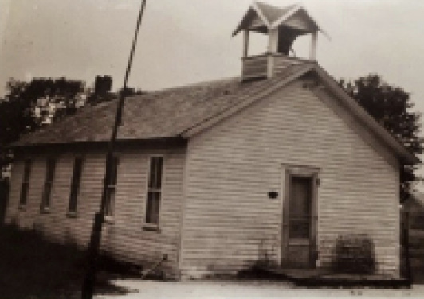

The Liberty #6 school building, circa 1955. Photo courtesy of Mary McBee

Two poems | Lewis-Beck

Photo courtesy of Mike Lewis-Beck

Mike Lewis-Beck writes and works in Iowa City. He has pieces in Alexandria Quarterly, Apalachee Review, Cortland Review, Chariton Review, Pure Slush, Pilgrimage, Seminary Ridge Review, Taos Journal of International Poetry and Art, Writers’ Café and Wapsipinicon Almanac, among other venues. He had poems in volume IV, Issue 1 of Rootstalk, and his short story, “Delivery in Göteborg,” received a Finalist prize from Chariton Review in 2015. His essay, “My Cherry Orchard in Iowa,” received recognition as one of the ‘Notable Essays’ in Best American Essays of 2011. He has a chapbook, Rural Routes, forthcoming. 

Two poems

by Mike Lewis-Beck

June’s Coming

When June comes—you know— 

the clover knows June, 

rolling out yards of white for her.

Soon though the mulberries make a mess

of the summer sidewalk, birds’ magenta stain all over.

Drifters on broken bikes pedal the cinder alleys

 past dying lilacs—rummaging,

balancing black bags of tin cans

while on a back stoop flashes a galvanized

aluminum tub full of top soil,

tiny leaves coming, going green,

 radishes maybe.

Dead Courthouse Museums

Every heartland courthouse, dying or not,

has a dead museum

in a closet, an ancient display case, 

a neglected corner where—gathered together

to preserve the ghosts—a rag-tag collection

huddles—stuffed owls, arrow-heads, lamp-lighters,

hand cartography, yellow-leathered books,

bone-knob canes, army medals

& jars with tonsil-like objects in solution.

Artifacts of the county history

no one knows, no one knows what to do with.

No money for a curator, hardly money

for the lights and floor polish of the grand building itself.

But these objets perdus cannot be thrown out,

they are sacred in some way, not sure what.

“Not Too Deep” | Hanson

Photograph by Paul Chan

Ethan Evans is a third-year student at Grinnell College and prior contributer to Rootstalk. Their writing and art have appeared elsewhere in Hobart, Guavamilk, and The Nation’s Annual Student Writing Contest. 

Seth Hanson’s “Not Too Deep”—Seeking the Sound of Rural Iowa

Interview by Ethan Evans

When I think of music, I think of place. When I hear a song I associate with my past, I see the scenery of that past come alive again. When I think of Seth Hanson’s music, I think of dormitory basements. I’ve seen lots of musicians play in basements. Most of them got drunk and yelled. Seth was different; his show was both subdued and exciting, each song featuring new guest vocalists and musicians who helped make an enlivening performance of a bunch of melancholy, introspective songs. I saw Seth play many times after that basement set my first year at Grinnell College. With each performance his music grew on me. His meditations on life, on family, on his surroundings, deceptively simple, kept returning to me. 

When I left Kentucky for college in central Iowa, I thought a lot about place. My perception of the prairie region and Midwest at large was largely shaped by a few negative stereotypes; Iowa in particular seemed to me a flat, culturally milquetoast place that people only noticed when presidential candidates came to play acoustic guitars on top of tractors and woo farmers by eating corn. My only exposure to prairie culture that existed as something outside of pastiche was that of the Prairie School of architecture. When I was a child my mother, an architectural historian, took me to buildings designed by Louis Sullivan, Frank Lloyd Wright, Marion Mahony and Walter Burley Griffin, and other prairie-adjacent architects. Designed with strong horizontal lines and thick beams meant to blend organically with their surroundings, these buildings, ornamented yet stark, full of light yet heavy, spoke to me. They felt informed by a world that I did not know. 

There’s a generic image that the word “prairie” evokes—meadows, glutted with Indiangrass, dry in autumnal light and extending in all directions. Compass plants rise above the grass and follow the sun. Sparrows dart. This image is certainly not wrong; the time I spent on restored native prairie largely fit the picture. It is, to a degree, what the Prairie School was trying to capture—wide, open expanses full of air and light rising out of soil choking with flora. Yet it is not, alone, what “prairie” means, or should mean. The prairie is the dynamic cultural interaction that occurs between people and the land of the tallgrass region of North America. 

How closely the Prairie School truly aligned itself with this dynamic interaction is questionable. At the peak of their careers, Frank Lloyd Wright left the prairie for Europe, Walter and Marion Mahony Griffin for Australia. I reference the Prairie School, though, because it is the only obvious example of a mainstream movement within the arts that takes up the prairie moniker. Coming to Iowa for college has changed my perception of the Midwest; I now recognize it as a region whose cultural diversity and depth frequently go unrecognized on the national level. What remains yet mysterious to me is what this word “prairie” really means for the culture around me, especially as so much of the physical tallgrass prairie has vanished. Living in rural Iowa has profoundly impacted my aesthetic as a poet and artist—I find myself increasingly drawn to minute details and wide-open spaces. When I became an associate editor for Rootstalk this spring, I found myself trying to pin down what exactly I found so appealing but ineffable about the prairie. Bereft of any answer myself, I returned to Seth’s music.

Seth Hanson makes music rooted in place. His latest album, Not Too Deep, released last summer, reflects Grinnell, Iowa, on a variety of levels. It captures the scenography of life in a rural prairie town—car windows opening in the spring warmth, a family walking by an artificial lake, a group of friends playing music on a couch. Not Too Deep also features field recordings—Grinnell and the prairie appear auditorily as well as lyrically. Seth released Not Too Deep right after he moved from the prairie region, where he had lived all his life, to Boston, Massachusetts. The album is not only a reflection of his life in prairie towns, but of his musings about moving away from them. As my time at Grinnell College draws to a close, I find myself thinking about and listening to Not Too Deep regularly. Like the architecture of the Prairie School, it has a levity that I treasure. I interviewed Seth recently to get his thoughts on how place impacts art. 

Rootstalk: I’m interested in how artmaking relates to place. Part of the allure of Not Too Deep, for me, is how your lyrics evoke a sense of timeless place. I’m thinking specifically of the last two tracks of the album—the first about leaving Grinnell and the latter about staying. Are you still writing music now that you’re living in Boston? Does it feel different from Grinnell or Northfield, Minnesota, where you grew up?

Hanson: I am still writing music, though it took me a little while before things had settled in enough that I felt ready to start processing things into songs. I personally don’t feel particularly different (yet), so the songwriting process doesn’t feel too different either. I have still been writing observationally, so certainly some of my new Boston experiences have made their way into the content of the songs, but I guess I’ve managed to find a life here that doesn’t feel too different from my life in Grinnell. Back when I was writing songs in Northfield, I was not writing quite so observationally or introspectively, so a lot of those songs feel very different to me now, much more distant.

Rootstalk: What you said about observational writing is interesting. What do you think made you shift into writing songs that are observational concerning your surroundings? How much of it do you think was your surroundings versus simply growing and changing as a songwriter?

Hanson: Certainly a lot of those changes happened after moving to Grinnell, but I would attribute them most to personal growth, which then filtered into songwriting growth. I do think it was Grinnell (the space, the people, the feeling of it) that created the opportunities for that change... the change being that I began to see little things around me and in my life that I felt were worth sharing, which I had not seen as such before.

Rootstalk: I’m interested in how musicians and artists use field recordings in their work. It seems like the ultimate observational way of writing. You use a recording of a train on the last track of Not Too Deep. Have you done other field recordings? Do you think Not Too Deep was impacted by the sounds of Grinnell and the prairie?

Hanson: I was definitely thinking about and reacting to the sounds of Grinnell while writing those songs. That recording is of a train on the east-west track, recorded from the apartment I had downtown, so it is exactly how I would hear it from my home. From the same window, I also recorded the sounds of Broad Street for the track “Spring,” which is about looking out my window on an early spring morning. Nothing too deep about that one. But when I listen to the track now I am so happy I took the time to make that recording and include it because it brings me right back to those little peaceful moments. I have always appreciated field recordings for their ability to add depth to a mix and ground a recording in the feeling of a specific place, though I haven’t used them much. But I think, to a similar if more subtle degree, all of my recordings have been made in bedrooms and living rooms— in the same places that I lived. I enjoy having the faint imprint of those rooms on the recordings as another little note documenting the context of the recordings and my life at the time they were made.

Rootstalk: I like what you said about having the “faint imprint” of your life at the time of recording in your music; obviously location impacts any sort of artmaking to a degree. Do you think that there’s a particular aesthetic to music that’s written in the prairie region that’s different from that of the Midwest in general?

Hanson: I guess I don’t feel particularly aware of what is happening in “Midwestern music”.... I don’t really know how to answer that...sorry.

I left my interview with Seth Hanson feeling more knowledgeable about his process as a musician, and less clear about what the prairie aesthetic is. I took this question to Rachel Eber, a friend and musician who helped Seth to record Not Too Deep. The two had met at a crossing point in their lives; Rachel had just moved from Boston to Grinnell, Seth was about to leave Grinnell for Boston. 

Eber: I don’t think that there is a specific prairie aesthetic. I think that all musicians are all pretty different, the prairie aesthetic maybe is folk music, or at least is what I would think of, but I don’t think people from this region necessarily write the same kind of music. I think whatever prairie aesthetic means is different from just the Midwest. The town of Grinnell, to me, has been very inspiring just in terms of what it feels like to walk around and see the same places during different times of the year and stuff like that... and that’s definitely very specific to Grinnell and being a very small town in the Midwest, and that’s definitely connected to the prairie region. One thing I’ve been thinking about is being at Grinnell the school and in Grinnell the town. I think both are so small that the music scene is immediately recognizable. It’s held together by the fact that we’re all together in a small town. I think that’s something pretty special and different about being in a small town, in terms of a music scene, than being in Boston, when you could hear a new band anytime.

 I listen to Seth when I want to hear songs about Grinnell; it is not like New York City or something where I could listen to anyone. What that means is that each individual song becomes a lot more powerful and embodies a lot more things. Using New York, you might see a landmark and be like “Oh yes, so many people have written about this landmark,” and it might remind you of a song or many different songs but I think Grinnell, being small, has fewer things that would catch your eye...so when they do catch your eye it’s a bigger deal. I feel like there’s probably not many people besides Seth who would write a song about sitting on a bench in Miller Park. Songs about small towns often feel a lot more personal than songs about places that tons of people have been. 

In follow-up questions, neither Rachel nor Seth indicated that there was a clear or specific impact the prairie had had on their songwriting. Rather, it was the small prairie towns, and the people they encountered in those towns, that left a tangible mark on their music. At first I was disappointed by what I found. Small towns are not unique to the prairie region. Neither Seth or Rachel seemed comfortable being described as Midwestern—let alone as prairie—musicians. This makes sense. I don’t feel comfortable being described as a Southern writer, however much my childhood in the South may reach into or shape the writing I produce while living in the Midwest. If the prairie is, as I wrote earlier, the dynamic cultural interaction that occurs between people and the land of the tallgrass region, then perhaps it cannot be distilled into a singular “aesthetic.” For, like Rachel and Seth, the prairie moves. Its foliage shifts in color and form with every new season. When you drive down Iowa’s roads, you see prairie plants rising anew in areas that were newly mowed. It cannot be stilled. This is what makes it ineffable. 

Listening to Seth Hanson’s “Spring,” I walk into town. It is bright, but the sidewalks are still dark with rain. Birds call and doors open. I walk into the Merchants National Bank—now a branch of Wells Fargo. It is a late building by Louis Sullivan—one of a series of “jewel boxes” scattered across the Midwest. They appear in small prairie cities, sturdy brick rectangular prisms full of resplendent color and light. The terra cotta molding morphs into flowers vining around the brick, a griffin’s mouth opening. Inside, rays of light travel through the stained glass cathedrally. People are filtering into the building like seedheads leafing out of Indiangrass.

Photograph of Seth Hanson by John Brady

“Not Too Deep” | Hanson

Album cover for Not Too Deep courtesy of Seth Hanson. To listen to “Spring,” a cut from the album, either download a fully interactive PDF of this review and click the image above, or follow this link to Seth’s Bandcamp page: https://theadditionalsix.bandcamp.com.

“Not Too Deep” | Hanson

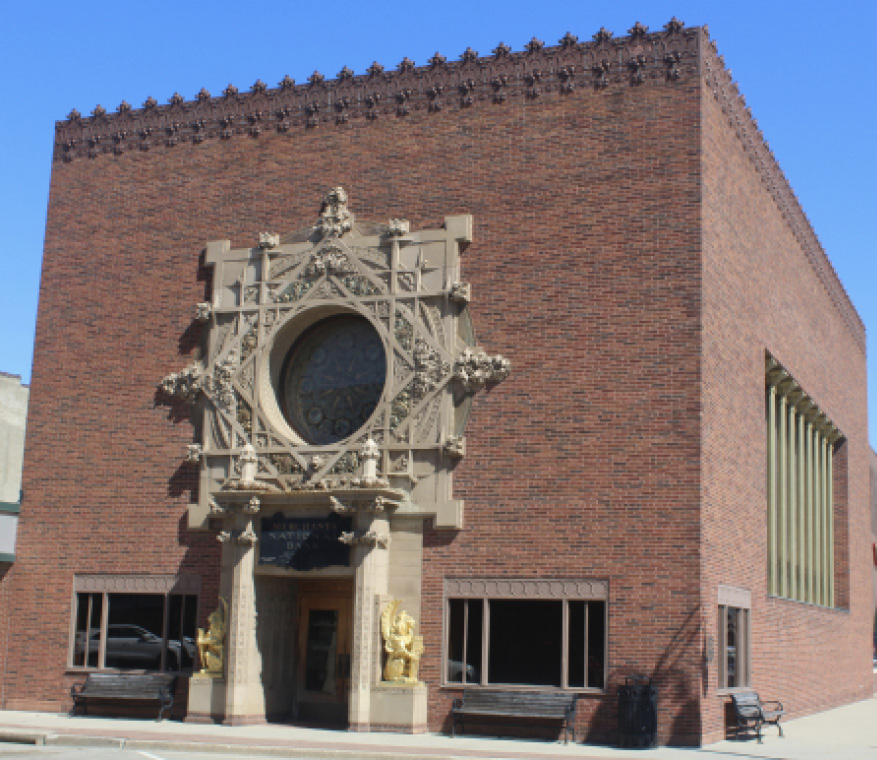

Louis H. Sullivan’s “Jewel Box” Bank in Grinnell, Iowa. Photo by Jon Andelson

 

Photo courtesy of Heather Swan

In the sixth RootsTalk! Podcast, audio producer Maya Dru interviews Heather Swan, author of Where Honeybees Thrive: Stories from the Field concerning her love for pollinators. Her nonfiction has appeared in places like Aeon, ISLE, Belt Magazine, Minding Nature, About Place and Resilience Magazine. Her chapbook The Edge of Damage was published by Parallel Press. She teaches writing and environmental literature at the University of Wisconsin at Madison. 

To hear an audio recording of this issue’s podcast use the link at the bottom of the web page to download the fully interactive PDF of Episode 6 of 

RootsTalk!, then click the audio link like the one above. 

Roots Talk! Episode #6

A Podcast Interview with

Heather Swan

Thoreau’s Home on the Prairie | Goodnature

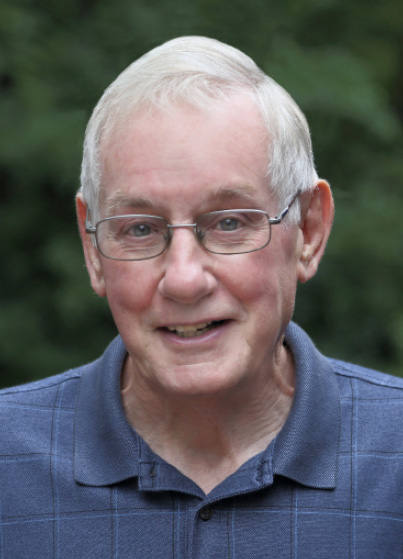

Photo courtesy of Paul Goodnature

Paul Goodnature was raised on a family farm near Blooming Prairie, MN , and completed his undergraduate and graduate degrees at the University of Minnesota, Mankato. His area of special interest is 19th century American literature, especially the works of Emerson and Thoreau. In addition to teaching, he served on the board of the Minnesota Humanities Commission and was recognized in 1987 as Minnesota Teacher of the Year. In 2018 the Albert Lea Education Foundation acknowledged him as a distinguished educator in the district. After retirement he continued to advise the local high school philosophy club. He has made three pilgrimages to Walden Pond in Massachusetts for inspiration. 

Thoreau’s Home on the Prairie

by Paul Goodnature

As a long-time teacher of humanities and American studies at Albert Lea High Schooland Riverland Community College in Minnesota, I loved introducing students to Thoreau and his works. When I took a graduate course on Thoreau, I already knew that he had spent most of his life in and around his home town of Concord, Massachusetts, and that his experiment in living a simple and deliberate life in the woods at Walden Pond had influenced conservationist movements around the world. Likewise, I knew that his “Resistance to Civil Government” had become a handbook for all who would attempt to bring about political and social change, including Mahatma Gandhi and Dr. Martin Luther King, Jr. I was not aware, however, of Thoreau’s impact on modern architecture until I took the graduate course on his work. When I learned about his influence, I was intrigued. Many years later I was able to implement his ideas when I built a reproduction of his cabin near my home on the shores of Geneva Lake in southern Minnesota.

Like me, many readers of Walden are unaware of Thoreau’s impact on modern architecture. When he described building his home at Walden Pond in a few pages of the first chapter, he laid the groundwork for an organic theory of architecture. A century later his theories took root on the prairie through the homes designed by Frank Lloyd Wright, and Wright’s early homes were part of the Prairie Schoolof Architecturethat he inaugurated.

When Thoreau built his one room home for a total of $28.12½, he used recycled materials from a shanty and did most of the work himself. In stating that a house should be built around the inhabitants’ needs using natural materials of earth and nature’s colors so that it becomes part of the natural environment, he expressed a couple of fundamental elements of organic architecture. He also said that “all men should have the pleasure of building their own homes.” His home, a 10’ x15’ structure, satisfied his simple needs. It contained a fireplace, a single bed, a writing table, and three chairs (one for solitude, two for friendship, and three for society). His home—and he called it his home and not his cabin—fit beautifully into the natural environment at Walden Pond. He asked his readers to consider “how slight a shelter is absolutely necessary” and further stated that “[t]he most interesting dwellings in this country, as the painter knows, are the most unpretending, humble log huts and cottages of the poor community.” I suspect Thoreau would be somewhat amused and pleased by the current tiny house movement where his ideas, whether known to the occupants or not, are being implemented.

My newly discovered information about Thoreau’s views on architecture increased my interest in the designs of Frank Lloyd Wright as seen through his Prairie School. As a result, I toured Taliesen East in Spring Green, Wisconsin, and the Stockman home in Mason City, Iowa. The connections with Thoreau became very clear during these visits. Wright has been called an “earth son,” a description he appreciated, and one that Thoreau would have appreciated as well. The principle that “form follows function”—first expressed by Wright’s onetime mentor Louis Sullivan—echoes Thoreau’s idea about building a home based on the inhabitants’ needs. In order to do this, Wright was known to stay with a family before he began designing a home for them. Wright also believed that a building should reflect its natural environment. His prairie style houses, exemplified by Robie House in Chicago, were long and horizontal with cantilever overhangs in order to blend with the prairie landscape. Even when Wright designed homes in other parts of the county, such as Fallingwater in western Pennsylvania, he incorporated the structure into the natural surrounding; for example, Fallingwater is built around a waterfall rather than merely near it, and it reflects the colors of the rhododendron in the fall. His two architectural schools, Taliesen East in Wisconsin and Taliesen West in Arizona, were designed to reflect their native environments and use the natural colors of their areas.

Like Thoreau, Wright believed that people should learn by doing. Thoreau was amazed that he was never required to get in a boat when he took a course in navigation at Harvard, and he was determined to build his own home for his experiment in simple living. Likewise, students at Wright’s schools lived together, worked together, studied together and were expected to help with the everyday operations of the facilities, a much more practical approach than that of a typical college or university. “If you have built castles in the air your work need not be lost; that is where they should be. Now put foundations under them,” wrote Thoreau, and Wright encouraged his students to do the same.

Learning by doing became real to me when I took a course titled “Build Thoreau’s Cabin” at the North House Folk School in Grand Marais, Minnesota, during Memorial Day weekend in 2003. The opportunity to take an actual course in building a reproduction of Thoreau’s home attracted me. For five full days, nine other students and I worked with an instructor building a cabin. It was built in a remote and wooded area rather than on campus, and the learning was hands-on. In the few times the instructor needed to give a “lecture,” he used a piece of plywood and a carpenter’s pencil rather than a power-point, an approach Thoreau would have appreciated. We learned the basic use of a carpenter’s tools as well as the means of designing and constructing our own buildings.

Two years before taking that course, I had purchased four and a half acres of woods on Geneva Lake in southern Minnesota, and the main house was constructed in 2002. The building lot was kept small in order to keep the house surrounded by woods. The house itself has a prow front with sliding glass doors facing the lake. Each door is complemented by a Wright window on each side, and the cedar siding was stained to match the surrounding woods. For Wright, an inhabitant of a home should not be able to tell where the house ends and nature begins. Now, on this lot, I had a perfect place to build a structure like Thoreau’s. The reproduction is the exact size of Thoreau’s home—10’ x 15’—but the roof has a greater pitch than his in order to allow a loft to be included; this works well when the cabin is used as a guest house. The interior is different from Thoreau’s, and the cabin is placed so that the front without windows faces the main house. The side windows, recycled from the main house, face the woods, and one of them faces the lake beyond the woods. Former students had already named my new home Walden West, and they were pleased to see that Thoreau’s home at Walden was being re-created.

I began the actual project in the late summer of 2003, and the house was framed and enclosed before the snow flew. The supplies cost about $3,000, which would be the approximate cost of Thoreau’s expenses if inflation is calculated at four percent per year since 1845. A number of graduates from Albert Lea High School volunteered their labor, so there was no cost for that element. The interior of the cabin was completed in the spring of 2004. Since that time, I have given presentations about Thoreau, his philosophy, and the building of the cabin to high school groups and community organizations such as the American Association of University Women (AAUW). Many former students have toured the cabin, and some have stayed in it with their families. The cabin has become relatively well known in the area, and the local newspaper did an article about it in 2006.

Both Thoreau and Wright believed a person needs a strong connection to place, and that a house became a home when it was designed to fit the needs of the occupants rather than vice-versa. In addition, the house itself needs to be at home in nature by reflecting the natural environment of its location. Home, then, becomes a place where a person is completely comfortable in his or her environment, and that environment is grounded and reflected in the beauty of nature surrounding the home. According to Thoreau’s and Wright’s thinking, Walden West at Geneva Lake is my home in the truest sense of the word, and the cabin has become an important part of my sense of place. Even though only parts of the original foundation of Thoreau’s home remain at Walden Pond, he now has a home on the prairie.

The Stockman Home was Wright’s first and only Prairie School style house in Iowa. Public tours of the home are available. Of the public buildings Wright designed, only one hotel remains, the Historic Park Inn, also in Mason City. The hotel is open to the public.

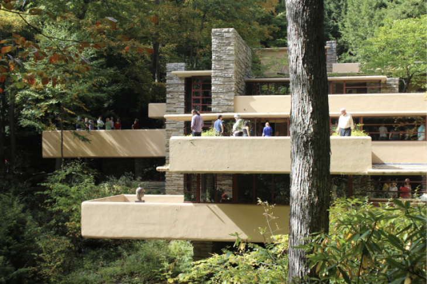

Fallingwater, the retreat Frank Llyod Wright designed for the Kaufmann family in the woods of Mill Run, Pennsylvania. Photo by R London, 2014, from Wikimedia Commons.

Thoreau’s Home on the Prairie | Goodnature

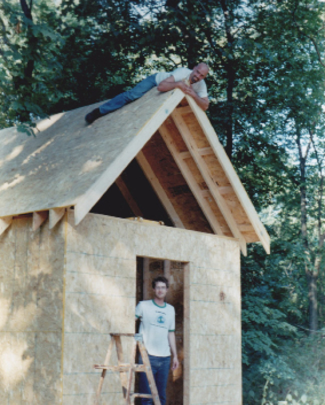

“walden on the prairie,” under construction. Photo courtesy of Paul Goodnature

Paul Goodnature’s finished cabin<Variable overset>

The author’s interpretation—located on Geneva Lake, Minnesota—of Thoreau’s home on Walden Pond. Photo courtesy of Paul Goodnature 

Prayerful Prairies | Sarnat

Prayerful Prairies 

by Gerard Sarnat

1. Whereby Sarnat The Gnat Flicked His Urban Prairie Silo 

I was a ruffian whose cooties lugeed and whizzed 

trudging O’Keeffe Grammar’s sludge which looked just like a funky Slushy. 

Mined sleetballs with gravel ripped off salt trucks 

to bilk protection gelt from flitty Iowa-nice 

Cornhusker booger-eaters whose crotches slipslid like on rollerskates 

when ambushed and swatted in Snowmageddon death match cakewalks. 

Witnessed Davey roust his evomitocious 

father from local bowling alley barstools before bouncers tossed the tomcat.

Stashed contraband Marilyn calendars 

Teddy presented to this rookie for manning his corner bookie newsstand

deep inside a 5 finger discount Walgreen’s bookbag. 

Lugged it four flights to the fam’s cold water flat 

past Mr. Hatfield’s ground floor guard station

where the landlord’s master of the manor, 

king of the castle, super of fu fa tenement dead-ender domains.

Mother revered the principal/home ec substitute, Mrs. Leech, 

whose sociology noodged me to be hall/eraser monitor 

since her tent dress became the tenant/hoarder 

under us whose touched-up skin sipped vodka/vermouth 

if her foul-mouthed hubby, the janitor/woodshop teacher, 

hit the grain whiskey to keep Bergen-Belsen tattoo demons at bay. 

Brown paper bag clutched, flowering it up with earflaps down, 

Stanley Hatfield sat on the stoop, 

jiggled skeleton keys dawn to dusk, 

bamboozled folks he didn’t cotton to shell out rent moolah or get the boot. 

Shakedowns so’s each unit’s paid-up on the barrelhead plus a smidge extra. 

Purged those whose number came up empty first of each month period. 

As funny money thin ice softened ‘n liquified, dirty coppers 

in Stan’s pocket’d take a taste then paper the halls with eviction notices 

before sofas ‘n worse kerplunked 

onto the sidewalk. Foot soldiers hoodlumed 

loveable rogue scofflaws to believe we’d be put on dry ice, cemented 

into Lake Michigan—which loose-bowelled bunco spiel hardened 

into shticks I ear-witnessed below the shudder of elevated Illinois Central trains. 

Nights I’d schlep down, con Stanley Sr.’s marbled daughter

whose vagarious weight you might guess at a country fair cattle call

to out-naked us all on the fire-escape

or loudmouth fat Stan Jr. to roll-up the steel shutters, 

open the front door for my big brother 

whom Miss Joy’s Mary Janes tensely resented. 

Not born till post hari-kari, the bomb and the Emperor surrendered, 

I remember what turned out to be ration books 

buried in Pops’ condom sock drawer. 

At the time my nuclear family of origin was shoehorned 

in Bubbe and Zeyde’s one room apartment. 

Mom and Grandma always on bad terms, rapscallion 

needed to be careful. Eventually Grandpa weaseled, told Dad to leave.

But Pops had mafia contacts 

who bribed the Hatfield missus some kind of yenta

to let him have our current place for two tanks of fossilized TRexs 

plus a week’s food coupons plus some unspecified “other favors” 

in her not-Rembrandt Netherlands—

that’s just how Chi-town was during the final stages of winning the war. 

Lucky GIs back from the front were overdomesticated 

by cutesies’ baser instincts to make too many babies. 

Ravenous Heebs scrambled to bootstrap beyond South Shore ghettocide, 

but no matter where we flocked, newly minted parochial school thugs 

pummeled up in my business 

unless I surrendered the cornucopia 

of Medimore’s penny candy, pocket change, crumpled Monroe nudies, 

a flask of rotgut swiped from Hatfield. 

2. Ready To Rumble

 “When I was younger I could remember anything, 

 whether it had happened or not.”

 —Mark Twain

i. 

Made my bones playing ledgeball on the block, but during college 

no taxi’d drive back into the Southside snatch-‘n-grab boarded up 

storefronts below Chicago’s elevated trains. Hertz’d have none of it; 

Avis required signing stacks of notarized waivers. Bounding four flights, 

I’m scrutinized by a scraggly old gent who cackled, Beg pardon, lookie 

we got here in Spookville!—slamming the door before could catch my breath.

Back in the 50s, 71st and Jeffery seemed just booooring Jewish

(no one’d buy Christmas cards I sold door-to-door) except my riverboat 

gambler Uncle Sugar whose fortunes handicapping the Daily Racing Form 

turned a 3-hole Buick Special into a jalopy into a cherry Impala with rims

—you know that kind of thingamajig. But thanks to auspicious demographics, 

later on playing with house money, I faked having survived the Blackstone Rangers.

ii. 

Planning better lives, when they got the chance my parents moved 

our quartet through prairie dog towns west to another walk-up 

in paradise so Sis and I’d do well at the best available LA public schools.

As it happened, right up the alley of my lifelong partner whom I’d eventually 

meet during high school, she spent indifferent time playing in the same alley 

—though we didn’t figure it out until four decades had passed.

When Dad’s finances afford it, he relocated us to a ramshackle fixer-upper

a few miles north in the part of town the world thinks of as Beverly Hills; 

the miniscule antique swimming pool’s hand-painted tiles were a drainless cesspit.

There no one played on the block or in the alley where only maids went.

Took months to get invited into mansions with triple-stemmed cherries, big rock 

candy soda fountains, tennis courts—if you can believe it, even Otis elevators. 

iii.

Harvard pre-med home the summer of South Central’s riots of 1965, I’d volunteered 

to administer vaccines at the Watts Health Center. Maneuvering to avoid pepper spray/ 

duck snipers in here while outside, establishments burned and Crips pulsated blood, 

jostled below window level by ex-gangbanger Community Organizer Julio Bates 

(nicknamed Master), my high-tops bid to establish bogus street cred 

based on résumé more than cajones: “No problemo. I was raised in Chiraq.”

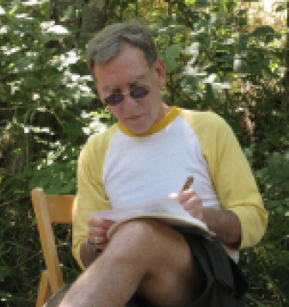

Photo courtesy of Gerard Sarnat

Gerard Sarnat is a physician who’s built and staffed homeless and prison clinics as well as a Stanford professor and healthcare CEO. His writing has appeared in U.S. outlets including San Francisco Magazine, The Los Angeles Review and The New York Times, as well as many international publications. His collections include Homeless Chronicles (2010), Disputes (2012), 17s (2014), and Melting the Ice King (2016). He has been married since 1969 with three kids and five grandsons, and is looking forward to future granddaughters. 

Prayerful Prairies | Sarnat

.jpg)

Photograph by Jun Taek Lee

Tortilla Pooris | Jain

Author photoPatuis pora? Qui sentum lis consimus, opubli,

Photo by Claire Ledwith

Anjali Jain is an artist, technician, dancer, amateur cook, reader, ethnographer, dobro player, and day-dreamer from Saratoga, California. Although she herself is not from the Midwest, her time at Grinnell College and her parents’ Midwestern childhoods have helped her to feel a deep-rooted connection to the area. She frequents Iowa City during her time at school, and the time she has spent in her father’s hometown has enabled her to get better acquainted with the stories of her family. This piece is a narrative analysis of her own life, interspersed with excerpted interviews conducted with family members—primarily her father, aunt (Bua), and grandfather (Dada).

Tortilla Pooris* (and other kitchen experiments)

by Anjali B. Jain

When my Dada, my paternal grandfather, moved to Iowa City in 1967, there were approximately one hundred Indian students at the University of Iowa, and only five Indian families in Iowa City. My Dada was one of those students, and my family one of those families. Iowa in 1967 was not equipped to, nor was it conscious of, maintaining space for Indian food, lifestyles, and culture. That trailmaking for the Indian community that exists in Iowa City now was in part due to those five Indian families who, despite being in the middle of prairie and cash-crop corn, learned to find ways to continue to cook Indian food and live as a close-knit community.

When my Dada moved to Iowa City, he subsisted on a dabba containing spices from India to maintain a tie from home. By the time my Dadi, my father, and my Bua joined him in 1968, there were enough Indian families to buy Indian spices through the post. 

Dada: You see, I got some spices from India when we came so I had a…Masala dabba we call it, some spices. But there was no way I could get the grocery from India so [laughs] I had to buy them here. Basically [only] a few items were available and I was able to just cook those. I came in ‘67, and [Dadi] came in February ‘68. And at that time there were five Indian families in town. So all these five Indian families will get together, and we used to [order] grocery from New York. And at that time, if you order more than twenty-five dollar worth of grocery the postage was free. And one family couldn’t afford to get the grocery of twenty-five dollars because twenty-five dollar was at that time, was a lot of money.

 So each family will contribute five dollars and order for twenty-five dollars and then we just used to split all those things. 

Something as simple as free postage brings people together. I like to think that it was the simplicity of it all that made those bonds so tight. Although in the short- term my family may out of simple necessity have bonded with the people around them who shared their looks, their food, and their culture, it came to mean decades of those same Friday night dinners. Eventually, coming together was no longer about finding space for Indian food in Iowa. However, those nights of food and cards remained the way to swap methods for adapting Indian dishes with new ingredients, for watching each other’s children and grandchildren, and for cultivating family away from family.

I didn’t grow up in that core community, but I grew up on its stories and traditions. Visiting Iowa City from my hometown in California was always a window back into that familial past. When my family would get together and snack on chaat or have big cups of chai, there would always be stories about the big weekend potlucks.

Bua: Oh, growing up it’s like Friday came and you know—you were like “Ok, who’s house are we going to dinner at?”

Continuously hearing those stories, I have always been struck by the parallels to how my family operates now; long dinner tables (covered in a Fabindia tablecloth), the regular dishes: aloo gobi, raita, chaval, kaddu, poori…. The same people, lined up along the sides of each table; sometimes nine, sometimes thirteen, sometimes twenty-something. The same conversations about sales at different supermarkets, and updates on different relatives’ lives. Every dinner had multiple courses. The actual meal was usually followed by multiple rounds of fruit and chai, met with protests of “Oh no, I’m too full,” followed by everyone somehow finding room for more food. The decks of cards for teenpatti would be whipped out sometime around ten o’clock, and round after round would begin, until at last the people who had abandoned the game were sleeping on the floor and had to be dragged home. Although we now end the night at two or three in the morning, it used to be different. When my father was growing up kids used to spend the night at the house of whomever was hosting.

Bua: “...whose house are we going to dinner at?” ’Cause you knew that’s where you were having breakfast.

Although I never attended the weekly potlucks that happened every Friday night as my father was growing up, I still start and end my nights with my family the same way he did: by sitting down at a familiar table, overeating and playing cards until two in the morning. Although I never ate the marshmallow rasmalai my Dadi attempted to make in one of her many kitchen experiments, I did eat pooris made by frying store-bought tortillas (another kitchen experiment). 

According to many members of my family, passing down recipes is not a large part of how they think about food. Although foodways are passed down, it is not through an ordered sense of tradition. After she passed away, I remember my Dadi through how her food tasted, how she particularly favored one spice over another. Anytime I tried to learn to cook from her, she insisted that I feel out how much of each ingredient to put in (she never measured!)—the point was to understand how to use each spice to create a dish, not to recreate her way of cooking exactly. I know that no one will ever make a dish the way she did. It is a different kind of history, but it is one that I value above having recipe cards of her food.

Dada: So in India, again, we don’t have these recipes, nothing like that. Once you know how to make potatoes, then you can make zucchini, you can make any vegetable just once you know. You need to learn only one vegetable, and then you can make all of them. Same thing with daal, if you know how to make one daal, you can make all daals like that. So...so it was simple. I think, cooking here. I don’t know why they think it is so complicated, because they have to go through recipes and we don’t have.

I would say that there is a lot of recently-developed history in the food traditions that my family and extended family hold. And there is a tradition that can be created without intention—tradition that is simply made through love and generosity towards family. My Dadi and her friends (my father’s and my Bua’s aunties) would talk about these traditions as simple parts of life. All of these events, the cooking large dinners for everyone, finding ways to make Indian food out of American food, were never considered tradition or the start of tradition. Rather, they were a part of everyday life living as an Indian in Iowa City. And yet, those everyday aspects of life in the 60s have persisted even now. And even though cooking is supposedly not passed down all that often, cooking was learned, and was shared within the Indian community. It became an impromptu family, and a family that unintentionally blended cultural traditions of passing down food.

Bua:  Even Aunty talks about it—they [Dadi and others] talk about how simple life was then; how much fun it was experimenting, and you know, you discovered one thing and you’d share it with everybody, and it was just so fun.

 

Papa: And then when new families came, they were the ones that taught everybody, that this is what you can do and this is how you make this or....

Bua:  And even at the hospital, Aunty came and was talking about how she learned cooking from [Dadi]. So many people learned cooking from her. 

That is why the members of those families who are still in Iowa City are considered family, and that is why I have such a strong relationship with family and food. That same sharing that still persists now has shaped the way I have come to think about food.

There are many things that have changed about Iowa City since 1968. The airport that my father flew into no longer accepts commercial flights; when I fly into town to visit, I come through Chicago O’Hare or Cedar Rapids. One thing that I know hasn’t changed is the drive from any of those airports in February—down the highway, past snow-covered fields; spindly trees gathered in the distance, everything soft as if drawn in slightly-smudged colored pencil. Both my father’s and my first snows were in the Midwest, although his was when he stepped off a plane in Iowa City in February 1968; mine, looking out the window of his childhood house as an infant. It is these small details that make me feel connected to the history that is so important to my family.

The truth is, when people ask me why I came to school in the middle of Iowa, I have no way to explain that I don’t find it that odd. After all, moving from the San Francisco Bay to Grinnell in 2017 is far less outside-the-box than moving from India to Iowa City in 1968. And every time I go to Iowa City, I see how happy my family is after more than 50 years there. I see how the members of two of those four other Indian families have come to be grandparents, aunts, uncles, and cousins to me. I see how community developed in a place where they weren’t expected to develop, and how those deep connections remain. And I know that if my father’s family could make it that far in the prairie, then I also have a shot.

Glossary:

 Aloo Gobi: Potatoes and cauliflower

 Aunty/Aunties: Female adults one generation older than oneself

 Bua: Father’s sister, however can also be extended to people who fill a similar role/closeness.

 Chaat: Indian snacks that almost function as their own seperate meal/time. Perhaps the best way to explain it is the Indian version of High Tea. Google it (it’s hard to explain).

 Chai: Tea

 Chaval: Rice

 Dada: Paternal grandfather, however can also be extended to people who fill a similar role/closeness.

 Dadi: Paternal grandmother, however can also be extended to people who fill a similar role/closeness.

 Kaddu: Pumpkin

 Masala Dabba: A spice container

 Poori: An deep-fried Indian bread made with a whole wheat dough

 Raita: An Indian side made with spiced yogurt or buttermilk, with various other ingredients.

 Rasmalai: A Bengali dessert, made with cheese dumplings soaked in spiced, sweetened condensed milk.

 Teenpatti: Three-card poker

*See glossary at the article’s end

Every dinner had multiple courses. The actual meal was usually followed by multiple rounds of fruit and chai, met with protests of “Oh no, I’m too full,” followed by everyone somehow finding room for more food.

Tortilla Pooris | Jain

My Integrated Life (Part II) | Brown

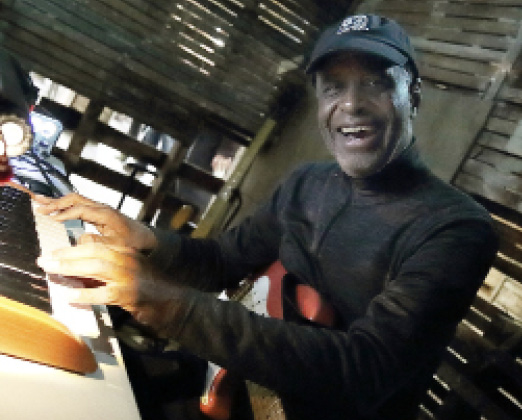

Photo by Dan Welk for Click Photography. Except where noted, all other images courtesy of Dartanyan Brown

Dartanyan Brown  is an Iowa musician, journalist and educator with a 40-year career in the arts. He is an inductee into the Iowa Blues, and Rock ‘n Roll Halls Of Fame. Dartanyan and his late father Ellsworth Brown are both inductees of the Iowa Jazz Hall of Fame. He lives in Des Moines, Iowa with Visual Artist Paula Egan. 

*References listed in Endnotes

My Integrated Life*

(Part II)

by Dartanyan Brown

In Volume V, Issue 1 of Rootstalk1, Dartanyan Brown told the first of three installments in a remarkable story. A native Iowan and African American, born in the Midwest at nearly the exact middle of the 20th Century, he was front-and-center for many of American culture’s most defining struggles, particularly the Civil Rights movement and the advent of revolutions in music and technology. Where many people content themselves with one career, Brown has had at least four: in journalism, in musical performance, in the tech sector and in education. 

The story Dartanyan began in our last issue told of his musician parents, his early years as a journalist with the Des Moines Register2, and his adventures in the burgeoning musical—and cultural—scenes of the 60s and 70s, when he began playing Rock-n-Roll, blues and jazz with various Midwestern bands. In the spring of 1973, he hit the big time when he was called to join Chase, the Jazz-Fusion band fronted by seminal trumpet player Bill Chase3. 

That’s where Dartantyan’s story picks up in this issue. Though he didn’t know it at the time, his story was destined to have a few more dramatic turns, and he was going to be at the forefront as our culture changed—dramatically—yet again. 

As I write this, I realize that it’s 46 years ago this month (April 2019) since I packed up my gear and headed for the Des Moines airport, ready to fly off to Chicago into what would be one of the most significant periods of my life. 

The flight from Des Moines wasn’t long, of course, and upon arriving at O’Hare Airport I was met by one of Bill Chase’s managers. With the late afternoon becoming evening, we whisked down the Dan Ryan Expressway into Chicago’s storied North Side to the corner of Rush(!) and Walton Streets—the site of The Universal Recording Corp4. 

This is where the Chase band rehearsed and recorded their albums too?? Whoa! 

Once inside, we took an elevator to the second floor where I was led down a short hallway and through a set of doors into the massive Studio A. There I saw my hometown friend Tommy Gordon5 seated at the drums in the center of what appeared to be a jungle of microphones and cables. On his left the four trumpet players—Jerry Van Blair6, Jay Sollenberger7, Carl Haefli and Bill Chase, at six foot four, literally towering over the other horn players who were warming up. On Tommy’s right was guitarist Tony DiCaprio8 and organist/electric piano/synthesizer player Wally Yohn9 from Phoenix, Arizona.

Surveying my new surroundings, I saw a big window on the south wall behind which was the control room with its massive (for those days) 24-input Harrison Console, 16-track Ampex tape machines, and, most importantly, one Murray Allen.10 

Murray was chief engineer and arguably one of the most experienced audio engineers in the world. He oversaw recording sessions with virtually every major recording artist of the late 1950’s, and until his passing in 2006 he was the chief sound engineer for the Grammy Awards Show. 

 To digress for a moment, Universal Studios was the brainchild of Bill Putnam, Sr.11 who founded Universal Recording Corporation in 1946 in Evanston, Illinois. Putnam founded the company to investigate new recording techniques and to develop specialized recording equipment. In 1947, Putnam moved the company to Chicago, where the Harmonicats12 recorded the first pop song featuring artificial reverberation: “Peg o’ My Heart.” The song sold 1.4 million copies, and the subsequent jump in income and new business also brought about a jump in Universal’s stature in the music industry. Soon artists including Patti Page,13 Vic Damone14 and Dinah Washington15 were recording there, and Al Morgan’s “Jealous Heart16” became the second million-selling record the studio was associated with, coming out on the in-house Universal Records label. 

Universal was central to the development of experimental studio techniques including the first use of tape repeat in a recording, the first isolated vocal booth, the first recording with multiple overdubs of a single voice, early 8-track recording trials, and the first experiments with half-speed disc mastering. 

On the spring day of my arrival, as I looked around Universal’s massive studio—with its once-white walls now a time-worn beige—I drank in the art, culture and technology that resided in this hallowed audio creation space. As an innocent kid out of Iowa, I really had no idea of the actual business of music, but looking around you could tell they were recording a lot more than just rock bands. 

As I later learned, Universal turned out soundtracks for movies and television shows, orchestral performances, radio plays with sound effects, commercials for television, radio, limited distribution recordings for business, public service announcements and hundreds of other applications for sophisticated, cutting edge sound recording, mixing and distribution techniques. This would be my workplace for the next 15 months!

 At the time, though, I realized that the next 15 minutes were the real challenge.... The time had come to pick up my instrument and make sense of the charts that were placed in front of me for my first rehearsal session. 

The first chart we played was the band’s hit song “Get It On.17” 

I’d heard it countless times. Beneath all the fury and energy, it’s really just a souped-up blues structure. I looked at the chart and was able to recognize the overall piece, but as we kicked it off I realized two things: 

1. These guys played really fast, and 

2. My bass sound disappeared in the mix due to my lighter ‘jazz’ approach to the chart. 

I learned then and there that Chase was a jazz-ROCK band. 

That meant that we could play as subtle as we wanted—at 120 decibels! Oh god, the little jazz club-type amp that I pushed my bass through was less than inadequate. (Imagine a kazoo with the Chicago Symphony Orchestra) The road crew went out and found a bigger amplifier for me and then came the next problem….

I knew “Get It On” because I had heard it a million times but what about the rest of Bill’s compositions? 

Time signatures of 9/4, significant solo spaces, and very intricate rhythmic and harmonic devices demanded full attention (and sometimes that wasn’t enough). Here I was in Chicago thrown headlong into the deep end of the talent pool, and if I didn’t get it together fast…well…going back to Des Moines wasn’t a fun thought. 

The band lived at the Marilyn Hotel less than a block from the studio. It was a busy place where traveling musicians stayed during their Chicago runs. It was there that I met guitarist Barry Finnerty18 and woodwind master Arnie Lawrence19. Both of them were playing and recording in Chicago with the great drummer and composer Chico Hamilton.20 Barry and I were both 23, and while this was his first ‘big time’ gig, a few years later, in 1978, he would record with the Brecker Brothers21 jazz-fusion band on Heavy Metal Be-Bop,22 and then, in 1981, with Miles Davis23 on The Man with the Horn.24

Arnie, born in 1938, was a veteran woodwind player who had played with Charles Mingus,25 Thad Jones,126 Maynard Ferguson,27 Clark Terry28 and Duke Pearson,29 and was first recorded in 1966, playing on Chico Hamilton’s The Dealer.30 

As the three of us became friends, I related how tough it was for me to learn some of Bill’s music. 

“Come on over to my room, I’ll show you some ways to learn faster,” said Arnie. And boy, did he. He was a natural teacher, and his sessions—on learning how to subdivide measures, how to deal with Latin clavé variations, and how to create rhythmic phrases—were mini-master classes without which I might not have survived the experience. Arnie Lawrence and I would meet again six years later at Duke University as Jazz-Artists-In-Residence with the National Endowment for the Arts.31 

One more thing…

Now that I was actually playing bass with the band, there was yet another unsettling new development in the offing. 

Chase fans familiar with the group’s sound on the first two albums know that Terry Richards32 and GiGi Shinn,33 were two of the most capable white blues shouters you could find in that day. These two guys had all the blue-eyed soul you could ask for. 

Me? I weighed 145 soaking wet and my voice, while scat-singing-capable, was about as far as you could get from a classic “soul” voice.

When I arrived on my first day at Universal studios, I noticed that while we were playing the songs, there was nobody singing the songs. Curious.

Later, I found out why: Bill had decided (aided and abetted by Tommy Gordon) that I should be the new lead singer for Chase. 

I didn’t believe it at first, but I was told this was not a joke, but my new reality. The number of vocal numbers was to be drastically reduced (and that was good) but I would be the one singing “Get It On” as the last song before the end of the show/encore (and that, as it seemed to me, was very bad). 

I put on a “let’s-go-for-it” face to the band, but inwardly, I was aghast. There was no way I could fake a soul voice. Too thin, too reedy, no heft there, in my personal estimation. 

After our first concert in El Paso, and for the next two shows, I was getting pretty low. Even with enthusiastic response from the audience, I still felt vaguely fraudulent—and I think Bill noticed because he took me aside.

“You’re in this band because you’ve got what it takes,” he told me. “Hell, you’ve got more than what it takes. Just be yourself and do the song your way.” 

Boy, did that make a difference. I relaxed a bit about singing, and instead of trying to be ‘them,’ I discovered ‘me’. Tommy and I were now free to create a swinging rhythm section with guitarist Tony DiCaprio and keyboardist Wally Yohn. 

Taking on the challenge of being lead vocalist/bassist with Chase on the road was its own reward. Discovering that my sound could be an important addition to the band produced a feeling more of gratitude than pride. In the ensuing months, we headlined with classic 60’s-70’s artists including Spirit,34 Jim Croce,35 Harry Chapin,36 Sly and the Family Stone,37 The Spinners,38 Kenny Rogers and the First Edition,39 and a bunch more that I don’t remember. So, though my transition to lead vocalist/bassist with Chase on the road had started weird, we got it done and all turned out well.

Chase on tour

The cool thing about a bus ride with the band is that you’ve got a lot of time to do whatever. Some guys practiced, some guys slept, some guys read, some guys talked, and talked and talked. Some of the best road stories you’ll never hear. Colorful and crazy, bawdy banditry, teary stories of lost loves, triumphant gigs in dive bars or crappy gigs in famous venues. Like sailors before them, itinerant artists relating stories full of humanity’s triumphs and tragedies. Road stories from the older musicians served to hip us younger guys (almost no girls in these bands) to the reality of maintaining your sanity and humanity while traveling 400-1,000 miles between engagements. 

The memories of that first tour are a blur. What I do remember are some numbers:

5,000 people to see the band

140 decibels (inside an auditorium) 

2 Ringing ears 

1 sore wrist from signing autographs

400 watts (I needed a bigger amplifier)

1 burning question: Can I do this forever?

I discovered that being the lead singer for Chase was fun on the road, but in the recording studio, it turned out to be quite a different matter! 

Straaaangs not strings

The recording experience at Universal Studios was awesome, but one moment remains hanging in my memory closet like a forgotten clown suit. There was a new song to record, a potential single titled “Run Back to Mama.” It was written by Jim Peterik40 and Bill Chase. The chorus had a tagline: “Will you always be tied to those apron strings?” It was a weird, pejorative little anthem to male superiority (and we actually had another piece entitled “Weird Song #1” on the record!) As I mentioned before, the previous two Chase lead singers were leather-lunged white soul shouters. Me? Not so much. 

When producer Frank Rand41 would listen to me sing that tagline, he’d invariably stop the tape and ask me to “sing it blacker. He’d draw it out saying: “Don’t say ‘strings’ say ‘straaaaangs.’” 

Well, we went through this frustrating ritual for another 10 attempts to ‘blacken up’ my delivery of the tagline before Frankie gave up and replaced me with Peterik, a white guy who could sing it as “soul” as Frankie wanted. I wasn’t in the least bit bothered about it because:

a. I couldn’t actually sing the style he wanted and,

b. The song was panned by Downbeat magazine42 as perhaps the most sexist song of 1974. So there’s that….

Boston—April, 1974

The Chase band was a virtual rollercoaster of experience for me. I joined in April 1973 and by April 1974, the band had broken up (twice!), reformed, recorded a great album and was now preparing to hit the road to promote it. 

At that time, hit-making jazz musician Herbie Hancock43 was also completing his groundbreaking jazz-fusion album entitled Headhunters.44 Both Herbie and Bill Chase were signed to the same label—CBS/Epic Records—and the promotion department put us together on an East Coast tour covering Boston and New York City. 

This was our second tour with Herbie. In mid-1973 we had played a series of shows in Boston together. Both bands hung out quite a bit, watching each others’ performances. Our drummer Tommy Gordon and I became friends with Herbie’s bassist, Paul Jackson.45 

Several nights into the series, some of us decided to head out into the Boston evening to find food, fun, and who knows what else. 

It was a clear starry night and the wind coming out of the East was cold and steady. Tommy had been a cab driver in Boston (that was a good thing for the rest of us). I’d never been to Boston before, and the streets are notoriously serpentine with intersections which angle in ways that would mystify Pythagoras. Tommy was in the back seat, Jim Oatts46 was driving and the rest of us were wildly riding with not a care in the world. 

We somehow broke out of the maze of streets and got onto a stretch of freeway. The moon was full, joints were rolled as we rolled along enjoying the evening and our general living-the-dream circumstances. Blissfully unaware, Jim took an exit off the freeway. The exit, which we barely acknowledged, appeared to be a flyover that would take us back in the direction we had come from. 

For a freeway overpass, it was a fairly steep climb and in the back seat, I could feel acceleration and gravity pulling me deeper into the cushions. 

It was at that moment that Tommy sitting next to me said, “Ah, Jim stop the car…” 

Well, his admonishment was lost in the din of the conversations and Jim certainly didn’t hear Tommy as he rocketed up the exit ramp, laughing with someone in the front passenger seat. 

“STOP THE CAR NOW!!” 

Yelling from the back seat, Tommy got Jim’s attention, and fortunately Jim instantly mashed the brake pedal bringing the car to a halt less than 300 feet from the lip of an unfinished freeway flyover hanging 20 or 30 feet in the air. 

I’ll never forget the full vanilla moon above us almost beckoning, siren-like for us to come and meet her. We had almost played Jason to her siren call, somehow blissfully unaware of the DANGER NO EXIT—UNDER CONSTRUCTION sign that we had blown right by at the bottom of the ramp. We had been on our merry way to what could have been a tragicomic Rock ‘n Roll footnote.

I’m not really sure how long it took for Jim to hit reverse and back our way down the unfinished exit. It might have been an hour, with all of us sitting up there in silence contemplating what had almost happened. Of course, it might have been a couple of minutes of stunned silence followed by “holy crap, man.” 

For one evening, we were thankful we could go back to the hotel, order room service and watch Johnny Carson on TV. 

Almost a year later…. In April 1974, Chase—now with Walter Clark on drums—and Herbie Hancock’s Headhunters played Boston again, and you can imagine how thankful I was to be playing this gig after our experience the year before. 

School? Famous band? School? Famous band? 

There is an old saying: “Be careful what you wish for because you just might get it.” 

Sly Stone put it a different way: “The nicer the nice, the higher the price.” 

After a tumultuous year in rock ‘n roll’s fast lane I found myself onstage thinking: “Man, it would actually be great to be off the road and back in college again.” Contrary to popular lore, the reality of the traveling musician was often 180 degrees opposed to the Rolling Stone version. “Sex, Drugs and Rock ‘n Roll” could devolve into “stress, drudge and hard-as-rock rolls” in crappy restaurants. Personnel changes and the economics of keeping a nine-piece band afloat took their toll on Bill, but The Great Energy Crisis47 of 1973-74 really took the bloom off the rose. 

We weren’t really paying attention to the international situation at the time, but during the Nixon administration, the emergence of the cartel of the Organization of Petroleum Exporting Countries48 (OPEC) raised the price of a barrel of oil from $3 a barrel to over $12 a barrel. That got our attention! 

The resulting shock to the economy disrupted any business that was connected to the price of oil—which was pretty much the entire economy. The music business was materially impacted because: 

1. Bands on the road (and practically every other form of commerce) were dependent on gasoline, and 

2. The recording business was using petroleum-based vinyl for making phonograph records, the preferred medium of the booming music business. 

Even very successful bands and traveling entertainment were negatively affected. For a successful but capital-intensive venture like the Chase band, the business model became almost immediately untenable. 

The point was driven home during an 1,100-mile trip from Nashville to Boston. (That is, “We play in Nashville tonight guys, tomorrow night we play in Boston!”) This was during the midst of the energy crisis when stations were literally running out of fuel at any price. Driving through the Allegheny Mountains, we passed hamlet after hamlet with closed gas stations and “No Gas Available” signs dotting the landscape. 

By this time, in the dead of night, our tanks were almost on “E,” and we were praying we wouldn’t run out of gas before reaching someplace that might loosely have been termed “civilization.” By the grace of the rock ‘n roll angels, we entered a downhill grade and coasted into a closed gas station, stopping beside its only gas pump. Exhausted, we all passed out until sometime around 6am when the owner tapped on our window, woke us up, filled our tank and sent our sad little delegation on its way to Beantown. We made the gig with about 30 minutes to spare on the other end. 

 At this point, I realized that many of the things I had learned to value were missing in a life lived out of an airport terminal or hotel suite. The realization slowly dawned that I really was a nerd at heart, and I missed school and more intellectual sustenance. 

In the face of the rigors and struggle of touring, the stability and predictability of the academic life (as well as the unfinished business of my J-School degree) started to look better all the time. During a break in the tour, I actually went to Drake49 and inquired about the process of dropping back into college again. 

The reply I received was positive, and I even found that a fellowship supported by the Register and Tribune was available. 

Buoyed by the possibility of NOT being on the road forever, I rejoined the band. Because of my research, I didn’t feel as locked into the rock ‘n roller coaster as I had before. And that, as it turned out, was a very good thing. 

Great music leavened the crazy life offstage. 

Though I was conflicted about road life, the band itself was getting better all the time. My friend Tommy Gordon had left the band, but Walt Clark, our new drummer, was incredible. Our rhythm section came alive, pushing Bill, Wally Yohn, guitarist John Emma50 and the other soloists to even more incredible solos and ensemble work. So the whole “rock star” experience was really bittersweet. 

We were in Houston, playing what would be our final show, when Bill took me aside after a set:

“Dartanyan, I have been thinking about dissolving the 4-trumpet version of the band and starting a new group with just myself and a rhythm section. Will you consider being part of the new group…?”

Seriously?! What he said rolled over my brain like an earthmover. He was offering me a bass player-vocalist gig and a position as a co-writer in a new band with new music. (Bill and I had already co-written a promotional project for the Gibson guitar company) 

Now I was really conflicted. I hadn’t told anyone that I had been thinking about going back to school, and with this latest development, I realized I had some major decision-making to wrestle with. 

Bill told me I should think about his offer and give him an answer at the next show, scheduled 10 days hence in Jackson, Minnesota. 

I hadn’t seen my mother in months, so before heading to Minnesota, I grabbed a flight to Kansas City to visit her at Unity Village51—headquarters for the Unity Church founded by Charles and Myrtle Fillmore in 1889—in Lee’s Summit, Missouri.

Mom was in her last year of study on the path to ordination as a Unity Minister. She would ‘graduate’ in August 1975. It was now late July 1974 as I drove out to visit with the future Rev. Mary Alice Brown. 

Since I had left school under less-than-optimal circumstances nearly four years earlier, we had actually become able to laugh at how my act of “falling up” was truly a great lesson…if only we could discern what it was.

Well, now it was time to either ‘fall back’ into college or continue chasing a rock ‘n roll phantom that still seemed mighty real.

How was I to balance the fact that while, yeah, road life was hard, the rewards it offered were compelling? The band was great; we had survived a lot of shit together and now I was being asked to form an even closer relationship with Bill Chase, a man that I highly respected as a musician and now a good friend. 

School? Famous band? School? Famous band? 

These were the thoughts clanging endlessly in my head between July 20, and August 9, 1974. Like an angel on one shoulder and a little devil on the other, the dialog was constant. 

Devil: “Dart, don’t be a square. You can always go to school, but you can’t always tour with a great band.” 

Angel: “Now, Dartanyan, you know that you made a commitment to your education. Stop this madness and return to your ‘normal’ life.” 

On August 9, I was driving with Jim Oatts, Jay Sollenberger and Joe Morrissey52—the Chase trumpet section—as we made the rain-soaked drive to Jackson, Minnesota from Oatts’ parents’ house in Jefferson, Iowa. 

Bill, along with keyboardist Wally Yohn and new members Walt Clark and guitarist John Emma were flying in a private plane from Chicago for our concert at the Jackson County Fair.

We endured a combination of late summer tornado-like winds and sheeting rain and even hail at times. We barely made the 135-mile drive to Jackson and in normal times, I would’ve been with the guys flying from Chicago, where I lived.

My decision-making process seemed to mirror the storm outside, but I had finally decided what I should do. I was going to tell Bill my decision on seeing him at the show but….

We never ever saw each other again. The rest of us later learned that the plane carrying Bill Chase, Walter Yohn, John Emma and Walt Clark had crashed 300 feet short of the runway in the blinding storm, killing everyone on board. Suddenly and irrevocably, everything was over. 

Returning to Chicago was pointless. It was time to close the loop and prepare for whatever life had in store for me next. 

On my earlier visits, I had already begun processing the paperwork for my re-admission to Drake University, so by September 9, 1974, I began working with Professor Joe Patrick on completing a BA in news-editorial journalism. I also re-joined the Drake Jazz Band, directed by Robert Weast.53 I earned that J-school degree on August 5, 1975, the same day Reverend Mary A. Brown was ordained as a Unity Minister in Kansas City. The timing seemed sublime. 

In the next issue of Rootstalk Dartanyan Brown will tell the final part of his remarkable story, in which he plunges into the Tech Revolution, and reconstitutes himself again in one of his longest incarnations—that of teacher.

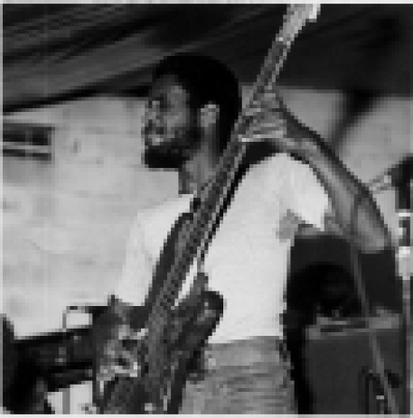

Dartanyan Brown onstage with Chase in 1973, “exploring the lyrical qualities of his ax”

My Integrated Life (Part II) | Brown

Bill Chase onstage with keyboardist/synthesist Wally Yohn

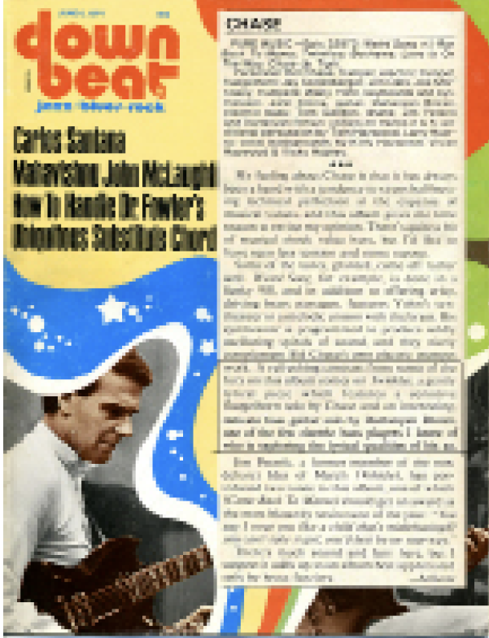

Downbeat Magazine’s review of “Pure Music,” featuring a prominent mention of Dartanyan Brown’s contribution

My Integrated Life (Part II) | Brown

“You’re in this band because you’ve got what it takes,” he told me. “Hell, you’ve got more than what it takes. Just be yourself and do the song your way.” 

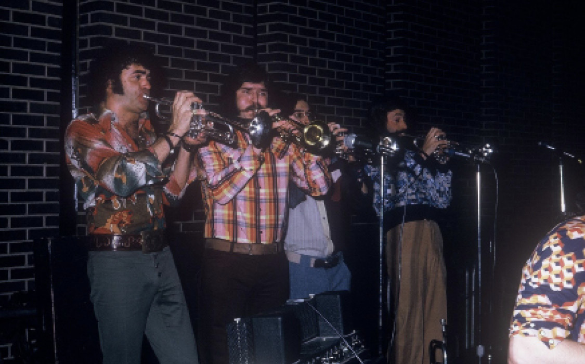

The Chase horn section in full cry: (from left to right) Bill Chase, Jim Oatts, Jay Sollenberger and Joe Morrissey

My Integrated Life (Part II) | Brown

[B]lissfully unaware of the DANGER NO EXIT —UNDER CONSTRUCTION sign...We had been on our merry way to what could have been a tragicomic Rock ‘n Roll Footnote.

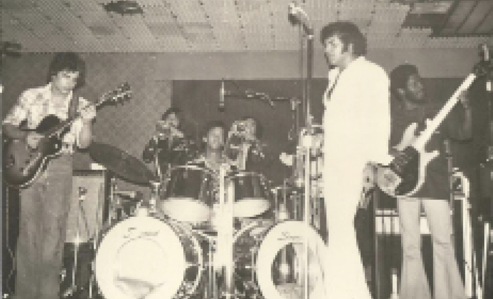

The final incarnation of the Chase band. From left, John Emma (guitar), Jim Oatts (trumpet), Walter Clark (drums), Jay Sollenberger (trumpet), Bill Chase and the author, on bass

My Integrated Life (Part II) | Brown

What he said rolled over my brain like an earthmover. He was offering me a bass player-vocalist gig and a position as a co-writer in a new band with new music.

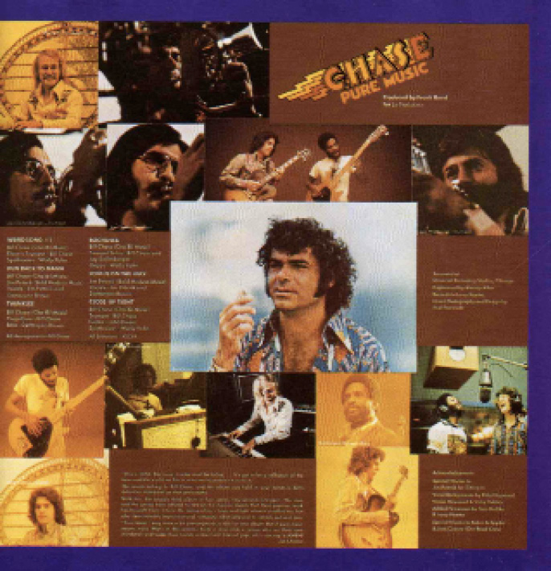

The liner notes for Chase’s third and final album, “Pure Music” with Dartanyan Brown appearing in four photos

 

 

Endnotes

Endnotes 

Publisher’s note: "What Makes A Hero? Remembering Bill Stowe (1959-2019)” 

1 Emily Kratzer, “A Hero’s Welcome: Homecoming and Transition in the Trachiniae,” Transactions of the American Philological Association 143 (2013) 23-63

2 Robert Kuhn McGregor, A Wider View of the Universe: Henry Thoreau’s Study of Nature (1997, University of Illinois Press)

3 Ada Hayden, “Conservation of Prairie,” Iowa Parks: Conservation of Iowa Historic, Scenic, and Scientific Areas (1919, State of Iowa)

4 https://www.sparknotes.com/lit/odyssey/themes/page/2/

"Why Drive to Central Nebraska During a Winter Weather Warning?"

1 Edgar “Bill” Nye, 1850-1896 , humorist and editor of the Laramie Boomerang, was the first to use this phrase in describing the Platte River, to which he added, “too thin to plow and too thick to drink.”

2 Naturalist Robert Tory Peterson, author of Birds of Eastern and Central North America and other field guides published by Houghton Mifflin Harcourt Brace.

“My Integrated Life (Part II)”

1 https://rootstalk.grinnell.edu/article/my-integrated-life-part-i

2 https://www.desmoinesregister.com

3 https://en.wikipedia.org/wiki/Bill\_Chase

4 https://en.wikipedia.org/wiki/Universal\_Audio#cite\_note-2

5 https://cibs.org/events-programs/iowa-blues-hall-of-fame/tommy-gordon

6 https://www.discogs.com/artist/370888-Jerry-van-Blair

7 https://www.discogs.com/artist/390313-Jay-Sollenberger

8 https://www.discogs.com/artist/2817797-Tony-DiCaprio

9 https://www.discogs.com/artist/390315-Wally-Yohn

10 https://www.mixonline.com/recording/murray-allen-1930-2006-425060 

11 https://en.wikipedia.org/wiki/Bill\_Putnam

12 https://en.wikipedia.org/wiki/Jerry\_Murad%27s\_Harmonicats

13 https://en.wikipedia.org/wiki/Patti\_Page

14 https://en.wikipedia.org/wiki/Vic\_Damone

15 https://en.wikipedia.org/wiki/Dinah\_Washington

16 https://en.wikipedia.org/wiki/Jealous\_Heart

17 https://www.youtube.com/watch?reload=9&v=C4SW2Z3\_d8I

18 https://www.barryfinnerty.com

19 https://www.allmusic.com/artist/arnie-lawrence-mn0000929868/biography

20 https://www.discogs.com/artist/70526-Chico-Hamilton

21 https://en.wikipedia.org/wiki/Brecker\_Brothers

22 https://en.wikipedia.org/wiki/Heavy\_Metal\_Be-Bop

23 https://www.milesdavis.com

24 https://en.wikipedia.org/wiki/The\_Man\_with\_the\_Horn

25 https://mingusmingusmingus.com

26 https://thadjones.jazzgiants.net

27 https://en.wikipedia.org/wiki/Maynard\_Ferguson

28 https://clarkterry.com

29 http://www.bluenote.com/artist/duke-pearson

30 https://www.allmusic.com/album/the-dealer-mw0000208016

31 https://www.arts.gov

32 https://www.discogs.com/artist/370882-Terry-Richards

33 https://www.discogs.com/artist/370886-G-G-Shinn

34 https://en.wikipedia.org/wiki/Spirit\_(band)

35 http://jimcroce.com

36 https://harrychapinmusic.com

37 https://www.slystonemusic.com

38 https://en.wikipedia.org/wiki/The\_Spinners\_(American\_R%26B\_group)

39 https://en.wikipedia.org/wiki/Kenny\_Rogers\_and\_The\_First\_Edition

40 http://jimpeterik.com

41 https://www.discogs.com/artist/304937-Frank-Rand

42 http://downbeat.com

43 https://www.herbiehancock.com

44 https://www.herbiehancock.com/music/discography/album/673

45 http://www.pauljacksonbass.com

46 https://www.iowarocknroll.com/jimoatts 

47  https://www.history.com/topics/1970s/energy-crisis

48 https://www.opec.org

49 https://www.drake.edu

50 https://www.allmusic.com/artist/john-emma-mn0001615986

51 http://www.unity.org

52 https://www.discogs.com/artist/2466330-Joe-Morrissey

53 http://dmcommunityjazzcenter.org/HallofFame/tabid/86/articleType/ArticleView/articleId/27/Robert-Bob-Weast-2007-Inductee.aspx

"Cheyenne Bottoms: the Indispensible Kansas Wetland You Never Knew About”

“Cheyenne Bottoms Wildlife Area.” Natural Kansas. www.naturalkansas.org.

Kansas Wetlands Education Center. www.wetlandscenter.fhsu.edu.

Laux, E. Vernon. “In the Prairie Heartland a Wealth of Shorebirds Gathers.” The New York Times 12, June 2001. 

Robl, Frank W. “The ‘Duck Man’ Writes About Cheyenne Bottoms.” www.kansasmemory.org. 

Senner, S. E., and E. F. Martinez. “A Review of Western Sandpiper Migration in Interior North America.” 

The Southwestern Naturalist 27.2 (1982): 149-159. 

Schwilling, Marvin. “Cheyenne Bottoms.” The Kansas School Naturalist 32.2 (1985). 

“The Whooping Crane.” Operation Migration. www.operationmigration.org. 

“Western Sandpiper.” Cornell Lab of Ornithology, All About Birds. www.allaboutbirds.org. 

Yaffee, Steven L. et. al. Ecosystem Management in the United States. Washington D.C.: Island Press, 1996. 

Zimmerman, John L. Cheyenne Bottoms: Wetland in Jeopardy. Lawrence: University Press of Kansas, 1990. 

"Book Review: Building the Agricultural City: A Handbook for Rural Renewal, by Robert Wolf”

Wendell Berry, The Unsettling of America: Culture and Agriculture, Counterpoint Press, Berkeley, CA. 1977. 

John Thackara, How to Thrive in the Next Economy. Thames and Hudson. 2017.

David Montgomery, Growing a Revolution: Bringing Our Soil Back to Life. W.W. Norton & Co. 2018.

Peter M. Rosset and Miguel A. Altieri, Agrocecology: Science and Politics. Fernwood Publishing, Canada, 2017.

Endnotes

