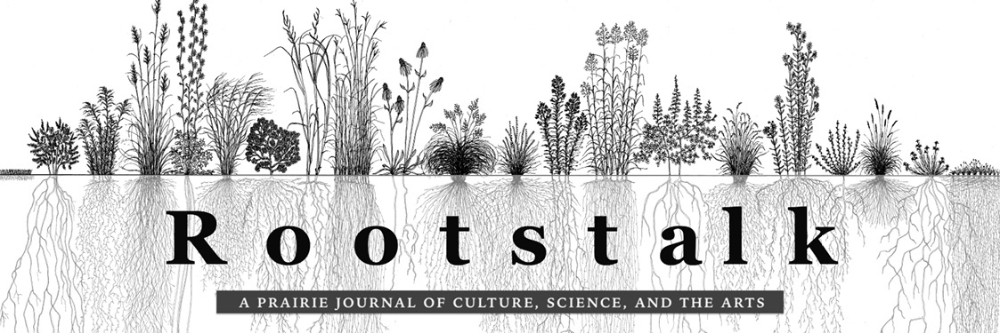
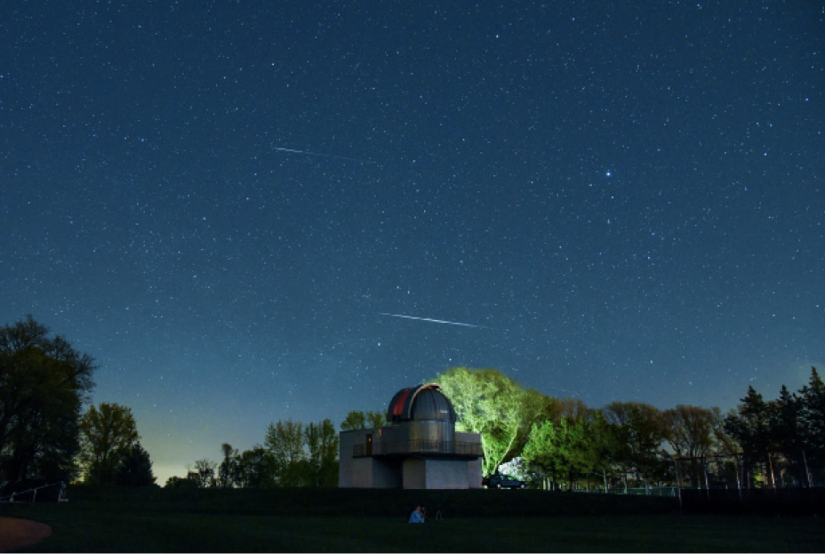
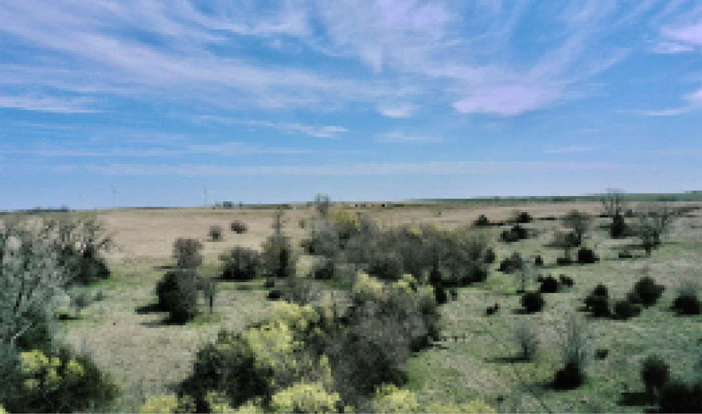

2022-spring

Volume VIII, Issue 1, Spring 2022

Rootstalk | Volume VIII, Issue 1, Spring 2022

Rootstalk, Spring 2022

Volume VIII, Issue 1

Supported by Grinnell College’s [Center for Prairie Studies](http://)

 (https://www.grinnell.edu/academics/centers-programs/prairie-studies) 

Rootstalk is committed to promoting open expression and is hosted on

 Grinnell’s Digital Grinnell server.

A note on this issue’s multimedia features: In addition to this “print-friendly” number of Rootsatalk, we’ve created an interactive multimedia version of the issue. In order to access all the media in this interactive issue—including content featuring hyperlinks—you’ll need to download the interactive PDF version and, once you’ve done so, open it using the Adobe Acrobat Reader. You'll find a link you can use to download the interactive PDF at the bottom of the page at [https://rootstalk.grinnell.edu](http://).  If you don’t already have the Adobe Acrobat Reader installed on your computer, you can download a trial copy at https://acrobat.adobe.com.

Grinnell alumnus Keith Kozloff  took the photograph we're featuring on the cover of this issue. It’s titled “Hiking with Frank.” 

Cover design: Mark Baechtel, Jonathan Andelson

Table of contents photograph: “Prairie Light” by Carl Kurtz

Layout: Mark Baechtel, Jon Andelson

Jon Andelson is the Publisher of Rootstalk. He is [Rosenfield Professor of Social Science](http://www.grinnell.edu/academics/areas/anthropolog) (Anthropology, http://www.grinnell.edu/academics/areas/anthropolog) at [Grinnell College](http://www.grinnell.edu) (http://www.grinnell.edu) and co-founder and director emeritus of the College’s [Center for Prairie Studies](https://www.grinnell.edu/academics/
centers/prairie-studies) (https://www.grinnell.edu/academics/

centers/prairie-studies).

*All references appear in Endnotes in the back of the issue.

Photo courtesy of Jon Andelson

Publisher’s Note:

The Stories We Tell*

by Jon Andelson

One bright spring morning nearly twenty-five years ago I was sitting with some colleagues around a seminar table in a Grinnell College classroom sharing opinions about a wide variety of topics. The occasion was a breakout session at an all-faculty retreat. We were talking about the curriculum, the demands of teaching, work-life balance, students, and the general state of the college. 

“Grinnell is a good place to teach,” one of my colleagues said at one point. “Too bad it’s where it is.” As I recall, she went on to lament that the college wasn’t in St. Paul, Minnesota, but I think that was just a for-instance. Someone else agreed and said, “how about Santa Fe?” “Or Santa Barbara,” another chimed in. What was it about saints, I wondered? (Our local coffee shop is named Saints Rest (https://www.saintsrestcoffee.com), but clearly that wasn’t sufficient.) I remember feeling sad about the direction the conversation was taking, and a bit irritated, but I said nothing. 

During the coffee break that followed the session I found myself sitting outside with my friend Jackie Brown, a member of the Biology Department (https://www.grinnell.edu/academics/majors-concentrations/biology), who had been in a different breakout session. I decided to share with Jackie what I’d just heard and how it had made me feel. Somewhat to my surprise he said, “I heard the same thing in my group, and it pissed me off, too.” 

“It’s not as if the college is going to move,” I said.

“They should settle in and get to know the place,” Jackie said. 

In fact, at that time the college as an institution was doing a pretty good job of ignoring its location, and even apologizing for it. One Admission brochure said something to the effect that “Grinnell might be in the middle of corn fields, but it’s a great school.” A subtle—or maybe not so subtle–slap in the face . . . to the town, the state, and corn. As Jackie and I talked, ideas for pushing back against this attitude began popping into our minds. In the weeks that followed we brought together a number of other colleagues from across the college who we thought or hoped shared our views, or at least could be brought around to them. To make a long story short, the result was the decision to create a Center for Prairie Studies at Grinnell. 

The Center’s mission, as we conceived it, was to celebrate and use our location as a teaching and learning resource instead of ignoring it, letting our location, as one of our colleagues put it, “be our text, our stage, our canvas, our laboratory, and our archive.” But how did we think of our location, and what should we call our Center? We considered Iowa Studies, Midwest Studies, Rural Studies, and some others that I cannot now recall, but in the end we decided to designate our location as “the prairie region of North America.” In this we were influenced by a statement in a history of Iowa, prepared for the Bicentennial of the United States by Grinnell College historian Joseph Frazier Wall (https://carnegiemuseums.org/magazine-archive/1996/janfeb/wall.html). “The history of every state must ... begin with the land itself,” Joe said. “For Iowa, the land serves as more than an introduction. It is the main story line.”1 In 1850, roughly 80 percent of Iowa was tallgrass prairie, the highest proportion of any state. Even though a century later 99 percent of the original prairie had been destroyed to make way for Euro-American agriculture, the prairie’s influence on Iowa’s development endures to this day. 

I have told this story many times, but until now never committed it to print. Although the story is the same, publishing it here changes it. Putting the story in print makes it part of a more durable record. That is one goal of Rootstalk: A Prairie Journal of Culture, Science, and the Arts: to gather stories from the prairie region and to share them with our audience. Most of the stories are told in words, but some are told in images or in sound, and some in all three. The stories are literally everywhere; we just coax them into the open and put them in a storehouse or, if you will, a storyhouse. 

I have been thinking about stories a lot lately. This seemingly straightforward category contains its share of enigmas. For example, I cannot decide if we once were the stories we tell, or if we become the stories we tell, or if the stories, like Janus—the Roman god of doors, gates, and transitions—face backwards and forwards simultaneously, connecting the past to the future. Are stories wisdom or wish or warning? The word’s derivation is a story in itself. “Story comes via Anglo-Norman estorie from Latin historia (‘account of events, narrative, history’).”2 We can trace the word farther back to the Greek histor, originally widtor, meaning “wise” or “knowing,” thence back to an Indo-European root, weid, “to see or look.”3 Thus, seeing allows us to know things, and we give accounts of what we saw, and of what we know from seeing, in the stories we tell. 

I notice stories everywhere, but this was not always the case. I used to think of stories as fictional narratives. I did not think of myself as collecting stories when, as an anthropologist, I would conduct interviews with people about their cultural practices and norms; I was collecting evidence—facts, not fictions. Nor did I think of the news on television or in newspapers as stories; again, these accounts were factual. (Editorials might be opinion rather than fact, but that still was different from fiction.) Scientific reports, also, were not “mere stories” but based on careful methods for systematically gathering information, data. In my mind, the phrase “it’s a true story” only highlighted the idea that most stories were not. 

My perspective on stories began to shift under the influence of a current Grinnell student. I first met Emma Schaefer (https://www.facebook.com/emmakieranmusic) in the Spring of 2020 when she enrolled in the Digital Journal Publishing class that I co-teach every spring with Mark Baechtel, Rootstalk’s Editor-in-Chief. Emma took the class, she told us, because she thought it might contribute to the independent major in Multimedia Storytelling she was pursuing. That sounded interesting, but, I thought, limited. However, the more I listened to Emma, and the more I began to pay attention to what other people were saying about stories, and the more I thought about the broad etymology of the word “story,” the less I felt that stories lay on one side of the line I had drawn between fact and fiction. Put another way, stories transcend that distinction, which in any case is not the most important thing about stories. Rather, the most important thing about stories is that they convey a message about how things were, or are, or might become. They are tools for describing and illuminating the past, the present, and the future. 

Consider what the author Beth Hoffman says in her new book, Bet the Farm: The Dollars and Sense of Growing Food in America (https://islandpress.org/books/bet-farm), an account of the challenges she and her husband faced moving back to Iowa to take over his family’s farm and move it in a more sustainable direction: “Yet as I outlined in the previous chapters, there is much that we can do as individuals, as farms, as groups of farms, and as a nation to improve the system [of agriculture], all of which start with changing the stories we tell about farming.”4 

Or consider what Keith Kozloff (https://www.governing.com/authors/keith-kozloff.html), formerly a senior environmental economist at the U.S. Treasury Department, said to me recently: “After spending much of my career working on climate policy, but seeing insufficient action, I came to the conclusion that one of the legs missing is the political and public will to make change. How do you mobilize that? It’s got to be done by engaging people at the heart level. Story-telling has emerged as central in that.” 

Or consider what Kamyar Enshayan (https://ceee.uni.edu), the Director of the Center for Energy and Environmental Education at the University of Northern Iowa, said at a talk he gave in Grinnell recently. His subject was how the world, and especially the United States, could meet our energy needs without pumping yet more carbon dioxide into the atmosphere. “The future of energy is almost always framed in terms of supplies, ‘where can we get more of this or that?”It is rarely framed in terms of demand reduction,” Kamyar said. “Furthermore, solutions aren’t always technological. What kinds of cultural transformations do we need to make? What kind of stories can inspire us to reduce demand?”5 He proceeded to talk about things from the past like ice houses, electric public transporation, hanging clothes on lines to dry, and home gardening that used much less energy than their modern counterparts. 

What Beth, Keith, and Kamyar are implying is that all of us live our lives—believing certain things and behaving in certain ways—based on stories we have heard. In the absence of a story, we might lack the will to act, as Keith suggests. If we have been taught untrue stories, our own actions or our tacit acceptance of the actions of others can be misguided, as Beth argues. If we have forgotten certain stories from the past, the options for action in the present are curtailed, as Kamyar believes. Ultimately, we need to tell stories, true stories, to inspire right action. Of course, fictional stories can also serve these ends; we can find great inspiration in the writings of our novelists, poets, and playwrights, whose stories are true though fictional. What we must be on our guard against are stories that are lies, or that cause environmental degradation, or that demean or incite hatred. 

In this issue of Rootstalk, and every issue, we offer stories about the prairie region in hopes of shedding light on the region’s past, present, and future, and in hopes of inspiring thought and action that will contribute to the health and well-being of its natural and cultural features. 

Postscript: This issue of Rootstalk contains photography by Keith Kozloff on the covert and a song by Emma Kieran Schaefer. 

Image Courtesy of Grinnell College’s Center for Prairie Studies

Janus, Roman god of doorways, gates and transitions. Image courtesy of Wikimedia Commons 

John Everett Millais, “The Boyhood of Raleigh” (1870), from the collection of the Tate Gallery, London. Image courtesy of Wikimedia Commons 

Contents

In order of appearance

Common Yarrow, Blue Grama,  Cover

 and Showy Milkweed

 Sofia Carr

Publisher's Note 3-5

Jon Andelson

Editor’s Note 6-9

Mark Baechtel

Associate Editors 10

Untitled Photo 13-14

 Carl Kurtz

To Understand the Prairie’s Beauty, 14-15

“Deconstruct to Reconstruct”

 (Artwork)

Sofia Carr

Visualizing Loss: Fabric Art and

Photography 17-20

 Winifred Commers (Quilt)

 Chris McGowan (Photographs)

 Graeme Thompson (Photographs) 

Two poems 21

Changming Yuan

Untitled Photo 22

 Bruce Leventhal

Trees of the Prairie: 23-24

the American Elm

Fit Getahun

Untitled Photo 24

Homer Edward Price

How Wetlands Contribute 25-26

to Water Quality (Infographic)

Elisha Tibatemwa

Memory in A Mustard Grain: 27-31

Three Indigenous Women (Essay)

Ingrid Meulesmans

The Politicians of Edison High 32-34

School (Audio Essay) 

Connor Arneson

Telehealth on the Prairie 35-41

(Interview) 

Berit Madsen talks with Telehealth expert 

Mary DeVaney

Untitled Photos 36, 37, 40

Justin Hayworth

“Freedom and Equality”: Missouri’s 42-49

 East Wind Community (Essay) 

 Agnès Ohlenbusch

Trees of the Prairie:  50

the Burr Oak

 Fit Getahun

Untitled Photo 50

 Carl Kurtz 

Barns of the Midwest (video essay) 51-52

 McKenna Doherty

A Conversation about the   53-62

 Great Plains Trail (Interview)

 Cara Keleher interviews Thru-hiker “Pony”

Prairie Restoration: Grown at 63-66 Home (Infographic) 

Katie Goodall

Untitled Photo 64

 Jon Andelson

A Summer’s Day on the Prairie 67-68 

(Short Video) 

Maya Andelson

Exploring Minnesota Foodways 69-73

through Four Recipes 

Nicki Kreutzian

From Bhutan to Omaha: Refugees 74-77

 Put Down New Roots

 Tenzing Sherpa

Trees of the Prairie: 78

the Cottonwood

Fit Getahun

Untitled Photos 78

 Jason Sturnr

 Carl Kurtz

“Evening Falls on the Prairie”:  79-82

 An Interactive Poetry Module 

 (Computer Program)

 Oona Miller

Trees of the Prairie: 83

the Hackberry

Fit Getahun

Untitled Photos 83

 Kathy Zuzek

 Carl Kurtz

Endnotes 84

By category 

Words

Publisher’s Note 3-5

Jon Andelson

Editor’s Note 6-9

Mark Baechtel

Associate Editors 10

Two poems 21

 Changming Yuan

Memory in A Mustard Grain: 27-31

Three Indigenous Women (Essay)

Ingrid Meulesmans

Telehealth on the Prairie 35-41

(Interview) 

Berit Madsen talks with Telehealth expert 

Mary DeVaney

“Freedom and Equality”: Missouri’s 42-49

 East Wind Community (Essay) 

 Agnès Ohlenbusch

A Conversation about the   53-62

 Great Plains Trail (Interview)

 Cara Keleher Interviews Thru-hiker “Pony”

Exploring Minnesota Foodways 69-73

through Four Recipes 

Nicki Kreutzian

From Bhutan to Omaha: Refugees 74-77

 Put Down New Roots

 Tenzing Sherpa

Endnotes 84

Sounds & images

Common Yarrow, Blue Grama,  Cover

 and Showy Milkweed

 Sofia Carr

Photography: Carl Kurtz

 Untitled  13-14

 Untitled  48

 Untitled  76

 Untitled  83

To Understand the Prairie’s Beauty, 

 “Deconstruct to Reconstruct”

 (Artwork)

Sofia Carr 14-15

Visualizing Loss: Fabric Art and

Photography 17-20

 Winifred Commers (Quilt)

 Chris McGowan (Photographs)

 Graeme Thompson (Photographs)

Photography: Bruce Leventhal 22

 Untitled  

Trees of the Prairie

 American Elm 24

 Burr Oak 50

 Cottonwood 78

 Hackberry 83

Photography: Homer Edward Price 

 Untitled  24

Infographic: How Wetlands Contribute

 to Water Quality 

 Elisha Tibatemwa  25-26

Audio Essay: The Politicians of 

Edison High

 Connor Arneson  32-34

Photography: Justin Hayworth 

 Untitled  36

 Untitled  37

 Untitled  40

Video Essay: Barns of the Midwest

 McKenna Doherty  51-52

Photography: Jon Andelson

 Untitled  64 

Infographic: Prairie Restoration: 

Grown at Home

 Katie Goodall  63-66

A Summer’s Day on the Prairie 67-68 

(Short Video) 

 Maya Andelson

“Evening Falls on the Prairie”:  79-82

 An Interactive Poetry Module 

 (Computer program)

 Oona Miller

Photography: Kathy Zuzek

 Untitled  83

Photo courtesy of Zainab Thompson

Zainab Thompson is an urban fantasy-horror author, a surrealist artist, and the Co-Editor-in-Chief of Grinnell College Press (https://grinnellcollegepress.com/archive/index.html). She has published short stories and art in NOT AN [ANTHOLOGY], The Paranormalcy Zine (https://paranormalcyzine.tumblr.com), and The Grinnell Review (http://www.grinnellreview.com/), and is still riding the high of her February gallery show, Death, Decay, (Re)Defined (https://www.thesandb.com/article/death-decay-redefined-spreads-spores-at-smith-gallery.html) She is finishing up a Bachelor of Arts in Psychology with a concentration in Global Development Studies. She enjoys critiquing zombie movies, theorizing the psychology of fictional characters, and making close friends laugh. 

Dark Skies or Light in My Eyes: A Look at Light Pollution

by Zainab Thompson

I’ve never considered myself an avid astronomy fan, but I have always enjoyed looking at the night sky. Its distance makes it mysterious; a twinkle in the sky could be a star, a planet, a distant galaxy, or something else entirely. The mere knowledge that many of those pinpricks of light up there are the same ones that my ancestors also likely saw, marveled at, and told stories about, even if they were in a completely different part of the world, is magical. 

I grew up in Dallas, Georgia, a suburb about 32 miles northwest of Atlanta. Its historic downtown boasts old boutiques and town museums rather than towering skyscrapers or sprawling centers like the state’s capital, but it’s still not the best place to do any sort of stargazing. This wasn’t something I realized until I moved to the Midwest, specifically to the town of Grinnell, Iowa. One of my earliest realizations of the difference between the rural Midwest and the suburban Southeast happened the night that I was with a group of fellow science pre-orientation students in the middle of one of Grinnell College’s athletic fields hoping to see the Perseid meteor shower (https://en.wikipedia.org/wiki/Perseids). 

As we were walking to the field, I remember being struck by how far from any artificial lights we seemed (at least in comparison to where I was from), and how the darkness of the night on the prairie was darker than anything I’d ever experienced back in Dallas. We laid out blankets, and one of our upperclassmen guides told us to lie down and look up. 

The stars sparkled like someone had spilled thousands of tiny diamonds across a deep black carpet. Backset against them all was a mottled blue-purple haze that I would later learn was the body of our Milky Way galaxy. Then, there were the Perseids themselves. They were quick flashes of playful blink-and-you’ll-miss-it streaks that had me staring for so long I had to remind myself to blink. We stayed out there until the stream of meteors slowed to a trickle. Even after the shower ended, I was still captivated by the sky. By that point, however, others were grumbling about being tired or cold and I didn’t want to stay out there by myself, so we packed everything up and headed back to our dorms. 

Over the following months, I tried to gain a more nuanced understanding of the night sky. I went to an Open House at Grinnell’s Grant O. Gale Observatory (https://en.wikipedia.org/wiki/Grant\_O.\_Gale\_Observatory) and attended a couple of Astronomy Club meetings, but I wasn’t quite able to replicate the feeling of breathless awe that I had experienced during that original night of stargazing. As time went on, my sense of fascination faded into more of a passing interest. The night sky became merely a reason for me to crane my head upwards as I walked back to my room in the evenings. 

For the purposes of this article I decided to revisit that interest. My initial inquiries led me to interviews with three people in the area who collectively have decades of astronomy experience: Professor Bob Cadmus, a longtime member of the College’s Physics department; Dr. James R. Paulson, a local physician and amateur astronomer who built his own observatory about five miles east of Grinnell; and John Johnson, Outreach and Promotions Director of an astronomy group called the Nebraska Star Party.(https://www.nebraskastarparty.org). 

Some, looking up at the night sky, feel miniscule. In the grand scheme of the cosmos, Earth is but a tiny celestial body floating amongst countless other celestial bodies. While the odds of life existing on other planets is high in our infinite universe (https://now.tufts.edu/articles/what-are-chances-life-another-planet) ,until we find evidence of complex beings such as ourselves elsewhere in the galaxy, we are alone on this ball of rock. To some, this is a daunting notion that engenders existential dread and creates questions about the meaning of our finite lives. Grinnell’s Bob Cadmus has a completely different perception. 

“[People] say, ‘Oh, whenever I look at the night sky, I feel so insignificant.’ And they seem depressed by this. That’s the exact opposite of the way I feel. When I look at the night sky, I feel privileged and fulfilled... I can spend hours lying on my back and looking [up].”

Cadmus appreciates the night sky as an opportunity to relate to people, believing the view is a “resource for everybody.” If understanding the stars and their celestial companions is enjoyable to him, the ability to introduce visitors and newcomers to the Midwestern night sky is equally rewarding. 

Dr. Paulson feels the same way. Despite joking that “amateur [astronomers] are nuts,” he fondly recalls summers stargazing with kids from the town, showing his night sky photography at the Grinnell Area Art Center (https://www.grinnellarts.org) and at the Science Center of Iowa (https://www.sciowa.org), and even driving all the way from Grinnell to Car Henge (https://carhenge.com) in Nebraska to experience the 2017 solar eclipse with hundreds of others. 

The passion Cadmus and Paulson feel for space and the stars makes them fierce advocates in the effort to preserve the night sky. Such advocacy is necessary, they told me, because the view that captivated me in my first year on the College’s athletic fields is actually under threat.

This threat stems from phenomena both natural and human-produced which are obstacles to clear night skies. In addition to light pollution from populated areas, there are less-obvious phenomena which make astronomy difficult. These include heavy greenery, humidity, and large bodies of water. Paulson grew up near Lake Michigan, which often created clouds and haze, while Cadmus grew up near forests where his view of the sky was often blocked by trees. Humidity can cause light dispersion effects that create distracting halos of light around the very celestial bodies you’re trying to look at. 

Given that fairly little can be done about natural barriers to clear skies, the efforts of astronomers like Cadmus and Paulson have centered on a problem caused by human activity: light pollution. Researchers in a joint study (https://www.mdpi.com/2072-4292/13/16/3311/htm) published last year by the Complutense University of Madrid (https://www.ucm.es) the Institute of Astrophysics of Andalusia (https://www.iaa.csic.es) and Exeter University (https://www.exeter.ac.uk/us-2/?mrasn=756487.940308.UQt7HFUi) estimate that the increase in light pollution from 1992 to 2017 was 270 percent globally, and potentially up to 400 percent in certain regions. The study’s authors pinned the blame for the increase partly on solid-state light-emitting diodes, also known as LED lighting. 

LED lighting has been championed as an energy-efficient, low-emission and low-cost method of illumination. That it’s inexpensive compared to other lighting methods has made it a light pollution problem because, as more and more people and businesses use it to illuminate outdoor spaces, it further degrades the experience of viewing the night sky. Additionally, this profligate use of artificial lights causes problems for nocturnal wildlife. According to Paulson, artificial light interferes with migrating birds, deprives bats of their insect food sources, disorients newly hatched turtles who use moonlight to navigate to the ocean, and interferes with the twilight used to guide arctic krill’s daily rhythms. Paulson said this light can also cause spring to come early by prompting trees to bud before they should, as well as disrupting humans’ sleep rhythms. 

These ill-effects have led many to question what can be done about them. In Grinnell, Cadmus and Paulson have pushed for and helped pass a lighting ordinance, modeled on similar laws put in place elsewhere (https://conservationtools.org/guides/10-lighting-ordinance) which aims to preserve the view of the night sky and to minimize artificial lighting’s harm to the environment. 

Cadmus says he believes the ordnance passed in Grinnell because he and Paulson pitched it as protection for “a valuable natural resource that we should preserve for future generations.” 

Characterizing the night sky in this way is one strategy advocates for minimal artifical illumination use to convince local or federal powers to pass night-sky-friendly measures. For instance, Paulson was successful in lobbying Monsanto Corporation when it announced plans to build one of the largest agribusiness plants in the world about a mile from his observatory. Paulson contacted the plant’s engineers. 

“I said, ‘Look, guys. There’s this thing called ‘dark skies’ and it’s gonna be a win-win for you. When you design the lights you’re going to have around, if you make them dark-sky-friendly, [it’ll be] great for you guys! You don’t have to spend as much money for energy.’ To my pleasant surprise, they did it!” 

In citing “this thing called ‘dark skies,’” Paulson was referring to the efforts of the International Dark-Sky Association (IDA; https://www.darksky.org), which was started in 2001 “to encourage communities, parks and protected areas around the world to preserve and protect dark sites through responsible lighting policies and public education.” 

In practical terms, advancing this agenda has meant fostering conversations about the need to combat light pollution. The IDA has formulated an 11-step action plan to recruit dark sky advocates and create a loose consortium of places prioritizing reduced light pollution. 

Cadmus points out that lighting ordinances don’t actually reduce existing light pollution. Rather, they reduce the rate at which things get worse. Cadmus says that while such ordinances are an important early step, public education is equally important, to help people to understand why massive security lights are unnecessary for backyard illumination, or intervening before problematic lighting gets built at all. 

Unfortunately, this doesn’t always work. Cadmus provides an illustration from early in his Grinnell career. At that time, there were translucent globe lights on campus that sent significant amounts of light upwards. He used his position on an important committee to try to advocate for the installation of more responsible fixtures. Acorn-shaped globes were one solution then, but the shielding they were equipped with was rudimentary. When the College began a new round of construction and expansion, Cadmus pushed for adoption of the more advanced technologies that had been developed in the interim.

Unfortunately, the College president at the time liked the acorn lights, so many remained. Today, these fixtures stand in contrast to newer lights that provide softer lighting elsewhere on the college grounds. 

“We had a great opportunity to really improve the campus and we blew it,” Cadmus said.

The nine-class Bortle scale (https://skyandtelescope.org/astronomy-resources/light-pollution-and-astronomy-the-bortle-dark-sky-scale) measures the quality or brightness of the night sky for a given location. Class 9 represents an “inner-city sky” that is brightly lit, rendering many stars and certain constellations invisible. On the other end of the scale, Class 1 locations are “excellent dark-sky sites” which feature clear naked-eye viewing of celestial objects such as the M33 (Triangulum) galaxy and the path of our own Milky Way galaxy, which it would be difficult to see in a more light-filled environment.

According to LightPollutionMap.info, the 2015 Bortle scale designation of the area including my house in Dallas was designated Class 5. This means that the Milky Way was faint there, if not impossible to see. In contrast, the Bortle scale designation of the area including the soccer field where I watched the Perseids was a Class 4. Finding out that the soccer field was only middle of the pack as far as darkness goes was quite a shock. If what I saw was a class 4, then how much darker could the sky possibly get? 

As I learned, this would be a good question to ask at a star party. These events, usually held in the summer, attract amateur astronomers who gather to stargaze together. The Nebraska Star Party (NSP; https://www.nebraskastarparty.org) is one of the most famous of these events. The NSP is the annual project of a loose coalition of individuals and groups which sponsor the gathering at Nebraska’s Merritt Reservoir (http://outdoornebraska.gov/merrittreservoir, which, notably, is designated as a Class 1 on the Bortle scale). The 2022 event, set for July 24-29, will be the 29th NSP. 

It is sites and events like this that really show how stargazing is unique in the prairie region, an area of North America in which there are large zones of low-density settlement. Less densely populated clusters mean less light pollution, which allows for experiences like the ethereal sensation of seeing shadows cast by the Milky Way on your hand. (https://www.space.com/7270-great-week-milky.html) 

For John Johnson, the NSP’s Outreach and Promotions Director, a large part of the joy he finds in astronomy comes not merely through the study of the planets and the stars themselves (though the hundreds of astronomy books he owns may suggest otherwise); it comes via sharing the experience of stargazing with other people. To him, it’s a bittersweet feeling of “connecting with nature and being out there with this beautiful sky, and then the sadness of knowing that probably 75 percent of the world’s population does not, can not, and will not have that experience.” This realization forms the cornerstone of his conviction that people need to understand just how harmful the brightening night skies are. 

“I get to the point where I just want to grab and shake people and say, ‘Do you realize what we’re doing?’” he said. “I’ve done all the studying. I’ve got videos, I’ve got proof, whatever proof you want, about how it’s affecting society, humans both psychologically and physically, and it’s obviously detrimental for nocturnal animals.”

He has been working hard for decades to bring to more general awareness both the wonders of the night sky and the threats to experiencing them. He is a passionate advocate for the International Dark Sky Association(https://www.darksky.org/about/) agenda

Along with the Nebraska Game and Parks Commission and the rest of the Nebraska Tourism Commission, Johnson has worked to designate Merritt Reservoir and the surrounding area as a dark sky sanctuary. According to the IDA’s website, this label identifies the most dark and remote places in the world “whose conservation state is most fragile” but otherwise has few nearby threats to the quality of its darkness. Upon certification, the IDA works with a given site to promote their work and enhance their visibility to the world at large. 

Like Cadmus and Paulson, Johnson has laid the case for the value of this particular dark sky sanctuary before the relevant federal powers by emphasizing the economic benefit of the designation. 

“If a bunch of wild-eyed astronomers start beating on their chests saying ‘Oh, we gotta shut all the lights off!! We got to be able to see the stars!’ That doesn’t fly,” Johnson said. “What flies is when you [say], ‘Well, you know how many more destination tours we could get out here? How much more money [tourists] would spend around the state if we had areas designated as dark sky sanctuaries where they could come out and really see the stars?’”

As of this writing, Johnson and his fellow amateur astronomers are still trying to get Merritt Reservoir recognized as a dark sky sanctuary in order to preserve the pristine dark skies above in the area. 

During Fall Break in 2021, I went on a camping trip with the Grinnell Outdoor Recreation Program (GORP). The trip happens annually, COVID years notwithstanding, and one of our destinations was Pikes Peak State Park (https://www.iowadnr.gov/Places-to-Go/State-Parks/Iowa-State-Parks/Pikes-Peak-State-Park) which is known for its sweeping views of the Mississippi River. 

One evening while we were there, one of the trip’s two student leaders invited everyone to go on a night hike. I was immediately game for the adventure. Our leader took us through the woods along trails that we’d explored earlier that day, which suddenly seemed so much more menacing as we kept getting spooked by the reflecting eyes of nearby deer and racoons.

We eventually reached a tiny trickle of a waterfall by the name of Bridal Falls. Directly behind the dripping curtain of water was a little hollow, likely from years and years of the water eroding away the rock. Our student leader was the first to slowly pick his way down the slippery dirt-turning-rock path to go sit in the hollow. The rest of us gingerly followed suit.

Directly in front of us and across the Mississippi River, we could see lights in the state of Wisconsin. The view was spectacular in some ways, with its clear path across the state border to hibitation miles away from us, but I found myself struck by the sight of the sky. Right above the cityscape was a halo of yellow haze being cast up into the air.

In the moment I had felt at peace, basking in the quiet with the other students after a long day of hiking. Looking back, though, I don’t recall seeing a single star. The twinkling of the artificial city lights drowned out the natural sparkle and splendor of the stars above.

Despite the fact that the Midwest is a far better place to stargaze than my hometown, bigger urban centers like Chicago or the Twin Cities show that the Midwest is by no means immune to light pollution. People like Cadmus, Paulson, and Johnson are putting in hard work to protect the Midwestern skies as much as possible, but it’s going to take a lot more than just them to make a dent. The more people that join the movement to protect one of our most overlooked natural resources, the longer we’ll be able to save it for future generations to enjoy.

Watching a meteor shower from a field near Grinnell College’s Grant Gale Observatory. Photo by Scott Lew (https://instagram.com/bellagio3?igshid=YmMyMTA2M2Y=)

Image of Comet Hale-Bopp taken by Bob Cadmus from the Gale Observatory in 1997. The lights of the City of Grinnell are blurred because the camera was tracking the comet. It is clear that the town’s lights affect the view from the observatory

() 

Light pollution can be mitigated by replacing lights whose translucent globes lack shielding (top image) with partly shielded fixtures (bottom image) in which the fixture reflects light downward. Photographs on Grinnell College’s campus by the author

A map depicting the zenith sky brightness, as measured by the World Atlas in 2015. Point 1 is the location of the author’s home in Dallas, GA. Point 2 is the location of the Grinnell College soccer field where she watched the Perseid meteor shower. Point 3 is the location of Merritt Reservoir, where the Nebraska Star Party holds its annual event. Image Credit: lightpollutionmap.info (https://www.lightpollutionmap.info). 

A Unihedron Sky Quality Meter (SQM) and its accompanying information card, given to the author by Dr. J. R. Paulson. SQMs are used to measure sky brightness, an important step in the process of applying to be a dark sky location. Photo by the author.

On August 10, 2020, a derecho with winds up to 120 mph (https://www.washingtonpost.com/weather/2020/10/17/iowa-derecho-damage-cost) pummeled the Midwest. the storm an estimated $7.5 billion in damage and knocked out power to a wide area. Grinnell was in the blackout zone. Peter Hanson, a Grinnell College faculty member and amateur astro-photographer, took pictures immediately after the storm while the power was still out (left) and again in the same spot days later when power had been partly restored (right). The effect of light pollution on the same stretch of sky is stark. Photo courtesy of Peter Hanson (https://sites.google.com/view/peterchanson/night-sky-imaging?authuser=0) 

Visitors stand beneath the Milky Way at Grinnell College’s Conard Environmental Research Area (CERA; https://www.grinnell.edu/academics/majors-concentrations/biology/facilities/cera). Photo courtesy of Justin Hayworth

Associate Editor Fernando 

Villatoro-Rodriguez '22 is a LatinX graduate of Grinnell College, where he received his bachelors degree in a self-designed independent major titled Health Narratives/Studies. Originally from Los Angeles, California, his interests center on history, seen through a post-modern lens, and include film studies, English, public service, and education. 

Photo courtesy of Fernando Villatoro-Rodriguez 

Woodpeckers 

of the Prairie

by Fernando Villatoro-Rodriguez

Woodpeckers are fascinating birds which are widely known for their method of gathering food. They use their sturdy beaks to drill holes in tree bark to find their insect prey, and to chisel nest holes in dead wood. Though the prairie is most closely identified with grasslands, there are multiple species of trees that are native to the area, and that’s where woodpeckers are found. 

Woodpeckers are a part of the Picidae family, which also includes piculets, wrynecks, and sapsuckers. While (according to the Handbook of Birds of the World, https://en.wikipedia.org/wiki/Handbook\_of\_the\_Birds\_of\_the\_World) there are 254 species of woodpeckers, which come in a wide variety of shapes, sizes, and colors, there are seven species that call the prairie region home.These include northern flickers, yellow-bellied sap suckers, and downy, hairy, pileated, red-bellied, and red-headed woodpeckers. These birds are non-migratory, though some temperate-region species do shift their range for warmth. Their diet mostly consists of insects, but some also feed on fruits and berries. 

Woodpeckers are found throughout the world except for Australasia, Madagascar, and Antarctica, as well as some of the oceanic islands. 

Frequent Rootstalk contributor Sandy Moffett took the photographs which accompany this feature, capturing all the images near his home in Poweshiek County, Iowa. The yellow-bellied sapsucker is the only local woodpecker that has eluded his camera so far, and it is the only species missing from this issue’s “Birds of the Prairie” special feature.

Photo taken May 31, 2017, courtesy of Sandy Moffett

To listen to the vocalization of a red-headed woodpecker, and to learn more about the bird, go to Cornell University's Ornithology Lab and its "All About Birds" site at https://www.allaboutbirds.org/guide/Red-headed\_Woodpecker.

Woodpeckers of the Prairie:

Red-Headed 

Woodpecker*

 Melanerpes erythrocephalus

The red-headed woodpecker is characterized by its bright-red head, neck, throat, and upper breast; blue-ish black wings and tail; and large white square areas on the rear part of its wings and upper rump. They are monogamous and territorial, with an average life expectancy of 119 months. 

Red-headed woodpeckers live from the central to eastern United States, and in the lower tip of Canada. They are small compared to some other species within the same family. Their diet consists of a wide variety of insects, spiders, earthworms, nuts, seeds, berries, wild and cultivated fruit and occasional small mammals. Red-headed woodpeckers are also known to eat the young or the eggs from the nests of bluebirds and house sparrows, and they sometimes even consume bark. They prefer open woodlands, forest edges, clearings, and habitats with few tall, large-diameter trees. You can find these birds in river bottoms, open woods, orchards, parks, savannas, and prairies. Red-headed woodpeckers do not migrate in winter, but prefer mature forests containing larger, older trees where they can find an abundance of food, most notably acorns.

*You’ll find the other “Woodpeckers of the Prairie” featured in this issue on pages [insert pages here].

All photos courtesy of Denise O’Brien

Denise O’Brien is a farmer and community activist from Atlantic, Iowa. She has farmed with her husband, Larry Harris, for 47 years. She is the co-founder of Women Food and Agriculture Network (https://wfan.org), the past Chair of the Board of Directors for Pesticide Action Network of North America (https://www.panna.org), and served as an Agriculture Advisor in Afghanistan from 2011 to 2012, deepening her knowledge of women farmers on an international level. Denise currently serves on the board of the Iowa Organic Association (https://www.iowaorganic.org), is the Chair for the county Democratic Party, and is an Assistant Soil and Water Commissioner. Denise has received numerous awards for her community achievements and accomplishments and was inducted into Iowa’s Women’s Hall of Fame (https://humanrights.iowa.gov/cas/icsw/events-recognition/iowa-womens-hall-fame) in 2000. She has run for numerous public offices, including Iowa Secretary of Agriculture in 2006 and the Iowa Legislature in 2018.

A Woman and the Land

by Denise O’Brien

Oats, peas, beans and barley grow. 

Oats, peas, beans and barley grow

Do you or I or anyone know 

How oats, peas, beans and barley grow? 

First the Farmer sows the seed

Then he stands and takes his ease

He stamps his foot and claps his hands 

And turns around to view his lands. 

  -British/American song from the late 1800s 

 

There was no honeymoon for Larry and me after our early morning spring wedding. The guests had returned home, and our house was quiet after the festivities of the weekend. The baby pigs were nestled in their pens with their mothers’ providing them with meals on demand. The pregnant cows were feasting on their breakfast of ground corn. We headed up to the home place that Lyle and Delma Harris established in 1949, to prepare the machinery for planting oats. They are sown in March, the first seedlings of the growing season. They can germinate in 40 degree soil. The corn and beans that follow require warmer temperatures. 

 “You’ll be close by, right?” I anxiously asked as we started the daily checklist on the tractor and equipment. My hands were the happy recipients of new, soft leather gloves that protected me from the grease and grime I would encounter. The loud, whiny air compressor demanded that air be released as the tank filled. Larry and his father, Lyle, were there to teach me how to get machinery ready for the field. Lyle owned the equipment and his supervision was necessary to launch me on my first outing as a new farmer.

 Larry instructed me to twist the tab on the dipstick to check the appearance and quantity of the oil that lubricated the engine. Next, I took the caps off the valve stems of the tires and used an air pressure-gauge to determine if the tires were properly inflated. Tires are expensive and it was important to make sure they were well inflated for fieldwork. I walked around the large, red metal frame of the tractor with all its moving parts, absorbed in memorizing each detail. I was surprised that, despite all the pedals on the platform, I could not see an accelerator 

“Where’s the gas pedal?” I asked. 

“There isn’t one, the throttle is on the steering column,” Larry replied, pointing to a rod sticking out from under the driving wheel. “You have to pull the throttle down to increase the gas to the engine and push up to slow down.”

Two days after our wedding, it was time to plant the oats. The festivities of the past week quickly vanished from my mind as I set out to learn to farm the land; to turn the soil in preparation for planting the seed. Blood coursed through my veins in anticipation of what I was about to do. I could hardly contain either my excitement or my apprehension. Today, I would be on my own, my first field experience as an apprentice farmer.

I followed Larry closely and listened to his instructions. I breathed in the surrounding smells of the machine shed Larry’s brother Steve had built. The tall shed was constructed with used telephone poles, lumber, and galvanized tin he had torn down from other buildings. It had four bays where two tractors, a planter, and a wagon were parked.

 The Harris family equipment was red, signifying their allegiance to the International Harvester brand. 

“Farmers like to stay loyal to a brand of machinery that has served them well”, Lyle, a former International Harvester salesman, told me. “Green and yellow are John Deere people, blue are Ford folks, and orange are Allis Chalmers enthusiasts.”

 Even though old and tarnished, daily maintenance had kept them in good working order. Resourcefulness was a strong virtue in the farming world and today I was learning from the best. The Harris’ lived by the rule that you take care of what you have; treat machinery with respect and they will do the job for you.

 The tractor I learned on was an IH 560 model, a two-wheel drive, standard-tread, with 6-cylinder, 72.5 horsepower engine. It was manufactured from 1958 to 1963 and cost $5,500 brand new. I named it the Red Beast. 

 “Our tractors are pretty old but powerful,” Larry said. “The oldest is a Farmall H built in 1946 and the next, a 1949 Super M. Our newest model is a 504 IH from the 1960s. The fleet has been easy to fix and does the job we need done.”

 I would come to love the Super M, manufactured the year I was born. It steered easily and was my favorite to rake hay and haul wagons. The seat had a large coil spring underneath that provided a fun, squeaky, bouncy ride.

 The preparation made me impatient. I just wanted to jump on the tractor and drive to the field where I could finally work the land. I contained my eagerness while I helped the men work through the routine they knew so well. I was their student, and I had to learn from them. Larry understood far better than I the importance of teaching how safety was critical to a good job. What I learned prepared me for the days and years ahead. 

 “Okay, it’s time to attach the disk,” Larry said. He took a deep breath and watched me climb up onto the tractor.

 “This must be scary for you to trust me on this machine,” I said. “I think I’ll do okay if I can just remember everything that you and your dad have taught me.” 

 A large contraption, called the disk, sat ominously behind the tractor. The silver, slightly rusted, round disk blades looked like monster teeth, intimidating me. It seemed like they could easily slice off a finger or body part. It was my task to back up the Red Beast and hook on to that piece of machinery.

 I pulled out the choke lever and pushed the black-rubber button to start the engine. Reaching down between my knees, I put the gear shift lever in reverse and backed up slowly and cautiously. The knot in my stomach tightened as I tried to align the tractor bar with the disk. Missed! I tried again. My hands turned white as they grasped the steering wheel so tightly my arms ached. My foot slipped off the clutch and the tractor jumped backward so quickly that my body would have gone airborne if I had not gripped the steering wheel. The transmission gears ground loudly as the tractor rocked back and forth while I shifted between first and reverse. I concentrated my whole being to get that tiny hole on the hitch aligned with that tiny hole on the tongue of the disk.

 “Always shift gears using the straight direction of an H,” Larry instructed me.”Push or pull the shift lever straight to neutral and feel it snap in before moving on to the next gear. This practice will help you from grinding the transmission and getting stuck between gears.” 

 The third time I backed up was a charm. The tractor aligned perfectly as Larry dropped in the large hitch pin that held the pieces of machinery together. With the hook-up successful, I was on to the next item of business—attaching the hydraulic hoses to the proper female couplers on the tractor. Connecting the hoses made it possible for the oil in the tractor to raise and lower the wheels of the disk. Surprised that gender was used to identify equipment parts, I was taught to put the male end of the hose into the female coupler. I felt uncomfortable using those terms that accurately described the process. 

 Two black, slinky, oily, serpentine hoses lay in wait, teasing, laughing, as if they knew I was a novice. Connecting these culprits was a challenge. My left hand held the stationery connection on the back of the tractor while my right hand attempted to push the hose with the silver ball into place. I did not win the battle in the first round. The pressure behind the ball was so great that the hose blasted out of my hand and sprayed thick gooey oil all over me. The pressure in the hose was too high and had to be released. I gathered all the strength I had to fulfill the task, finally this human won over the stubborn machine.

 “Farming has its own language, I’ll help you get through that learning process,” Larry told me. “The word ‘zerk’ refers to the grease fittings on machinery. The fitting needs lubrication to reduce friction wear on moving metal parts. It’s extremely important to grease the disk daily and in fact, a couple of times a day if it is used for long periods of time. Well oiled equipment makes farming easier with fewer breakdowns and less time and money spent on repairs.”

 “This grease gun will be your best friend,” Larry told me. “It’s kept right here on the tractor next to your foot. If you hear a loud, screeching noise behind you, put the tractor in neutral, raise the disk up and check out where the noise is coming from. Be sure to grab the grease gun as you jump off the tractor.”

 I bent over and slipped the tip of the grease gun onto zerk. These were located on the disk where the most wear and tear would happen. It was excruciating work. I leaned over the sharp edges of the frame and sometimes had to contort my body just to reach the fitting.

 “I didn’t realize how much work there is before sitting on the tractor and driving through the field. It’s not just a matter of jumping on the Red Beast and heading out.” Larry laughed, “Prepping to go to the field is as important as the field work itself.”

 I wondered how in the world I would be able to manage all the tasks of machine maintenance. I took a deep breath and concentrated on what my teacher was saying. I tried not to think about the consequences of going out to the field with no experience. Larry had prepared me well, but could I remember what to do? He assured me that he would stay in the field for a while to make sure things were going well. But when he left, would I be able to do the job on my own? 

 Finally, everything was ready to go. We decided that it would be best if Larry drove to the field. I stood on the platform on the side of the tractor as Larry pulled out of the drive and took off down the road. My hands gripped the handle on the fender and gravel spewed out from under the wheels. The wind blew across my face as we made our way to the entrance of the field. I hung on hoping not to lose my grip and fall underneath the wheel. We turned into the field at the bottom of the hill, next to a creek Larry named Little Buck in his childhood. I had arrived at my first job as a farmer. Could I do this? Would I crash into the trees or roll down the steep bank?

 Larry stopped at the edge of the field where corn had grown the previous year. Pale, old stalks of corn stuck up through the earth where they had partially decomposed over the winter. Disking turned them into the earth, creating a welcoming place for the oats we would be planting.

 “The tractor needs to be lined up on this edge,” he instructed me. “And because the disk is wider than the tractor you have to be careful to keep the furrows straight.” 

 My farmer-teacher made the first couple of rounds to show me how the process worked. The long, narrow field ran along Little Buck. It was a beautiful field that sloped uphill to the east. It would become the pallet from which my artistry of farming would emerge.

 With trepidation I moved onto the tractor seat and Larry moved to the platform. My chest swelled with the importance of the job I was about to do. I reached behind me to the right and pulled the lever that engaged the hydraulic system. The oil pumped through the hose. Whoosh! The wheels on the disk popped up like referees signaling a touchdown and the disc blades hit the ground. 

 Larry jumped to the ground and put me in charge. My mind focused on the pedals and throttle, trying to remember my instructions. What happens first, engaging the clutch or accelerating? Both hands and feet had to be ready to meet the demands of steering the tractor through the field. My whole body was on full on alert.

 My left arm pulled on the torque amplifier that geared down the transmission to accommodate the heavy load. I lifted my left foot slowly and let up on the clutch. With my right foot poised over the brake, I flew off across the field. 

 A strong, musty, moist smell from the earth tantalized my nose as the disk blades churned. I loved it. The field was a half-mile long, so I had plenty of time to absorb the rhythm of the tractor and the disk. I looked back to see the pattern of freshly tilled soil created with the guidance of my hand on the steering wheel. 

 Worms suddenly appeared on the dark soil surface, unintentionally offering themselves to the birds that gathered for a morning meal. Suddenly, several red-tailed hawks circled above me, their keen eyes focused on the small rodents fleeing for their lives. I began to feel comfortable and less frightened. I disked the field in the noisy environment of a roaring engine and clanking machinery. I knew this was where I was supposed to be. I was a town girl, but I was becoming a farmer. With the wind in my face and the sun shining brightly, I was a woman on a tractor. A job that I had thought was only for men.

 Lost in my thoughts about how wonderful it was to be farming, the fence line suddenly appeared in front of me. Panicked, my mind went into overdrive as I recalled Larry’s instructions. I heard his voice in my head say slow down! I grabbed the throttle and shoved it up, slowing the tractor down. My left and right feet simultaneously slammed down on the clutch and the brake. I held on for dear life. The adrenalin pumped through my veins until my heart nearly exploded. The Red Beast ground to a stop. My hands clutched the wheel, unable to release their hold. I shifted the gear into neutral and jumped down, my feet gratefully touched the earth. I was okay.

 “You’ve got to leave enough room to turn the tractor and the disk!” Larry shouted as he ran up behind me. “You can’t daydream at this job, especially when you get to the end of the field.” 

 Deftly, he swung his body up onto the platform, sat in the seat, and performed the rescue operation. He had driven a tractor since the age of eight and knew exactly how to maneuver out of the problem I had created. 

 “I guess I should have paid more attention rather than watching the birds and the worms,” I said sheepishly. “Thanks for the lesson in getting out of a tight situation.”

 The rest of the morning went without incident. Larry and Lyle got the Farmall H tractor ready for planting. They greased and oiled the power take-off driven broadcast seeder mounted on its draw bar. This piece of equipment had two hoppers, a large one to hold the oats and a smaller one to hold the pinhead sized alfalfa or clover seed. 

 I finished disking and the guys arrived at the field with planting implements. The H with a broadcast seeder attached, a wagon of oats to refill it, a couple of scoop shovels and a strong back were all the equipment needed to accomplish this spring ritual. Larry filled the seeder, a dusty, itchy job that required a shower afterward. 

 “Early season grains, like oats, wheat or rye, are considered a nurse crop for the tiny legume seeds,” Lyle explained as they filled the hoppers. “When the big seeds germinate, they suppress the weeds and give the slower-growing legumes a better chance to survive.” The legumes, I learned, would become hay for the livestock and provide nitrogen to the soil. 

“Every year in July when we harvest oats, a wagon-load of the grain is set aside for the next season,” Larry told me as he shoveled the seed into the hopper. “It’s a way to save money on seed costs. Every three or four years we buy a new variety to keep our seed stock healthy.” 

Lyle pushed down on the clutch, engaged the gears, pulled the throttle down and started across the field spreading the seed. The grain flew out of the seeder in a wide arc, covering the ground with a light beige blanket. Soon it would turn to a rich color of green, a feast for eyes seeking color at this time of year.

Our first day ended with the oats planted, the equipment cleaned, parked, and ready to go the next day. A ritualistic cadence developed that spring—get up in the morning, do livestock chores, come in to eat breakfast, and go out to prepare for work that was determined by the season. Spring planting, summer cultivating, fall harvesting, winter rest, and getting ready for the next go around. 

Larry and I headed home to do the evening chores. I reflected on the day’s events. 

This was the beginning of my transformation. I was becoming a woman of the land—a farmer.

Denise and Larry

“A strong, musty, moist smell from the earth tantalized my nose as the disk blades churned. I loved it. The field was a half-mile long, so I had plenty of time to absorb the rhythm of the tractor and the disk.”

Photo courtesy of Jeremy chen

Jeremy Chen is an artist and educator based in Grinnell, Iowa. He holds an MFA in Printmaking with area specialization in Sculpture from the The University of Iowa. (https://uiowa.edu). He currently teaches at Grinnell College (https://grinnell.edu)where he is a Senior Lecturer in Studio Art and chair of American Studies.

*All references appear in Endnotes in the back of the issue.

Grow Finish Unit 

Takes on “Ruthless and Insatiable” 

Industrial Ag* 

by Jeremy Chen

On June 24, 2020, from my house in rural Grinnell, Iowa, I saw a billowing plume of dark smoke rising nine miles away. I later learned that the smoke came from a farmstead where an enormous fire was raging. There, the county sheriff and his deputies were in the midst of a seven-hour stand-off with Dwaine Bauman, a U.S. Army veteran armed with a shotgun, who was upset that a Concentrated Animal Feeding Operation—a CAFO—had been issued a permit to move into his neighborhood. 

CAFOs, according to the Sierra Club, are industrial-sized livestock operations which house anywhere from hundreds to millions of animals. The animals in CAFOs are most often dairy cows, hogs, or chickens. Most often in our region CAFOs are massive, windowless buildings where livestock are confined in boxes or stalls for at least 45 days or more per year, in an area without vegetation. The quantity of urine and feces from even the smallest CAFO is equivalent to the urine and feces produced by 16,000 humans. 

In Iowa, the state’s Department of Natural Resources (DNR; https://iowadnr.gov) freely issues CAFO permits—for operations housing fewer than 2,500 hogs—without site visits, input from neighbors, or any say from the county supervisors (who can only deny permission if the farm operation’s Manure Management Plan does not meet the requirements). This is what had set Mr. Bauman off. One of his neighbors, seeking the extra income a CAFO would bring in, had decided to build one in Mr. Bauman’s neighborhood, despite the adverse effects this was likely to have on the neighbors’ property values and quality of life, as well as the damage it could potentially cause to the ecosystem.

Mr. Bauman launched his protest by setting fire to two vehicles, 100 bales of hay, and the rental house he was living in. The county sheriff’s department got involved after one of Mr. Bauman’s family members reported that he was acting strangely with a gun. The sheriff and deputies arrived and tried to talk to him, but when he discharged his shotgun into the ground the sheriff backed off, blocked roads, and waited out of sight. Friends implored the sheriff to let them speak to Bauman in person and de-escalate the situation but, intending to protect them, the sheriff didn’t allow this. Law enforcement later arrived in force with an armored vehicle and tactical gear. 

While one might argue with his methods, at bottom Dwaine Bauman simply wanted to have a voice in what was happening around him. His protest has inevitably brought back to my mind an artwork titled Grow Finish Unit by Irish-born artist John Gerrard (https://johngerrard.net), which Grinnell College’s Faulconer Gallery (https://www.grinnell.edu/campus-life/arts-cul-ture/museum) hosted in 2015, the year Rootstalk began publication. Today the issue of industrial-scale agriculture—with CAFOs providing one of the most egregious examples of its effects–is as big as it ever was, making this call-back examination of Gerrard’s work appropriate.

Using software simulations, Gerrard creates meticulously crafted generations of reality that are astonishingly real as they elapse over time. His works document the agri-industrial landscapes of the American Great Plains, in recent years examining such subjects as the Dust Bowl, our dependence on petroleum, and the overuse of nitrogen in agriculture. 

With Grow Finish Unit, Gerrard invites us to contemplate a ruthless and insatiable system that industrial agriculture has become, prioritizing profits over people and the environment, constantly creating more waste, and demanding more land, more hogs, more feed, and more sacrifices from those living in proximity to CAFOs. The work might protest with resignation, the system’s exploitation and alienation of the essential workers who process (slaughter, cut, pack, and distribute) the meat, eggs, and milk these facilities produce.

Gerrard’s visually stunning simulation depicts a confined animal feeding operation (CAFO) near Elkhart, Kansas, functioning in real time. The CAFO depicted in Grow Finish Unit is designed to contain thousands of hogs. The simulation, which was started in 2008 and has been running ever since, displays a computer-generated sun faithfully rising and setting in real time on a functioning CAFO, and follows relationships between humans, architecture, hogs and a landscape that is deceptively invisible. 

Grinnell College’s Faulconer Gallery was an appropriate venue for Grow Finish Unit. When Gerrard was researching the project, he visited a Polk County Facebook server farm in Altoona and a Poweshiek County liquid egg production CAFO unit near Malcom with a capacity of nearly 20 million chickens. Like many other rural locales, Poweshiek County—where the College is located--has been impacted by the exponential growth of CAFOs. Gerrard became fascinated by these contemporary monumental production systems, made visible in the rural landscape by their unassuming architecture. 

The visually hypnotizing effects of Grow Finish Unit are generated on a video monitor screen by gaming software on hard drives. The entire artwork, like the system it depicts, seems sealed. But Gerrard’s constructed reality simulation and the lived reality in Poweshiek County are terrifying shadows of each other. Gerrard’s compelling virtual reality focuses on, yet segregates, the relationships that tie a small rural community to its land and ways of life and the world economy. The simulation describes a nearly lifeless and inhumane system devoid of sustainable ways of living. Eventually, in this system, even profit will not be sustainable. In Grow Finish Unit sustainability doesn’t matter; the virtual sun will rise and set over the banal CAFO building in perpetuity, as long as the computer functions and there is electricity to run it.

It’s possible to think of the industrialized rural landscape around me as a late reflection of a misguided utopian idea that seamless market efficiency, production, and profit ought to be the goals of our farming system. However, these utopian economic goals ignore the real costs and dystopian impacts on life and land. Inside Gerrard’s gleaming CAFO building, the piglets grow into hogs that magically turn into meat for global tables— but primarily in America and China. Through “vertical integration” the local farmers don’t own the animals or the buildings, but maintain both for the absent global corporation, which sets their compensation with thin margins. Farmers who sign on with these corporations to host CAFOs are caught in a conundrum. Pressed by corporations with their eye on the bottom line and consumers who have become accustomed to low prices, they are forced into making decisions that negatively impact the local land, air, water, real estate, economy, culture, and community. Huge global corporations like Smithfield or Tyson drive the local land use, the labor and work conditions, and the profits that largely leave any state from which they extract resources, leaving behind lasting negative environmental and human impacts for local communities to reckon with in the future.

Dwaine Bauman inflicted his physical damage on property. Thankfully, no human life was lost, and no one was seriously hurt during the incident.. As the fires burned, Bauman was eventually taken into custody by the sheriff’s office and charged with second-degree arson and intimidation with a dangerous weapon. He was held in the Poweshiek County jail on a $250,000 bond. 

The landowner, despite his loss, did not intend to press charges. Bauman’s friends regret that a different law enforcement intervention and de-escalation didn’t occur for a usually peaceful man who reached a tipping point of frustration and anger that drove him into uncommon actions in order to be heard.

Of course, Dwaine Bauman’s violent actions were ineffective. The larger system continues undisturbed with the backing of the state, corporations, Iowa Farm Bureau, Iowa Pork Producers, and other big players in the food and farming system. Perhaps, to them, Bauman is an outlier, just an unstable war veteran who needs mental health services or prison time. Bauman’s voice and the voices of others who protest civilly against the inevitable remain sealed off by systems that collude in the destruction of Iowa’s natural resources and quality of life. CAFO production and exponential expansion continues unabated across Iowa and the Midwest. Likewise, Gerrard’s simulation quietly continues undisturbed in perpetuity. While a simulation may be sustainable, the reality is not. 

Image from Grow Finish Unit courtesy of John Gerrard. To view a website that includes the artist’s simulation, Enter this URL in your browser: http://www.johngerrard.net/grow-finish-unit-elkhart.html

“With Grow Finish Unit, Gerrard set out to comment on the ruthless and insatiable system that industrial agriculture has become, prioritizing profits over people and the environment, constantly creating more waste, and demanding more land, more hogs, more feed, and more sacrifices from those living in proximity to CAFOs.”

Image courtesy of Wikimedia Commons

Rootstalk | Volume VIII, Issue 1, Spring 2022

Photo courtesy of Mikayla Trissell

Associate Editor Mikayla Trissell ‘22 is a Spanish and Gender, Women’s, & Sexuality Studies major in their last semester at Grinnell College. They were born and raised in Texas, then moved to Colorado when they were twelve, so they have spent their whole life in the United States prairie region. In their free time, Mikayla enjoys reading, painting, hiking with their partner, and playing with their dogs, Scout and Scrappy, and pet reptiles, Sanjay and Snakey. 

Food Deserts in the Midst of Plenty

by Mikayla Trissell

Living in the prairie region of the United States surrounded by endless fields of crops, I am struck by the irony of the lack of healthy, reliable sources of food available to low-income individuals. In fact, this problem has been widely recognized as a food desert, characterized by a large population of low-income households who have inadequate access to transportation or other resources that would allow them to gain access to fresh produce and healthy groceries that they can afford. Nutritious food is imperative to maintaining a vital community and overall well-being. Its lack–– particularly in rural and low-income communities–– is a huge problem that is only beginning to be addressed. I am currently working at a non-profit organization based in Des Moines, Iowa, that serves low-income households in several of the state’s counties. IMPACT Community Action Partnership’s (https://www.impactcap.org/) mission is to help lessen the burden of poverty by providing funds to help pay bills and access food pantries or gift cards for groceries. However, these resources only cover a portion of the need, and even then, people needing federal and state-provided funding must jump through several hoops to access it. To illustrate this problem, I have examined food inaccessibility in Kellogg, a small town in Jasper County in central Iowa. 

Each year, IMPACT surveys families they serve in order to determine what programs are most beneficial to them. The infographic on the next page, taken from the IMPACT needs assessment, shows how 243 families responded when asked “Which food and nutrition needs could you or your family use help with?”

The Jasper County Health Department also released an overview of the needs assessment (https://idph.iowa.gov/Portals/1/userfiles/91/CHNA%26HIP/2019%20CHNA%26HIPs/Jasper%20County%20CHNA%202019.pdf) it administered to its citizens. According to this report, “obesity (nutrition and exercise)” is a significant issue that needs to be addressed in the community. 

Jasper County is one of the areas that IMPACT serves. IMPACT provides resources to low-income families in the county, including grocery allowances to spend at local stores. Typically, families have access to IMPACT’s food pantries; however, Jasper County lacks a food pantry, so families there must find grocery stores where they can spend their gift cards. This makes things especially difficult for low-income families in the county’s more rural areas, including Kellogg. 

The 2020 Census reported Kellogg’s population to be just 606, a population that has been fairly stable since the 1970s. Currently, there is only one store in town–– a combination gas station and convenience store named Kellogg Country Store. The nearest full-sized grocery stores are found eight miles west of Kellogg, in Newton, and ten miles east, in Grinnell. This means that any time a family needs more groceries or items than are available at the convenience store, they must travel to one of those two towns. Access to transportation sometimes poses a problem.

I made the trip to Kellogg to see what the town is like and to get a feel for the selection of items sold at the Kellogg Country Store. The images accompanying this article are meant to give some notion of the food items offered there.

What may not be obvious from the images is the lack of a complete array of healthy foods. There were no fresh fruits, vegetables, or meat. Instead, there was a large variety of canned goods and microwavable instant noodles. The only category of healthy foods being sold were eggs and dairy products. Interestingly, there was a more expansive selection of these than is typically offered at convenience stores. Beyond the foods, there was a larger presence of condiments, cutlery, bags of pet food, laundry soap, and cleaning supplies. This could show the convenience store serves as a means of rectifying the inaccessibility to a local grocery store, or that it takes economic advantage of the situation being that the Kellogg citizens have no choice to make purchases from there if they cannot make a trip to Newton or Grinnell. 

Even the signage outside of the gas station communicates that they carry products that somebody could need when they are not able to get out of the town.

As this makes obvious, the Kellogg Country Store does offer a larger variety of items than most other convenience stores, but does not provide local, low-income families who have limited transportation options access to a reliable supply of nutritious food. It is clear that the lack of a grocery store in rural Kellogg is a problem for the local population. Beyond this simple fact is an unanswered question: Why can’t the people of the region just live off of the food grown nearby? 

To further contextualize the issue of food inaccessibility and discuss the reasons why, in an area with so much land under agricultural production, food accessibility is a critical issue, it is useful to look more deeply into demographic information. There are three main types pf farming: livestock, crop, and horticulture. In central Iowa, a majority of the land is dedicated to crop farming, whereas food fit for direct human consumption is classified as horticulture farming. According to the 2020 census, the total population of Jasper county is 37,813. An analysis of the “County Summary Highlight” section of the 2017 agricultural census ( https://www.nass.usda.gov/Publications/AgCensus/2017/Full\_Report/Volume\_1,\_Chapter\_2\_County\_Level/Iowa/st19\_2\_0001\_0001.pdf) shows that Jasper County has a total of 986 farms, with a total of 378,175 acres of farmland. However, and the key point, most of the land is allocated to crops that cannot be directly consumed by humans. The crops primarily harvested in Jasper County are soybeans, corn for grain, corn for silage or green chop, and oats for grain. Little land in central Iowa is allocated to horticultural farming. This accounts in large part for why low-income people are not able to easily access nutritious foods. 

Access to nutritious food is vital to maintaining a community and ensuring all members of the community are well-taken care of. Gaining access to reliable food sources should not fall on the shoulders of the consumers, nor on the local food producers. Solving this problem will take more than small overnight changes; there will have to be larger systemic changes before we can see a difference. 

The small town of Kellog, Iowa, is roughly equidistant from Newton in the West and Grinnell in the east. Image courtesy of Alltrails.com (https://www.alltrails.com/us/iowa/kellogg) 

Image from the IMPACT Communnity Action Partnership Needs Assessment for 2019

The Kellogg Country Store on March 15, 2022. The store offers gas, access to an ATM, liquor, bait, ice, and--finally--hot food and groceries. Note where food items are on the list. Image courtesy of the author

Food choices inside the Kellogg Country Store mostly consist of prepackaged food items with limited nutritional value. Image courtesy of the author

Kellogg is located in Jasper County, Iowa. Image courtesy of Wikimedia Commons.

Some people have proposed that backing away from the industrial food production system and moving towards more local food sources could solve this problem. To gain insight into this possibility, I reached out to Suzanne Castello and Barney Bahrenfuse, whose farm operation near Kellogg, Iowa is largely dedicated to raising livestock. 

Castello and Bahrenfuse primarily raise beef, sheep, pork, and chickens on their farm. They farm on the entire 450 acres they own, and also farm on an additional 40 acres that they rent. Castello said they have equal amounts of crop ground and grazing pasture for their animals, and they are currently trying to integrate grazing into their land dedicated to crops as well. A majority of the crops grown on Castello and Bahrenfuse’s farm are fed to their livestock, but they also grow organic soybeans to sell on the market. Their family farm is especially unique in that they do not use pesticides when growing their crops, and they practice regenerative farming. Castello said that each year, they try to increase the number of acres on their farm that are certified organic. Right now, they have 142 acres of certified organic crops. Castello’s and Bahernfuse’s farming strategies allow them to regenerate the soil and the surrounding environment, so the land can be advantageously managed in order to prioritize healing the earth as well as providing for themselves and their livestock. 

This is a balance that each farmer is forced to navigate—maintaining an economically sustainable farm and caring for the earth so that its resources can be used for generations to come. Trying to walk the line between making a living and prioritizing regenerative farming practices proves to be an issue for all farmers interested in sustainable farm management, not just for Castello and Bahrenfuse. More sustainable farming practices require much more time and financial investment, and can sometimes lead to smaller profit margins for the farmers. Through no fault of the food growers and producers, locally-sourced and organic food is typically more expensive, and therefore still remains inaccessible to low-income families who are experiencing the phenomenon of food deserts. This means that low-income families are then forced to buy the cheapest, and often least sustainably grown, food from larger corporations that can afford to lower the market prices. 

As Castello pointed out, addressing the issue must start with larger systemic changes such as increasing the wages that low-income families are paid or creating more opportunities for local food to be distributed. Another issue concerns the knowledge that farming requires. Traditionally, such knowledge is passed on from one generation to the next and applies to particular parcels of land. In other words, the knowledge is local. As Iowa agriculture becomes increasingly industrialized and corporatized, the local knowledge becomes less relevant and with it the possibility of a more local food system.

What Do Iowa Farmers Think about Food 

Deserts in Their Area?

Barney Bahrenfuse and Suzanne Castello on their land outside of Kellogg, Iowa, where they raise livestock including beef cattle, sheep, pork and chickens. In their estimation, solving the food desert problem will take more than planting human-consumable food crops. It will take low-income families being paid a living wage, expanded opportunities for local food distribution, and the preservation of farming wisdom that should be passed on from one generation to the next.

To listen to the vocalization of a downy woodpecker, and to learn more about the bird, go to Cornell University's Ornithology Lab and its "All About Birds" site at https://www.allaboutbirds.org/guide/Downy\_Woodpecker.

photo taken May 19th, 2019, in Poweshiek County, Iowa, courtesy of Sandy Moffett

The Downy woodpecker is the smallest native woodpecker to North America, with a length of five to seven inches. They are mostly black and white, with white stripes and spots throughout their entire body. They are a monogamous species with a life expectancy of 143 months.

 The downy is non-migratory and can be found throughout North America, from southeastern Alaska east to Newfoundland, Canada. Their range extends south to southern California and Florida. In the northern part of their habitat range, downy woodpeckers mostly reside in forests and woodlands. They’re also common in cultivated areas such as orchards, and can even be found in urban and suburban areas. In the southern region of the U. S., they prefer the woods or moist, aspen-willow stands. Their diet consists of insects and other arthropods, fruits, seeds, sap, beetles, weevils, ants, plant lice, caterpillars, scale insects, spiders, and suet from backyard feeders.

Woodpeckers of the Prairie:

Downy Woodpecker

Picoides pubescens

photo taken March 3,2013, in Poweshiek County, Iowa, courtesy of Sandy Moffett 

To listen to the vocalization of a red-

bellied woodpecker, and to learn more about the bird, go to Cornell University's Ornithology Lab and its "All About Birds" site at https://www.allaboutbirds.org/guide/Red-bellied\_Woodpecker.

Woodpeckers of the Prairie:

 

Red-Bellied 

Woodpecker

Melanerpes carolinus

Red-bellied woodpeckers are characterized by the bold black-and-white zebra patterns on their backs and—of course, given their name—some red on the abdomen, as well as bright, distinctive red coloring on the crown and nape of the neck. They also have long, chisel-shaped beaks. They are monogamous and have an average life expectancy of 145 months. 

Red-bellied woodpeckers are non-migratory and can be found in the eastern half of the United States, including the prairie region. They are adaptable to various temperate forested habitats, but typically reside below 600 meter elevations in mature hardwood forests, mixed pine-hardwood forests, mesic pine flatwoods, heavily timbered bottomlands, swampy woods, and riparian forests. Their diet includes a wide variety of fruits, nuts, seeds, berries and tree sap, as well as ants, flies, grasshoppers, beetle larvae, caterpillars, brown and green anole lizards, tree frogs, small fish, nestling birds, and bird eggs. 

Kay Henry is a writer with roots in the American Midwest who now lives with her husband in the Catalunya region of northern Spain. She holds her MFA from Vermont College of Fine Arts (https://vcfa.edu/programs/mfa-in-writing).  Her nonfiction work has appeared in The Writer’s Chronicle (https://www.awpwriter.org/magazine\_media/writers\_chronicle\_overview), Numéro Cinq (http://numerocinqmagazine.com), and Collateral Journal (Collateral Journal), and her essays have been selected as finalists for prizes including Ruminate Magazine’s VanderMey Nonfiction Prize (https://www.ruminatemagazine.com) and the Orison (https://www.orisonbooks.com) Anthology Award in Non-Fiction. She is currently working on an essay collection whose topics include why Catalunya reminds her of Kansas.

Photo by Oscar Lanau. All other photos courtesy of Kay Henry

Havensville

by Kay Henry

My father has left me 118 acres of pastureland, just north of the once-prosperous town of Havensville, Kansas, (https://en.wikipedia.org/wiki/Havensville,\_Kansas) where my parents met and courted. I am not sure what to do with my new holdings. I never thought much about what I would inherit from my parents, though I knew they owned their own home as well as a farm in Missouri, plus two properties in Kansas. I’ve known most of my adult life that when they died, I would own half of their land and my sister, Kit, would own the other half. In my parents’ wills, the Missouri properties were to be transferred on death to Kit and me in 50 percent shares, whereas the Kansas farms were deeded separately. Kit’s name is on the beneficiary deed to the farm my father inherited near Goff, where he was born in 1919. My name is on the deed to the Havensville property. 

Though I view my inheritance through the blurring scrim of grief, I gratefully welcome the farm’s economic value. I came to modest prosperity late in life and do not take money for granted. Yet the land’s material worth does nothing to untangle my confused emotions about being its new owner. I am grateful for my father’s bequest to me after a lifetime of his careful attention to the land that is now mine. I am sorrowful that he and my mother are no longer here to act as a bridge between my present-day life and our family’s long history. Most of all, I am perplexed about how to manage both the emotional significance of my new land and the functional operation of a farm I can’t find on a map and until recently was not sure I had ever set foot on.

My first visit to Havensville after inheriting the land brought to light long-dormant memories. It had been over forty years since I had last made that journey. Had you asked me to recall the way the Kansas hills roll away off Highway 63 south of town, I could not have remembered. I could not have recalled the pond nestled two-thirds of the way to the horizon off to the left, nor the chunks of pale flint erupting from the spring grass on certain hillsides. Yet when I turn north off Highway 16 from Holton towards the faded buildings that still line Main Street I think, “There’s that pond,” and “I remember those rocky hills.” I feel light, joyous, like I used to as a child when we spent every vacation in Kansas and the sight of that pond and those pale stones meant that the long drive from our Arizona home was over. I would soon be eating one of Aunt Minnie’s sweet rolls and running through the yard with my cousins. 

I could not have recalled the fact that when Highway 16 jogs a little and continues to Onaga, Ellis Road stems straight ahead at the intersection with Route 63. Yet I know I could find the site of the old farmhouse where my mother’s oldest brother, Bo Ellis, lived for seventy years with his wife Edna and a dozen dogs, generations of chihuahuas and spitz. Bo’s son Larry tore the old house down and built a modern one for him and Connie, his second wife. I don’t mind too much until I remember the walnut stairway that used to ascend from the dark living room, how beautiful the wood was and how my great-grandfather had harvested it from that very land when he first built the old farmhouse at the beginning of his marriage. But Larry and Connie have worked hard in their lives and deserve a comfortable home, especially now that Larry is dying of cancer and Connie, with bitter and desperate humor, is trying to imagine life without him. 

I remember precisely, though, the way my Uncle Doo and Aunt Min’s house sat on a slight rise next to the white clapboard Christian church with its modest steeple. When I was a child, that rounded hilltop seemed tall as a mountain. My uncle had dug out a dark cellar smelling of damp stone whose door conformed to the hill’s incline, making it even more mysterious, a magic portal that concealed worlds deep under the earth. My cousins and I would sometimes hide there among the musty jars and scare ourselves in the darkness. In reality, the cave’s dark shelves held little besides home-canned peaches, green beans, corn salad, and pickles. 

After Doo and Minnie died, their daughter R.Meta sold their house and with it, I thought at the time, my deepest memories of Kansas. The new owners demolished the old house and built a new one, leveling the hill in the process. They used the dirt from the hill to fill in the cellar. 

R.Meta’s unusual name combines “R” from Russell, her father, and “Meta” from her mother, whose full name was the rather ponderous Wilhelmina Katerina Meta Blasky Ellis. R.Meta lived her whole adult life with her husband, Don, across the street from her parents. Don died a few months ago, and she and their daughter Debbie have taken over his small cattle operation. R.Meta is twelve years older than I am. When we were growing up, she seemed like a different generation, more aunt than cousin. She married Don at age eighteen. I used to stare at her wedding picture in Doo and Min’s living room and wonder what it would be like to be a bride. She stared back at me through thick, heavily framed glasses that did nothing to detract from the allure of the white brocade dress that clung to her curvaceous figure. For the duration of my childhood she embodied glamour for me. 

R.Meta and Don adopted their two children, who left home once they were grown but got no farther than Kansas City, less than a hundred miles away. Debbie came back to Havensville after nursing school to work and raise a family. Her brother Kenny stayed in the city. I haven’t seen Debbie since 1976, when I, in my early twenties, returned from a year of studying in France and visited Kansas with my parents. Debbie would have been about eleven then. Now, we’re both middle-aged, and I’m her landlord. 

 I use the term “landlord” because I can’t bring myself to say that I am a “landlady.” That word is too slight, connoting a meddling fussbudget or else an unkempt soap opera addict whose grey roots show at the part in her fake-auburn hair. A landlady is disorganized, lets things fall to ruin. A landlady of this sort is what I fear I will become. A landlord, though, knows her responsibilities. She treats her tenants with respect, never condescension. She maintains her property and charges a fair price. When I realize the sexist turn my thinking has taken, I remind myself that “actor” has become gender-neutral, as has “author.” “Landlord” could, and should, be next – at least the kind of landlord I want to become, if I want to become one at all. But I am one, I remind myself with trepidation. I inherited that role along with the farm. 

As with so many other parts of my life, I’m convinced that my father was much better at this business of land-owning than I will ever be. He would be astounded to hear this. Modest to the point of self-doubt, he sought excellence in all he did, from stringing fence to, in later years, carving wood and weaving white-oak baskets. If he saw his children as imperfect creations, as he surely did, he never let us know. Owning land brought him the peace he sought during his Navy service in World War II, when after surviving the bombs at Pearl Harbor he spent three straight years in the Pacific Theatre without once returning home to the Kansas he loved, nor to the woman from Havensville who would become his bride and lifelong companion. 

The Kansas hills and the dark bottomland along the creek, the peaceful world he had left behind in 1938 to join the Navy, became an imagined refuge during his twenty years at sea. He dreamed, he told me once, of returning there to farm, to spend his days with the cattle and the crops and his evenings playing pitch with my mother’s raucous family. He must have envisaged a life as distant as the salt-laden air of the South Pacific. 

He retired from the Navy in 1957 when I was four years old. I can imagine that my parents felt a new freedom then, unconstrained by his various deployments which had structured their entire marriage. Instead of returning to the Kansas of his boyhood, though, he moved with our family to Arizona. From the day I was born, I had suffered from asthma. Doctors offered hope that the dry desert air of Tucson would help my breathing. It did. Our family grew to love the Southwest over the twelve years we lived there before moving to Missouri for my father’s work. But we always knew that Kansas was our true heritage. In 1967, a decade after he retired from the Navy, my father had the opportunity to buy the Havensville acreage from the estate of his father’s brother Jack, who with his wife Bonnie partly raised my father after his parents’ divorce. After 30 years away, he still cherished his homeland and dreamed of returning, but he never did. Instead, he took a job in Missouri, close enough to drive to Kansas in half a day if he needed to, as he put it, “check on things.”

My father rented his Havensville pastureland to various friends and neighbors until the early 1980’s, when he began renting it to R.Meta and Don. They grazed their cattle there every summer. Though they paid way less than the going rental rate for Nemaha County, they took good care of the place and never asked my father to pay to put in new fence or spray for thistles. They sent my father a check twice a year and included a newsy letter about the land’s condition and the price of cattle and feed. The letters bragged about Debbie’s children and Kenny’s successful banking career. In the years just before my parents’ death, the letters turned darker, documenting R.Meta’s hip surgeries and Don’s lengthy chemotherapy treatments for lymphoma. I was sad to get such news when my mother would bring me up to date on our Kansas relatives. It seemed to me as if their drama was playing out in a distant place, one at once deeply familiar to me and completely foreign. I was connected to their family by blood and memory. Yet Havensville was too far away, emotionally if not geographically, for me to feel anything other than a distant pity for my Kansas cousins. 

Now, as I prepare to see those same cousins for the first time since my early twenties, I follow the highway down a slight incline and see a familiar sign: Havensville, Population 142. 

Even though, or perhaps because, my parents lived long and full lives that spanned nine decades, I’ve had trouble defining myself now that they are gone. The Kansas inheritance is a new puzzle piece. Previous generations of my family on both my father’s and my mother’s side were Kansas farmers. My parents’ grandparents had settled in northeastern Kansas in the late nineteenth century. They were drawn to the fertile bottomland near Havensville and Goff, towns created a century and a half ago as a safe haven in a still-wild territory, towns that offered both services and companionship. Farmers could gather there to forge a broader community, fall in love, create and educate children, buy and sell goods and land. I grew up knowing that these strong-willed people were my people, with all their hidden tragedies and modest victories. I am like them in ways that have nothing to do with geography. My parents, while they were living, maintained those connections and reminded my siblings and me that we had come from Kansas stock and were, in truth, Kansans. I would not wholly define myself that way today. With my parents gone, my self-concept has become more nebulous. 

As I drive into Havensville, I consider what it will mean to care for my inherited land in a way that honors my Kansas ancestors. At first, I think—with some despair—that it will mean living there or visiting frequently. That option does not fit into the shape my life has taken. My husband and I have moved from St. Louis to a retirement property in Spain, a small farmhouse on eleven acres. Yet, I reason now, my father found ways to care for the land from a distance; maybe I can, too. I have to make sure someone is keeping the brush down and the pasture full of silky, thistle-free grass for the cattle, the fences mended, and the pond clean and stocked with bass. Debbie and her dad did a good job with all these things while my father was alive. He knew what needed doing, and so did they, without being asked. Will it fall to me now to oversee these tasks? I fear it will not take long for my cousins to spot me as a novice. I will have to trust them to be my proxy. 

I remember my father coming home from work on weeknights and clearing undergrowth on the Missouri farm until it got too dark to see. He spent his weekends lopping cedars, felling dead trees, hauling brush to sink-holes, and doing battle against encroaching Rosa rugosa. He knew what to do to make the woods and fields beautiful and the land valuable. I appreciated the beauty he created, but I didn’t understand how much work went into it, how nature had to be bent to his designs. I loved the briar rose for their blossoms, but he saw them as a thorny enemy that, if left unchecked, would clog his open pasture. I have neither the skills nor the will to work on my property as hard as he did on his. Yet the path of neglect is not an option. 

In addition to managing the land, I am uncomfortable with managing tenants, especially tenants who are relatives. I want to get fair rent for the pasture, but I don’t want to boot my own family off the land in the process, nor do I feel good about increasing their rent to meet the market rate. I am also tempted to sell while land prices are high and invest the proceeds for my retirement. It would make sense, I tell myself, since I have no intention of living in Kansas. My financial advisor agrees. 

Since my parents died, though, it has become clear that emotional as well as economic factors will drive the decisions I make about my Havensville inheritance. I have now become the custodian not only of a piece of land, but of a nearly vanished way of life, a history that is as much a part of me as my name, but which I will never live out for myself. 

My cousins, on the other hand, live in much the same way that our parents’ generation did. They have made their home in the town they grew up in, and it seems they don’t want to change, though I realize that what I see from the outside may not be the whole truth. I am their opposite, I tell myself. I’ve travelled internationally since I was in high school, finding something of a home everywhere I went, though I admit I never really felt that I belonged. One learns to live with this paradox; being a stranger isn’t all bad. I have thrived on experiencing new cultures with their unfamiliar people, food, and customs. I have learned foreign languages. I am married to an Algerian. Still, when people ask me where I’m from, I don’t know how to answer. My cousins do. 

On the day of my visit to Havensville, I drive slowly down Commercial Street past the old tavern that Don and R.Meta ran when they were still young and beautiful. Back then, they served up beer and hamburgers and joked with customers they had known all their lives. Now, the tavern sits empty. Across the street and down a block, I recognize the red brick post office, now closed, where the postmistress used to steam open everyone’s mail and read each letter before resealing and distributing it. She also, in a perfect confluence of careers, wrote the gossip column for the town paper. On my left are the vacant windows of what used to be Harley’s drug store. When I was a kid, you could still get an ice cream cone at Harley’s for a nickel. My sister, Kit, opened a charge account there when she was four, and caught hell from my mother when the bill arrived at the end of the first week. Or maybe old Harley caught hell for letting her do it. 

I detour to the left so I can see the old schoolhouse, solidly built of hewn stone, whose boarded windows have succumbed to ruin and whose yard is a tangle of weeds. When they bloom, we’ll call them wildflowers, I remind myself. I circle past the Christian church and the corner where Aunt Minnie and Uncle Doo’s house once stood. The new house disorients me, even though it is a surprisingly close copy of the old one. I pull my father’s white Toyota parallel to the sidewalk across the street. 

I hesitate briefly before deciding that the neater and less-decayed of the two houses at the end of the block has to be R.Meta’s. As I mount a rickety step to the porch, I see a slender, serious woman slide down from the driver’s seat of a dented white pickup truck. Unsmiling, she walks toward me. I know she is my cousin Debbie, but I am taken aback by her haggard beauty: her wide grey eyes, her high cheekbones and proud nose, the long, straight, white ponytail, the easy fit to her jeans. She wears a flannel shirt and rubber-toed work boots. I think: this is her uniform. This is what she wears every day. We hug and I feel myself tearing up. She looks at me without blinking and I can’t tell whether she is crying, too, or not. I decide that she is. 

On the porch of her mother’s house, within sight of the corner where we played as kids, Debbie introduces me to her boyfriend. Rowan is built like a block of wood, rectangular and solid. His mouth remains unsmiling beneath his thick brush of white mustache, but his eyes meet mine in welcome. Then R.Meta opens the screen door and walks out onto the porch to give me a hug. When I last saw her, she wasn’t yet forty, and still resembled the young woman she had been when I visited Havensville as a child. Now, she has morphed into her mother or any one of my other aunts--short, with permed grey hair and a softness about her body that belies her strong character. After not quite enough of the small talk I had counted on to ease us into our new reality, she invites me in and sits me down on the cloth-covered couch. She looks at me hard through her thick-lensed glasses. “Don’t you sell that land,” she says. It is more a threat than a plea.

On the drive to Havensville, I had felt prepared for any conversation with my cousins. I had imagined myself benevolent and thoughtful, getting to know them again, building a relationship, as they say in business. I would make them feel that they were my partners in stewarding the land. I might even suggest that I had much to learn from them. Later, much later, I had thought, I would gently inform them of the land’s true worth and hint that it might make sense to sell. Or at least raise the rent. But faced with R.Meta’s blunt command, I drop my eyes and stammer. 

“Oh, no, I have no intention of selling, not now,” I say, my voice too shrill. I mentally grab onto the “not now” as evidence I’m not really lying, or worse, making a commitment I cannot keep. “It’s too soon,” I continue. That last part is true, at least. My father’s recent death has unmoored me, and I see the wisdom in the common advice not to make major decisions for a year after such a loss. R.Meta continues to glare. I turn to Debbie. 

“My father was glad to hear you like raising cattle,” I tell her. Another true statement. “He said you and your dad always took good care of the pasture.” Debbie nods and gives me a wistful half-smile, acknowledging our shared grief. From the corner of my eye I can see that R.Meta is softening. 

“Well, make sure that if you ever do sell you give Debbie the first chance at it,” R.Meta says, her tone still brusque. This is just the way she talks, whispers a small voice in my head. She’s always talked this way. Now I remember. 

I rearrange myself on the sofa and face R.Meta. “You must be feeling lost without Don,” I say. I speak the word she had used on the phone when I called to give my condolences: “I’m just lost without him,” she had said then. I can see now that it is true. 

“He always did everything around here,” she says. “I never even had to write a check.” The four of us sit in silence. I look over at Rowan. He has only been with Debbie a few months, and they have been hard ones. First, Don learned he had lymphoma and underwent a series of debilitating treatments. No longer tall and strong, he spent most days at home tethered to an oxygen machine even after his cancer was in remission. Then, just before Christmas, he and Debbie both broke their necks in a car accident. Debbie still hasn’t quite healed. 

R.Meta takes and releases a deep breath and focuses on an empty recliner in the corner. 

“He got over his cancer,” she says. “It’s that damn C.O.P.D. that ruined his lungs and killed him.” She pauses. “I heard him get up in the night, and I asked if he was ok. He said he couldn’t sleep and was going to sit up in his chair for a while, see if he could get to breathing better. I found him right there the next morning.” We all stare at the recliner. I can see him slumped there, his weakened frame still too big for the chair. I notice a photo on a nearby shelf. Don, as handsome as I remember him, stands behind his wife giving the camera a lecherous grin. R.Meta leans into his arms. Her glance is coquettish behind her glasses, and she stretches out a shapely leg adorned with a garter. I can almost hear their laughter. 

The present-day R.Meta follows my eyes to the photo. “That was when we had the tavern,” she says. “We’d had a couple of drinks that night.” She smiles at the memory. I cannot speak. 

Debbie asks if I’m ready to go see the farm. She must think it’s incredible that I don’t even know how to locate the property she loves. I tend to agree with her. I’m lucky enough to own a piece of prime pasture and I can’t say what side of the highway it’s on, let alone drive there. I have no idea what the land even looks like. Why, I wonder, did I not visit the property while my parents were alive? I must have gone there at some point, but I can conjure no memories. A month before he died, my father and I opened up Google Earth on his computer and located the land my sister now owns. I recorded our conversation as we labeled each landmark: his father’s pond, Uncle Buck’s house, Grandpa Henry’s truck garden, the road to Fostoria, the property lines. I saved the map, pleased at having captured all that knowledge. We agreed to map the Havensville property next time. His illness worsened quickly, and there was no next time. 

Rowan says goodbye and drives away. R.Meta and I squeeze into the cab of Debbie’s old truck – her Dad’s, I learn – and we drive north out of town and take the second left. I tell myself to pay attention, to remember each turn so I can drive there on my own. We follow a stretch of road and turn right after half a mile or so. Debbie points out an old boxcar on the corner, a landmark. We take a few more corners and I lose track. Instead, I look at the rolling landscape and think how my father would have known every hill, draw, and fencepost, as well as all the neighbors and their stories and how much land they had and when they had last added onto their house. For me, by contrast, the plots of land blur together into a single expanse of green, and the houses are peopled by strangers. 

A car approaches and Debbie raises her index finger in greeting without removing her hand from the steering wheel. The other driver does the same. I remember this from childhood as a sort of secret Kansas handshake. Sometimes, as a joke, my father would raise his middle finger instead, but the gesture was without venom. His hand faced forward on the wheel, mitigating any obscene reference. We kids thought the finger wave was hilarious in all its forms, and we urged our father to try it on city streets where cars passed in a constant stream instead of a few times a day. Now, seeing my cousin make the same familiar gesture gives a strange comfort. 

Debbie stops the truck, gets out, and swings open a gate. She slides back behind the wheel and drives west toward a ribbon of trees. “It’s all pasture,” she tells me. “Except for that draw there.” On our right is a hedgerow of Osage orange. The draw is to our left, a couple of dozen trees I can’t identify growing out of a shallow, meandering ravine. She points out a new fence. 

“Dad and I put that in last year.” 

I nod. “Pop sure appreciated it.” 

“The neighbor’s going to replace that fence over to the south.” She indicates other sections, half-sections, boundaries. I don’t even speak this language. 

R.Meta is quiet. Debbie pulls up beside a pond. As soon as I see it, I remember fishing there as a little girl. I must have been with my father, or with one of my uncles, my mother’s brothers, most likely Uncle Doo, Debbie’s grandfather. I remember sitting quietly on the bank holding the pole with great patience and anticipation. I might have caught a sunfish. My father or uncle would have thrown it back, and that would have been all right with me. The process of doing something as important as fishing with a grown man far eclipsed the mundane product, the day’s catch. I recall lying back against the bank and watching clouds gather overhead. The clouds quickly took the form of a giant hand spreading across the sky. Looking back nearly six decades, I’m sure I didn’t know whether the hand would protect or destroy me. Years later, my mother would tell me that she once saw the same formation as she rested in a Kansas field, pregnant for the first time, feeling the earth turn below her and watching the clouds above her form into gentle fingers. 

Relieved that I had at least once walked on this land I now own, I follow Debbie around the pond’s western edge. It has been a drought year and the water level is low. Debbie picks up a handful of dry earth and lets it flow through her fingers. I do the same. We look like we’re in a movie, I think. I don’t know what I am looking for in the dirt I hold, but it is important to look, to touch, to feel. I want to understand this place. 

Debbie says, “If you come back this summer, we can go fishing.” She looks toward the far bank. “Have a barbecue right here by the pond.” Her invitation both moves and frightens me. What about me, I wonder, made her think I could fish? I had said nothing about my sudden recollection from childhood. I worry that I won’t be able to bait a hook. My husband has to remind me how to operate a reel every time we go surfcasting at the beach during our annual South Carolina vacations. He strings shrimp or sardines along the hooks of his seven-foot poles, casts out, and puts the butt-ends of the poles in pieces of PVC pipe he’s twisted into the sand. If we get a bite and I’m closer to the pole than he is, I’m supposed to flip back the reel’s wire trap, give the pole a yank, and bring in the fish. Mostly, though, I walk on the beach or keep my nose in a book. As to cleaning the fish we catch, forget it. I’m not squeamish but I have no experience in slitting open bellies and removing guts black with offal. I’m betting Debbie does. 

But what I say is, “I would enjoy that.” Then I add as a hedge, “My husband does most of the fishing these days.” 

We see R.Meta watching us from the truck and we walk towards her. I own this land, I think. It’s mine, and my father, before he died, gave me permission to sell it if I wished. We had been sitting out by the woodstove in the narrow room where he had slept every night since my mother died three years earlier. “I don’t feel attached to that place in Havensville,” he told me. “It never hurts a fellow to have some land, but if you decide you want to sell it, you go right ahead.” 

“You told Kit to sell to Gold if she ever sold her piece,” I reminded him. The Gold family owned the land adjacent to the Goff property and had been renting it since the forties. I needed to know my father’s wishes for the Havensville farm. I waited for him to say, “Sell yours to Debbie.” Instead, he said, “Sell it to whoever’ll give you the best price.” 

My father always appreciated Don, I remember as Debbie and I walk back to the truck, but their relationship was not without complications. For a while, Don sublet the pasture, renting part of it out to another farmer. It irked my father that his nephew, who was already paying below-market rent, was actually making money off the property. Don also left a light on in the barn at the old Ellis family place where my mother grew up, and the barn caught fire and burnt down. But he was good with cattle and he was nice enough to R.Meta’s folks. He seemed to have done a good job raising Debbie and her brother. He stayed married. He never left Kansas, and he lived a life my father might have chosen for himself had things worked out differently. 

Debbie and I climb back in the truck, and we drive silently away. 

“I thought I’d take you by the old place,” Debbie says after a few minutes. 

“She wants to see her cows,” says her mother. “That girl is nuts about them cows. Treats ’em like pets.” Debbie smiles and looks sideways at R.Meta. The “old place” is the Ellis family farm, where my mother and R.Meta’s father and their siblings, six in all, were raised. The house is gone now, along with the barn that Don burnt down. I haven’t seen the farm since I was in my twenties, but I do own the bed that came out of the upstairs bedroom where my mother and her brothers and sisters were born. Through the bed, I feel tied to the place and to my mother’s family. The bed is made of iron, gilded over with flaking paint. I’ve taken it along wherever I’ve lived. Once, I thought it had been stolen from a storage container in my parents’ small Missouri town. I was heartbroken: all that family history lost, and the bed would have no value to anyone outside our clan. A few months later, to my great joy, it turned up in our attic in St. Louis. 

We pull off to the right and Debbie parks under a stand of oak trees dense with foliage. I can almost sense that these trees do talk, as my mother believed they could. I can see where the barn stood before it burned. I can trace the foundations of the house. My mother’s parents had moved into the town well before I was born, and yet their old farm seems familiar to me, more familiar than the land we just left. 

The cattle, twenty head or so, amble toward the fence. Debbie is already out of the truck, walking toward her animals. R.Meta and I slide out and follow. Most of the cattle are black Angus, with a couple of red-and-white-faced calves. Debbie pulls up handfuls of grass and holds them out to the wet noses pushing between the wires. I bend down to the grass and pull up a fistful and let the cattle’s huge, black-spotted tongues wrap themselves around the blades as if accepting an offering. Their liquid eyes gaze at me obliquely as they chew. I pull up more grass, and more. “Hey, forty-two,” I call to one cow, reading off the number on her ear-tag. My father used to call his cattle by their tag numbers. “Come on over here, seventy-four.” Debbie leaned on a post and looked content. “Forty-two had trouble during calving season this year,” she tells me, “But she’s ok now. That’s her baby over there.” She points to a calf that to me is indistinguishable from the others. As if it had heard its name, it walks toward us, stopping to nuzzle its mother. 

R.Meta joins us beside the fence and we all stand and watch the cattle. “I’ll take them up to pasture next week,” Debbie says. The unspoken truth is that things will go on as before. I won’t sell. Debbie will mail me a check every six months. She’ll pasture her cattle on my land this year and next year and thereafter until something changes. Debbie, maybe with Rowan’s help, will repair the fences and keep a watchful eye out for thistles. In the fall, she’ll take some cattle to the slaughterhouse, and she’ll rent the neighbor’s bull to sire another round of calves. R.Meta will grow old watching her daughter do the chores. 

 In a few months I’ll probably make another trip to Havensville. Maybe this time I’ll drive Debbie and R.Meta out to the pasture that used to be my father’s, and I’ll know that the gate is on the left just past the old boxcar. Maybe we’ll bring a picnic and build a cooking fire, and Debbie and I’ll pull bluegills out of the pond while her mother tends the coals. I’ll lie back on the grassy bank. Clouds will reach toward me with airy hands.

Havensville’s watertower 

 “I have to make sure someone is keeping the brush down and the pasture full of silky, thistle-free grass for the cattle...” The 118-acre Havensville acreage Kay Henry inherited from her parents.

“After 30 years away, he still cherished his homeland and dreamed of returning, but he never did. Instead, he took a job in Missouri, close enough to drive to Kansas in half a day if he needed to, as he put it, ‘check on things.’”

“I grew up knowing that these strong-willed people were my people, with all their hidden tragedies and modest victories. I am like them in ways that have nothing to do with geography.” 

“Debbie pulls up beside a pond. As soon as I see it, I remember fishing there as a little girl.”

“‘My father was glad to hear you like raising cattle,’ I tell [Debbie]... ‘He said you and your dad always took good care of the pasture.’ Debbie nods and gives me a wistful half-smile, acknowledging our shared grief. 

“[R.Meta] looks at me hard through her thick-lensed glasses. ‘Don’t you sell that land,’ she says. It is more a threat than a plea.” 

“...I look at the rolling landscape and think how my father would have known every hill, draw, and fencepost...” 

“Debbie picks up a handful of dry earth and lets it flow through her fingers. I do the same. We look like we’re in a movie, I think. I don’t know what I am looking for in the dirt I hold, but it is important to look, to touch, to feel. I want to understand this place.” 

“The unspoken truth is that things will go on as before. I won’t sell. Debbie will mail me a check every six months. She’ll pasture her cattle on my land this year and next year and thereafter until something changes.” 

photo taken Febuarary 21st, 2013, in Poweshiek County, Iowa, courtesy of Sandy Moffett

To listen to the vocalization of a hairy woodpecker, and to learn more about the bird, go to Cornell University's Ornithology Lab and its "All About Birds" site at https://www.allaboutbirds.org/guide/Hairy\_Woodpecker.

Woodpeckers of the Prairie:

Hairy Woodpecker

Picoides villosus

The hairy woodpecker has black and white streakings on the wings, with white outer tail feathers. The males have a red patch on the back of the head, a black crown, and black eye mask and nape of the neck.

The hairy woodpecker can be found throughout most of North America, ranging from Alaska to Newfoundland, Canada, and southern Mexico to Florida. In the eastern United States, they can be found in all types of forests. They can be found in forested areas and gather socially where dead trees stand. In the northwestern region, they can be found in western hemlock forests, open juniper woodlands, and in riparian forests. They can also be found in gardens and residential areas. 

Some northern residents migrate south during the winter to Guatemala, Costa Rica, and Panama. 

photo taken May 30, 2017, in Poweshiek County, Iowa, courtesy of Sandy Moffett

To listen to the vocalization of a northern flicker, and to learn more about the bird, go to Cornell University's Ornithology Lab and its "All About Birds" site at https://www.allaboutbirds.org/guide/Northern\_Flicker/sounds

Woodpeckers of the Prairie:

Northern Flicker

Colaptes auratus

The northern flicker is identifiable by its unique gray-brown barred back and white rump. They are a monogamous species with a life expectancy of 110 months. 

The northern flicker is a migratory species, with habitats ranging from Alaska eastward to Quebec, then south throughout the United States to northern Mexico. They can also be found in Cuba and range as far as Nicaragua. During winter they prefer the southern part of this range and northern Mexico because of warmer climates. They live in wooded areas that have stands of dead trees, open areas, forest edges, burnt areas, agricultural lands, and residential areas. Their diet consists primarily of ants, however, they also consume grasshoppers, crickets, termites, wasps, aphids, beetles and their larvae, caterpillars, spiders, cherries, the berries of dogwood, Virgina creeper, poison ivy, sumac, hackberry, blackgum, weed seeds, acorns, and other types of nut kernels.

To listen to the vocalization of a Pileated woodpecker, and to learn more about the bird, go to Cornell University's Ornithology Lab and its "All About Birds" site at https://www.allaboutbirds.org/guide/Pileated\_Woodpecker.

photo taken November 4th, 2021 in Mahaska County, Iowa, courtesy of Sandy Moffett

Woodpeckers of the Prairie:

Pileated Woodpecker

Dryocopus pileatus 

The pileated woodpecker is the largest woodpecker in North America, with a wingspan of up to 30 inches, which makes it comparable in size to the crow. They’re distinguishable by their large, dull black body and red crest. The life expectancy of this species is approximately 155 months.

The prefered habitat of this non-migratory bird is mature deciduous woodlands of nearly every type. You can find them across Canada and the U.S., from the Northwest to forests in New England, to the swamps of the Southeast. They prefer nesting close to streams and in hollow trees with multiple entrances. Their primary food source is carpenter ants, but they also feed on other insects as well as fruits and nuts. 

The one that got away. The yellow-bellied sapsucker is the only woodpecker native to the prairie that has thus far eluded Sandy Moffett's lens. Photo captured at a bird-banding event by Chelsea Steinbrecher-Hoffmann (https://www.linkedin.com/in/chelsea-steinbrecher-hoffmann-82723755), biologist with the U.S. Geological Survey's Eastern Ecological Science Center (https://www.usgs.gov/centers/eesc) 

Sandy Moffett, Emeritus Professor of Theatre at Grinnell College, joined the faculty in 1971 and continues to teach and direct plays on campus on occasion. Currently he spends most of his time restoring prairie, writing songs and stories, performing with The Too Many String Band, and catering to the whims of his grandchildren. His writing has appeared in The Wapsipinicon Almanac, and Salt Water Sportsman, and he has frequently published his writing, photography and music in Rootstalk, in Volume VI, Issue 1 (Spring 2020); Volume V, Issue 2 (Spring 2019); Volume III, Issue 2(Spring 2017); Volume III, Issue 1 (Fall 2016); and Volume II, Issue 1 (Fall 2015). 

Photo courtesy of Xonzy Gaddis

Associate Editor Xonzy Gaddis ‘22 is a native Venezuelan who has lived in Texas for nearly two decades. She is a graduate of Grinnell College, where she earned her degree in Political Science and Latin American Studies. Over the past year, she served as a Data and Policy Intern for the Justice Administration Department for Harris County, Texas, through the Leadership, Experience, & Employment Program and the Texas Legislative Internship Program as well as a Project Associate for the Texas Center for Justice & Equity (https://texascje.org).

To watch Xonzy Gaddis’s full video interview with Blossom Aloe, enter this URL in your browser: https://youtu.be/3z74fFCLoU8. 

Interview:

Blossom Aloe Extends Roots Across Texas

by Xonzy Gaddis

Blossom Aloe (https://www.instagram.com/blossomaloeband/?hl=en) is a Texas band from the Houston area that has been making a name for itself on the indie music scene. Associate Editor Xonzy Gaddis conducted an extended interview with the group this spring to find out about its history and inspirations. The following transcript was edited for readability. 

I grew up swimming and going to school with Jafet Lujan, Aaron Ruiz and Henry Huelskamp--all members of the musical group Blossom Aloe. I knew Henry played guitar, but when I saw he was in a band with Jafet and Aaron, and that they had been featured on NPR’s World Cafe(https://www.npr.org/sections/world-cafe) playlist, I dug around on Spotify (https://www.spotify.com/us) and found one of their top songs, titled “Holding On,” and found myself listening to the rest of their discography. Their music features tranquil synths and a sound that rivals that of Tame Impala (https://official.tameimpala.com/#). For me, it’s a perfect soundtrack for a soothing drive through the rolling hills of central Texas. 

Blossom Aloe is an indie band comprising five members, including Jafet Lujan (lead singer), Josh Vargas (producer), Ian Morales (drummer), Aaron Ruiz (bassist), and Henry Huelskamp (lead guitarist). The band members all hail from Houston, Texas, but have continued to expand their range, building a following in central Texas and beyond. 

The band started out nearly a year ago when lead singer Jafet pulled in Josh’s production talent and Aaron’s bass skills, and Ian and Henry joined along the way. Now the group is celebrating the completion of their first album called A Place We Used to Be (https://open.spotify.com/album/36Wm5HxoJI6aIM8ux54HuI). The rising fame the album brought them in Texas won them a spot in the lineup at the annual Float Fest (https://floatfest.net/?) in Gonzales, Texas, right next to big names such as Chance the Rapper (https://open.spotify.com/artist/1anyVhU62p31KFi8MEzkbf) and Cage the Elephant (https://www.cagetheelephant.com/home).

I conducted a video interview (https://youtu.be/3z74ffclou8) with the group to learn more about their growth in the world of music. This is Blossom Aloe. 

Rootstalk: Tell me a bit about yourselves and your roles in the band. 

Josh Vargas: I’m Josh and I play guitar, sing, and I also play keys in Blossom Aloe. And I’m also the producer for the band. 

Ian Morales: I’m Ian, and I play drums for the band. And yeah, I do all sorts of things in my free time, but I never thought I’d be a drummer. So here we are. 

Henry Huelskamp: I play lead guitar in Blossom Aloe, but I also do like drums and bass at home, and I play with a lot of pedals in my alone time. That’s kind of what I do. And I try to bring the pedals and the songs to life in the live setting. 

Aaron Alejandro Ruiz Davila: My favorite place to play is in the comfort of my room, just feeling whatever music I’m trying to play or am listening to. I’m the bass player. The reason I play is because I love playing alongside my best friend, Jafet, and I also love playing the bass.  

Jafet David Lujan (aka Bluff): My favorite place to perform so far would have to be The Concert Pub (https://www.theconcertpub.com/TCP-North.html) north of Houston. I have many positions in the band, for example, I play the guitar, I play the congas, but then I also write the lyrics and song structure to most of the songs I sing in, but I also let the band help as well. Then last but not least, I perform because I love seeing people actually enjoy the music we play/created and also it’s just so freaking fun.  

 

Rootstalk: How did Blossom Aloe start out? What are the band’s roots? 

Vargas: Actually, on the album, there’s a little Easter egg at the end of “Lost in My Dreams” (https://www.youtube.com/watch?v=kCUodk8\_Sfw), where it was a sample. And that’s the first song that we made together because [Jafet] brought in the song and [Jafet] only had a verse and a chorus, there wasn’t really like a bridge or [anything]. And he said that he had the song complete, but when he came through, he only had a few chords. So, he wanted me to help him out to finish a song. And we finished the song that day; we took five or six hours and completed [it] right then and there. And [Jafet] was like, “Dude, this song’s so good. I never thought it would sound like this. We should work together again.” 

You know, sometimes there’s, like, a [hindrance] on creative freedom, at least [with]the bands that I’ve been in. So that’s why I was put off [about] being in a band. So whenever [Jafet] asked me that, I was like, “Yeah, I don’t know. We’ll see, whatever.” So [Jafet says] “Dude, I know this drummer,” or “I know a bassist. He’s my buddy, Aaron. He could play bass for us.” And that’s when Aaron came in the picture. And [Jafet] also says that Aaron knows this guy that could play drums for us, and that’s how we ended up getting Ian. And it was going well. The chemistry was just working, and we ended up completing that song in about a day or two, and [Jafet] puts out that song and, once we completed the recording process, he said “Dude, you got to be in a band with me. It’s going to be great. You’re so good at what you do, and you [really] know how to play guitar and I really like your style and....” And at the time I really appreciated that. And I also liked working with Jafet and Aaron. 

It felt like something. It had [something] that I never really felt before when working with other musicians. And then at that point, I was, like, “You know what? Yeah, like, I’ll be in a band with you guys. Let’s do it.”

[At first] we were going to be called “Pocket Animals” or something. I don’t know, like “Eucalyptus Daydreams” or something like that. [O]ne of [the names that we thought of] was Blossom Aloe. And that was just kind of a random name. But it just rolled off the tongue just a little better than the other ones. And [the other band members] voted on it. Like, “Yeah, we love this name. Let’s do it.” So that’s how Blossom Aloe became Blossom Aloe. 

Rootstalk: What does the rehearsal set-up look and feel like, especially during COVID-19? 

Morales: It’s just very interesting to finally get together with other people and do something. I think a lot of us [just thought] “Oh, I just do this for myself and I’m just in my room.” So it was fun to just interact, feeding off somebody else’s energy. It [was] a stress reliever, just playing, and sweating, and everybody having a good time. 

Then Henry [joined the band] with all his pedals. And that blew my mind, the noises that he was making, I was like, “How did you do that with that?” And then we started playing at Aaron’s house, outside, which was a whole different vibe... There’s a little pond and it was mostly super-nice [to be outside until] it got cold. And [even] then we were still out there. Looking back, that’s respectable, because I don’t like to hang out in the cold just for no reason. [But] we were [still] all out there just doing it, and it was just really fun. 

[So we have] fun though sometimes it can be very serious, and we usually just go through the set a few times. I think it sounds better in practice. [But] then we get out there and we play a show and I’m like, damn.” 

Rootstalk: How have you seen the band’s reach grow and change demographically? How do you see yourselves inspiring others? 

Huelskamp: I’m noticing that now we’re getting more shows in the inner city, whereas before we were playing North Houston. And I’m noticing a huge demographic change. The audiences are more diverse. And to me, that’s way better than what we were doing before, where [we were playing] in some of these hard rock bars, where it was just white people. I want to play to all kinds of people: young, old, people of color and just everybody. And I feel like Houston is the perfect place to do that. 

Personally, I don’t really get stage anxiety just two minutes before the show. I get pumped. But I’ll feel it a week before, or the day before. When I wake up on the morning of the show, something inside of me is, like, “Let’s go. You’re ready.” 

Morales: Actually, just recently, after they announced the Float Fest lineup, one of my friends from [when I went] to Texas State [got in touch and he] was like, “Yo, we’re proud of you. It’s awesome that you’re really trying to do what you love.” [Back then] I just had Garage Band [software] and a guitar. And I would make something, and I would show the guys there and they’d be like, “Oh, that’s so cool. Like, that’s really cool.” They were very supportive. And then I came back [to Houston] and we still talked, but not as much as...when I lived there. 

[But when my friend contacted me he said]: “Ever since you showed us your first stuff...like, your very first demo thing, it inspired me, someone who doesn’t really like to put themselves out there. [It showed me that you can] influence people without even knowing them. 

 I believe that anybody can do what we do. And it’s not about getting this awesome line up or having to do extravagant shows. I think it’s more [about] people getting together and just making stuff and just hanging out. And that’s what I found to love. 

When we first started, it was just like ”Okay, I had a shitty week. [But then we’d] get together and just hang out. And that would be the highlight of my week. So, I think to anybody who is looking to us for inspiration, I [would say] “Just do it. You can do anything, and it’s not about getting famous or getting streams. It’s about playing and just doing what you like to do. 

Rootstalk: What has inspired each of you to be musicians? 

Huelskamp: [For a while] I tried to market myself and join other bands and there were some obstacles. [For instance] one dude didn’t show up to a Craigslist meeting. We were supposed to meet one day and he straight up didn’t show. So, there were some challenges at first. If you’re posting videos of yourself online playing music, just keep doing it. Especially if you’re doing it because you love it. You’ll catch someone’s attention, and you could join a band like Blossom Aloe. 

 Vargas: I was really into this solo artist named Dayglow (https://dayglowband.com), and this guy puts out this song “Can I Call You Tonight?” (https://dayglowband.bandcamp.com/track/can-i-call-you-tonight) in 2018 before we even had a full-length album. And he instantly blows up. He is also from Austin, Texas, and he just mixes and produces all these songs by himself. Now, a year later, he’s already playing festivals and headlining. He did what he loved, and he blew up from it so quick. Considering that he’s from Texas, you know, just like all of us, I feel like I can be like that guy or I feel like we can make something and, you know, get some kind of traction like he did. Because he had a bunch of supporters from his family and friends that pretty much helped him make music videos and his music, and look where he’s at now. 

Morales: Back when I was in kindergarten, I [forgot] my baseball cards for show and tell, and everyone said, well, sing a song. So I did a Beatles song. That’s the first time I ever thought, “Okay, this is cool,” because people were clapping and I thought, “Okay, nice.” But yeah, I just always wanted to make music. And I did. I made a little solo project, just me, and I did all kinds of [stuff] to it. It was just experimenting. And I love bands like Modest Mouse and I like Mac Miller a lot and indie bands, [I could] just list a bunch. But…these guys [in Blossom Aloe] inspired me as well. Josh is a good producer. Henry is, like, f***ing amazing at guitar. Aaron is just a god at bass, and Jafet has this energy that, you know, Jafet, he’s just very outgoing and it’s like, okay, I can be that as well. Josh challenges me [and I ask myself], okay, can I play this beat? Can I keep up? So it’s things like that. I’m just very grateful to be part of it. 

Huelskamp: [In my] first musical memory I was riding in the car with my dad, listening to Incubus, which is like some band from the nineties. I owe a lot to that, just listening to music with my dad and going to shows with him when I was a kid. Just growing up around music. I’m grateful that my parents got me lessons when I was eight years old and got me an electric guitar when I was ten. So, things like that contributed to [what I’m doing today]. 

 

 Roostalk: What are you looking forward to as the band’s roots continue to spread? 

Huelskamp: Float Fest. I’m definitely looking forward to that. It’s already such a milestone, just even being on the artist list. I wasn’t in the group when [Blossom Aloe] made the album, so I haven’t had that experience yet and I’m super excited to do that. I guess a long-term goal would be to go on tour and play in a bunch of cities around the United States. That’s a lifelong dream of mine, for sure. And I’m sure it’s also a dream of everyone else in this group. And yeah, maybe score a record deal along the way. You never know. I’m definitely remaining optimistic about everything but, you know, enjoying it day by day, remaining conscious that you need to enjoy the journey and not the end result. So I’ve got to enjoy where we are right now. I can’t just always focus on what’s next. 

Rootstalk: Leave us with a final message to your fans! 

Vargas: Do what you think is right. Follow your heart. Follow your dreams. If you think it can’t be done, it can be done. Nothing is impossible. 

 Morales: Do what you want to do, but make sure that there’s some good that comes out of it and come hang out with us sometime and everybody just be safe out there. Thank you. 

Huelskamp: I’d say no matter what skill level you are, always make time for your creative outlet. Whether it’s music, art, theatre, put some time away to do those things because you never know where it’s going to go. 

Be sure to check Blossom Aloe out on Spotify, Apple Music, and all other music streaming platforms. Enter this URL (https://open.spotify.com/playlist/6alHG9nqV5BBXVTa9fyQ62?si=cfeed586d5a04fff) to link to Blossom Aloe’s setlist, featured at Axelrad in Houston.

You can catch the group at Float Fest in July and keep up with them on Instagram, Twitter and all other platforms through their Linktree (https://linktr.ee/blossomaloeband). Also, make sure to check out the full video on YouTube at https://youtu.be/3z74fFCLoU8. e time away to do those things because you never know where it’s going to go. 

Make sure to check Blossom Aloe out on Spotify, Apple Music, and all other music streaming platforms. Linked here is Blossom Aloe’s setlist featured at Axelrad in Houston. 

Catch them at Float Fest in July and keep up with them on Instagram, Twitter and all other platforms through their Linktree. Also, make sure to check out the full video linked above on YouTube. 

Blossom Aloe (L to R) are: Jafet Lujan, Ian Morales, Henry Huelskamp, Josh Vargas and Aaron Ruiz. Photo courtesy of Micahl wyckoff

Photo by Mark C. Austin 

“ I want to play to all kinds of people: young, old. People of color and, like, just everybody. And I feel like Houston is the perfect place to do that.” 

Photo Courtesy of Blossom Aloe 

Screen grab from the author’s interview with Blossom Aloe, courtesy of the author and the band. Enter this URL (https://youtu.be/3z74fFCLoU8) in your browser to listen in on the conversation. 

 

 

Endnotes

Endnotes 

Publisher’s Note: “The Stories We Tell”

1 Joseph Frazier Wall, Iowa: A Bicentennial History (The States and the Nation Series, New York: W.W. Norton & Company, 1978, p.xvi)

2 John Ayto, Dictionary of Word Origins (New York, Little, Brown and Company, 1990, p.504)

3 Calvert Watkins (ed.), The American Heritage Dictionary of Indo-European Roots, 3e (New York: Houghton Mifflin Harcourt, 2011, p.99)

4 Beth Hoffman, Bet the Farm: The Dollars and Sense of Growing Food in America (Island Press, 2020). 

5 Kamyar Enshayan, personal communication, March 15, 2022

Grow Finish Unit Takes on “Ruthless and Insatiable” Industrial Ag

1 https://www.sierraclub.org/michigan/why-are-cafos-bad#what-is

2 https://www.kcrg.com/2020/06/25/man-charged-with-arson-after-a-7-hour-standoff-in-poweshiek-county/

“A Conversation about The Great Plains Trail”

1The Bureau of Land Management (BLM) owns nearly 250 million acres of land in the United States, mostly in the western half of the nation. Most BLM land is free to camp on for up to 14 days, making it a popular choice for thru-hikers. 

