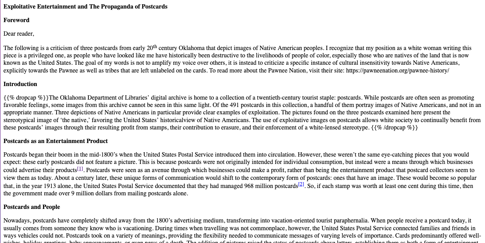
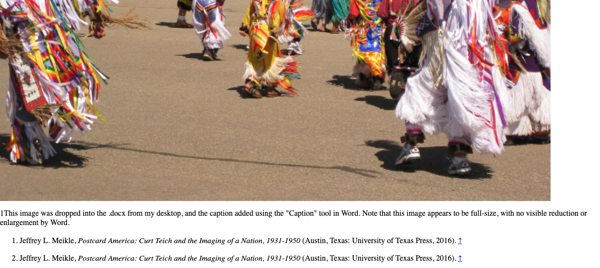

# Digital-First Workflow

A decision to pursue a `digital-first` publication workflow was made following much discussion in August and September, 2023.  The need for a subsequent print-edition of _Roostalk_ remains strong, so this discussion from _Slack_ is what we currently have in mind:

---
I agree, a print edition of Rootstalk should still be generated, but after the digital edition is “complete” and ready for release.  I don’t see the process of producing the print edition changing much at all, the only difference is that during production of the digital edition you, the Editor(s), will have already identified:  

- the list and order of articles,
- the single-column layout of each article including headings, indentation, etc.,
- the media within each article and the relative position of those elements within,
- the pull-quotes, and
- the end notes for each article.

So, when building for print you should be able to use the digital edition for guidance and the process, mostly with InDesign I presume, will be to:  

- break each article into a two-column layout and add page breaks,
- resize and reposition media as desired for print,
- add filler images to balance the pages,
- add the cover,
- generate and add the TOC,
- gather end notes and move them to the back of the publication (unless we elect to keep end notes with each article in print),
- pull the print issue together and produce a PDF that can be added to the digital edition.  

# Starting Point - MS Word

After some discussion it appears that the logical approach to a digital-first workflow is to continue accepting article submissions largely in MS Word (.docx) form with illustrations and other media as attached, but separate, files.  In the past, _Rootstalk_ editors have created a sequence of working copies from the original Word document with comments and media added to document the changes.  An overall "linear" layout of each article with embedded media is usually the result, although things like article header images, footer images, and positioned pull-quotes are generally NOT included at this stage.  

It seems reasonable to keep that assembly and editing workflow in MS Word intact, perhaps supplementing it with some additional layout "tricks" where needed.  

# Word-to-Markdown Conversion - Mammoth

Searching for a Word-to-Markdown conversion tool yielded a number of unacceptable paid/subscription options, but only one likely open source candidate, [Mammoth](https://github.com/mwilliamson/mammoth.js), or `mammoth.js`.  We had hoped to find an open source Python solution so that customization might be relatively easy, and fortunately there's also a Python version at [python-mammoth](https://github.com/mwilliamson/python-mammoth).  

Note that while _Mammoth_ claims to offer conversion to Markdown and a `--output-format=markdown` option, the documentation states that such conversion is deprecated in favor of HTML output only.  Fortunately, that HTML is remarkably Markdown-like so this does not appear to be a fatal flaw.   

The statement from the Mammoth `README` file says:    

```
Markdown support is deprecated. Generating HTML and using a separate library to convert the HTML to Markdown is recommended, and is likely to produce better results.
```

We already have a "custom" HTML-to-Markdown conversion (see [rootstalk-workflow](https://github.com/Digital-Grinnell/rootstalk-workflow)) app that we previously used to convert InDesign HTML exports to Markdown.  

`Mammoth` does offer some useful customization "options" that are not deprecated, and while testing them we found the following command form to be most promising:  

```zsh
(.venv) ╭─mcfatem@MAC02FK0XXQ05Q ~/GitHub/rootstalk-issue-workflow ‹main●› 
╰─$ mammoth source_document.docx --output-dir=output_dir
```

**Note**: The `mammoth` command only works inside our Python virtual environment.  Therefore, you must `source ./venv/bin/activate` to establish the environment before you attempt to run `mammoth`!   

In that form, the command opens an existing, specified `output_dir` and and deposits within a `.html` file named after the source document, plus a `.png` copy (this may vary depending on the source format) of each embedded image.  Images are numbered and named sequentially `1.png`, `2.png`, etc., based on their order of appearance in the source document.  

The images do not appear to be altered by MS Word or by Mammoth in any way.  

# Directory Structure for Testing

A directory named `Submitted-Word-Documents` has been created in this project and it contains two (or more) subdirectories named `klassen` and `walsh`.  Each of these subdirs is named for an author and article found in [Rootstalk Volume IX Issue 1](https://rootstalk.grinnell.edu/volume-ix-issue-1/).  

The `klassen` article, an essay, contains significant elements including:  

  - lots of italics
  - dropcap
  - section headings
  - embedded links
  - referenes with endnotes
  - pullquote
  - embedded "original" images with captions
  - end-of-text "leafbug"
  - an image added from outside the author's submission
  - author's bio w/ headshot image

The `walsh` article, a collection of poems, contains significant elements including:  

  - lots of italics
  - an attribution line
  - dropcap
  - page dividers
  - a wealth of creative whitespace and text alignment
  - one embedded link (in the endnotes)
  - referenes with endnotes
  - pullquote
  - NO embedded "original" images
  - end-of-text "leafbug"
  - numerous images added from outside the author's submission
  - author's bio w/ headshot image

In each subdirectory is a list of unlatered content from Mark B's _OneDrive_ in directories named `Draft`, `Edited-Draft`, `Final-Draft` and `Images`.  At the same level is a copy of what was thought to be a "final draft" of the submitted `.docx` file, and a working copy of the same named after the author, so filenames `klassen.docx` and `walsh.docx` are our WORKING documents.  

Also inside each "author" directory is a `converted` subdirectory which is/was the `output_dir` we specified in our _mammoth_ command.  

## Example

For example, the `Submitted-Word-Documents/klassen` directory looks like this:  

  

Note that the `klassen.md` file is simply a "renamed" copy of `klassen.html` that we used to demonstrate that the `.html` output makes a suitable intermediate Markdown product for us to work with.  

The `klassen.docx` "working document" has been altered numerous times to test different editing strategies.  In each iteration it was convered to Markdown using these commands:  

```zsh
cd ~/GitHub/rootstalk-issue-workflow/Submitted-Word-Documents/klassen
mammoth klassen.docx --output-dir=converted
cp -f klassen.html klassen.md
```
# Image w/ Caption Added via MS Word

In my last test I added an image (not in the original submission) with a caption added using MS Word.  My last conversion run produced the following:  

```zsh
(.venv) ╭─mcfatem@MAC02FK0XXQ05Q ~/GitHub/rootstalk-issue-workflow ‹main●› 
╰─$ cd ~/GitHub/rootstalk-issue-workflow/Submitted-Word-Documents/klassen
mammoth klassen.docx --output-dir=klassen-converted
Unrecognised paragraph style: caption (Style ID: Caption)
```

It's likely that the added caption is to blame.  It might be worth looking into the [Styles](https://github.com/mwilliamson/python-mammoth?tab=readme-ov-file#styles) and `custom-style-map` features of `python-mammoth` to see if these can be accommodated.  

I'm going to remove the `caption` from the final image and test again to see what happens... NOPE, the error persists.    

So, I found [this reference](https://stackabuse.com/how-to-convert-docx-to-html-with-python-mammoth/) that includes a little more background for working with `custom styles`.  That lead me to create a new file, `rootstalk-custom-style.map`, with initial contents shown here.  

```txt
p[style-name='Caption'] => <figcaption>
```

We should be able to engage the new `custom styles` like so:  

```zsh
(.venv) ╭─mcfatem@MAC02FK0XXQ05Q ~/GitHub/rootstalk-issue-workflow 
╰─$ doc='klassen'  
dir='./Submitted-Word-Documents'
mkdir -p ${dir}/${doc}/converted
mammoth ${dir}/${doc}/${doc}.docx --output-dir=${dir}/${doc}/converted --style-map=rootstalk-custom-style.map
cp -f ${dir}/${doc}/converted/${doc}.html ${dir}/${doc}/converted/${doc}.md 
```

This process works without error, but there's no evidence of our `caption` since it was removed from the `klassen.docx` file prior to this test.  After putting it back we get...  BINGO!  

## Successfully Using Mammoth

The [klassen.html](./Submitted-Word-Documents/klassen/converted/klassen.html) file created by the last process is NOT Markdown, it's clearly HTML as expected, but it looks VERY GOOD and demonstrates that we can easily control `mammoth` output using a `custom style map`.  

  

The image above is a screen grab of `klassen.html` displayed in a simple, local browser.  Worth noting in the image is the presence of...

  - Headings - There's no hierarhcy because the `.docx` file we used has none.
  - {{tag}} Pass-thru - The `{}` at the start of the second paragraph is just one example. 
  - Live Endnote References - There are two of these, superscript `[1]` and `[2]` in the third paragraph, and THEY WORK!

  

The above image is a screen grab from near the end of the `klassen.html` rendering.  Worth noting in the image are...

  - Images - The dancers image is cut off in my screen capture, but it's clearly visible, reproduced without any apparent distortion.  
  - Figcaption - Below the image is the `<figcaption>` tag created by our `custom style map`.
  - Working Endnotes - Note the up-arrow links at the end of each numbered note, those links take you back into the document.  

### Other Observations

It's worth noting that the three embedded images were output into the `converted` directory as `1.png`, `2.png` and `3.jpeg`.  The differenes in those `converted` file extensions seems to indicate that whatever extension/type present in the Word document is preserved by `mammoth`, only the basename is changed to an integer.  

Note too that our custom style map to `<figcaption>` did more than just "substitute" our text, it created valid opening and closing tags in the HTML.  

## Next Steps / Questions

The `mammoth` documentation indicates that Markdown output was deprecated because there are many suitable tools for HTML-to-Markdown conversion these days.  We should probably take a look at those, including the `markdownify` library and its use (plus other bits of code) in our own [rootstalk-workflow/main.py](https://github.com/Digital-Grinnell/rootstalk-workflow/blob/main/main.py) script.  

## More Testing and Configuration

Moving on to the `walsh.docx` test article... 

```zsh
(.venv) ╭─mcfatem@MAC02FK0XXQ05Q ~/GitHub/rootstalk-issue-workflow ‹main●› 
╰─$ doc='walsh'    
dir='./Submitted-Word-Documents'
mkdir -p ${dir}/${doc}/converted
mammoth ${dir}/${doc}/${doc}.docx --output-dir=${dir}/${doc}/converted --style-map=rootstalk-custom-style.map
cp -f ${dir}/${doc}/converted/${doc}.html ${dir}/${doc}/converted/${doc}.md
Unrecognised paragraph style: paragraph (Style ID: paragraph)
Unrecognised run style: normaltextrun (Style ID: normaltextrun)
Unrecognised run style: eop (Style ID: eop)
Unrecognised paragraph style: Normal (Web) (Style ID: NormalWeb)
```

Clearly, there are some styles here that are unaccounted for.  Some `rootstalk-custom-style.map` additions should at least get the conversion working.  

```txt
p[style-name='Caption'] => figcaption
p[style-name='paragraph'] => p
p[style-name='NormalWeb'] => p
```

Note that even with the "Unrecognised..." messages in the output, a `converted` document WAS created.  So, moving on to `weeks.docx`...  

```zsh
(.venv) ╭─mcfatem@MAC02FK0XXQ05Q ~/GitHub/rootstalk-issue-workflow ‹main●› 
╰─$ doc='weeks'  
dir='./Submitted-Word-Documents'
mkdir -p ${dir}/${doc}/converted
mammoth ${dir}/${doc}/${doc}.docx --output-dir=${dir}/${doc}/converted --style-map=rootstalk-custom-style.map
cp -f ${dir}/${doc}/converted/${doc}.html ${dir}/${doc}/converted/${doc}.md
(.venv) ╭─mcfatem@MAC02FK0XXQ05Q ~/GitHub/rootstalk-issue-workflow ‹main●› 
```

Note that the `weeks.docx` file contained very few "features" to be converted, and NO images whatsoever.  The `converted` result is also rather bland and as expected, there were NO errors.  


