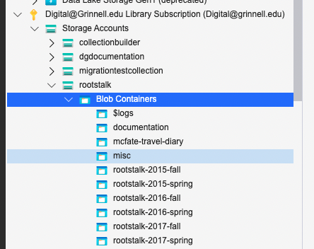

# Rootstalk New Issue Workflow - New DIGITAL FIRST Workflow

This file documents a comprehensive workflow for creation of a new **digital** issue of _Rootstalk_ in our new (2024) _digital-first_ workflow.  

## Python

See [Proper Python](https://blog.summittdweller.com/proper-python/) for applicable guidance when enabling Python parts of this workflow.  

## Assumptions and Conventions

An _issue_ of _Rootstalk_ is a single bound print publication, created once or twice per year following the _fall_ and/or _spring_ academic term.  Each _issue_ is commonly identified by its year-of-issue followed with a "term" identifier corresponding to the semester in which the issue was assembled.  For example, an issue assembled in the Fall semester of the 2015-16 academic year would be identified as `2015-fall`, and the next _issue_ assembled in the Spring of that academic year would be identified as `2016-spring`.

Each _issue_ is part of a `volume` which contains one or two issues from a single academic year.  Each _issue_ also has a corresponding `title` consisting of a volume number, using Roman numerals, followed by a single-digit issue number of 1 or 2.  Our example issues from the 2015-16 academic year have titles like:

  - _Volume II, Issue 1_ : This is the `2015-fall` issue.
  - _Volume II, Issue 2_ : This is the `2016-spring` issue.

An _issue_ is comprised of `articles` and _filler_. Each _article_ is  included in the web-edition of _Rootstalk_ as individual web "pages", sometimes with _filler_ content included.  The overall structure of the website is described by:

  - current issue
    - issue index
      - article 1
      - article 2
      - ...
      - article n
      - filler
  - past issues
    - year-term 1
      - issue index
        - articles 1...n
        - filler
    - year-term 2
      - issue index
        - articles 1...n
        - filler
    - ...
    - year-term n
      - issue index
        - articles 1...n
        - filler

&copy;[InDesign](https://www.adobe.com/products/indesign) by &copy;[Adobe](https://www.adobe.com) will be used to manage, assemble, edit, and publish all **print** versions of _Rootstalk_.  


**Progress Marker**
** Document digital-first workflow procedure here. **


_InDesign_'s `File`>`Export...`>`HTML` feature will be used to generate an HTML copy of each print-version issue to seed the creation of that issue in the [Rootstalk](https://rootstalk.grinnell.edu) website.  &copy;[Hugo](https://gohugo.io) is used to manage, assemble, edit and publish the _Rootstalk_ website. 

## <a name="export-indd"></a> Editing _Rootstalk_ for the Web

This portion of the workflow NEED NOT follow successful publication of an issue in-print.

  - Create a new subdirectory with a `year-term` name in this repo.  For example, when working with the Spring 2023 issue a new subdirectory named `2024-spring` was created.

  - Inside the new `year-term` subdirectory create an issue `.yml` file reflecting the web-structure of the _issue_.  See the [Issue .YML File](#issue-yml) section for details.  In our `2024-spring` example the file should have a path of: `./2024-spring/2024-spring.yml`.

The next steps will move the **old/existing** "current issue" (`Volume IX, Issue 1` in our example) to "past issue" status, and will introduce a **new** "current issue" (`Volume X, Issue 1` in our example) to the publication.  

  - Working locally in the `npm-rootstalk` directory, duplicate the old/existing current issue contents (the entire `volume-ix-issue-1` directory in our example) and rename the new folder to match the **new** issue name (`volume-x-issue-1` in our example).  

  - Move the old/existing current issue directory (the entire `volume-ix-issue-1` directory in our example) to the `past-issues` directory.  

  - In the **new** issue directory (`volume-ix-issue-1` in our example) delete all of the "article" `.md` files.  DO NOT delete the `_index.md` file there!   

  - In the **new** issue directory create a new `.pending` hidden directory (`volume-x-issue-1/.pending` in our example).    

  - Make a new issue sub-directory in `static/images/` named after the **new** issue, so `static/images/volume-x-issue-1` in our example.  

  - Open the `.pdf` of the **new** issue, view the cover, and copy/crop a portion of the cover image, saving the cropped copy as `cover.png` in the new `static/images/` sub-directory created above (`/static/images/volume-x-issue-1/cover.png` in our example).  

  - Edit the **new** issue `_index.md` file changing any/all old issue references to new ones.  Nearly all of the frontmatter will need to be updated, as well as any old references in the content portion of the file.  The data in this file will be reflected in several places in the new "current issue" so if anything is missed it will become apparent when you view the new publication.  

  - Edit the **old** issue's `_index.md` file (the `past-issues/volume-ix-issue-1/_index.md` file in our example) and remove any `Current Issue` references there.  

  - In the root directory edit the `index.html` file changing old issue references to new ones.  

  - Open `Microsoft Azure Storage Explorer` and the account owned by `digital@grinnell.edu`.  You should be able to see a structure like the one depicted below.  

      

    - Right click on the `Blob Containers` link under `Storage Accounts | rootstalk` and select `Create Blob Container`.  Name the new blob container `rootstalk-YEAR-TERM`, so `rootstalk-2024-spring` in our example.  

    - Navigate into the new blob container and use the `Upload` button to upload all of the files from the `rootstalk-issue-workflow/<current issue>-web-resources/image` directory (`rootstalk-issue-workflow/2024-spring-web-resources/image` in our example) to the new blob container.  This process could take a few minutes so be patient.  

    - Right click on the new blob container link (`rootstalk-2024-spring` in our example) and select `Set Public Access Level...` from the dropdown menu.  Set the access level to 
   `Public read access for container and blobs` and click `Apply`.

    - That should be all we need of `Microsoft Azure Storage Explorer` at this time so that window can be closed.

  - Return to the `npm-rootstalk` local project and edit the `config.yml` file changing old issue references to new ones.  There are 7 or more places where changes will be necessary.  

  - In the `npm-rootstalk` local project terminal enter `npm run serve`.  You should see output something like this:  

```
╭─mcfatem@MAC02FK0XXQ05Q ~/GitHub/npm-rootstalk ‹main●› 
╰─$ npm run serve

> npm-rootstalk@1.0.0 serve
> npm run hugo:build && npx pagefind --source public --bundle-dir ../static/_pagefind && npm run hugo:serve


> npm-rootstalk@1.0.0 hugo:build
> hugo -d public

Start building sites … 
hugo v0.111.3-5d4eb5154e1fed125ca8e9b5a0315c4180dab192 darwin/arm64 BuildDate=2023-03-12T11:40:50Z VendorInfo=gohugoio

                   | EN   
-------------------+------
  Pages            | 411  
  Paginator pages  |   0  
  Non-page files   |  20  
  Static files     | 648  
  Processed images |   0  
  Aliases          |   0  
  Sitemaps         |   1  
  Cleaned          |   0  

Total in 381 ms

Running Pagefind v0.12.0 (Extended)
Running from: "/Users/mcfatem/GitHub/npm-rootstalk"
Source:       "public"
Bundle Directory:  "../static/_pagefind"

[Walking source directory]
Found 354 files matching **/*.{html}

[Parsing files]
Did not find a data-pagefind-body element on the site.
↳ Indexing all <body> elements on the site.

[Reading languages]
Discovered 1 language: en

[Building search indexes]
Total: 
  Indexed 1 language
  Indexed 352 pages
  Indexed 19573 words
  Indexed 0 filters
  Indexed 0 sorts

Finished in 0.624 seconds

> npm-rootstalk@1.0.0 hugo:serve
> hugo server

Start building sites … 
hugo v0.111.3-5d4eb5154e1fed125ca8e9b5a0315c4180dab192 darwin/arm64 BuildDate=2023-03-12T11:40:50Z VendorInfo=gohugoio

                   | EN   
-------------------+------
  Pages            | 411  
  Paginator pages  |   0  
  Non-page files   |  20  
  Static files     | 648  
  Processed images |   0  
  Aliases          |   0  
  Sitemaps         |   1  
  Cleaned          |   0  

Built in 304 ms
Watching for changes in /Users/mcfatem/GitHub/npm-rootstalk/{archetypes,assets,content,data,layouts,package.json,static,themes}
Watching for config changes in /Users/mcfatem/GitHub/npm-rootstalk/config.yml
Environment: "development"
Serving pages from memory
Running in Fast Render Mode. For full rebuilds on change: hugo server --disableFastRender
Web Server is available at http://localhost:1313/ (bind address 127.0.0.1)
Press Ctrl+C to stop
```  

- If all went well you should be able to open a local copy of the new site in your browser by visiting the link provided.  


  


  
### <a name="issue-yml"> Issue .YML File

Each _issue_ must have a corresponding issue `.yml` file in it's corresponding `year-term` subdirectory.  The structure of an issue `.yml` file is [YAML](https://yaml.org), and its contents include the following fields:
  - `year` - The 4-digit calendar year in which the _issue_ was assembled.
  - `term` - The academic term in which the _issue_ was assembled.  Usually "spring" or "fall".
  - `title` - The title of the _issue_.  Usually in a form like: "Volume IX, Issue 1, Spring 2023".  Surrounding quotes are only required if the title contains a quote, colon, or other punctuation.
  - `articles` - A list declaration of identifiers for each _article_ to be included in the web-version of the _issue_.

The name given each _article_ **must be unique** within the corresponding _issue_ and values generally reflect the last name of the author, if known, or may alternatively reflect the author's role with _Rootstalk_, or a brief description of the _article_'s content.  Some examples include:

  - `editor` - A role reference used to identify the "Editor's Note" or an _article_ written by the _Rootstalk_ editor.
  - `birds` - A subject reference used to identify a collection of distributed pieces about "Birds of the Prairie" in the _issue_.
  - `thomasch-1` - An author reference used to identify the first of two _article_s in this issue by an author with a last name of "Thomasch".

## Example: Spring 2022

Engaging the workflow for the Spring 2022 issue (`2022-spring`) looked something like this:  

1) Opened Mark B's OneDrive at https://grinco-my.sharepoint.com/personal/baechtel_grinnell_edu/Documents/Forms/All.aspx?RootFolder=%2Fpersonal%2Fbaechtel%5Fgrinnell%5Fedu%2FDocuments%2FRootstalk&FolderCTID=0x012000A6C31E30BF003640A2D7B60A01D853B7&View=%7BB15D8612%2DAF44%2D4DC9%2D8513%2D5154D5D906C9%7D, where I found a `Spring 2022` folder.

2) In the aforementioned folder I found a subfolder structure of:  

  - `PDFs & InDesign files`
    - `InDesign files`
      - `Draft InDesign files`
        - many individual article files
      - `Edited InDesign files`
        - `Interactive version`
          - many individual article files
          - `volume-viii-issue-1-spring-2022`   <-- This file appears to be INCOMPLETE!
        - `Print version`
          - many individual article files
          - `volume-viii-issue-1-spring-2022-print-version`  <-- This is the file I need!
    - `PDFs`
      - `Draft version PDFs`
      - `Edited version PDFs`
      - `volume-viii-issue-1-spring-2022-print-version`  <-- We will need this file too, for guidance.

      *Note that in _OneDrive_ file extensions are NOT displayed.  This is VERY annoying, but we will assume that what we found were indeed `.indd` and `.pdf` files, respectively.

3) Copied the two needed files to the local* copy of this repository on my workstation and renamed them to `2022-spring.indd` and `2022-spring.pdf`, respectively.  

    *Note that our `.gitignore` file contains entries designed to keep large files like these from finding their way into _GitHub_, so _temporary_ local copies of these files need to be carefully maintained!

4) Opened the `./2022-spring/2022-spring.indd` file using _InDesign_ as directed in the second bullet above under [Editing _Rootstalk_ for the Web](#export-indd), and created `./2022-spring/2022-spring.yml` as instructed above in [Editing _Rootstalk_ for the Web](#export-indd).

    - These actions created a new `./2022-spring/2022-spring.html` export and associated `./2022-spring/2022-spring-web-resources` directory.

    - All of the media files created in the `./2022-spring/2022-spring-web-resources/image` folder were uploaded to _Azure Blob Storage_, into a blob container named `rootstalk-2022-spring` and were subsequently removed from the local repository so as not to bloat _GitHub_ with unnecessary content.

5) Initiated creation of a new issue `.yml` file (see section [Issue.YML File](#issue-yml) above) by examining the table of contents in `./2022-spring/2022-spring.pdf` to identify articles and author names. 

  The subsequent `./2022-spring/2022-spring.yml` file describing the `2022-spring` issue of _Rootstalk_ reads like this:

  ```yml
  year: 2022
  term: spring
  title: Volume VIII, Issue 1, Spring 2022
  articles:
    - publisher
    - agpoon
    - editors
    - munoz
    - thompson
    - macmoran
    - woodpeckers-of-the-prairie
    - obrien
    - chen
    - trissell
    - mcgary-adams-dubow-fay-stindt-schaefer
    - hootstein
    - horan
    - kessel
    - henry
    - buck
    - lewis-beck
    - burt
    - taylor
    - gaddis
    - bradley
    - burchit
    - filler-material  
  ```

6) Launched the `indd-to-html.py` script like so:

  ```
  cd ~/GitHub/rootstalk-issue-workflow
  python3 indd-to-html.py
  ```

7) The script ran without error and produced the following directory structure inside the `./2022-spring` subdirectory:

  ```
  ├── 2022-spring-azure.md  
  ├── 2022-spring-web-resources  
  │   ├── agpoon.md  
  │   ├── bradley.md  
  │   ├── burchit.md  
  │   ├── burt.md  
  │   ├── chen.md  
  │   ├── css  
  │   │   └── idGeneratedStyles.css  
  │   ├── editors.md  
  │   ├── filler-material.md  
  │   ├── gaddis.md  
  │   ├── henry.md  
  │   ├── hootstein.md  
  │   ├── horan.md  
  │   ├── image  
  │   ├── kessel.md  
  │   ├── lewis-beck.md  
  │   ├── macmoran.md  
  │   ├── mcgary-adams-dubow-fay-stindt-schaefer.md  
  │   ├── munoz.md  
  │   ├── obrien.md  
  │   ├── publisher.md  
  │   ├── taylor.md  
  │   ├── thompson.md  
  │   ├── trissell.md  
  │   └── woodpeckers-of-the-prairie.md  
  ├── 2022-spring.html  
  ├── 2022-spring.log  
  ├── 2022-spring.md  
  └── 2022-spring.yml  
  ```  