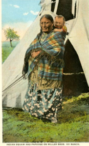
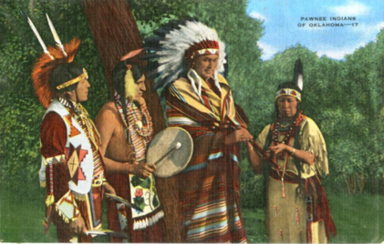
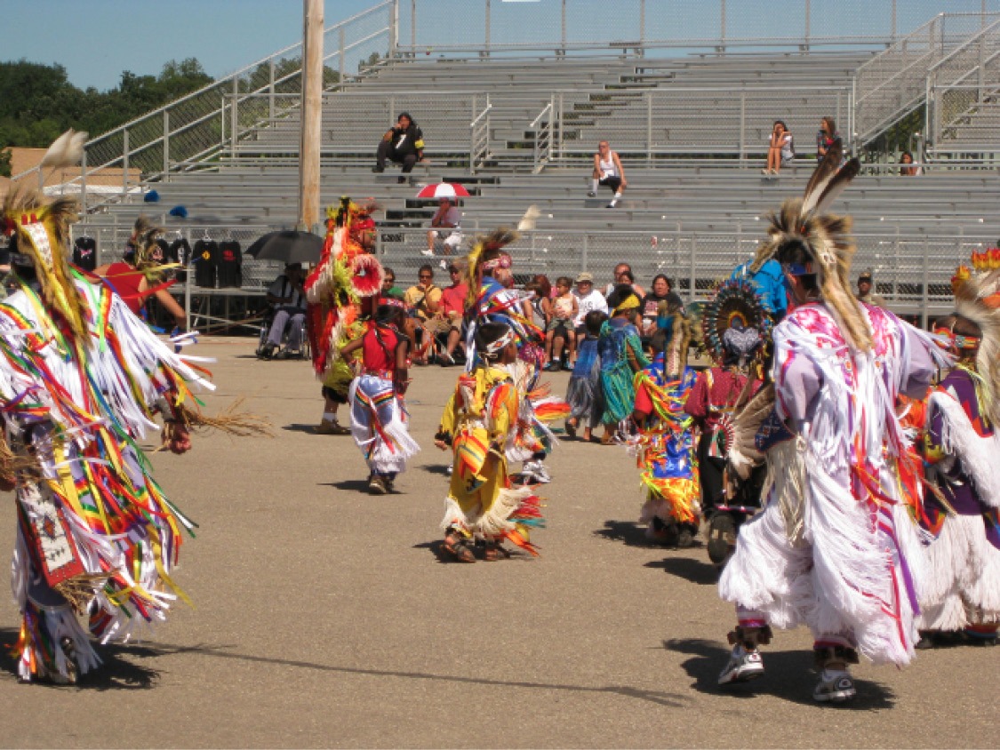

<strong>Exploitative Entertainment and The Propaganda of Postcards </strong>

<strong>Foreword</strong>

Dear reader, 

The following is a criticism of three postcards from early 20th century Oklahoma that depict images of Native American peoples. I recognize that my position as a white woman writing this piece is a privileged one, as people who have looked like me have historically been destructive to the livelihoods of people of color, especially those who are natives of the land that is now known as the United States. The goal of my words is not to amplify my voice over others, it is instead to criticize a specific instance of cultural insensitivity towards Native Americans, explicitly towards the Pawnee as well as tribes that are left unlabeled on the cards. To read more about the Pawnee Nation, visit their site: https://pawneenation.org/pawnee-history/

<strong>Introduction</strong>

{}The Oklahoma Department of Libraries’ digital archive is home to a collection of a twentieth-century tourist staple: postcards. While postcards are often seen as promoting favorable feelings, some images from this archive cannot be seen in this same light. Of the 491 postcards in this collection, a handful of them portray images of Native Americans, and not in an appropriate manner. Three depictions of Native Americans in particular provide clear examples of exploitation. The pictures found on the three postcards examined here present the stereotypical image of ‘the native,’ favoring the United States’ historicalview of Native Americans. The use of exploitative images on postcards allows white society to continually benefit from these postcards’ images through their resulting profit from stamps, their contribution to erasure, and their enforcement of a white-lensed stereotype. {}

<strong>Postcards as an Entertainment Product</strong>

Postcards began their boom in the mid-1800’s when the United States Postal Service introduced them into circulation. However, these weren’t the same eye-catching pieces that you would expect: these early postcards did not feature a picture. This is because postcards were not originally intended for individual consumption, but instead were a means through which businesses could advertise their products<a href="#endnote-2" id="endnote-ref-2">[1]</a>. Postcards were seen as an avenue through which businesses could make a profit, rather than being the entertainment product that postcard collectors seem to view them as today. About a century later, these unique forms of communication would shift to the contemporary form of postcards: ones that have an image. These would become so popular that, in the year 1913 alone, the United States Postal Service documented that they had managed 968 million postcards<a href="#endnote-3" id="endnote-ref-3">[2]</a>. So, if each stamp was worth at least one cent during this time, then the government made over 9 million dollars from mailing postcards alone.

<strong>Postcards and People</strong>

Nowadays, postcards have completely shifted away from the 1800’s advertising medium, transforming into vacation-oriented tourist paraphernalia. When people receive a postcard today, it usually comes from someone they know who is vacationing. During times when travelling was not commonplace, however, the United States Postal Service connected families and friends in ways vehicles could not. Postcards took on a variety of meanings, providing the flexibility needed to communicate messages of varying levels of importance. Cards predominantly offered well-wishes, holiday greetings, baby announcements, or even news of a death. The addition of pictures raised the status of postcards above letters, establishing them as both a form of entertainment as well as a means of communication. In thinking of postcards as entertainment, though, it is important to note who was selling the pictures in these scenarios, and whose picture was being bought. 

<strong>Depictions of Native Americans on Postcards</strong>

In trying to understand these three specific cards from Oklahoma, it helps to know how tribes which were not native to this part of North America ended up in Oklahoma. The relationship of Native American people to Oklahoma, in turn, further irritates these postcards’ capitalizations on the already-existing United States’s stereotypes.  

When Andrew Johnson signed the Indian Removal Act of 1830, “some 60,000 Native Americans were forced westward into ‘Indian Territory’”<a href="#endnote-4" id="endnote-ref-4">[3]</a>. This act of inherent dispossession removed tribesincluding the Chickasaw, Seminole, Cherokee, Choctaw, and Muscogee from their native lands, into land supposedly set aside for them by the government<a href="#endnote-5" id="endnote-ref-5">[4]</a>. These nations—known colloquially as “the Five Tribes of Oklahoma” —were forcibly moved to what became Oklahoma, the “final destination of the trail of tears<a href="#endnote-6" id="endnote-ref-6">[5]</a>.” It is important to note that while this was happening, however, Native Americans had and still have agency. In response to this act, the Cherokee Nation established a newspaper, created petitions, as well as took their case to the Supreme Court where they eventually won. Unfortunately, Andrew Johnson disregarded the Supreme Court’s decision and “Cherokee people were forcibly taken from their homes” <a href="#endnote-7" id="endnote-ref-7">[6]</a>.

Knowing this history of exploitation, it becomes possible to see the images on the Oklahoma postcards as an extension of that history. These images can be seen as exemplifying  three different types of exploitation

<strong>Financial Exploitation</strong>

The first postcard (Figure 1) shows a group of eight Native Americans in Oklahoma with the generic title ‘Indians on Miller Bros. 101 Ranch’. According to the Oklahoma Historical Society, this ranch was occupied by George Washington Miller and “earned most of its notoriety from the Wild West shows that it staged”<a href="#endnote-8" id="endnote-ref-8">[7]</a>. Based on this information, as well as the fact that the image was clearly staged, it can be inferred that the people on this postcard were actors in these pageants. Furthermore, the postcards were used as advertisements for such shows. This use harkens back to postcards' original purpose in promoting different businesses, in this case a wild west show. 

White people in power have historically profitted by taking Native Americans’ land. This postcard demonstrates that the exploitation extends to Native Americans’ image as well.  These wild west pageants dressed Native Americans to fit a certain generic look, affirming the dominant stereotypes of the United States. Not only were white people directly profiting from the success of these wild west shows, and the generic depictions of native people in them, but the government was indirectly profiting as well through the postage paid to mail the postcards. The layers of financial exploitation of Native Americans in Oklahoma are numerous and extensive. Already exploited through the Indian Removal Act, these people were being exploited again through the postcard photos--which financial exploitation was being carried out on land that was ‘given’ to them. <a href="#endnote-9" id="endnote-ref-9">[8]</a>. Furthermore, these varying levels of financial exploitation were fostering negative stereotypes of Native Americans that upheldthe United States’s dominant view. 

<strong>An Exploitation by Erasure</strong>

 The second postcard (Figure 2) also displays this same type of United States stereotype, time promoting erasure of specific tribes through use of a universalizing term. On this postcard, the picture is of a Native American woman carrying a child photographed at the same ranch as the previous postcards’ image. The title at the bottom of this specific postcard reads, “Indian Sq*** and Pap**** on Miller Bros 101 Ranch”. Not only is there no information about the tribe to which the mother and child belong--as with the first postcard--but the use of such derogatory terms to describe them is  demeaning  By using the blanket term “Indian” or, in this case, slurs for a Native American woman and her child, these  postcards contributes to the erasure of specific tribes. Since this woman was probably an actor in a Wild West show on the Miller ranch as well, it is important note that these shows were often othering in the fact that they were consistently labeled as ‘cowboys vs Indians’. This theme, familiar fromwild west films, contributes to the erasure of individual groups and promotes the false ideas that Native Americans are one group of people, and that group is the enemy. 

<strong>Exploitation through the White Gaze</strong>

In he third and final postcard (Figure 3), a group of Pawnee people are showcased. While their tribal affiliation is included in the title, they are depicted in a way that conforms to white society and United States’s stereotypes. While this postcard is not set on the same ranch as the other two, it still looks staged in the way that people are posing. Presumably, the primary audience for this image would be white, as they would be the ones buying these postcards, and the images affirm white culture’s stereotypes concerning what a group of Native Americans should look like. Those encountering the photo would see the image postcard sellers know will make a profit: a group of stereotypically staged Native Americans. The commodification of images of the ‘generic native’ through postcards endorsed U.S. stereotypes of indigenous people, all while profiling one tribe to be the same as all others. Despite the inclusion of the name Pawnee in the title, the commodification of images of the Pawnee after they had been relocated displays the inherent exploitation of native people, affirming the dominant culture’s stereotypes through the lens of white society on a postcard. 

<strong>Conclusion</strong>

These three postcards depict Native Americans living in Oklahoma both as physically and literally one-dimensional, enforcing the dominant stereotype of United States society. Postcards’ exploitative intentions to perpetuate these stereotypes contribute to erasure and enforce looking at Native Americans through the white gaze. For these reasons, these postcards exist as a specific form of propaganda, as they publicize damaging stereotypes of Native Americans through an entertainment beloved by United States’ society.   

In contrast to the harmful ways in which these Oklahoman postcards depict Native Americans, the Pawnee Nation’s website includes galleries of their own images which they deem to be representative of themselves. These pictures feature images from Pawnee Homecomings and community gatherings, as well as Pawnee City Council meetings. While the Oklahoman postcard’s depiction of the Pawnee Nation supported white culture’s stereotyping of Native Americans, the Pawnee Nation’s images represents the tribe’s lived reality.

Even now, the first sentence of the Oklahoma Historical Society page titled <em>American Indians</em> reads, “American Indians living in Oklahoma have a complicated, interesting, and unique history”<a href="#endnote-10" id="endnote-ref-10">[9]</a>. These adjectives trivialize the plight of tribes that were dispossessed of the  places they had called home and forced to move to Oklahoma. Further, these three extremely vague adjectives do not mention that Native Americans have any sort of agency, or that they persevere despite everything that has been taken from them, including the control over their own images. {}

<figcaption>1This image was dropped into the .docx from my desktop, and the caption added using the &quot;Caption&quot; tool in Word.  Note that this image appears to be full-size, with no visible reduction or enlargement by Word.</figcaption><ol><li id="endnote-2">
 Jeffrey L. Meikle, <em>Postcard America: Curt Teich and the Imaging of a Nation, 1931-1950</em> (Austin, Texas: University of Texas Press, 2016). <a href="#endnote-ref-2">↑</a>
</li><li id="endnote-3">
 Jeffrey L. Meikle, <em>Postcard America: Curt Teich and the Imaging of a Nation, 1931-1950</em> (Austin, Texas: University of Texas Press, 2016). <a href="#endnote-ref-3">↑</a>
</li><li id="endnote-4">
 History.com Editors, “Andrew Jackson Signs the Indian Removal Act into Law - History,” History.com, August 30, 2021, https://www.history.com/this-day-in-history/indian-removal-act-signed-andrew-jackson. <a href="#endnote-ref-4">↑</a>
</li><li id="endnote-5">
 “Manifest Destiny and Indian Removal - American Experience,” Smithsonian American Art Museum , accessed March 21, 2023, https://americanexperience.si.edu/wp-content/uploads/2015/02/Manifest-Destiny-and-Indian-Removal.pdf. <a href="#endnote-ref-5">↑</a>
</li><li id="endnote-6">
 Pam Cornelison and Ted Yanak, <em>The Great American History Fact-Finder the WHO, What, Where, When, and Why of American History</em> (Boston , Massachusetts: Houghton Mifflin, 2004). <a href="#endnote-ref-6">↑</a>
</li><li id="endnote-7">
 “Trail of Tears,” The Museum of the Cherokee Indian, September 16, 2015, https://cherokeemuseum.com/archives/era/trail-of-tears. <a href="#endnote-ref-7">↑</a>
</li><li id="endnote-8">
 Larry O'Dell, “Miller Brothers 101 Ranch,” <em>The Encyclopedia of Oklahoma History and Culture</em>, https://www.okhistory.org/publications/enc/entry.php?entry=MI029. <a href="#endnote-ref-8">↑</a>
</li><li id="endnote-9">
 Larry O'Dell, “Miller Brothers 101 Ranch,” <em>The Encyclopedia of Oklahoma History and Culture</em>, https://www.okhistory.org/publications/enc/entry.php?entry=MI029. <a href="#endnote-ref-9">↑</a>
</li><li id="endnote-10">
Donald Fixico, “American Indians,” Oklahoma Historical Society | OHS (Oklahoma Department of Libraries), accessed April 30, 2023, https://www.okhistory.org/publications/enc/entry?entryname=AMERICAN+INDIANS. <a href="#endnote-ref-10">↑</a>
</li></ol>