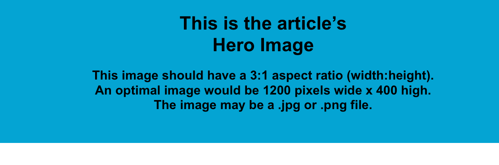
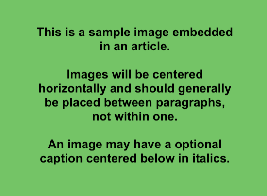
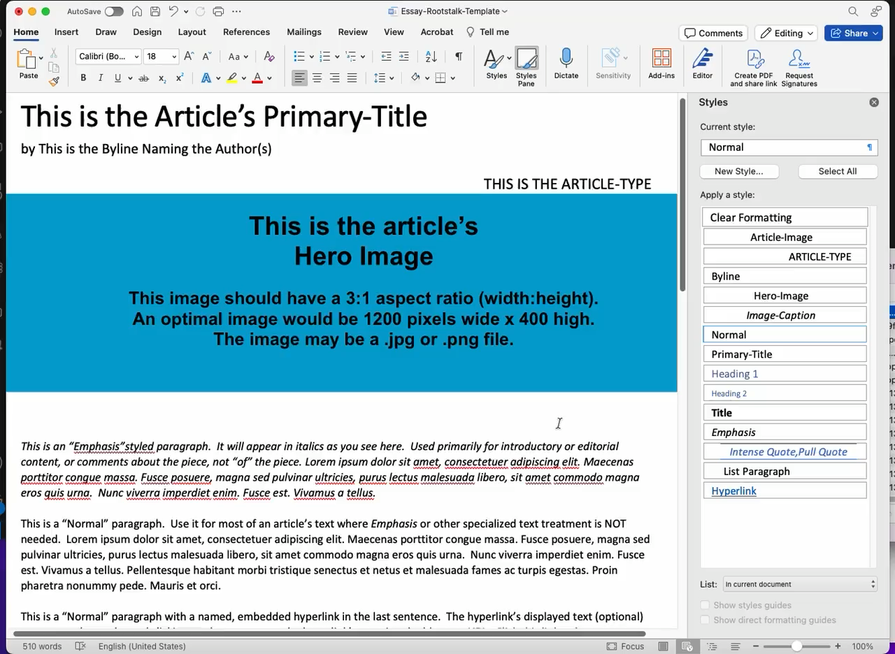

This is the Article’s Primary-Title

by This is the Byline Naming the Author(s)

This is the Article-Type

This is an “Emphasis”styled paragraph.  It will appear in italics as you see here.  Used primarily for introductory or editorial content, or comments about the piece, not “of” the piece. Lorem ipsum dolor sit amet, consectetuer adipiscing elit. Maecenas porttitor congue massa. Fusce posuere, magna sed pulvinar ultricies, purus lectus malesuada libero, sit amet commodo magna eros quis urna.  Nunc viverra imperdiet enim. Fusce est. Vivamus a tellus.  

This is a “Normal” paragraph.  Use it for most of an article’s text where Emphasis or other specialized text treatment is NOT needed.  Lorem ipsum dolor sit amet, consectetuer adipiscing elit. Maecenas porttitor congue massa. Fusce posuere, magna sed pulvinar ultricies, purus lectus malesuada libero, sit amet commodo magna eros quis urna.  Nunc viverra imperdiet enim. Fusce est. Vivamus a tellus. Pellentesque habitant morbi tristique senectus et netus et malesuada fames ac turpis egestas. Proin pharetra nonummy pede. Mauris et orci.

This is a “Normal” paragraph with a named, embedded hyperlink in the last sentence.  The hyperlink’s displayed text (optional) appears to the reader and clicking on that text opens the hyperlink’s associated address or URL.  <a href="https://support.microsoft.com/en-us/office/embed-or-link-to-a-file-in-word-8d1a0ffd-956d-4368-887c-b374237b8d3a">Click this link to learn more about hyperinks</a> and note that the displayed text may be omitted in which case the address is displayed.

This is a Title (Secondary) or Section Heading

This is a “Normal” paragraph with two footnote (endnote) references<a href="#endnote-2" id="endnote-ref-2">[1]</a> expressed using lowercase Roman numerals<a href="#endnote-3" id="endnote-ref-3">[2]</a> like `i`, `ii`, `iii` `iv`, etc.   All such refenced notes in <em>Rootstalk</em> appear as “endnotes” at the end of the article, not as “footnotes” at the end of the page.  Instructions for inserting endnote references into a Word document can be found here:  <a href="https://support.microsoft.com/en-us/office/insert-footnotes-and-endnotes-61f3fb1a-4717-414c-9a8f-015a5f3ff4cb">Insert footnotes and endnotes</a>

This is the image-caption.

Just Another Title (Secondary)

A handful of “Normal” paragraphs full of “lorem ipsum” text.  Following this first paragraph is a “Pull Quote”, the style name is “Intense Quote”, highlighting text extracted from an upcoming paragraph.  Lorem ipsum dolor sit amet, consectetuer adipiscing elit. Maecenas porttitor congue massa. Fusce posuere, magna sed pulvinar ultricies, purus lectus malesuada libero, sit amet commodo magna eros quis urna.

Proin pharetra nonummy pede. Mauris et orci.  Aenean nec lorem. In porttitor. Donec laoreet nonummy augue!

Nunc viverra imperdiet enim. Fusce est. Vivamus a tellus.  Pellentesque habitant morbi tristique senectus et netus et malesuada fames ac turpis egestas. Proin pharetra nonummy pede. Mauris et orci.  Aenean nec lorem. In porttitor. Donec laoreet nonummy augue.  

Suspendisse dui purus, scelerisque at, vulputate vitae, pretium mattis, nunc. Mauris eget neque at sem venenatis eleifend. Ut nonummy.

Adding Media 

Word templating is available for adding media in the form of embedded audio or video playback.  While this is a “Normal” paragraph, the elements you see below are 15-second samples of video (.m4v) and audio (.mp3) captured from my screen while editing this template.

<em></em>

This is the video caption using “image-caption” style.

	

This is the audio widget caption using “image-caption” style.

	

Adding Poetry or Fixed-Format Text  

Word templating is available for adding fixed-format text like poetry.   The following lorem-ipsum text uses whitespace and the “fixed-format” style to selectively position text.  

Lorem ipsum dolor sit amet, 

    This line indented by 4 spaces…consectetuer adipiscing elit. 

       This line intented by 7 spaces…Maecenas porttitor congue massa. 

Fusce posuere, magna sed pulvinar ultricies, 

purus lectus malesuada libero, sit amet commodo magna 		eros		 quis urna.

      This line indented by 6 spaces…Nunc viverra imperdiet enim. 
<ol><li id="endnote-2">
 This is endnote #1 referenced with the lowercase Roman numeral ‘i’.  Like other text, an endnote may contain a link like <a href="https://support.microsoft.com/en-us/office/insert-footnotes-and-endnotes-61f3fb1a-4717-414c-9a8f-015a5f3ff4cb">this one</a>. <a href="#endnote-ref-2">↑</a>
</li><li id="endnote-3">
 This is endnote #2.  Endnotes typically refer to content supporting the article, generally gleaned from research conducted during the article’s creation. <a href="#endnote-ref-3">↑</a>
</li></ol>